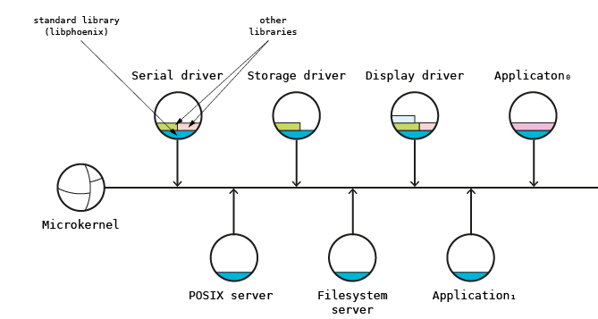

# Architecture

Phoenix-RTOS operating system starting from version 3 is based on microkernel architecture. It means that system consist of small, effectively implemented microkernel and set of servers communicating over it.

## Microkernel
Microkernel implements minimum set of primitives necessary to implement other operating system components. Phoenix-RTOS microkernel implements four fundamental subsystems - memory management, process and thread management, interprocess communication and low-level I/O for redirecting the interrupts to user-level threads. Microkernel functionalities are accessible for applications through set of system calls. System call (syscall) is the operating system function implemented by the special processor instruction switching the execution privilege mode from user to system. After switching the execution mode from user to system privilege level program is able to execute privileged instructions and access the system memory segments and I/O space.

## Interprocess communication
The main functionality provided by microkernel necessary to implement the operating system is the interprocess communication (IPC). On the figure above microkernel was shown as the bus between other system components and this is the main factor which differentiates the microkernel-based operating system from the traditional monolithic kernel based operating system. All system components interact with each other using message passing. For example file operations are performed by communicating with file servers. Such approach affects tremendously system scalability and modularity. The local communication based on shared memory can be easily extended to the remote communication using network. The modules (servers) implementing specific functionalities can be easily added and removed from the system due to message passing restricting interactions between them to a well-structured format. Servers partition the operating system functionality in the natural way. The message passing should be implemented in such a way that minimizes the communication overhead. Consequently it should be supported by some virtual memory mechanisms like physical memory sharing. In the further considerations it is assumed that messages are sent to the ports registered by servers. Ports together with identifiers of data structures operated by servers (e.g. files) identify operating system objects.

## Standard library
Standard library is the set of functions constituting the basic programming environment (providing the basic API) and based on the system calls. API could be compatible with popular programming standards (ANSI C, POSIX etc.) or could be specific for the operating system. Phoenix-RTOS 3 provides its own standard library (`libphoenix`) compatible with ANSI C89 and extended with some specific functions for memory mapping and process and thread management. The library can be extended (in cooperation with servers) with additional functions to provide the POSIX compliant environment. Such environment requires much more memory than basic ANSI C native interface but allows for execution of the popular open-source UN*X applications. Dedicated chapter describes Phoenix-RTOS 3 standard library in full details.

## Servers
In the microkernel architecture servers plays very important role in the whole operating system. They provide functionalities removed from the traditional, monolithic kernel and moved to the user space. Good examples of such functionalities are file management or device management (device drivers). The main method for communicating with server is message passing. Each server allocates and registers set of ports used to receive messages from other system components. For example the file server registers new port in the filesystem space. Device driver registers new name in the `/dev` directory.

## Device drivers
Device drivers are specific servers responsible for controlling devices. They can implement protocol for I/O operations enabling to use them like files. Special mechanism is used to allow user level processes to communicate with the hardware. In architectures without I/O address space where device registers are accessible in the memory address space the special memory mapping is used. When device uses I/O space (e.g. ports on IA32) special processor flag is set permitting the unprivileged code to access the parts or whole I/O space. The flag is set during runtime using specific system call. Second important issue which should be discussed here is interrupt handling. When device drivers run on user-level, interrupts are redirected to the selected processes and interrupt handling routines are implemented as regular functions.

## File servers
File servers are specialized servers implementing filesystem. Similarly to device drivers they implement specific protocol for filesystem operations (for opening, closing, reading and writing files and for operating on directories). Any fileserver can handle any part of the namespace. The selected part of the namespace is assigned to the server by registering its port for the selected directory entry. When applications use the part of the namespace handled by the server during the path resolution procedure, the server`s port is returned in the object identifier and all communication is redirected to the server.

## Emulation servers

Microkernel architecture allows to easily emulate the application environment of existing operating systems (e.g. POSIX). To provide some OS specific mechanisms which are not supported by native Phoenix-RTOS environment (e.g. POSIX pipes, user and groups etc.) emulation servers should be provided. They implement the additional functionality and together with emulation libraries provide the application environment. The communication protocol implemented by these servers is specific for emulated application environment.

## See also

1. [Table of Contents](README.md)
2. [Building Phoenix-RTOS](building/README.md)
3. [Running Phoenix-RTOS on targets](quickstart/README.md)
4. [Kernel architecture](kernel/README.md)
5. [Standard library](libphoenix/README.md)
6. [Device drivers](devices/README.md)
7. [Filesystems](filesystems/README.md)