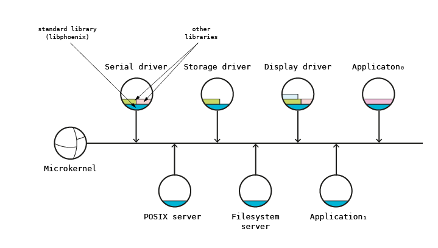

# Architecture

## Synopsis

After reading this chapter, you will know:

- How the Phoenix-RTOS microkernel architecture separates kernel, servers, and libraries
- How message passing works with three-tier copy minimization
- How system calls transition between user and kernel privilege levels on each architecture
- How the port-based namespace maps filesystem paths to servers
- How multi-core support is implemented

The Phoenix-RTOS operating system starting from version 3 is based on microkernel architecture.
It means that system consists of microkernel implementing basic primitives and set of servers based on these primitives
and communicating over it.
The main advantage of such architecture is high scalability.
The disadvantage is performance degradation caused by message passing.
Message passing demands in some cases memory copying and additional thread context switching.

The architecture is schematically presented on figure below.

## Microkernel

Microkernel implements minimum set of primitives necessary to implement other operating system components.
Phoenix-RTOS microkernel implements four fundamental subsystems - memory management, process and thread management,
interprocess communication and low-level I/O for redirecting the interrupts to user-level threads. Microkernel
functionalities are accessible for applications through set of system calls. System call (syscall) is the operating
system function implemented by the special processor instruction switching the execution privilege mode from user to
system. After switching the execution mode from user to system privilege level program is able to execute privileged
instructions and access the system memory segments and I/O space.

To understand the microkernel architecture please refer to chapter [Kernel architecture](../kernel/index.md).

## Interprocess communication

The main functionality provided by microkernel necessary to implement the operating system is the interprocess
communication (IPC). In the figure above microkernel was shown as the bus between other system components and this
is the main factor which differentiates the microkernel-based operating system from the traditional monolithic kernel
based operating system. All system components interact with each other using message passing. For example file
operations are performed by communicating with file servers. Such approach affects tremendously system scalability and
modularity. The local communication based on shared memory can be easily extended to the remote communication using
network. The modules (servers) implementing specific functionalities can be easily added and removed from the system
due to message passing restricting interactions between them to a well-structured format. Servers partition the
operating system functionality in the natural way. The message passing should be implemented in such a way that
minimizes the communication overhead. Consequently, it should be supported by some virtual memory mechanisms like
physical memory sharing. In the further considerations it is assumed that messages are sent to the ports registered by
servers. Ports together with identifiers of data structures operated by servers (e.g. files) identify operating system
objects.

Interprocess communication has been described in
[Kernel - Processes and threads - Message passing](../kernel/proc/msg.md) chapter.

### Message Copy Minimization

To minimize the overhead of message passing, the kernel uses a three-tier data transfer strategy:

1. **Inline (≤ 64 bytes)**: Data is carried in the `msg_t` structure's `raw[64]` union — no buffer allocation or
   page mapping needed
2. **Page mapping (larger aligned buffers)**: Sender's buffer pages are mapped into the receiver's address space
   via `page_map()` — no data is copied
3. **Boundary copy (unaligned partial pages)**: Only unaligned partial-page data at buffer boundaries requires
   copying, using wrapper page allocation to prevent interference

This means most IPC operations avoid data copying entirely, with only small messages and buffer boundaries incurring
copy overhead. If both sides share the same address space, the mapping/copying phases are skipped.

## Standard library

Standard library is the set of functions constituting the basic programming environment (providing the basic API) and
based on the system calls. API could be compatible with popular programming standards (ANSI C, POSIX etc.) or could be
specific for the operating system. Phoenix-RTOS 3 provides its own standard library (`libphoenix`) compatible with ANSI
C89 and extended with some specific functions for memory mapping and process and thread management. The library can be
extended (in cooperation with servers) with additional functions to provide the POSIX compliant environment. Such
environment requires much more memory than basic ANSI C native interface but allows for execution of the popular
open-source UN*X applications.

> **Note:** The C89 compatibility applies to the `libphoenix` API. Internal system code uses modern C features
> including C11 atomics (`atomic_load_explicit`, `memory_order_acquire`) and GCC extensions
> (`__attribute__((constructor))`).

Standard library has been described in [Standard library](../libc/index.md) chapter.

## Servers

In the microkernel architecture servers plays very important role in the whole operating system. They provide
functionalities removed from the traditional, monolithic kernel and moved to the user space. Good examples of
such functionalities are file management or device management (device drivers). The main method for communicating
with server is message passing. Each server allocates and registers set of ports used to receive messages from other
system components. For example the file server registers new port in the filesystem space. Device driver registers
new name in the `/dev` directory.

Server concept and server registering are described in
[Kernel - Processes and threads - Servers and namespace](../kernel/proc/namespace.md) chapter.

## Device drivers

Device drivers are specific servers responsible for controlling devices. They can implement protocol for I/O operations
enabling to use them like files. Special mechanism is used to allow user level processes to communicate with the
hardware. In architectures without I/O address space where device registers are accessible in the memory address space
the special memory mapping is used. When device uses I/O space (e.g. ports on IA32) special processor flag is set
permitting the unprivileged code to access the parts or whole I/O space. The flag is set during runtime using specific
system call. Second important issue which should be discussed here is interrupt handling. When device drivers run on
user-level, interrupts are redirected to the selected processes and interrupt handling routines are implemented as
regular functions.

To understand the device drivers architecture and method of development of new drivers please refer to chapter
[Device drivers](../devices/index.md).

## File servers

File servers are specialized servers implementing filesystem. Similarly to device drivers they implement specific
protocol for filesystem operations (for opening, closing, reading and writing files and for operating on directories).
Any file server can handle any part of the namespace. The selected part of the namespace is assigned to the server by
registering its port for the selected directory entry. When applications use the part of the namespace handled by the
server during the path resolution procedure, the server's port is returned to the object identifier and all
communication is redirected to the server.

File servers are described in [Filesystems](../filesystems/index.md) chapter.

## Emulation servers

Microkernel architecture allows to easily emulate the application environment of existing operating systems
(e.g. POSIX). To provide some OS specific mechanisms which are not supported by native Phoenix-RTOS environment
(e.g. POSIX pipes, user and groups etc.) emulation servers should be provided. They implement the additional
functionality and together with emulation libraries provide the application environment. The communication protocol
implemented by these servers is specific for emulated application environment.

## Namespace

The port-based namespace maps filesystem paths to server ports. When a server starts, it creates a port
(`portCreate()`) and registers it for a path (`portRegister()`). When an application opens a file, the kernel resolves
the path through the namespace tree, finds the registered port, and routes all subsequent operations (read, write,
close) as messages to that port.

The namespace is hierarchical — a server registering `/dev` handles all paths under `/dev/` unless a more specific
registration exists. Port registration/unregistration is dynamic, allowing servers to be started and stopped at runtime.

## Interrupt-to-thread pipeline

Device drivers on Phoenix-RTOS run in user space but still need to handle hardware interrupts. The `interrupt()` syscall
registers a handler function that runs in kernel context. When the handler returns a value ≥ 0, the kernel broadcasts
on the associated condition variable, waking the user-space thread that is waiting via `condWait()`. This allows
interrupt handling to be split into a fast kernel-context acknowledgment and a deferred user-space processing phase.

## Multi-core support

Phoenix-RTOS supports symmetric multiprocessing on architectures with multiple cores:

| Architecture | IPC Mechanism | Implementation |
|-------------|---------------|----------------|
| IA32 | APIC-based Inter-Processor Interrupts | `hal_cpuBroadcastIPI()`, `hal_cpuSendIPI()` |
| RISC-V | SBI-based IPI | SBI extension `0x735049` for inter-hart interrupts |

One core (boot hart/BSP) performs centralized initialization; other cores wait and are brought up afterward.
Spinlocks with architecture-specific memory barriers coordinate access to shared kernel data structures. The scheduler
uses 8 priority levels and distributes threads across available cores.

## Memory Management: MMU vs NOMMU

The kernel supports both MMU and NOMMU architectures through conditional compilation. On MMU architectures,
full virtual memory with paging provides process isolation through separate page tables. On NOMMU architectures
(e.g., Cortex-M), memory protection is achieved through MPU regions with a simplified `msg-nommu.c` message passing
implementation that avoids page table manipulation.
