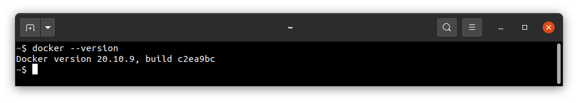
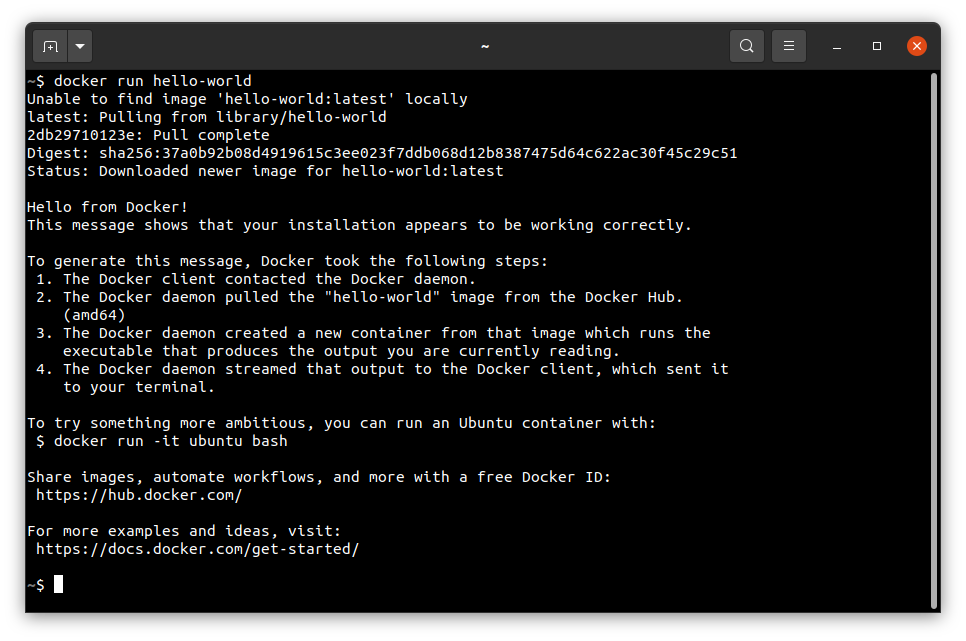

# Building

To create a Feniks-RTOS image for the selected target the `feniks-rtos-project` repository should be used. This
repository aggregates all operating system modules - kernel, standard library, device
drivers, filesystems, utilities, and loader. Read more about `feniks-rtos-project` submodule repositories
[here](project.md).

This chapter contains instructions on how to build a reference project and how to create the final system image.

## Contents

- [Supported host operating systems](#host-operating-system)
- [Getting the feniks-rtos-project repository](#obtaining-the-sources)
- [Supported Feniks-RTOS platforms](#supported-target-platforms)
- [Building the system image with docker](#building-using-docker)
- [Building the system image natively](#building-using-the-native-toolchain)
- [Launching Feniks-RTOS](#launching-feniks-rtos)
- [Navigation links](#see-also)

## Host operating system

Instructions in the `Building` and `Running system on targets` chapters have been verified for the Ubuntu
(20.04 and 22.04 versions) Linux distribution and macOS (tested on macOS Monterey 12.6.1), so this is the easiest way
to start working with Feniks-RTOS. Windows is also supported, by using `Cygwin` or `WSL`.

For more information follow:

- [Windows setup](windows.md)

## Obtaining the sources

The first step of the preparation of the final system image is repository cloning.

To do that and make the next instructions possible, it's recommended to update currently installed packages and, if need
be, install git:

  <details>
  <summary>Installing git on Ubuntu (click to expand)</summary>

  ```console
  sudo apt update && \
  sudo apt install -y git
  ```

  </details>

  <details>
  <summary>Installing git on macOS (click to expand)</summary>
&nbsp;

  You will need the command line tools for `Xcode` and `Homebrew` package, if you don't have it you can install it by
  typing:

  ```console
  xcode-select --install
  ```

  and then:

  ```console
  /bin/bash -c "$(curl -fsSL https://raw.githubusercontent.com/Homebrew/install/HEAD/install.sh)"
  ```

  Assure that brew is properly installed, by checking its version:

  ```console
  brew --version
  ```

  *The described instructions have been verified for `4.0.11` brew version.

  Then you will be ready for installing git and other required tools:

  ```console
  brew update && \
  brew install git
  ```

  </details>
  &nbsp;

Then, the repository should be cloned **recursively** (to get the submodules):

```console
git clone --recursive https://github.com/feniks-rtos/feniks-rtos-project.git
```

## Supported target platforms

The Feniks-RTOS reference project supports the following target platforms:

- aarch64a53-zynqmp-qemu
- aarch64a53-zynqmp-zcu104
- aarch64a53-zynqmp-som
- armv7a7-imx6ull-evk
- armv7a9-zynq7000-qemu
- armv7a9-zynq7000-zedboard
- armv7a9-zynq7000-zturn
- armv7m4-stm32l4x6-nucleo
- armv7m7-imxrt105x-evk
- armv7m7-imxrt106x-evk
- armv7m7-imxrt117x-evk
- armv8m33-mcxn94x-frdm
- host-generic-pc
- ia32-generic-pc
- ia32-generic-qemu
- riscv64-generic-qemu
- riscv64-generic-spike
- riscv64-noelv-fpga
- sparcv8leon-generic-qemu
- sparcv8leon-gr712rc-board
- sparcv8leon-gr716-mimas
- sparcv8leon-gr716-mini
- sparcv8leon-gr740-mini

To get the list of valid targets the `build.sh` script should be launched with an empty `TARGET` variable, eg:

```console
./feniks-rtos-build/build.sh
```


## Building using docker

This is the quickest way to start development - all necessary tools are distributed in a docker image.

Firstly, you need to have the docker installed.

  <details>
  <summary>Installing Docker on Ubuntu (click to expand)</summary>

- Install required packages

  ```console
  sudo apt update && \
  sudo apt install -y curl \
  ca-certificates \
  gnupg \
  lsb-release
  ```

- Make docker packages available

  ```console
  curl -fsSL https://download.docker.com/linux/ubuntu/gpg | sudo gpg --dearmor -o /usr/share/keyrings/docker-archive-keyring.gpg && \
  echo \
  "deb [arch=$(dpkg --print-architecture) signed-by=/usr/share/keyrings/docker-archive-keyring.gpg] https://download.docker.com/linux/ubuntu \
  $(lsb_release -cs) stable" | sudo tee /etc/apt/sources.list.d/docker.list > /dev/null
  ```

- Install docker packages

  ```console
  sudo apt-get update && \
  sudo apt-get install docker-ce docker-ce-cli containerd.io
  ```

- Check if Docker is properly installed (version can be different):

  ```console
  sudo docker --version
  ```

  

- To make calling docker command without `sudo` possible type:

  ```console
  sudo groupadd docker
  ```

  Even if group `docker` already exists type then:

  ```console
  sudo usermod -aG docker $USER && \
  newgrp docker
  ```

- Check if running docker images without sudo works properly:

  ```console
  docker run hello-world
  ```

  

  For more details and other instructions see

  [docker.com](https://docs.docker.com/engine/install/ubuntu/)

  </details>

<details>
  <summary>Installing Docker on macOS (click to expand)</summary>
&nbsp;

  You can find the up-to-date instructions on <https://docs.docker.com/desktop/install/mac-install/>

  To make this process simpler below is an example of installation for Mac with the Intel chip:

  Download the installer:

  ```console
  curl -o Docker.dmg "https://desktop.docker.com/mac/main/amd64/Docker.dmg?utm_source=docker&amp;utm_medium=webreferral&amp;utm_campaign=docs-driven-download-mac-amd64"
  ```

  Run the following commands to install Docker:

  ```console
  sudo hdiutil attach Docker.dmg && \
  sudo /Volumes/Docker/Docker.app/Contents/MacOS/install && \
  sudo hdiutil detach /Volumes/Docker
  ```

  Then add the path to `docker` binaries to the `PATH` environment variable:

  ```console
  export PATH="/Applications/Docker.app/Contents/Resources/bin:$PATH"
  ```

  It's recommended to place it in `.zshrc` startup script to export it every time during startup:

  ```console
  echo 'export PATH=/Applications/Docker.app/Contents/Resources/bin:$PATH' >> $HOME/.zshrc
  ```

- Check if Docker is properly installed by checking its version:

  ```console
  docker --version
  ```

- Check if running docker images without sudo works properly:

  ```console
  docker run hello-world
  ```

- If you see the following error: `ERROR: Cannot connect to the Docker daemon at unix:///var/run/docker.sock.`
  you can try to install `colima` and check once again:

  ```console
  brew install colima && \
  colima start
  ```

  </details>
  &nbsp;

Then, to build - provide a `TARGET` via ENV variable and run the build script:

```console
cd feniks-rtos-project/
TARGET=ia32-generic-qemu ./docker-build.sh all
```

After the build completes, kernel and disk images will be created and placed in the `_boot` directory.

You can read more about the building script options [here](script.md).

## Building using the native toolchain

This is the method preferred when you plan to develop Feniks-RTOS.

Firstly, you need to install some tools required for compiling the toolchain and finally create a
Feniks-RTOS system image.
There is a list of commands you can use to get them: on both Ubuntu and macOS host operating systems.

  <details>
  <summary>Installing required tools for native build on Ubuntu (click to expand)</summary>

  ```console
  sudo apt update && \
  sudo apt install -y build-essential \
  mtd-utils \
  autoconf \
  pkg-config \
  texinfo \
  genext2fs \
  libtool \
  libhidapi-dev \
  python3 \
  python3-jinja2 \
  python3-yaml
  ```

  </details>

  <details>
  <summary>Installing required tools for native build on macOS (click to expand)</summary>

  ```console
  brew update && \
  brew upgrade && \
  brew install bash \
  coreutils \
  autoconf \
  automake \
  genext2fs \
  make \
  libelf \
  wget \
  gnu-sed \
  hidapi \
  python3 \
  python3-jinja2 \
  python3-yaml
  ```

  *`bash` in version >= `4.0` and `make` in version >= `3.82` are needed (associative arrays and `undefine` used).
  They may be preinstalled, but in older versions, that's why we install it there.

  It's also required to add appropriate paths to the `PATH` environment variable:

  ```console
  export PATH=$(brew --prefix make)/libexec/gnubin:$(brew --prefix gnu-sed)/libexec/gnubin:$PATH
  ```

  and keep it updated, for example by placing the export in the startup script:

  ```console
  echo 'export PATH=$(brew --prefix make)/libexec/gnubin:$(brew --prefix gnu-sed)/libexec/gnubin:$PATH' >> $HOME/.zshrc
  ```

  *Note that you have to place the `gnubin` path that provides `make` before the `/usr/bin` in the `PATH` environment
  variable to use the `gnu` version (as it is done above).

  Feniks-RTOS requires the `endian.h` header, which may exist, but not be visible. If during the building you discover
  the following error:
  `fatal error: 'endian.h' file not found`
  please create the symlink to this header by the given command:

  ```console
  sudo ln -s /Applications/Xcode.app/Contents/Developer/Platforms/MacOSX.platform/Developer/SDKs/MacOSX.sdk/usr/include/machine/endian.h /usr/local/include/endian.h
  ```

  </details>
  &nbsp;

Next, you need to compile the toolchains for all required target architectures:

```console
cd feniks-rtos-project
```

```text
(cd feniks-rtos-build/toolchain/ && ./build-toolchain.sh i386-pc-feniks ~/toolchains/i386-pc-feniks)
(cd feniks-rtos-build/toolchain/ && ./build-toolchain.sh arm-feniks ~/toolchains/arm-feniks)
(cd feniks-rtos-build/toolchain/ && ./build-toolchain.sh riscv64-feniks ~/toolchains/riscv64-feniks)
(cd feniks-rtos-build/toolchain/ && ./build-toolchain.sh sparc-feniks ~/toolchains/sparc-feniks)
(cd feniks-rtos-build/toolchain/ && ./build-toolchain.sh aarch64-feniks ~/toolchains/aarch64-feniks)
```

<details>
<summary> Errors and warnings that may occur during the toolchain compilation </summary>
&nbsp;

If you have encountered some issue during the toolchain build - you probably interrupted a build before or the files in
the `toolchains` directory are broken for some reason. Removing a directory for a specific architecture
(arm-feniks/i386-pc-feniks/riscv64-feniks/sparc-feniks) and launching a build once again should help.

`NOTE:` Even during the correct compilation process there may be some unresolved warnings.

</details>
  &nbsp;

Toolchain binaries should be added to the PATH variable:

```console
export PATH=$PATH:$HOME/toolchains/i386-pc-feniks/i386-pc-feniks/bin/:$HOME/toolchains/arm-feniks/arm-feniks/bin/:$HOME/toolchains/riscv64-feniks/riscv64-feniks/bin/:$HOME/toolchains/sparc-feniks/sparc-feniks/bin/
```

You should keep the `PATH` variable updated. There are various methods to do that, for example you can place the export
in `.bashrc` file on `Ubuntu`:

  ```console
  echo "export PATH=$PATH:$HOME/toolchains/i386-pc-feniks/i386-pc-feniks/bin/:$HOME/toolchains/arm-feniks/arm-feniks/bin/:$HOME/toolchains/riscv64-feniks/riscv64-feniks/bin/:$HOME/toolchains/sparc-feniks/sparc-feniks/bin/" >> $HOME/.bashrc
  ```

or in `.zshrc` on macOS:

  ```console
  echo 'export PATH=$PATH:$HOME/toolchains/i386-pc-feniks/i386-pc-feniks/bin/:$HOME/toolchains/arm-feniks/arm-feniks/bin/:$HOME/toolchains/riscv64-feniks/riscv64-feniks/bin/:$HOME/toolchains/sparc-feniks/sparc-feniks/bin/' >> $HOME/.zshrc
  ```

Read more about the Feniks-RTOS toolchain [here](toolchain.md).

To build a project - provide a `TARGET` via ENV variable:

```console
TARGET=ia32-generic-qemu ./feniks-rtos-build/build.sh all
```

After the build completes, kernel and disk images will be created and placed in the `_boot` directory.

You can read more about the building script options [here](script.md).

## Launching Feniks-RTOS

To start the created image on target architecture please see [feniks-rtos-doc/quickstart](../quickstart/index.md)
guide.

## See also

1. [Windows setup](windows.md)
2. [Toolchain](toolchain.md)
3. [Building script](script.md)
4. [Reference project](project.md)
5. [Table of Contents](../index.md)

```{toctree}
:hidden:
:maxdepth: 1

toolchain.md
script.md
project.md
```
