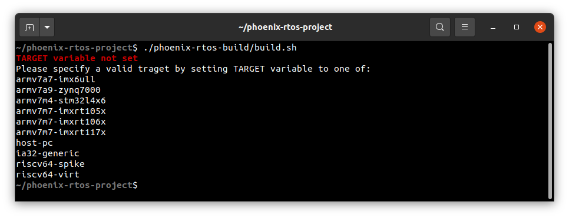
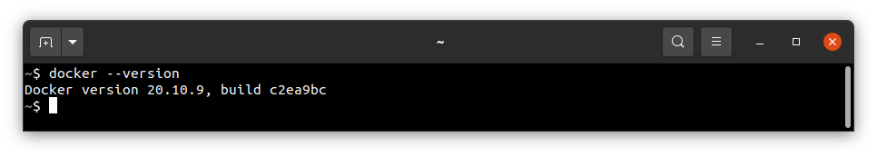
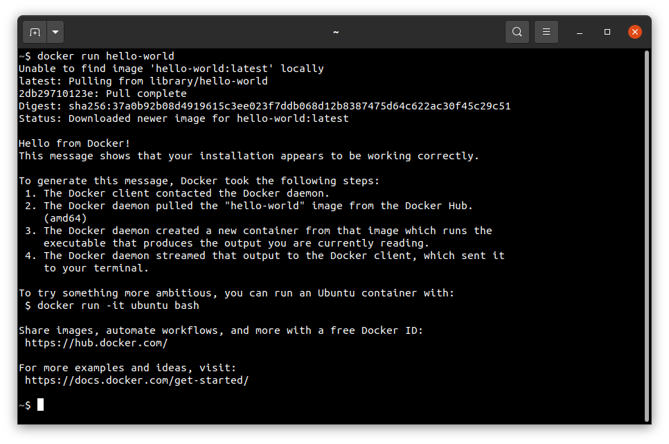

# Linux

## Obtaining the sources

The first step of the preparation of the final system image is repository cloning.

To do that and make the next instructions possible, it's recommended to update currently installed packages and, if need
be, install git:

  <details>
  <summary>Installing git on Ubuntu (click to expand)</summary>

  ```console
  sudo apt update && \
  sudo apt install -y git
  ```

  </details>

## Supported target platforms

To get the list of valid targets the `build.sh` script should be launched with an empty `TARGET` variable, eg:

```console
./phoenix-rtos-build/build.sh
```



## Building using docker

This is the quickest way to start development - all necessary tools are distributed in a docker image.

Firstly, you need to have the docker installed.

  <details>
  <summary>Installing Docker on Ubuntu (click to expand)</summary>

- Install required packages

  ```console
  sudo apt update && \
  sudo apt install -y curl \
  ca-certificates \
  gnupg \
  lsb-release
  ```

- Make docker packages available

  ```console
  curl -fsSL https://download.docker.com/linux/ubuntu/gpg | sudo gpg --dearmor -o /usr/share/keyrings/docker-archive-keyring.gpg && \
  echo \
  "deb [arch=$(dpkg --print-architecture) signed-by=/usr/share/keyrings/docker-archive-keyring.gpg] https://download.docker.com/linux/ubuntu \
  $(lsb_release -cs) stable" | sudo tee /etc/apt/sources.list.d/docker.list > /dev/null
  ```

- Install docker packages

  ```console
  sudo apt-get update && \
  sudo apt-get install docker-ce docker-ce-cli containerd.io
  ```

- Check if Docker is properly installed (version can be different):

  ```console
  sudo docker --version
  ```

  

- To make calling docker command without `sudo` possible type:

  ```console
  sudo groupadd docker
  ```

  Even if group `docker` already exists type then:

  ```console
  sudo usermod -aG docker $USER && \
  newgrp docker
  ```

- Check if running docker images without sudo works properly:

  ```console
  docker run hello-world
  ```

  

  For more details and other instructions see

  [docker.com](https://docs.docker.com/engine/install/ubuntu/)

  </details>

<details>
  <summary>Installing Docker on macOS (click to expand)</summary>
&nbsp;

  You can find the up-to-date instructions on <https://docs.docker.com/desktop/install/mac-install/>

  To make this process simpler below is an example of installation for Mac with the Intel chip:

  Download the installer:

  ```console
  curl -o Docker.dmg "https://desktop.docker.com/mac/main/amd64/Docker.dmg?utm_source=docker&amp;utm_medium=webreferral&amp;utm_campaign=docs-driven-download-mac-amd64"
  ```

  Run the following commands to install Docker:

  ```console
  sudo hdiutil attach Docker.dmg && \
  sudo /Volumes/Docker/Docker.app/Contents/MacOS/install && \
  sudo hdiutil detach /Volumes/Docker
  ```

  Then add the path to `docker` binaries to the `PATH` environment variable:

  ```console
  export PATH="/Applications/Docker.app/Contents/Resources/bin:$PATH"
  ```

  It's recommended to place it in `.zshrc` startup script to export it every time during startup:

  ```console
  echo 'export PATH=/Applications/Docker.app/Contents/Resources/bin:$PATH' >> $HOME/.zshrc
  ```

- Check if Docker is properly installed by checking its version:

  ```console
  docker --version
  ```

- Check if running docker images without sudo works properly:

  ```console
  docker run hello-world
  ```

- If you see the following error: `ERROR: Cannot connect to the Docker daemon at unix:///var/run/docker.sock.`
  you can try to install `colima` and check once again:

  ```console
  brew install colima && \
  colima start
  ```

  </details>
  &nbsp;

Then, to build - provide a `TARGET` via ENV variable and run the build script:

```console
TARGET=ia32-generic-qemu ./docker-build.sh all
```

After the build completes, kernel and disk images will be created and placed in the `_boot` directory.

## Building using the native toolchain

This is the method preferred when you plan to develop Phoenix-RTOS.

Firstly, you need to install some tools required for compiling the toolchain and finally create a
Phoenix-RTOS system image.
There is a list of commands you can use to get them: on both Ubuntu and macOS host operating systems.

  <details>
  <summary>Installing required tools for native build on Ubuntu (click to expand)</summary>

  ```console
  sudo apt update && \
  sudo apt install -y build-essential \
  mtd-utils \
  autoconf \
  pkg-config \
  texinfo \
  genext2fs \
  libtool \
  libhidapi-dev \
  python3 \
  python3-jinja2 \
  python3-yaml
  ```

  </details>

  <details>
  <summary>Installing required tools for native build on macOS (click to expand)</summary>

  ```console
  brew update && \
  brew upgrade && \
  brew install bash \
  coreutils \
  autoconf \
  automake \
  genext2fs \
  make \
  libelf \
  wget \
  gnu-sed \
  hidapi \
  python3 \
  python3-jinja2 \
  python3-yaml
  ```

  *`bash` in version >= `4.0` and `make` in version >= `3.82` are needed (associative arrays and `undefine` used).
  They may be preinstalled, but in older versions, that's why we install it there.

  It's also required to add appropriate paths to the `PATH` environment variable:

  ```console
  export PATH=$(brew --prefix make)/libexec/gnubin:$(brew --prefix gnu-sed)/libexec/gnubin:$PATH
  ```

  and keep it updated, for example by placing the export in the startup script:

  ```console
  echo 'export PATH=$(brew --prefix make)/libexec/gnubin:$(brew --prefix gnu-sed)/libexec/gnubin:$PATH' >> $HOME/.zshrc
  ```

  *Note that you have to place the `gnubin` path that provides `make` before the `/usr/bin` in the `PATH` environment
  variable to use the `gnu` version (as it is done above).

  Phoenix-RTOS requires the `endian.h` header, which may exist, but not be visible. If during the building you discover
  the following error:
  `fatal error: 'endian.h' file not found`
  please create the symlink to this header by the given command:

  ```console
  sudo ln -s /Applications/Xcode.app/Contents/Developer/Platforms/MacOSX.platform/Developer/SDKs/MacOSX.sdk/usr/include/machine/endian.h /usr/local/include/endian.h
  ```

  </details>
  &nbsp;

Next, you need to compile toolchains for all required target architectures:

```console
cd phoenix-rtos-build/toolchain && ./build-toolchain.sh i386-pc-phoenix ~/toolchains/i386-pc-phoenix
```

```console
cd phoenix-rtos-build/toolchain && ./build-toolchain.sh arm-phoenix ~/toolchains/arm-phoenix
```

```console
cd phoenix-rtos-build/toolchain && ./build-toolchain.sh riscv64-phoenix ~/toolchains/riscv64-phoenix
```

```console
cd phoenix-rtos-build/toolchain && ./build-toolchain.sh sparc-phoenix ~/toolchains/sparc-phoenix
```

<details>
<summary> Errors and warnings that may occur during the toolchain compilation </summary>
&nbsp;

If you have encountered some issue during the toolchain build - you probably interrupted a build before or the files in
the `toolchains` directory are broken for some reason. Removing a directory for a specific architecture
(arm-phoenix/i386-pc-phoenix/riscv64-phoenix/sparc-phoenix) and launching a build once again should help.

`NOTE:` Even during the correct compilation process there may be some unresolved warnings.

</details>
  &nbsp;

Then update your `PATH` variable. To make that change persistent across sessions, add the following command to your
shell configuration file (e.g. `~/.bashrc`):

  ```console
  echo "export PATH=$PATH \
	:$HOME/toolchains/i386-pc-phoenix/i386-pc-phoenix/bin/ \
	:$HOME/toolchains/arm-phoenix/arm-phoenix/bin/ \
	:$HOME/toolchains/riscv64-phoenix/riscv64-phoenix/bin/ \
	:$HOME/toolchains/sparc-phoenix/sparc-phoenix/bin/" >> $HOME/.bashrc
  ```

Afterward, source the `~/.bashrc` to apply the changes immediately, or simply restart your terminal session.
