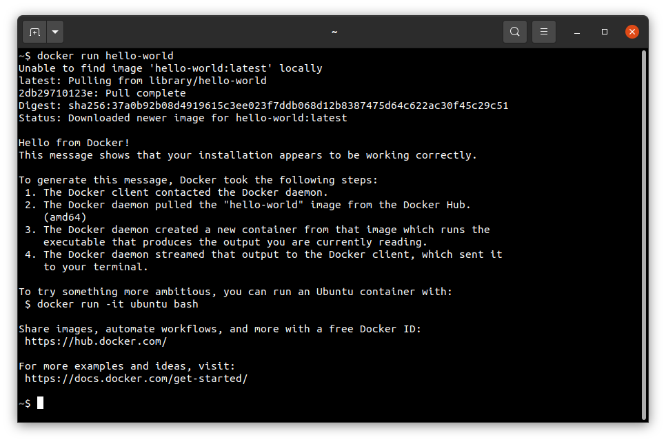

# Linux

## Obtaining the sources

The first step of the preparation of the final system image is repository cloning.

To do this and make the following instructions possible, it’s recommended to update the currently installed packages
and, if necessary, install `git`:

```console
sudo apt update && \
sudo apt install -y git
```

## Supported target platforms

To get a list of valid targets, the `build.sh` script should be launched with an empty `TARGET` variable, e.g.:

```console
./phoenix-rtos-build/build.sh
```


## Building using docker

This is the fastest way to start development, as all the necessary tools are included in the prepared Docker image.

Firstly, you need to have `Docker` installed.

  <details>
  <summary>Installing Docker on Ubuntu (click to expand)</summary>

- Install required packages

  ```console
  sudo apt update && sudo apt install -y \
  curl \
  ca-certificates \
  gnupg \
  lsb-release
  ```

- Make docker packages available

  ```console
  curl -fsSL https://download.docker.com/linux/ubuntu/gpg | \
  sudo gpg --dearmor -o /usr/share/keyrings/docker-archive-keyring.gpg && \
  echo "deb [arch=$(dpkg --print-architecture) signed-by=/usr/share/keyrings/docker-archive-keyring.gpg]"\
  "https://download.docker.com/linux/ubuntu $(lsb_release -cs) stable" | \
  sudo tee /etc/apt/sources.list.d/docker.list > /dev/null
  ```

- Install docker packages

  ```console
  sudo apt-get update && \
  sudo apt-get install docker-ce docker-ce-cli containerd.io
  ```

- Check if Docker is properly installed (version can be different):

  ```console
  sudo docker --version
  ```

  

- To make calling docker command without `sudo` possible type:

  ```console
  sudo groupadd docker
  ```

  Even if group `docker` already exists type then:

  ```console
  sudo usermod -aG docker $USER && \
  newgrp docker
  ```

- Check if running docker images without sudo works properly:

  ```console
  docker run hello-world
  ```

  

  For more details and other instructions see

  [docker.com](https://docs.docker.com/engine/install/ubuntu/)

  </details>

Then, to build, run build script with `TARGET` environment variable:

```console
TARGET=ia32-generic-qemu ./docker-build.sh all
```

After the build completes, kernel and disk images will be created and placed in the `_boot` directory.

## Building the native toolchain

If you prefer, you can build the toolchain from source yourself. Before doing so, run the command below
to ensure that the prerequisites listed below are installed.

```console
sudo apt update && sudo apt install -y \
build-essential mtd-utils autoconf \
pkg-config texinfo genext2fs \
libtool libhidapi-dev python3 \
python3-jinja2 python3-yaml
```

In the phoenix-rtos-build/toolchain directory, run one of the following command to build the toolchain
for the specific architecture:

```console
./build-toolchain.sh i386-pc-phoenix ~/toolchains/i386-pc-phoenix
```

```console
./build-toolchain.sh arm-phoenix ~/toolchains/arm-phoenix
```

```console
./build-toolchain.sh riscv64-phoenix ~/toolchains/riscv64-phoenix
```

```console
./build-toolchain.sh sparc-phoenix ~/toolchains/sparc-phoenix
```

<details>
<summary> Errors and warnings that may occur during the toolchain compilation </summary>

If you have encountered some issue during the toolchain build - you probably interrupted a build before or the files in
the `toolchains` directory are broken for some reason. Removing a directory for a specific architecture
(arm-phoenix/i386-pc-phoenix/riscv64-phoenix/sparc-phoenix) and launching a build once again should help.

`NOTE:` Even during the correct compilation process there may be some unresolved warnings.

</details>

Then update your `PATH` variable. To make that change persistent across sessions, add the following command to your
shell configuration file (e.g. `~/.bashrc`):

```console
echo 'export PATH=$PATH \
      :$HOME/toolchains/i386-pc-phoenix/i386-pc-phoenix/bin \
      :$HOME/toolchains/arm-phoenix/arm-phoenix/bin \
      :$HOME/toolchains/riscv64-phoenix/riscv64-phoenix/bin \
      :$HOME/toolchains/sparc-phoenix/sparc-phoenix/bin' >> $HOME/.bashrc
```

As a final step, source the `~/.bashrc` file to apply the changes immediately, or restart your terminal session for
them to take effect.
