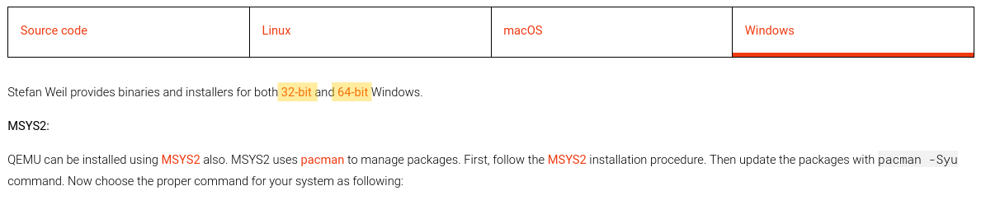
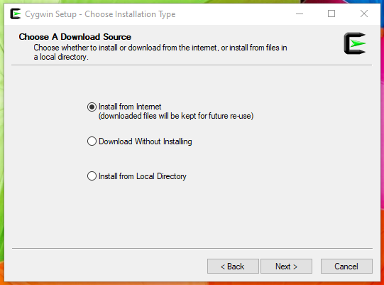
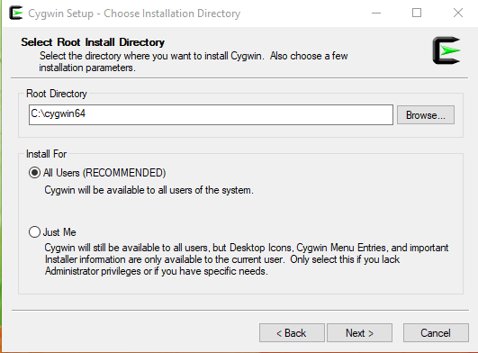
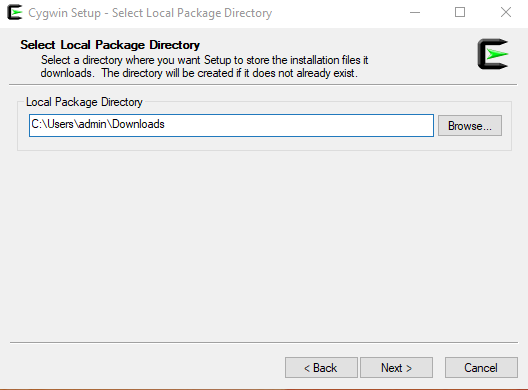
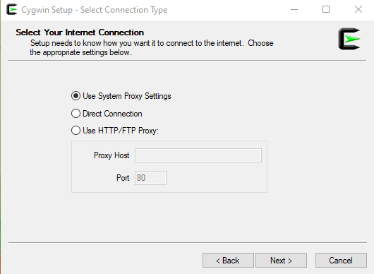
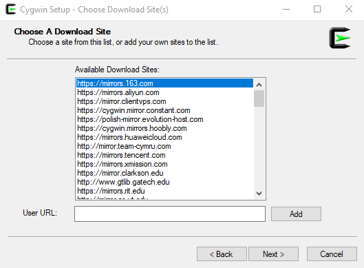
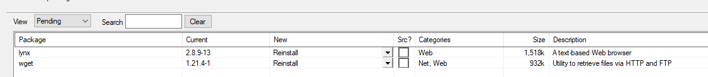
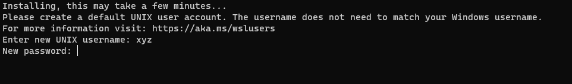

# Windows

For now, it is possible to build Phoenix-RTOS images for all targets and run `ia32-generic-qemu` on Windows using
`Cygwin` or `WSL`. Running the rest of targets is under development.

## Cygwin

To start, we need to download and install the QEMU environment on Windows. It's important to do it first to avoid issues
with the `qemu-integration` tool.

<details>
<summary> How to install QEMU on Windows (click to expand)</summary>
&nbsp;

To do this, go to the official [QEMU website](https://www.qemu.org/download/#windows) and select a mirror targeted
for your system.


Then it should be installed with the default configuration.

</details>

Next up we need to download `Cygwin` from the [official website](https://cygwin.com/install.html). It is a collection of
Open Source tools that provides functionality similar to a Linux distribution on Windows.

<details>
<summary> Cygwin installation/update process (click to expand)</summary>
&nbsp;

* The installation process also serves as a package manager. `Cygwin` will ask about a type of installation in our case
it will be first choice (Install from Internet).



* After that, it will ask about the destination of a root and local package directory




* `Cygwin` has the capability of using host's internet connection, but it needs to be configured with our preferences
(In most scenario it will be System Proxy Settings)



* Selection of a mirror for package downloads can be tricky, sometimes it needs to be changed for better results because
not all mirrors have all available packets. That's why it's recommended to install only the necessary ones at first as
it is done in the next instructions.



* After selecting the mirror, we can select the packages we want. For now only `lynx` and `wget` should be chosen (they
will be installed with required dependencies). Those tools are mandatory to use package manager
`apt-cyg` and install the rest of required packages in Cygwin terminal (explained further).
* Note that `Install` will be printed instead of `Reinstall` in case that you are executing the installation for a first
time.



* Once these are chosen, proceed to run the installation process.

</details>
  &nbsp;

The next step is to run `Cygwin` terminal.
Always run it as administrator, the best way to do that is simply setup this as default action:

<details>
<summary>How to run Cygwin as administrator by default (click to expand)</summary>
&nbsp;

Right-click on the `Cygwin64Terminal` icon, then go to `Properties` ⇾ `Compatibility` ⇾ `Settings` and choose `Run this
program as an administrator`

</details>
&nbsp;

After launching the terminal, it may happen that working directory is wrong. It can be corrected by moving to the home
directory.

<details>
<summary>Show more about changing directories in Cygwin.</summary>
&nbsp;

To simply change a directory to home, the `cd` command may be used:

```console
cd
```

This will move you to the default home directory placed in `cygwin64/home/admin/` on Windows (`cygwin64` placed in the
Cygwin installation path).
Then the terminal is pointed as `~`, and it determines you are in home directory. It will look like:

```console
pc@user ~
$
```

</details>
&nbsp;

Now the packages required for launching Phoenix-RTOS may be installed. It can be done using the following command:

```console
lynx -source rawgit.com/transcode-open/apt-cyg/master/apt-cyg > apt-cyg && \
install apt-cyg /bin && \
apt-cyg install libhidapi-devel libgccpp1 libtool \
libusb-devel libvirt-client libvirt-devel \
mingw64-i686-gcc-core mingw64-i686-gcc-g++ \
mingw64-x86_64-gcc-core mingw64-x86_64-gcc-g++ \
gcc-core gcc-g++ libclang-devel nano vim \
patch picocom python3 python3-pip python3-sphinx \
python3-devel qemu-integration symlinks \
tty-clock usbutils virt-viewer make autoconf \
automake cmake libc-client-devel git
```

&nbsp;

Before performing the next steps `Cygwin` needs to download all dependencies to the packages that were installed.
Launch `Cygwin` installation again and now in the package's section we can see tons of libraries that were automatically
added to the list.
All that we need is to execute the installing process.

The next step is to prepare the `genext2fs` library and clone the repository. We need to make manually `genext2fs`
library, because `Cygwin` doesn't support it, and it's mandatory in case of creating images for the ia32 system.

To do this, paste the following into the `Cygwin` terminal:

<details>
<summary>Make genext2fs package and download phoenix-rtos (click to expand)</summary>

&nbsp;

```console
git clone --recursive https://github.com/bestouff/genext2fs &&\
cd genext2fs &&\
./autogen.sh &&\
./configure &&\
make &&\
make install &&\
make check &&\
cd .. &&\
rm -rf genext2fs apt-cyg
```

</details>
&nbsp;

Finally, all external tools are on place.
Now what was left is to copy repository with all submodules.

To do that call this command in home directory:

```console
git clone --recursive https://github.com/phoenix-rtos/phoenix-rtos-project/
```

Now, we can follow instructions about building toolchains. Remember to use commands inside
`phoenix-rtos-project` folder.

(Quick tip: It is not mandatory but turning off Real-Time Protection in Windows Defender speeds up this process)

```console
 cd phoenix-rtos-project
```

```console
(cd phoenix-rtos-build/toolchain/ && ./build-toolchain.sh i386-pc-phoenix ~/toolchains/i386-pc-phoenix)
(cd phoenix-rtos-build/toolchain/ && ./build-toolchain.sh arm-phoenix ~/toolchains/arm-phoenix)
(cd phoenix-rtos-build/toolchain/ && ./build-toolchain.sh riscv64-phoenix ~/toolchains/riscv64-phoenix)
(cd phoenix-rtos-build/toolchain/ && ./build-toolchain.sh sparc-phoenix ~/toolchains/sparc-phoenix)

```

Adding toolchain binaries to the PATH variable can also be tricky. On Windows, we move over folders with names
containing white spaces, after using:

```console
echo "export PATH=$PATH:$HOME/toolchains/i386-pc-phoenix/i386-pc-phoenix/bin/:$HOME/toolchains/arm-phoenix/arm-phoenix/bin/:$HOME/toolchains/riscv64-phoenix/riscv64-phoenix/bin/:$HOME/toolchains/sparc-phoenix/sparc-phoenix/bin/" >> $HOME/.bashrc
```

After calling this we need to fix paths in `.bashrc` file e.g. `C:\x\y z\d` we must change to `C:\x\'y z'\d`.

This simple change will fix all unwanted messages at
the start of the `Cygwin` terminal, and it will allow us to use the toolchain without setting the path every time.

Now it should be possible to build the Phoenix-RTOS system image with the full configuration excluding tests:

```console
TARGET=ia32-generic-qemu CONSOLE=serial phoenix-rtos-build/build.sh all
```

Of course, you can build the system image for this target in different configuration.
More information [here](../building/script.md).

In case of performing all steps right, the statement about successful build will be printed. The kernel and disk images
will be available in the `_boot` directory then.

Then you can follow instructions from
[ia32-generic-qemu quick-start](../quickstart/ia32-generic-qemu.md).

* Note that QEMU is already installed, so this step should be skipped.

## WSL (Windows Subsystem for Linux)

This part is only available for users with Windows 10 **(version 1709 or later)** and all versions of Windows 11

`WSL` is based on a Linux virtualization environment within a Windows system.
To properly install `WSL` it's needed to enable **virtualization** in BIOS settings as by default it's disabled.

`WSL` we can download using `winget` in PowerShell (Remember to run it as an administrator):

```powershell
winget install wsl
```

If `winget` is not available on your system, search for the `App Installer` in the Microsoft Store.

After that, we'll need to set up an environment. In our case, we're aiming for `Ubuntu-22.04`.
To install it, use the following command:

```powershell
wsl --install -d Ubuntu-22.04
```

`WSL` will install the subsystem and all needed components. After successful installation, we can type

```powershell
wsl
```

In PowerShell and the entire subsystem will start up (This might take some time).
On the first start, you will be prompted to create an account in the subsystem (sudo credentials).



After that simply follow the instructions for Ubuntu written in the [Building Phoenix-RTOS](building.md) and
[ia32-generic-qemu quick-start](../quickstart/ia32-generic-qemu.md).

(Quick tip: It is not mandatory, but turning off Real-Time Protection in Windows Defender speeds up the toolchain
building process)

### See also

1. [Building Phoenix-RTOS image](building.md)
2. [Toolchain](toolchain.md)
3. [Building script](script.md)
4. [ia32-generic quick start](../quickstart/ia32-generic-qemu.md)
5. [Reference project](project.md)
6. [Table of Contents](../README.md)
