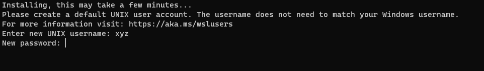

# Windows

At this moment on Windows it is possible to build Phoenix-RTOS image for all targets. Running the system is only
possible on `ia32-generic-qemu` using `WSL`. Running the rest of targets will be added soon.

## WSL (Windows Subsystem for Linux)

This part is only available for users with Windows 10 **(version 1709 or later)** and all versions of Windows 11

`WSL` is based on a Linux virtualization environment within a Windows system.
To properly install `WSL` it's needed to enable **virtualization** in BIOS settings as by default it's disabled.

`WSL` we can download using `winget` in PowerShell (Remember to run it as an administrator):

```powershell
winget install wsl
```

If `winget` is not available on your system, search for the `App Installer` in the Microsoft Store.

After that, we'll need to set up an environment. In our case, we're aiming for `Ubuntu-22.04`.
To install it, use the following command:

```powershell
wsl --install -d Ubuntu-22.04
```

`WSL` will install the subsystem and all needed components. After successful installation, we can type

```powershell
wsl
```

In PowerShell and the entire subsystem will start up (This might take some time).
On the first start, you will be prompted to create an account in the subsystem (sudo credentials).



After that simply follow the instructions for Ubuntu written in the [Building Phoenix-RTOS](index.md) and
[ia32-generic-qemu quick-start](../quickstart/ia32-generic-qemu.md).

(Quick tip: It is not mandatory, but turning off Real-Time Protection in Windows Defender speeds up the toolchain
building process)
