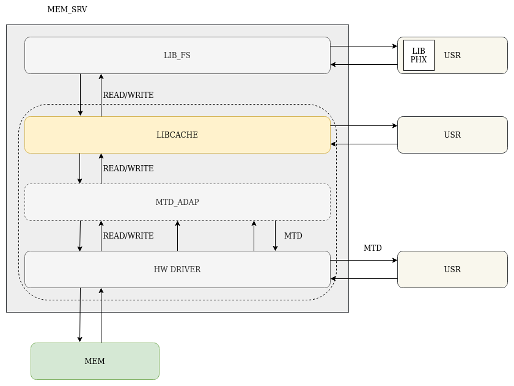
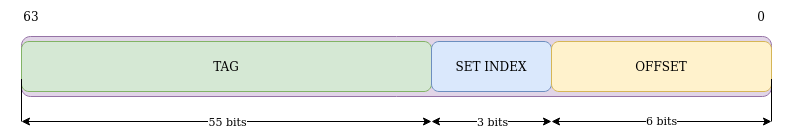
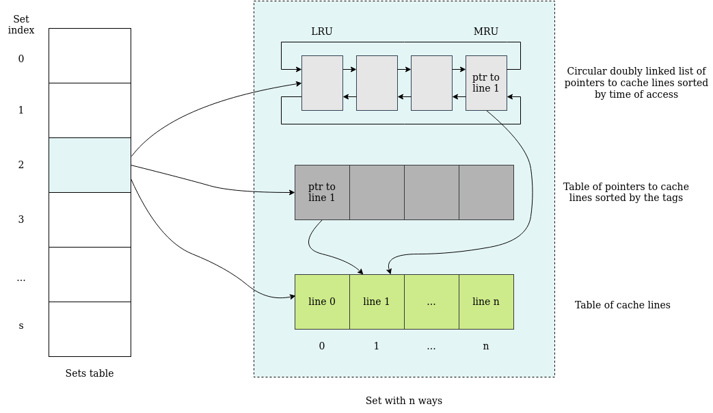

# Cache library (libcache)

`libcache` is a thread-safe library which implements a n-way set-associative cache.
<!-- TODO: mention whether the library is static and precompiled -->



## Contents

- [API](#api)
  - [Data types](#data-types)
  - [Functions](#functions)
- [Configurable cache parameters](#configurable-cache-parameters)
  - [Size](#size)
  - [Associativity](#associativity)
  - [Write policy](#write-policy)
- [Implementation](#implementation)
  - [Overview](#overview)
  - [Organization](#organization)
  - [Bitmasks](#bitmasks)
  - [Data structures](#data-structures)
- [Cache operations](#cache-operations)
  - [Read](#reading-a-buffer-from-a-device-via-the-cache)
  - [Write](#writing-a-buffer-to-a-device-via-the-cache)
  - [Flush](#flushing-the-cache)
  - [Invalidate](#invalidating-the-cache)
  - [Clean](#cleaning-the-cache)
- [Running tests](#running-tests)
- [Navigation links](#see-also)

## API

The `libcache` library is a collection of types and functions which provides the user with tools necessary to create,
operate and destroy a cache.

The user is obligated to supply a suitable definition of a device driver context and source memory-specific callbacks
that execute write to and read from the cached source memory.
<!-- markdownlint-disable -->
### Data types

| Type | Description | Remarks |
| ---- | ------------| ------- |
`cachectx_t` | Cache context — represents the cache table |Opaque type — can only be accessed and/or modified through/by provided API functions.
`cache_devCtx_t` | Device driver context | A cached source memory-specific `struct cache_devCtx_s` definition ought to be supplied by the user. <br /><br /> Constitutes a part of `cache_ops_t` interface. |
| `cache_ops_t` | Cached source memory interface | Mediates between the cache and the cached source memory by providing write (`cache_writeCb_t writeCb`) and read (`cache_readCb_t readCb`) callbacks as well as the device driver context (`cache_devCtx_t ctx`). |

#### Callbacks
<!-- TODO: write whether errno is set on failure -->
```c
typedef ssize_t (*cache_readCb_t)(uint64_t offset, void *buffer, size_t count, cache_devCtx_t *ctx);
```

| Status | Description | Return value | Remarks |
|--------|-------------|--------------| ------- |
| Declared | Read callback — a pointer to a function responsible for reading data from the source memory. The pointer is registered in the cache during a call to `cache_init` function. <br /><br />Reads up to `count` bytes starting from `offset` into a `buffer`. <br /><br /> Utilizes additional device driver context provided in `ctx`.| **On success:** a number of bytes read from the cached source memory <br /><br /> **On failure:** an error number | `count` is **always** equal to cache line size. <br /><br /> A cached source memory-specific implementation ought to be supplied by the user. <br /><br /> Constitutes a part of `cache_ops_t` interface. |

```c
typedef ssize_t (*cache_writeCb_t)(uint64_t offset, const void *buffer, size_t count, cache_devCtx_t *ctx);
```

| Status | Description | Return value | Remarks |
|--------|-------------|--------------| ------- |
| Declared | Write callback — a pointer to a function responsible for writing data to the source memory. The pointer is registered in the cache during a call to `cache_init` function. <br /><br /> Writes up to `count` bytes from `buffer` under `offset`. <br /><br /> Utilizes additional device driver context provided in `ctx`.| **On success:** a number of bytes written to the cached source memory <br/><br/> **On failure:** an error number <!-- TODO: write whether errno is set --> | `count` is **always** equal to cache line size. <br /><br /> A cached source memory-specific implementation ought to be supplied by the user. <br /><br /> Constitutes a part of `cache_ops_t` interface. |

### Functions

```c
cachectx_t *cache_init(size_t srcMemSize, size_t lineSize, size_t linesCnt, const cache_ops_t *ops);
```

| Status | Description | Return value | Remarks |
|--------|-------------|--------------| ------- |
|Implemented <br /><br />Tested| Initializes the cache for use. Stores the size of the cached source memory as `srcMemSize` (in bytes). Sets the cache line size to `lineSize` (in bytes) and the number of cache lines to `linesCnt`. <br /><br /> Registers cached source memory interface (`ops`) which contains write and read callbacks as well as device driver context. | **On success:** a pointer to initialized cache of type `cachectx_t` <br /><br /> **On failure:** NULL | The `linesCnt` argument has to be a multiple of the number of ways in a set (see: [Associativity](#associativity)). <br /><br /> Copies and stores the contents pointed to by `ops`: `writeCb`, `readCb` as well as the pointer `ctx`. Note that a pointer to `cache_devCtx_t` is stored, **not** its contents.

```c
int cache_deinit(cachectx_t *cache);
```

| Status | Description | Return value | Remarks |
|--------|-------------|--------------| ------- |
| Implemented <br /><br />Tested | Performs cache flush and invalidation and then deinitializes the cache: frees all allocated resources (cache lines, sets as well as the cache table). | **On success:** 0 <br /><br /> **On failure:** an error number | <!-- TODO: write about additional error codes, e.g. EBUSY --> May fail due to problems with the cached source memory (``EIO``).

```c
ssize_t cache_read(cachectx_t *cache, uint64_t addr, void *buffer, size_t count);
```

| Status | Description | Return value | Remarks |
|--------|-------------|--------------| ------- |
| Implemented <br /><br /> Tested| Reads from the device via the cache up to `count` bytes into a `buffer`. | **On success:** the number of read bytes <br /><br /> **On failure:** an error number | Fails if `buffer` is NULL or/and `addr` goes beyond the scope of the cached source memory. (`EINVAL`).  <br /><br /> May fail due to problems with the cached source memory (`EIO`). <br /><br /> The behavior is undefined if read occurs beyond the end of the `buffer`.

```c
ssize_t cache_write(cachectx_t *cache, uint64_t addr, void *buffer, size_t count, int policy);
```

| Status | Description | Return value | Remarks |
|--------|-------------|--------------| ------- |
| Implemented <br /><br />Tested | Writes to the device via the cache up to  `count` bytes from a `buffer` according to `policy` (see: [Write policy](#write-policy))  | **On success:** the number of written bytes <br /><br /> **On failure:** an error number | Fails if `buffer` is NULL or/and wrong `policy` value is supplied (`EINVAL`). Fails when `addr` goes beyond the scope of the cached source memory. <br /><br /> May fail due to problems with the cached source memory (`EIO`). <br /><br /> The behavior is undefined if write occurs beyond the end of the `buffer`.

```c
int cache_flush(cachectx_t *cache, const uint64_t begAddr, const uint64_t endAddr);
```

| Status | Description | Return value | Remarks |
|--------|-------------|--------------| ------- |
| Implemented <br /><br />Tested | Flushes a range of cache lines starting from an address `begAddr` up to `endAddr`. <br /><br /> Writes dirty lines (see: [Write policy](#write-policy)) marked with dirty bit to the cached source memory. Clears the dirty bit. | **On success:** 0 (i.e. all bytes from all lines marked with the dirty bit in given range were successfully written to the cached source memory) <br /><br /> **On failure:** an error number | Fails if `begAddr` is greater than `endAddr` or/and `begAddr` is greater than `srcMemSize` (`EINVAL`). <br /><br /> May fail due to problems with the cached source memory (`EIO`).

```c
int cache_invalidate(cachectx_t *cache, const uint64_t begAddr, const uint64_t endAddr);
```

| Status | Description | Return value | Remarks |
|--------|-------------|--------------| ------- |
| Implemented <br /><br />Tested | Invalidates a range of cache lines starting from an address `begAddr` up to `endAddr`. <br /><br /> Clears the validity bit for lines in that range. | **On success:** 0 (i.e. all lines marked with the validity bit in the given range were successfully invalidated) <br /><br /> **On failure:** an error number  | Fails if `begAddr` is greater than `endAddr` or/and `begAddr` is greater than `srcMemSize` (`EINVAL`). <br /><br /> This operation does **not** synchronize the dirty lines with the cached source memory and leads to **permanent** data loss. In order to save the important data it is advised to call `cache_clean` instead.

```c
int cache_clean(cachectx_t *cache, const uint64_t begAddr, const uint64_t endAddr);
```

| Status | Description | Return value | Remarks |
|--------|-------------|--------------| ------- |
| Implemented <br /><br /> Untested | Combines cache flush and invalidation in an atomic way and performs these operations in range of addresses starting from `begAddr` up to `endAddr`. | **On success:** 0 (i.e. all lines in given range were successfully flushed to the cached source memory and invalidated) <br /><br /> **On failure:** an error number | Fails if `begAddr` is greater than `endAddr` or/and `begAddr` is greater than `srcMemSize` (`EINVAL`). <br /><br /> May fail due to problems with the cached source memory (`EIO`). <br /><br /> Does **not** invalidate a line that failed to flush. |
<!-- markdownlint-enable -->
## Configurable cache parameters

### Size

1. The size of the cache line (in bytes) and the number of the lines can be set in run-time during a call to the
`cache_init` function. These parameters cannot be reconfigured once set.

2. The number of cache lines has to be divisible by [associativity](#associativity).

### Associativity

The number of ways in a set (i.e. the number of lines in a set) is defined in a form of a macro directive
`LIBCACHE_NUM_WAYS`. The value is set to 4 by default as it was deemed suitable for typical uses.

Other common associativity are 1 (a fully associative cache), 2, 4 and 8. Larger sets and higher associativity lead
to fewer cache conflicts and lower miss rates at the expense of hardware cost.

### Write policy

There are two available write policies: write-through and write-back. The policy is set individually for every write
operation by choice of a suitable value of `policy` argument of the `cache_write` function:

- `LIBCACHE_WRITE_BACK`
- `LIBCACHE_WRITE_THROUGH`

According to write through policy the data from the written/updated line is synchronized with the cached source
memory upon every write to the cache, therefore they stay coherent at all times.

Written back policy allows the cache and the cached source memory to stay incoherent until the user requests flushing
or the old, incoherent data needs to be replaced by new data.

## Implementation

### Overview

`libcache` implements the cache as a set-associative cache with n ways and s sets. A cache line contains a tag, a
pointer to cached data and flags indicating its validity and whether it is coherent with the cached source memory.

The number of ways in a set (associativity) is simply the maximum number of lines within a set.

**The cache is implemented for 64-bit addressing.**
<!-- markdownlint-disable -->
### Organization

The organization of the cache is best explained by an example: <br /><br />
_Full address of 64 bits (fixed in implementation, unalterable), associativity of 4 (fixed), cache line size of 64 bytes, 32 cache lines._
| Parameter | How it is computed | Example |
| --------- | ------------------ | ------- |
Offset address width | log<sub>2</sub>(cache line size) | log<sub>2</sub>(64) = 6 bits |
| Number of sets | number of cache lines / associativity | 32/4 = 8 sets |
| Set index width | log<sub>2</sub>(number of sets) | log<sub>2</sub>(8) = 3 bits |
| Tag width | full address width - set index width - offset width | 64 - 3 - 6 = 55 bits |
<!-- markdownlint-enable -->
The above example is illustrated in the image below.



_DISCLAIMER: The numbers of bits corresponding to tag, set index and offset may differ depending on your own example._

### Bitmasks

Three bit masks are computed and stored. They are applied to memory addresses in order to extract specific bits
corresponding to tag, set index and offset. The tag is used to identify a cache line within a set. The offset indicates
the position of a specific byte in that cache line.

| Parameter | How it is computed |
| --------- | ------------------ |
| Set index | (full address _RIGHT SHIFT BY_ offset address width) _AND_ set mask |
| Tag | (full address _RIGHT SHIFT BY_ (offset address width + set index width)) _AND_ tag mask |
| Offset | full address _AND_ offset mask |

### Data structures

Each cache set stores a table of cache lines (green table in image below). Moreover, it keeps:

- A table of pointers to cache lines sorted by the tags (dark gray table);
- A supplementary circular doubly linked list of pointers to the same cache lines sorted by the time of last access to
these lines. The pointer to the _Most Recently Used_ cache line (MRU) is stored in the tail of the list.

The image below represents the logical organization of the implemented cache.



## Cache operations

The index in set-associative cache identifies a set of cache lines that may contain the requested data. During a read
or write (create/update) operation every line within the set is examined to check whether its tag matches the tag
computed from a supplied memory address and that the VALID bit of that line is set. If both these conditions are met,
we have a _cache hit_. Otherwise, on a _cache miss_, a new block of memory in form of a cache line has to be loaded
into the set, replacing the _Least Recently Used_ (LRU) line in that set.

### Reading a buffer from a device via the cache

In order to read up to count bytes from a source memory address, a valid buffer has to be supplied. Set index, tag and
offset of the first byte to be read from a cache line marked by the tag are computed from the requested memory address.

The user might want to read just a few bytes starting from the offset. However, when count goes beyond the
maximum offset of the line, a read from multiple lines is performed. At first, a chunk of data of size equal to:

``` (size of cache line - offset of the first byte) ```

is read into the buffer. Depending on the size of the requested data, a few next whole cache lines might be read
into the buffer. The address of the first whole line is computed as follows:

```(address of the first byte to be read - offset of the first byte) + size of a cache line```

 The addresses of following lines are computed by adding the size of a whole cache line to the address of a previous
 line. Each of these addresses is mapped onto a specific cache set. Lookup in a set is performed according to the
 algorithm below:

1. The tag computed from the memory address becomes a part of a key used to perform a binary search in a table of
pointers to cache lines sorted by the tag (dark gray table in the image above).
2. If a line marked by the tag is found, it becomes the MRU line. The pointers in the circular doubly linked list are
rearranged so that this line is stored in the tail of the list.
3. The pointer to the found line is returned.

The desired chunk of data is read from the obtained line and written to the buffer supplied by the user.

### Writing a buffer to a device via the cache

Writing via the cache is implemented similarly to reading: data is written in the cache chunk-by-chunk from a supplied
buffer.

The user might want to update just a few bytes in a specific cache line, hence the line needs to be
found in the cache first. On success, the bytes starting from the offset are updated and a chosen to write policy is
executed.

If it happens, that a line mapped from a specific address does not exist in the cache, it is
created and written to the cache according to the algorithm below:

1. The pointer to the LRU line is removed from the circular doubly linked list and dereferenced to find a pointer (a
line in the green table).
2. The line pointed to may be flushed to the cached source memory for coherence. Afterwards it is substituted by a new
cache line.
3. A pointer to the new cache line is added in the tail of the circular doubly linked list. The line pointed to become
the MRU line.
4. The pointers to the lines are re-sorted according to the tag (dark gray table).

### Flushing the cache

The flush operation is used to synchronize the contents of the cache with the cached source memory so that they stay
coherent.

The operation requires a beginning and an end address, as it is performed within a range of
addresses.

### Invalidating the cache

A range of the cached source memory addresses can be invalidated and data removed so that the lines can be overwritten.
The data is not being synchronized with the cached source memory during this operation, therefore it cannot be
retrieved once the lines become invalidated.

In order to save the important data on the source memory and invalidate the lines in the cache it is advised to perform
cache clean instead.

### Cleaning the cache

The clean operation combines both cache flush and cache invalidate operations in an atomic way while also providing
better efficiency than if the user were to perform cache flush followed by cache invalidate.

## Running tests

Phoenix-RTOS libcache library provides a set of functional tests that are available in
[phoenix-rtos-tests](https://github.com/phoenix-rtos/phoenix-rtos-tests/tree/master). The tests can be run for
different platforms, e.g. `ia32-generic-qemu` target:

```bash
python3 phoenix-rtos-tests/runner.py -T ia32-generic-qemu -t phoenix-rtos-tests/libcache
```

## See also

1. [Phoenix-RTOS core libraries](README.md)
2. [Table of contents](../README.md)
