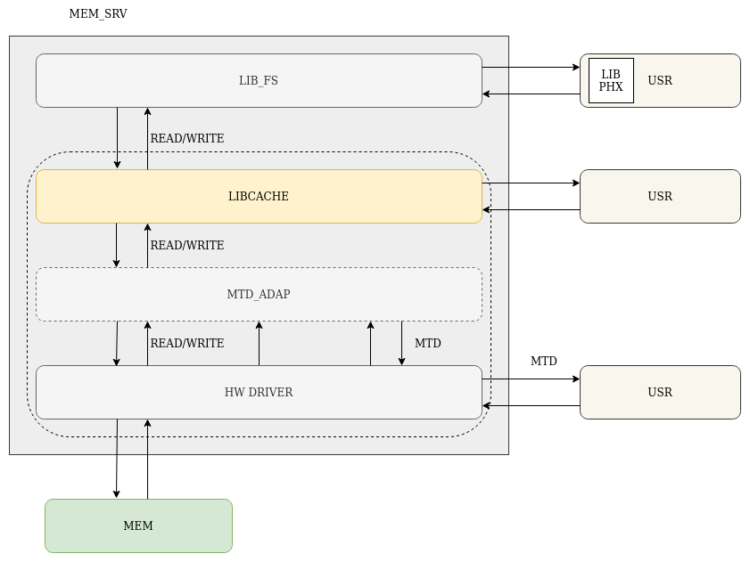
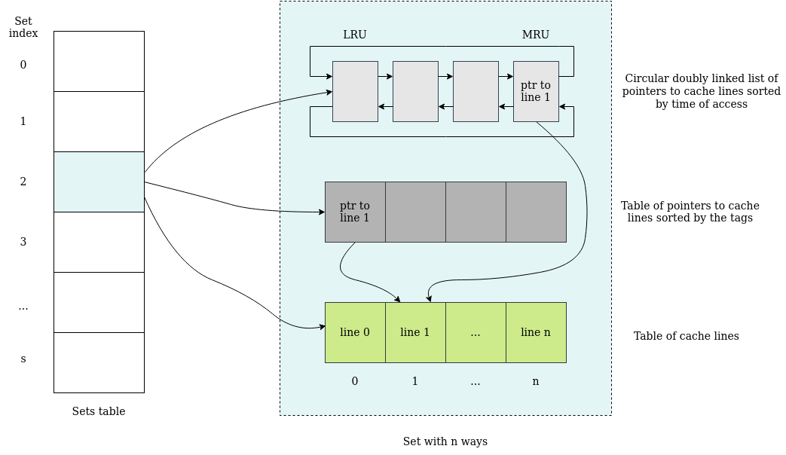

# Cache library (libcache)

`libcache` provides a thread-safe, 4-way set-associative cache for code that fronts a block-like source memory with
read and write callbacks.



## Header interface

The public interface is declared in `<cache.h>`.

### Types and callbacks

`cachectx_t`
: Opaque cache context returned by `cache_init()` and passed to the remaining cache functions.

`cache_devCtx_t`
: Device-driver context type. The user of the library defines `struct cache_devCtx_s`.

`cache_ops_t`
: Callback table copied by `cache_init()`.

  ```c
  typedef struct {
      cache_readCb_t readCb;
      cache_writeCb_t writeCb;
      cache_devCtx_t *ctx;
  } cache_ops_t;
  ```

````{function} cache_readCb_t(offset, buffer, count, ctx)
Reads data from the cached source memory into `buffer`.

The callback is supplied by the caller through `cache_ops_t.readCb`. The cache calls it with `count` equal to the cache
line size while fetching a line.

:param offset: Source-memory offset to read from.
:param buffer: Destination buffer owned by `libcache`.
:param count: Number of bytes to read.
:param ctx: Device-driver context from `cache_ops_t.ctx`.
:returns: A positive byte count on progress. Returning `0` or a negative value makes the cache operation return
  `-EIO`. The library does not set `errno` for callback failures.
````

````{function} cache_writeCb_t(offset, buffer, count, ctx)
Writes data from `buffer` to the cached source memory.

The callback is supplied by the caller through `cache_ops_t.writeCb`. The cache calls it while flushing a dirty line.

:param offset: Source-memory offset to write to.
:param buffer: Source buffer owned by `libcache`.
:param count: Number of bytes to write.
:param ctx: Device-driver context from `cache_ops_t.ctx`.
:returns: A positive byte count on progress. Returning `0` or a negative value makes the cache operation return
  `-EIO`. The library does not set `errno` for callback failures.
````

### Write policies

| Constant | Behavior |
| --- | --- |
| `LIBCACHE_WRITE_BACK` | Mark updated cache lines dirty and write them later during flush or replacement. |
| `LIBCACHE_WRITE_THROUGH` | Flush updated cache lines to the source memory during `cache_write()`. |

### Functions

````{function} cache_init(srcMemSize, lineSize, linesCnt, ops)
Allocates and initializes a cache context.

The implementation copies the `cache_ops_t` structure and stores the `ctx` pointer value. It does not copy the object
pointed to by `ctx`.

:param srcMemSize: Size of the cached source memory in bytes. The value must be non-zero.
:param lineSize: Cache line size in bytes. The value must be non-zero.
:param linesCnt: Number of cache lines. The value must be non-zero and divisible by `LIBCACHE_NUM_WAYS` (`4`).
:param ops: Callback table containing `readCb`, `writeCb`, and `ctx`.
:returns: A cache context on success or `NULL` when arguments are invalid or allocation or mutex creation fails.
````

````{function} cache_deinit(cache)
Flushes dirty lines, invalidates valid lines, destroys the internal mutex, and frees the cache context.

:param cache: Cache context returned by `cache_init()`.
:returns: `EOK` on success, `-EIO` when a dirty line fails to flush through `writeCb`, or a negative error returned by
  `resourceDestroy()`.
````

````{function} cache_read(cache, addr, buffer, count)
Reads data from the source memory through the cache.

If `addr + count` exceeds the configured source-memory size, the implementation truncates the request to the available
range. A zero-length request returns `0`.

:param cache: Cache context returned by `cache_init()`.
:param addr: Source-memory address to read from.
:param buffer: Destination buffer.
:param count: Requested number of bytes.
:returns: Number of bytes copied to `buffer`, `-EINVAL` when `buffer == NULL` or `addr > srcMemSize`, `-ENOMEM` when a
  cache line cannot be allocated, or `-EIO` when `readCb` fails.
````

````{function} cache_write(cache, addr, buffer, count, policy)
Writes data to the source memory through the cache.

If `addr + count` exceeds the configured source-memory size, the implementation truncates the request to the available
range. A zero-length request returns `0`.

:param cache: Cache context returned by `cache_init()`.
:param addr: Source-memory address to write to.
:param buffer: Source buffer.
:param count: Requested number of bytes.
:param policy: `LIBCACHE_WRITE_BACK` or `LIBCACHE_WRITE_THROUGH`.
:returns: Number of bytes accepted from `buffer`, `-EINVAL` when `buffer == NULL`, `addr > srcMemSize`, or `policy` is
  invalid, `-ENOMEM` when a cache line cannot be allocated, or `-EIO` when `readCb` or `writeCb` fails.
````

````{function} cache_flush(cache, begAddr, endAddr)
Writes dirty cache lines in the selected address range to the source memory.

:param cache: Cache context returned by `cache_init()`.
:param begAddr: First source-memory address in the range.
:param endAddr: End address for the range.
:returns: `EOK` on success, `-EINVAL` when `begAddr > endAddr` or `begAddr > srcMemSize`, or `-EIO` when `writeCb`
  fails.
````

````{function} cache_invalidate(cache, begAddr, endAddr)
Invalidates cache lines in the selected address range without writing dirty data back.

:param cache: Cache context returned by `cache_init()`.
:param begAddr: First source-memory address in the range.
:param endAddr: End address for the range.
:returns: `EOK` on success or `-EINVAL` when `begAddr > endAddr` or `begAddr > srcMemSize`.
````

````{function} cache_clean(cache, begAddr, endAddr)
Flushes dirty cache lines in the selected range and then invalidates the lines that flush successfully.

:param cache: Cache context returned by `cache_init()`.
:param begAddr: First source-memory address in the range.
:param endAddr: End address for the range.
:returns: `EOK` on success, `-EINVAL` when `begAddr > endAddr` or `begAddr > srcMemSize`, or `-EIO` when `writeCb`
  fails.
````

## Cache organization

The implementation uses 64-bit source-memory addresses and `LIBCACHE_NUM_WAYS == 4`. The number of sets is
`linesCnt / LIBCACHE_NUM_WAYS`. For each access, the cache splits the address into tag, set index, and offset fields.

| Field | Computation |
| --- | --- |
| Offset | `address & offMask` |
| Set index | `(address >> offBitsNum) & setMask` |
| Tag | `(address >> (offBitsNum + setBitsNum)) & tagMask` |

Each set contains 4 cache-line slots, a tag-sorted pointer table for lookup, and a circular list sorted by access time.
The tail of the circular list is the most recently used line. A cache miss replaces the least recently used line.



## Operation rules

- `cache_read()` fetches a full cache line with `readCb` on a miss, then copies the requested bytes to the caller's
  buffer.
- `cache_write()` fetches the line first when a partial-line write misses, updates cached bytes, marks the line dirty,
  and applies the selected write policy.
- `cache_flush()` writes dirty lines in the requested range and clears their dirty flags.
- `cache_invalidate()` drops cached lines without writing dirty data.
- `cache_clean()` flushes each dirty line and invalidates only lines that flush successfully.

## Running tests

The `phoenix-rtos-tests/libcache` tests can be run on `ia32-generic-qemu`:

```
$ python3 phoenix-rtos-tests/runner.py -T ia32-generic-qemu -t phoenix-rtos-tests/libcache
```
