# Graphics library (libgraph)

`libgraph` is a graphics library that allows for scheduling and (possibly hardware accelerated) execution of 2D graphics operations. 

Source code: https://github.com/phoenix-rtos/phoenix-rtos-corelibs/tree/master/libgraph

## Contents

- [Supported graphics adapters](#Graphics-adapters)
- [libgraph applications](#libgraph-apps)
- [libgraph interface](#libgraph-interface)
- [How to use the graphics library](#How-to-use-the-graphics-library)
- [How to use your own image in Phoenix-RTOS](#Generating-an-image-bitmap-and-displaying-it-using-libgraph)
- [Navigation links](#See-also)

## Graphics adapters

The library supports the following graphics adapters:

- `virtio-gpu` - virtualized graphics adapter compatible with VirtIO specificatiion (available on QEMU or VirtualBox)

- `vga` - VGA compatible graphics adapter

- `cirrus` - Cirrus Logic GD5446 SuperVGA adapter

## libgraph apps

Examples of applications, which use graphics library (`ia32-generic` target architecture).

- `voxeldemo`

  

  Source code can be found in the `_user` directory in [phoenix-rtos-project](https://github.com/phoenix-rtos/phoenix-rtos-project.git) repository.

  The app can be run using the following command:
  ```
  /usr/bin/voxeldemo
  ```

- `rotrectangle`

  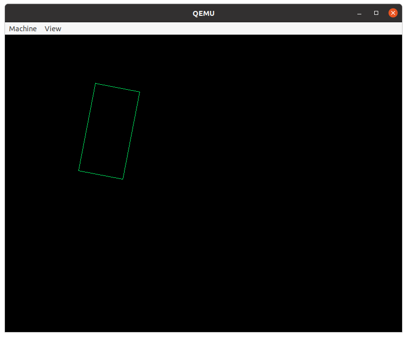

  Source code can be also found in the `_user` directory in [phoenix-rtos-project](https://github.com/phoenix-rtos/phoenix-rtos-project.git) repository.

  The app can be run using the following command:
  ```
  /usr/bin/rotrectangle
  ```

- `test_graph`

  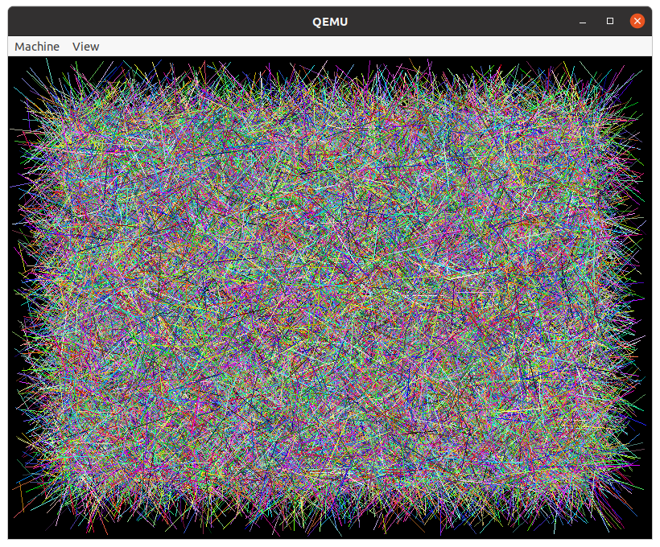

  Source code is available in the `gfx` directory in [phoenix-rtos-tests](https://github.com/phoenix-rtos/phoenix-rtos-tests.git) repository.

  The test can be run using the following command:
  ```
  /bin/test_graph
  ```

## libgraph interface 

`libgraph` functions take _`graph`_ argument which is a pointer to `graph_t` structure initialized by `graph_open()`. `graph_adapter_t` is an enum used to distinguish between different graphics adapters.

- `int graph_init(void)` </br>
  Initializes the graphics library and all required drivers.

- `int graph_open(graph_t *graph, graph_adapter_t adapter, unsigned int mem)` </br>
  Initializes the `graph_t` structure and opens a context for the specified graphics adapter. The uninitialized `graph_t` structure should be passed in the _`graph`_ argument and the graphics _`adapter`_ should be chosen from the following list:
  - `GRAPH_NONE` - the graphics adapter isn't specified, in this case the function returns `-ENODEV`
  - `GRAPH_VIRTIOGPU` - generic VirtIO GPU graphics adapter
  - `GRAPH_VGA` - generic VGA graphics adapter
  - `GRAPH_CIRRUS` - Cirrus Logic graphics adapter
  - `GRAPH_ANY` - an available graphics adapter is chosen

  The _`mem`_ argument specifies the total graphics tasks queue size. The bigger the _`mem`_ the more graphics tasks we can queue up.

  The return value is set to `EOK`, or an error number, for example:
  - `-EINVAL` - specified memory value is too low
  - `-ENOMEM` - memory allocation for graphics context failed
  - `-ENODEV` - incorrect graphics adapter passed in _`adapter`_

- `int graph_mode(graph_t *graph, graph_mode_t mode, graph_freq_t freq)` </br>
  Sets graphics mode with specified screen refresh rate frequency. The initialized _`graph`_ structure should be passed, and _`mode`_ should be chosen from the `graph_mode_t` enum, placed in the `graph.h` header. The common graphics modes are presented below:
  - `GRAPH_DEFMODE` - default graphics mode
  - `GRAPH_ON` - display enabled mode
  - `GRAPH_OFF` - display disabled mode
  - `GRAPH_STANDBY` - display standby mode
  - `GRAPH_SUSPEND` - display suspend mode
  - `GRAPH_800x600x8` - 800x600 resolution, 8-bit indexed color mode
  - `GRAPH_320x200x16` - 320x200 resolution, 16-bit color mode
  - `GRAPH_1920x1080x32` - 1920x1080 resolution, 32-bit color mode

  There should also be specified the _`freq`_ argument (`graph_freq_t` enum). The common screen refresh rates are presented below:
  - `GRAPH_DEFFREQ` - default refresh rate
  - `GRAPH_24Hz` - 24Hz  refresh rate
  - `GRAPH_60Hz` - 60Hz  refresh rate
  - `GRAPH_120Hz` - 120Hz refresh rate
  - `GRAPH_360Hz` - 360Hz refresh rate

- `int graph_line(graph_t *graph, unsigned int x, unsigned int y, int dx, int dy, unsigned int stroke, unsigned int color, graph_queue_t queue)` </br>
  Draws a line for the specified graphics adapter context. The following arguments should be passed:
  - _`graph`_ - initialized `graph_t` structure
  - _`x`_ - start point x position, where 0 is the left edge of the screen
  - _`y`_ - start point y position, where 0 is the upper edge of the screen
  - _`dx`_ - line length in x axis in pixels
  - _`dy`_ - line length in y axis in pixels
  - _`stroke`_ - line thickness in pixels
  - _`color`_ - line color

    - for `8-bit` indexed color default VGA color palette is presented below (e.g. `0x0B` represents cyan).

      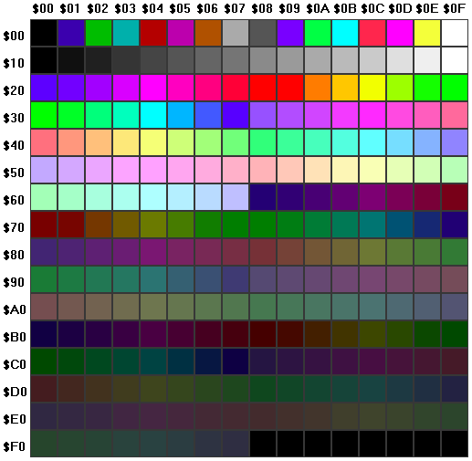

      Source: https://www.fountainware.com/EXPL/vga_color_palettes.htm

    - for `16-bit` color depth - it's the following format in bits: `RRRRRGGGGGGBBBBB` (e.g. `0x07E0` represents green)

    - for `24-bit` color depth - it's represented by `0xRRGGBB` (e.g. `0x0000FF` represents blue)

    - for `32-bit` color depth - it's the following format in hex: `0xAARRGGBB`, where `A` represents alpha. With `AA` set to `0xFF` opacity equals 100%, but by default transparency isn't enabled so there can be any value.

  - _`queue`_ - graphics task queue, should be chosen from the `graph_queue_t` enum, where are following options:
    - `GRAPH_QUEUE_HIGH` - high priority queue
    - `GRAPH_QUEUE_LOW` - low priority queue
    - `GRAPH_QUEUE_BOTH` - any queue
    - `GRAPH_QUEUE_DEFAULT` - default queue

- `int graph_rect(graph_t *graph, unsigned int x, unsigned int y, unsigned int dx, unsigned int dy, unsigned int color, graph_queue_t queue)` </br>
  Draws a rectangle. Arguments are similar to those in `graph_line()` function. A drawn rectangle will be filled with a specified color.

- `int graph_fill(graph_t *graph, unsigned int x, unsigned int y, unsigned int color, graph_fill_t type, graph_queue_t queue)` </br>
  Fills a closed figure with color specified in the _`color`_ argument ((_`x`_, _`y`_) should be any point inside the figure to fill). The following `graph_fill_t` color fill methods are supported:
    - `GRAPH_FILL_FLOOD` - works like Windows paint bucket tool (floods homogeneous area, all pixels inside the polygon with color values same as the one at (_`x`_, _`y`_) flood origin point)

    - `GRAPH_FILL_BOUND` - fills the polygon until an edge of the same color as the fill color is found. It can't fill the figure with color different than the  figure boundary

- `int graph_print(graph_t *graph, const graph_font_t *font, const char *text, unsigned int x, unsigned int y, unsigned char dx, unsigned char dy, unsigned int color, graph_queue_t queue)` </br>
  Prints text pointed by the _`text`_ argument. Font data should be passed to `graph_font_t` structure. The example is stored in `gfx` directory in [phoenix-rtos-tests](https://github.com/phoenix-rtos/phoenix-rtos-tests.git) repository (`font.h` file). The remaining arguments are similar to those from functions above.

- `int graph_move(graph_t *graph, unsigned int x, unsigned int y, unsigned int dx, unsigned int dy, int mx, int my, graph_queue_t queue)` </br>
  Moves data in the range specified by _`x`_, _`y`_, _`dx`_, _`dy`_ arguments to the following point: (_`x`_ + _`mx`_, _`y`_ + _`my`_).

- `graph_copy(graph_t *graph, const void *src, void *dst, unsigned int dx, unsigned int dy, unsigned int srcspan, unsigned int dstspan, graph_queue_t queue)` </br>
  Copies a bitmap pointed by the _`src`_ argument into bitmap pointed by the _`dst`_ argument. The area which is copied is limited by a rectangle with _`dx`_ and _`dy`_ dimensions. There should also be specified span arguments, which is the total width of a source/destination bitmap multiplied by its color depth. When copying some part of a bitmap, _`src`_ should point to the proper element, same with destination buffer.

- `int graph_colorset(graph_t *graph, const unsigned char *colors, unsigned char first, unsigned char last)` </br>
  Sets a color palette used for 8-bit indexed color mode. A color map should be passed in _`cmap`_ argument. The range of changing colors is set by passing _`first`_ and _`last`_ arguments. If a set color palette's size is lower than a default one, remaining colors are the same.

- `graph_colorget(graph_t *graph, unsigned char *colors, unsigned char first, unsigned char last)` </br>
  Retrieves a color palette used in 8-bit indexed color mode.. The retrieved color map from _`first`_ to _`last`_ element is passed to a buffer pointed by the _`colors`_ argument.

- `int graph_cursorset(graph_t *graph, const unsigned char *amask, const unsigned char *xmask, unsigned int bg, unsigned int fg)` </br>
  Sets cursor icon, _`amask`_ (`AND` mask) and _`xmask`_ (`XOR` mask) arguments determine the shape of the cursor. Default cursor shape is defined in `cursor.h` header file placed in `gfx` directory in `phoenix-rtos-tests` repository. There is possibility to pass cursor colors - outline color (`bg` argument) and main color (`fg` argument). The following color format should be applied: `0xAARRGGBB`, where `A` represents alpha, so when it's set to `0xff` 100% opacity is provided. Opacity isn't supported for cirrus graphics adapter (default for `ia32-generic` target).

- `int graph_cursorpos(graph_t *graph, unsigned int x, unsigned int y)` </br>
  Sets cursor position.

- `int graph_cursorshow(graph_t *graph)` </br>
  Displays cursor.

- `int graph_cursorhide(graph_t *graph)` </br>
  Hides cursor.

- `int graph_commit(graph_t *graph);` </br>
  Commits frame buffer changes (flushes frame buffer) in the specified graphics adapter context.

- `int graph_trigger(graph_t *graph)` </br>
  Triggers next task from queue execution.

- `int graph_stop(graph_t *graph, graph_queue_t queue)` </br>
  Disable adding new tasks to specified queue, for a _`graph`_ context.

- `int graph_tasks(graph_t *graph, graph_queue_t queue)` </br>
  Returns number of tasks in queue.

- `int graph_reset(graph_t *graph, graph_queue_t queue)` </br>
  Resets task queue.

- `int graph_vsync(graph_t *graph)`</br>
  Returns number of vertical synchronizations since the last call

- `void graph_close(graph_t *graph)` </br>
  Closes a graph context, pointed by _`graph`_.

- `void graph_done(void)` </br>
  Closes the graphics library.

## How to use the graphics library

Few simple examples of `libgraph` functions usage. Default graphics adapter (`cirrus`) for `ia32-generic` running script is used, default color depth is 4 bytes. Before calling mentioned functions following initialization was applied:

```c
#include <graph.h>
#include <time.h>

int main(void)
{
    graph_t graph;

    graph_init();
    graph_open(&graph, GRAPH_ANY, 0x2000);
    graph_mode(&graph, GRAPH_DEFMODE, GRAPH_DEFFREQ)
    /* clear screen */
    graph_rect(&graph, 0, 0, graph.width, graph.height, 0, GRAPH_QUEUE_HIGH)
}
```

- Purple line

  ```C
  graph_line(&graph, 0, 0, graph.width-50, graph.height/2-50, 2, 0x8282FF, GRAPH_QUEUE_HIGH);
  ```

  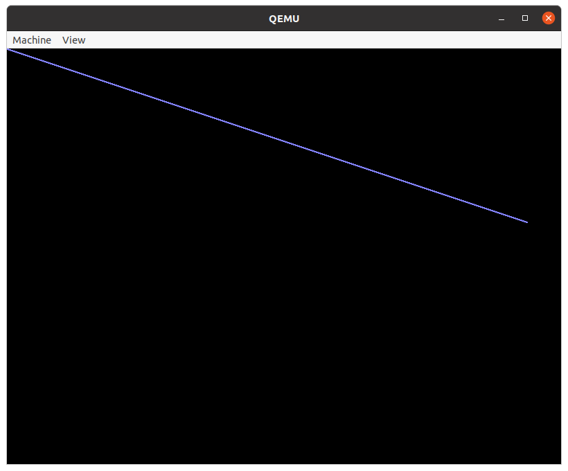

- Cyan filled rectangle

  ```C
  graph_rect(&graph, 200, graph.height/4, graph.width/2, graph.height/2, 0x00FFFF, GRAPH_QUEUE_HIGH);
  ```

  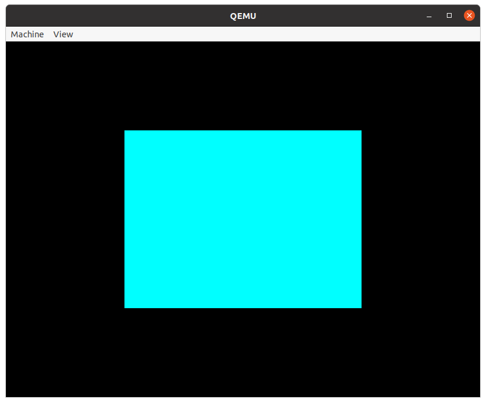

- Examples of `graph_fill()` usage, both for `GRAPH_FILL_FLOOD` and `GRAPH_FILL_BOUND` option

  ```C
  for (int i = 0; i < 2; i++) {
    graph_line(&graph, 50+i*350, 50, 0, 300, 2, 0x00000FF, GRAPH_QUEUE_HIGH);
    graph_line(&graph, 50+i*350, 50, 300, 0, 2, 0x00000FF, GRAPH_QUEUE_HIGH);
    graph_line(&graph, 350+i*350, 50, -300, 300, 2, 0x00000FF, GRAPH_QUEUE_HIGH);
    graph_line(&graph, 52+i*350, 52, 146, 146, 3, 0xFFFFFF, GRAPH_QUEUE_HIGH);
  }
  sleep(2);
  graph_fill(&graph, 52, 55, 0x00000FF, GRAPH_FILL_FLOOD, GRAPH_QUEUE_HIGH);
  graph_fill(&graph, 402, 55, 0x00000FF, GRAPH_FILL_BOUND, GRAPH_QUEUE_HIGH);
  ```

  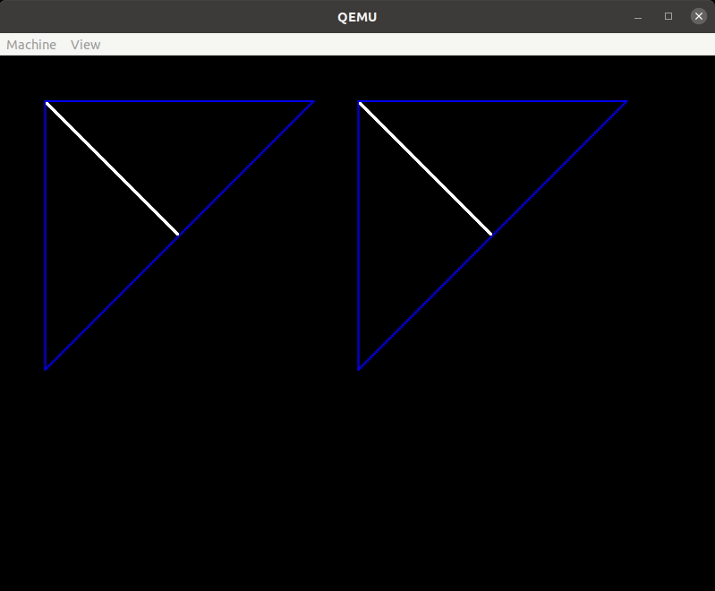

- Printing text using libgraph

  Header file with a font data in `graph_font_t` structure has to be included. The example of `font.h` is placed in `gfx` directory in [phoenix-rtos-tests](https://github.com/phoenix-rtos/phoenix-rtos-tests) repository.

  ```C
  graph_print(&graph, &font, "lorem ipsum", 300, 300, font.height, font.height, 0x00FF00, GRAPH_QUEUE_HIGH);
  ```

  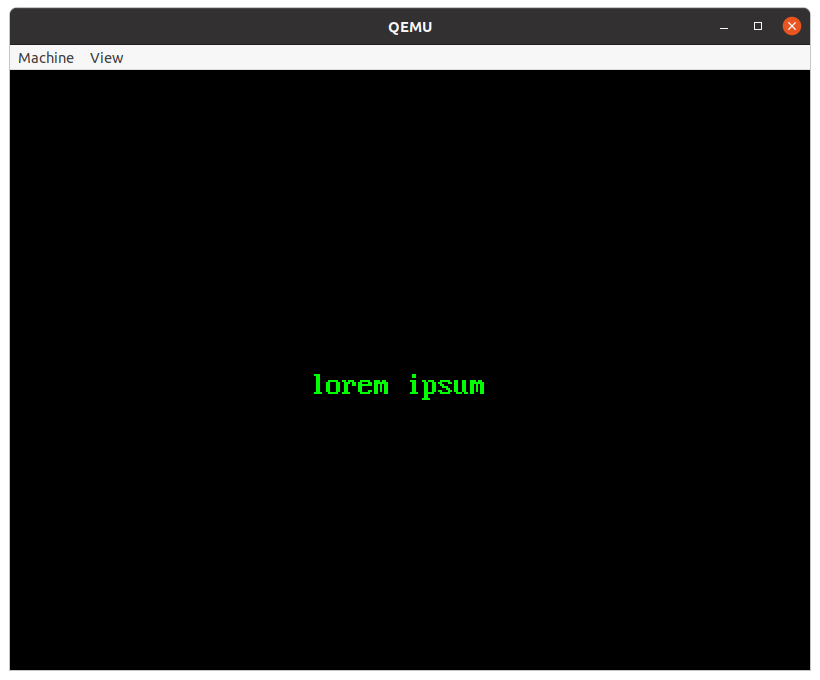

- `graph_move` example

  ```C
  graph_rect(&graph, 100, 100, 200, 200, 0xFFFF00, GRAPH_QUEUE_HIGH);
  sleep(3);
  graph_move(&graph, 100, 100, 100, 100, 300, 300, GRAPH_QUEUE_HIGH);
  ```

  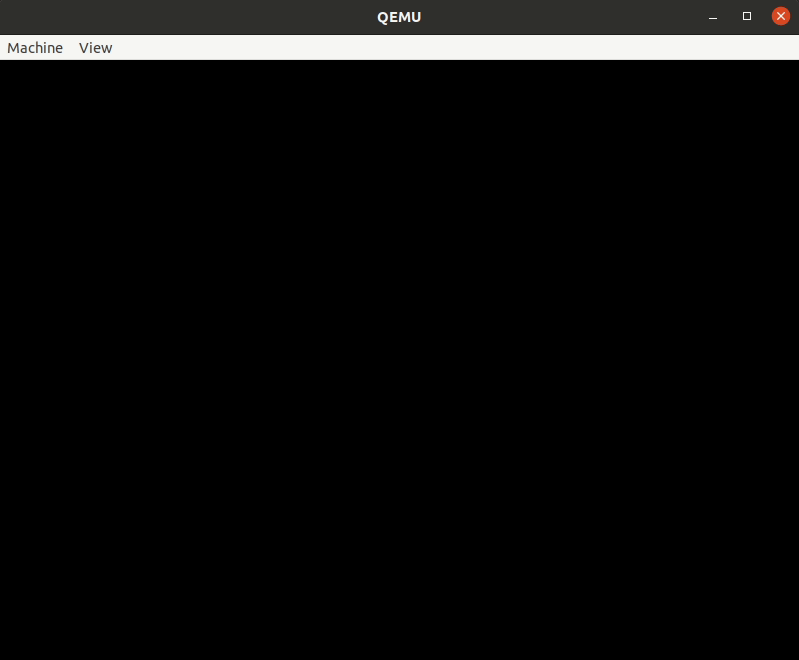

- Copying raw bitmap into a screen

  Note that bitmaps are stored in memory in little endian format. So for 32-bit color depth first byte represents the blue color, next green, red, alpha, and so on.

  ```C
  static const unsigned char greenSquareBitMap32[50][8] = {
  { 0x00, 0xff, 0x00, 0xff, 0x00, 0xff, 0x00, 0xff },
  { 0x00, 0xff, 0x00, 0xff, 0x00, 0xff, 0x00, 0xff },
  { 0x00, 0xff, 0x00, 0xff, 0x00, 0xff, 0x00, 0xff },
  { 0x00, 0xff, 0x00, 0xff, 0x00, 0xff, 0x00, 0xff },
  { 0x00, 0xff, 0x00, 0xff, 0x00, 0xff, 0x00, 0xff },
  { 0x00, 0xff, 0x00, 0xff, 0x00, 0xff, 0x00, 0xff },
  { 0x00, 0xff, 0x00, 0xff, 0x00, 0xff, 0x00, 0xff },
  { 0x00, 0xff, 0x00, 0xff, 0x00, 0xff, 0x00, 0xff },
  { 0x00, 0xff, 0x00, 0xff, 0x00, 0xff, 0x00, 0xff },
  { 0x00, 0xff, 0x00, 0xff, 0x00, 0xff, 0x00, 0xff },
  { 0x00, 0xff, 0x00, 0xff, 0x00, 0xff, 0x00, 0xff },
  { 0x00, 0xff, 0x00, 0xff, 0x00, 0xff, 0x00, 0xff },
  { 0x00, 0xff, 0x00, 0xff, 0x00, 0xff, 0x00, 0xff },
  { 0x00, 0xff, 0x00, 0xff, 0x00, 0xff, 0x00, 0xff },
  { 0x00, 0xff, 0x00, 0xff, 0x00, 0xff, 0x00, 0xff },
  { 0x00, 0xff, 0x00, 0xff, 0x00, 0xff, 0x00, 0xff },
  { 0x00, 0xff, 0x00, 0xff, 0x00, 0xff, 0x00, 0xff },
  { 0x00, 0xff, 0x00, 0xff, 0x00, 0xff, 0x00, 0xff },
  { 0x00, 0xff, 0x00, 0xff, 0x00, 0xff, 0x00, 0xff },
  { 0x00, 0xff, 0x00, 0xff, 0x00, 0xff, 0x00, 0xff },
  { 0x00, 0xff, 0x00, 0xff, 0x00, 0xff, 0x00, 0xff },
  { 0x00, 0xff, 0x00, 0xff, 0x00, 0xff, 0x00, 0xff },
  { 0x00, 0xff, 0x00, 0xff, 0x00, 0xff, 0x00, 0xff },
  { 0x00, 0xff, 0x00, 0xff, 0x00, 0xff, 0x00, 0xff },
  { 0x00, 0xff, 0x00, 0xff, 0x00, 0xff, 0x00, 0xff },
  { 0x00, 0xff, 0x00, 0xff, 0x00, 0xff, 0x00, 0xff },
  { 0x00, 0xff, 0x00, 0xff, 0x00, 0xff, 0x00, 0xff },
  { 0x00, 0xff, 0x00, 0xff, 0x00, 0xff, 0x00, 0xff },
  { 0x00, 0xff, 0x00, 0xff, 0x00, 0xff, 0x00, 0xff },
  { 0x00, 0xff, 0x00, 0xff, 0x00, 0xff, 0x00, 0xff },
  { 0x00, 0xff, 0x00, 0xff, 0x00, 0xff, 0x00, 0xff },
  { 0x00, 0xff, 0x00, 0xff, 0x00, 0xff, 0x00, 0xff },
  { 0x00, 0xff, 0x00, 0xff, 0x00, 0xff, 0x00, 0xff },
  { 0x00, 0xff, 0x00, 0xff, 0x00, 0xff, 0x00, 0xff },
  { 0x00, 0xff, 0x00, 0xff, 0x00, 0xff, 0x00, 0xff },
  { 0x00, 0xff, 0x00, 0xff, 0x00, 0xff, 0x00, 0xff },
  { 0x00, 0xff, 0x00, 0xff, 0x00, 0xff, 0x00, 0xff },
  { 0x00, 0xff, 0x00, 0xff, 0x00, 0xff, 0x00, 0xff },
  { 0x00, 0xff, 0x00, 0xff, 0x00, 0xff, 0x00, 0xff },
  { 0x00, 0xff, 0x00, 0xff, 0x00, 0xff, 0x00, 0xff },
  { 0x00, 0xff, 0x00, 0xff, 0x00, 0xff, 0x00, 0xff },
  { 0x00, 0xff, 0x00, 0xff, 0x00, 0xff, 0x00, 0xff },
  { 0x00, 0xff, 0x00, 0xff, 0x00, 0xff, 0x00, 0xff },
  { 0x00, 0xff, 0x00, 0xff, 0x00, 0xff, 0x00, 0xff },
  { 0x00, 0xff, 0x00, 0xff, 0x00, 0xff, 0x00, 0xff },
  { 0x00, 0xff, 0x00, 0xff, 0x00, 0xff, 0x00, 0xff },
  { 0x00, 0xff, 0x00, 0xff, 0x00, 0xff, 0x00, 0xff },
  { 0x00, 0xff, 0x00, 0xff, 0x00, 0xff, 0x00, 0xff },
  { 0x00, 0xff, 0x00, 0xff, 0x00, 0xff, 0x00, 0xff },
  { 0x00, 0xff, 0x00, 0xff, 0x00, 0xff, 0x00, 0xff },
  };

  graph_copy(&graph, greenSquareBitMap32, (void *)(uintptr_t)graph.data, 10, 10, graph.depth * 10, graph.depth * graph.width, GRAPH_QUEUE_HIGH);
  ```

  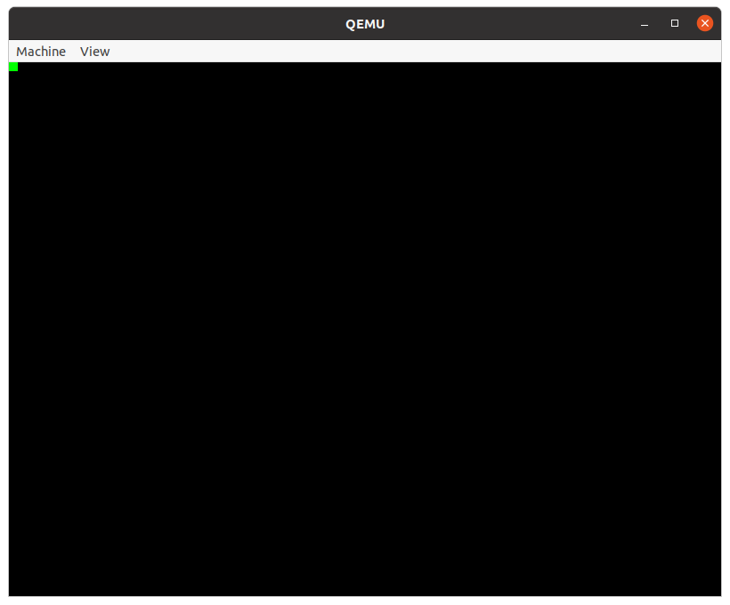

- Setting  and getting a color palette

  The 8-bit color depth has to be applied, so for cirrus graphics adapter please use `GRAPH_800x600x8` instead of `GRAPH_DEFMODE`. Note that in a default color palette when using the 8-bit mode, `0x01` refers to blue and for passed color map (`cmap`) it's `{ 0xff, 0x00, 0x00}` - red.

  ```C
  unsigned char buff[2][3];
  static const unsigned char cmap[2][3] = {
  { 0xff, 0xff, 0xff},
  { 0xff, 0x00, 0x00}
  };

  graph_colorget(&graph, buff[0], 0, 1);
  graph_colorset(&graph, cmap[0], 0, 1);
  graph_rect(&graph, 200, 200, 200, 100, 0x01, GRAPH_QUEUE_HIGH);
  sleep(1);
  graph_colorset(&graph, buff[0], 0, 1);
  ```

  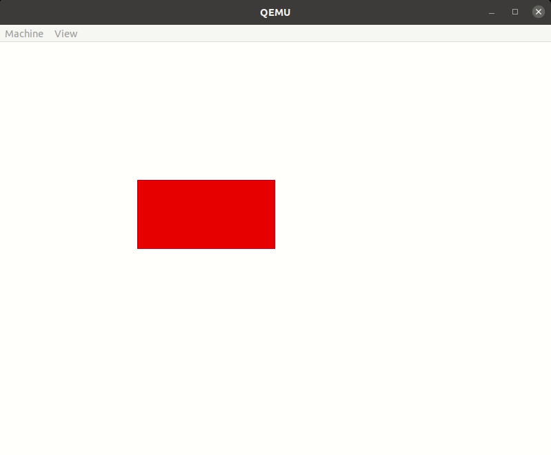

- Moving a cursor
  The `cursor.h` header file with cursor shape data (`amask`, `xmask`) has to be included.

  ```C
  graph_cursorset(&graph, amask[0], xmask[0], 0xff0000ff, 0xffffffff);
  graph_cursorshow(&graph);
  for (int i = 0; i < 300; i++) {
    graph_cursorpos(&graph, i, i);
    usleep(10000);
  }
  graph_cursorhide(&graph);
  ```

  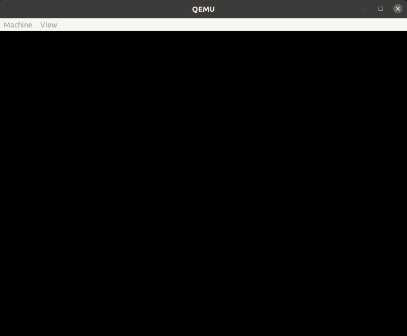

## Generating an image bitmap and displaying it using libgraph

To create a raw bitmap, which can be displayed on the screen, it's needed to use some graphic program, for example `Gimp`.

There are few steps to follow:

- Open `Gimp` and paste the image

- Set the desired resolution (image->scale image)

- Depending on the desired format:

  - for 8-bit indexed color - change the file mode (image->mode->indexed) and export the file as raw binary data (file->export and choose raw image data format)

  - for other color depths - export the file to C source/header format (a dialog window pops up with additional options for color conversion)

- At this point image binary data should be available (either as a an array in `.c` or `.h` file or raw hex dump)

- Custom image data formatting might be required

If the image bitmap is ready, there is possibility to display it using `graph_copy()`. Please see the proper example in [How to use libgraph](#How-to-use-the-graphics-library) chapter.


## See also

1. [Phoenix-RTOS core libraries](README.md)
2. [Table of Contents](../README.md)