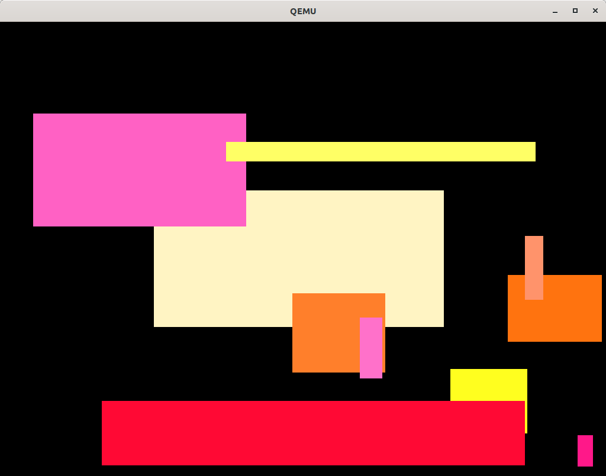
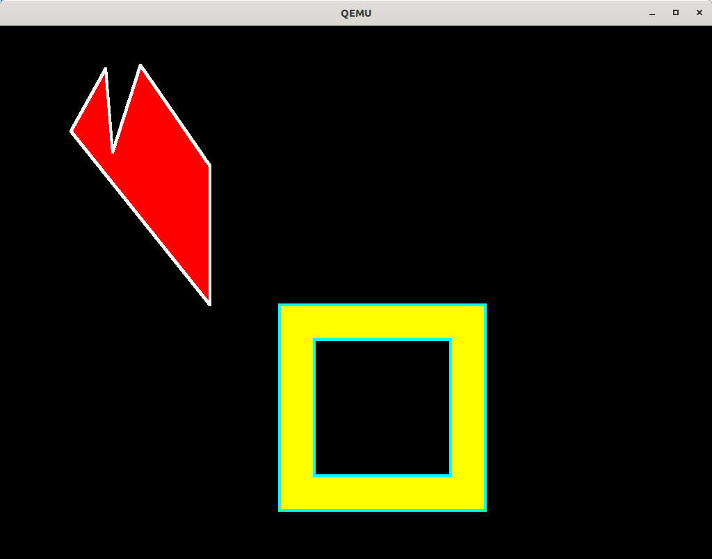

# Graphics library (libgraph)

`libgraph` is a graphics library which allows for scheduling and (possibly hardware accelerated) execution of 2D graphics operations.\
Source code: https://github.com/phoenix-rtos/phoenix-rtos-corelibs/tree/master/libgraph

## Graphics operations

The library supports following graphics operations with 1, 2 and 4-byte color depth:

- drawing lines

  

- drawing rectangles

  

- filling polygons

  

- printing text

- copying and moving memory

- changing cursor shape and position

## Graphics adapters

The library supports following graphics adapters:

- virtio-gpu - virtualized graphics adapter compatiblie with VirtIO specificatiion (avaiable on QEMU or VirtualBox),

- vga - VGA compatible graphics adapter,

- cirrus - Cirrus Logic GD5446 SuperVGA adapter.
