# Using Perfetto GUI to view kernel traces

Once we convert our CTF trace to the Perfetto protobuf format, we can load it to
the GUI. The following article is a simple feature tour.

Our example trace is a recording of an idling 4-core ia32 target emulated on
QEMU with UART console.

## Loading the trace file

Navigate to <https://ui.perfetto.dev/> and open the converted file via "Open
trace file":

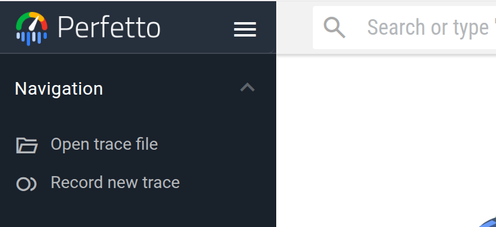{width=250px}

If everything succeeds, you should see a timeline of expandable processes, like here:

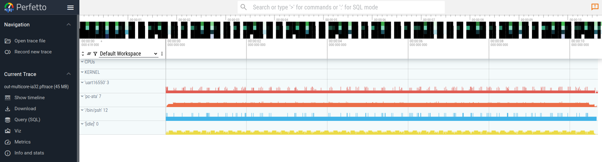

## Basics - What am I looking at?

Looking closer at the track list, we see:

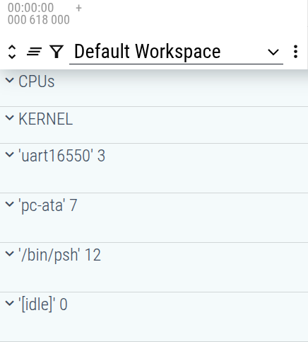{width=250px}

The "CPUs" and "KERNEL" tracks are special. The rest consists of process tracks.

A track can be expanded by clicking {.inline-icon} before its name. One can also expand
all tracks by clicking 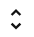{.inline-icon} in
the top-left corner.

The track filtering capabilities for the time being are known to be buggy (on
Perfetto's end), so exploring the {.inline-icon} option is left as an exercise to
the reader.

### "CPUs" track

Upon expanding the "CPUs" track and zooming in a bit (either with
{kbd}`Ctrl+ScrollUp`/{kbd}`Ctrl+ScrollDown` or {kbd}`W`/{kbd}`D` keys) we can
see what thread is executing at a given time on each CPU core:

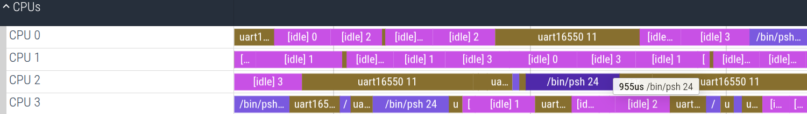

### "KERNEL" track

The "KERNEL" track contains a subtrack for each CPU core with specific
kernel-space events occurring that cannot be bound to any kernel thread such as
IRQs, scheduler invocation, etc.:

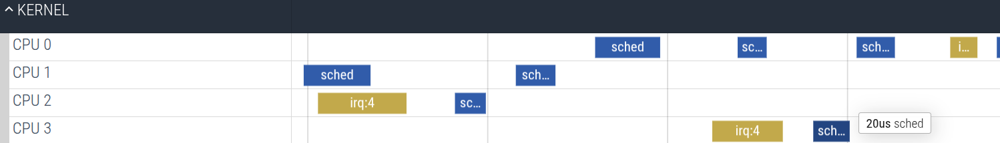

### Process tracks

We can see that there were 4 processes running:

1. uart16550 driver process - `uart16550' 3`
2. ATA disk driver - `pc-ata' 7`
3. main psh process - `'/bin/psh' 12`
4. idle process - `'[idle]' 0`

Every process track can be expanded to unveil its thread tracks. Here we expand
uart16550 process that has i.e. threads with TIDs 7 and 9 (number in parenthesis
denotes the thread ID):

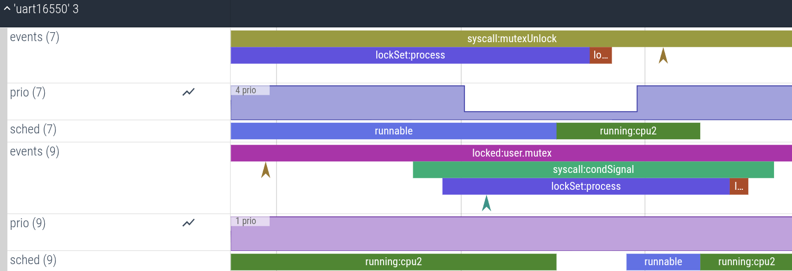

There are three tracks associated with each thread:

1. `events` track - event track where all the kernel events can be found:
   syscalls, locks, moment of preemption by the scheduler etc.
   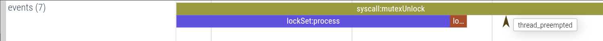

2. `prio` track - counter track denoting the thread priority at a given time. In
   the example, the thread 7's priority got temporarily elevated from 4 to 1 for
   the duration of kernel lock possession:

   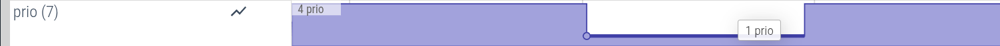

3. `sched` track - event track for scheduler state events, e.g. `runnable` marks
   the time period the thread is ready to be run, and `running:cpuN` denotes the
   period in which the thread was run on CPU core N
   

## Advanced features

Previous section should give you the fundamentals for navigating the trace.
Depending on your use case, the following section describes additional features
that may facilitate the trace analysis.

## Flows

Perfetto allows for grouping logically related events into *flows* that are
later visualized in GUI and possible to traverse back and forth.

Some of our events are grouped into such flows: the `running:cpuN` events are
connected wrt. the CPU core and `locked:X` lock possession events are connected wrt.
the lock.

If you click on any `locked:X` event, the GUI will unveil a flow for a given lock X:

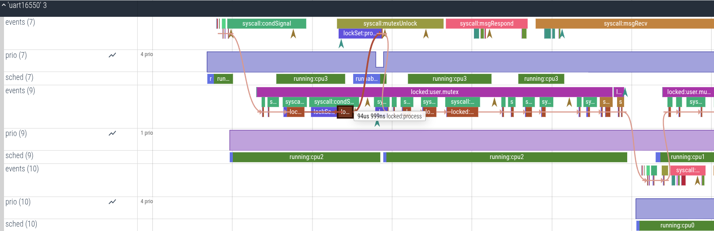

Same will happen if you click on `running:cpuN`:

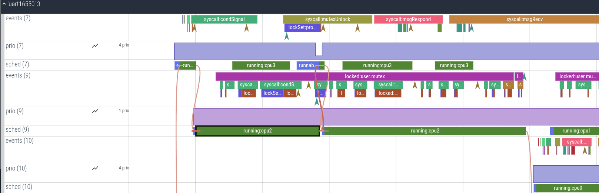

If you open the bottom bar by clicking the button {.inline-icon} on the bottom-right you can see
the previous and next events in the flow. By clicking on the flows, you can walk
through the flow.

### Aggregations

You can do selections on the timeline to perform aggregations. This time, if you
open the bottom bar by clicking the button {.inline-icon} on the bottom-right, you will
see statistics for the area selection:

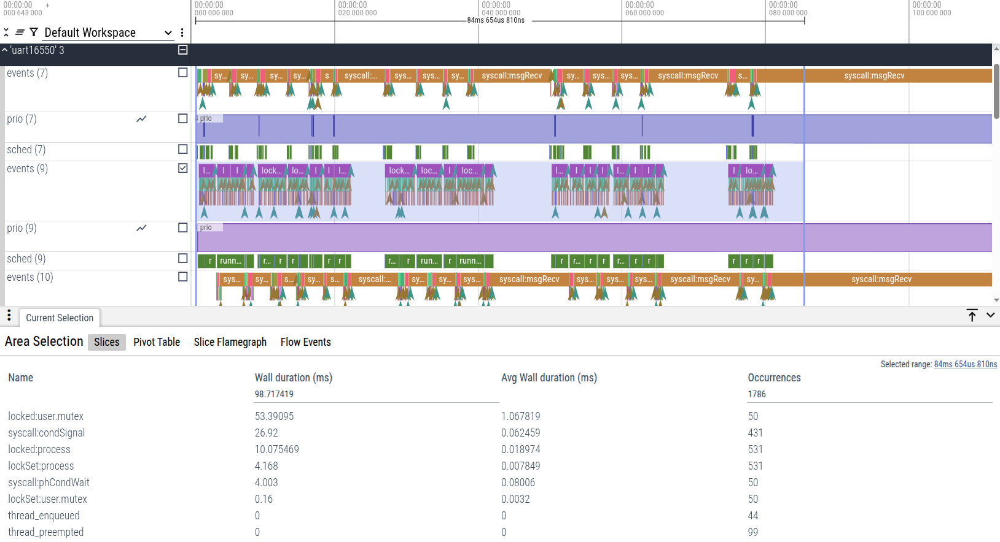

These aggregations are customizable.

There is also a pivot table (similar to Slices view) and a Slice Flamegraph:

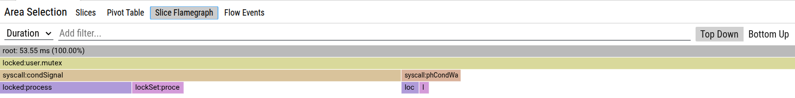

If you are an SQL connoisseur, you can insert `:` into the search bar...

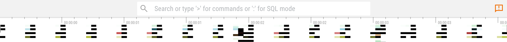

...and do queries, e.g:

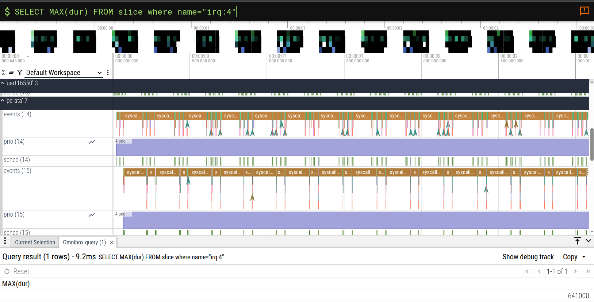
