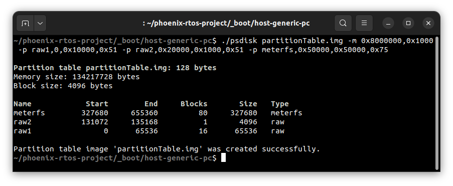
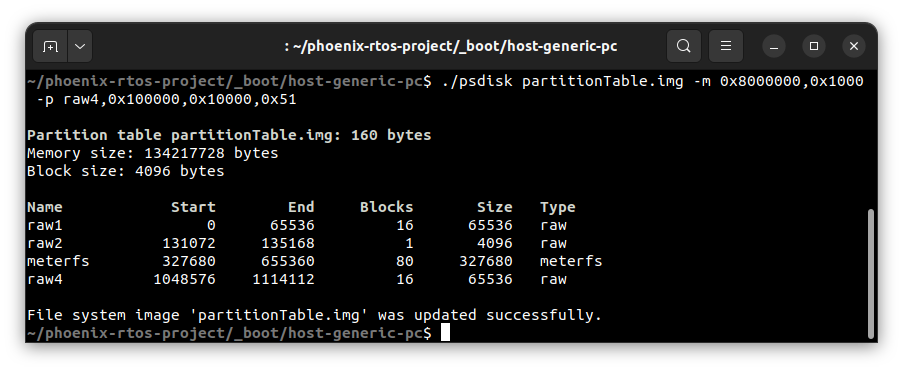

# psdisk

`psdisk` is a tool responsible for creating a partition table where sources are placed under the following link:
<https://github.com/phoenix-rtos/phoenix-rtos-filesystems/tree/master/ptable>

## Preliminary information

In Phoenix-RTOS this memory scheme was introduced in a flash server
(<https://github.com/phoenix-rtos/phoenix-rtos-devices/tree/master/storage/imxrt-flash>) for armv7m7-imxrt106x-evk
(NXP i.MX RT106x). It can be distinguished by the following partition types:

- `raw` - partition provides direct access only to a selected part of memory,
- `MeterFS` - partition contains access to a file system created for meter profile data storage
(<https://github.com/phoenix-rtos/phoenix-rtos-filesystems/tree/master/meterfs>).

In the mentioned flash server, a partition table has to be located in the last sector of the flash memory. Due to this
fact, the user can generate an image that covers the whole memory with a partition table that is located in the last
sector or only an image containing a partition table.
To generate an image with a flash memory size, the user should use `-o` option.

## Examples

The following example generates a partition table for MICRON MT25QL01GBBB. The size of the memory and sector based on
data from <https://pl.mouser.com/datasheet/2/671/MT25Q_QLKT_L_01G_BBB_0-1283539.pdf>

### Creating partition table

```text
./psdisk partitionTable.img -m 0x8000000,0x1000 -p raw1,0,0x10000,0x51 -p raw2,0x20000,0x1000,0x51 -p meterfs,0x50000,0x50000,0x75
```



### Updating partition table

```text
./psdisk partitionTable.img -m 0x8000000,0x1000 -p raw4,0x100000,0x10000,0x51
```



## See also

1. [Phoenix-RTOS Host Utilities](README.md)
2. [Table of Contents](../README.md)
