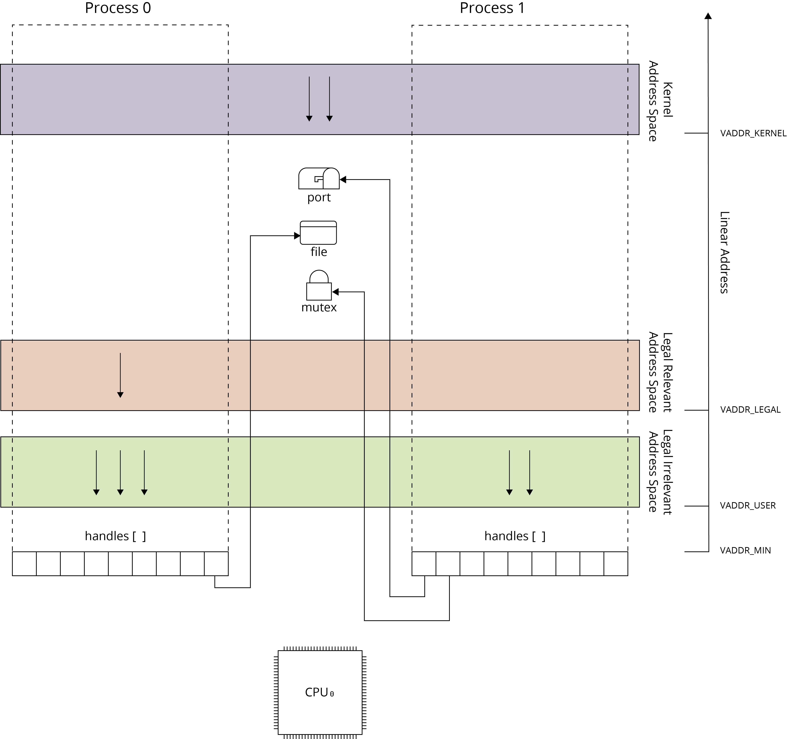

# Kernel - Processes and threads

Process and thread abstractions are used to control program executions in Phoenix-RTOS.

## Process definition
Process is the abstraction used for resource aggregation and to define the linear address space for the program execution. Process linear address space is defined using address spaces. Each process contains set of address spaces (each of them is described by its own memory map) accessible via its linear address space. On MMU architectures these address spaces are accessible using paging technique and segment definitions. On non-MMU architectures address spaces are accessible in the process linear address space using a segment definitions only (e.g. using MPU on ARM).

## Thread
Thread represents the program instruction stream and it is executed by processor concurrently with other threads. It means that execution of each thread is interrupted (periodically by system timer or aperiodically by external interrupts), the processor state resulting from the thread execution is preserved and other thread is selected for the execution. If a computer system is equipped with many processor cores many threads are in the fact executed concurrently.  If only single processor core is available only one thread is executed in the particular time slot. The execution of threads is controller by operating system scheduler, a special subprogram invoked after each thread interruption deciding what thread requiring processor should be executed on current processor in the following time slot. Generally speaking thread represents the instruction stream executed concurrently with other streams within a program.

Thread can be associated with the kernel or with a process. When thread is associated with the kernel it can use only kernel address spaces. When it is  associated with a process it can use all address spaces associated wit the process and kernel. When the access to the address space requires switching the processor to the privileged execution mode (e.g. access to kernel address spaces) the thread can do this using specific kernel function. Should be noticed that such transition between mode is carefully controlled by the operating system. The processor can enter into the particular mode using only well-defined entry points (e.g. after receiving hardware interrupt or executing trap) handled by the operating system. The discussion of processor execution mode is presented below.

## Operating system resources
During execution thread can use operating system resources provided in the kernel or process context. The typical resources assigned to process are mutexes, conditional variables, files, network sockets, ports etc. These resources (kernel objects) are shared among executed processes and can be accessed by the particular process after opening. Operating system resources are accessible in the process context via handles. The simplest example of process resource is a file. After successful file opening the file handle is created (file descriptor in UN\*X terminology). Handle can be used to perform input and output operations on the opened file and can be inherited by child processes created by the process. The handle inheritance is widely used in current applications because it is promoted by POSIX standard and popular UN*X operating systems.

To understand properly Phoenix-RTOS process model it should be discussed either for MMU and non-MMU architectures.

## Process model on architectures equipped with MMU
Process model for MMU architectures has been presented on the following picture.

The linear address space is defined individually per process using MMU (Memory Management Unit) and virtual addressing. It means that the linear address space is virtual and each linear address is translated into the physical address. The translation of virtual address takes place with a granulation of memory page size and is performed using MMU (Memory Management Unit) - a hardware unit located between CPU address bus and system address bus.

The hardware mechanism used for the virtual address translation depends on the hardware platform. On some hardware architectures the virtual address translation is performed using special data structures (page tables) located in the physical memory and using hardware page walking algorithm embedded into the MMU. On other architectures the virtual to physical address associations are controlled directly by the operating system using specific MMU registers. In this aproach operating system must define its own structures describing virtual address translations for each process.

When thread context and associated process context are switched the MMU state is changed to define the linear address space. This can result with performance degradation because new definitions must be downloaded from physical memory into into the MMU. Therefore threads scheduling algorithm should minimize the MMU context switching. Some hardware architectures provide mechanisms extending the standard virtual address definition with bits identifying the process linear address space to prevent the MMU flushing during each process context switch. Unfortunately these mechanisms (e.g. ARM ASID) are in most cases insufficient  because of limited range of these identifiers and are not used by operating systems.

The virtual addressing has a great impact on program creation, execution and process separation. Due to virtual memory the linear address space of each process can use the same address ranges and each program can be loaded into the memory without performing the address relocations. The linear address space of each process can use the private address spaces (defined per-proces) and global address spaces e.g. kernel address space.It should be noticed the kernel address space have to be mapped into the linear address space of each process because it is necessary to provide operating system services.

Virtual addressing and private address spaces have also big impact on memory sharing. When a new process is created it can define its own private map based on already allocated and named physical memory (see Memory objects). This map can be derived from the map of parent process or can be established from scratch. The smart use of copy-on-write technique allow to allocate the physical memory only for local modifications made by process threads during their execution (see Memory objects).

## Process model on architectures not equipped with MMU
The process model on non-MMU architecture has been presented below.

The main difference between process model on MMU and non-MMU architectures is the lack of virtual addressing. Each process uses the same linear address space. Some of linear addresses can be excluded from the process linear address space using segment definition unit (e.g. MPU on ARM) or can be excluded conditionally depending and the processor execution mode.

## Processor execution modes

Modern processors execute instructions using several execution modes. Execution modes allow to separate sensitive software parts (e.g. operating system kernel or machine emulation layer) from other software components. When processor enters into the particular mode only hardware resources (i.e. I/O space, memory segments) and processor programming model specific for this mode can be used. 

There are three commonly used and widely known processor execution modes – kernel mode (supervisor mode), user mode (application mode) and machine mode (machine emulation mode). 

The first of them is devoted for the operating system kernel execution, provides practically unlimited access to the hardware resources and privileged processor instructions can be used.

The user mode is used for user program (application) executions, provides limited access to the hardware resources, only user memory segments can be used and instruction set is limited to unprivileged instruction.

The machine mode (e.g. SMM on IA32 or Machine Mode on RISC-V)  is used "below" the operating system It is used for hardware virtualization when some hardware resources are required and are not implemented in the hardware or it is used for processor initialization. The existence of this mode should be especially considered when the software with the real-time constraints is executed, because the hardware virtualization (code execution in the machine emulation mode) can be the source of unexpected answer time jitter. This mode allows usually for higher privileges than supervisor mode and is usually hidden from the operating system.

Because of software partitioning requirements new execution modes are introduced. These modes are used to separate some parts of the application code (e.g. parts involved in security) from untrusted parts of application. The good example of such mode is TrustZone extension on ARM or privileges rings on IA32 (introduced in 1986).

## Thread transitioning between execution modes

## Process separation

Phoenix-RTOS process model based on address spaces complemented by execution modes constitutes a very powerful mechanism for program separation. Global address spaces can be selectively mapped into the linear address space of selected processes. Private address spaces can effectively prevent the interference between processes, but they can be seamlessly used when MMU is available.

Some of address spaces (e.g. kernel address space) can be attributed with the processor execution mode required to access to them. Using extended processor execution modes (e.g. ARM TrusZone or IA32 rings) the intermediate privilege modes can be introduced. This technique allows to separate the sensitive parts or program executed within a process from other parts. Privileged and separated address spaces mapped into many processes can consist shared data and code used for example for emulation or to implement managed execution environments.

## Implementation structure

The process and thread management subsystem is located in the `src/proc` subdirectory. The routines related to context switching are implemented in the HAL.

## See also

1. [Table of Contents](../README.md)
2. [Phoenix-RTOS architecture](../architecture.md)
3. [Building Phoenix-RTOS](../building/README.md)
4. [Running Phoenix-RTOS on targets](../quickstart/README.md)

5. [Kernel/HAL Subsystem](hal/README.md)
6. [Kernel/Processes and threads](proc/README.md)
7. [Kernel/Memory management](vm/README.md)
7. [Kernel/Common routines](lib.md)