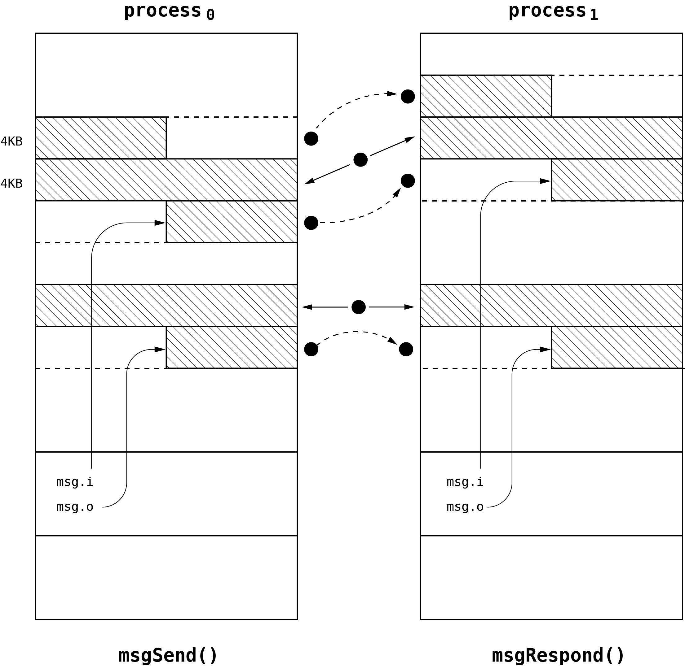

# Message passing

Message passing is the fundamental functionality of the operating system kernel which acts as a basic method of
interaction between operating system components. Message passing in Phoenix-RTOS is synchronous. Sending thread is
suspended until the receiving thread receives a message and responds to it.

## Ports

Port is the communication endpoint used for passing messages between executed threads.

## Data transfer

Kernel implements message passing by the following functions.

```c
extern int proc_send(u32 port, msg_t *msg);

extern int proc_recv(u32 port, msg_t *msg, unsigned int *rid);

extern int proc_respond(u32 port, msg_t *msg, unsigned int rid);
```

Structure `msg_t`, described in detail in [Message structure](#message-structure) chapter,
identifies message type and consists of two main parts - input part and output part.

Input part points to the input buffer and defines its size. It contains also a small buffer for passing the message
application header. The output part has symmetrical architecture to input buffer. It contains the pointer to output
buffer, output buffer data length and buffer for output application header.

When message is sent by the `proc_send` function the sending thread is suspended until the receiving thread executes
`proc_recv` function, reads data from input buffer, writes the final answer to the output buffer and executes
`proc_respond`. The `rid` word identifies the receiving context and should be provided to the `proc_respond` function.
There is possible to execute a lot of instructions between receiving and responding procedures. Responding function is
used to wake up the sending thread and inform it that data in output buffer are completed.

To prevent copying of big data blocks over the kernel when communication goes between threads assigned to separate
processes special optimization is introduced. When message is received by the receiving thread input and output buffers
are transparently mapped into the receiver address space. To prevent interference with other data, if any of these
buffers is not aligned with the page, the heading or tailing part of this buffer is copied to the newly allocated page
mapped instead of the original page. When receiving thread responses to the message the buffers are unmapped and heading
or tailing parts are copied to the original page located in sender address space. This technique is briefly presented on
following figure.



There is another type of optimization. If input or output data size is lower than page size and data fits into the
buffer used for application header passing the data is copied instead of using virtual memory capabilities which provide
extra overhead for small messages.

## External interface

In the user space, messages are sent using the `msgSend(port_t port, msg_t *msg)` function.
The `port` argument is the port number of the target queue, and `msg` is a pointer to the message structure.
The caller is responsible for filling the message structure with appropriate data.
`msg.i.raw` and `msg.o.raw` fields must not be used directly when using standard
message types, except for `mtDevCtl`. For all other types, input data should be passed using the `msg.i.data`
and `msg.i.size` fields. The calling thread is suspended until the receiving thread responds to the message.

The `msgRecv(port_t port, msg_t *msg, msg_rid_t *rid)` function is used to receive a message from the queue
identified by`port`.
The `msg` argument is a pointer to the message structure, and `rid` is a pointer to the message reception
context. The calling thread is suspended until a message is received.

Message recipient should perform action based on the message type and input data and write the response to the
appropriate `msg.o` field. Other fields of the message structure must be left unchanged. To respond to the message, the
`msgRespond(port_t port, msg_t *msg, msg_rid_t rid)` function is used.

## Message structure

The `msg_t` structure is defined as follows:

```c
typedef struct _msg_t {
	int type;
	unsigned int pid;
	unsigned int priority;
	oid_t oid;

	struct {
		union {
			/* OPEN/CLOSE */
			struct {
				int flags;
			} openclose;

			/* READ/WRITE/TRUNCATE */
			struct {
				off_t offs;
				size_t len;
				unsigned mode;
			} io;

			/* CREATE */
			struct {
				int type;
				unsigned mode;
				oid_t dev;
			} create;

			/* SETATTR/GETATTR */
			struct {
				long long val;
				int type;
			} attr;

			/* LINK/UNLINK */
			struct {
				oid_t oid;
			} ln;

			/* READDIR */
			struct {
				off_t offs;
			} readdir;

			unsigned char raw[64];
		};

		size_t size;
		const void *data;
	} i;

	struct {
		union {
			/* ATTR */
			struct {
				long long val;
			} attr;

			/* CREATE */
			struct {
				oid_t oid;
			} create;

			/* LOOKUP */
			struct {
				oid_t fil;
				oid_t dev;
			} lookup;

			unsigned char raw[64];
		};

		int err;
		size_t size;
		void *data;
	} o;
} msg_t;
```

Common fields for all message types are:

- `type` - message type,
- `pid` - sender process ID,
- `priority` - priority of sender thread,
- `oid` - object identifier of the target object (e.g. file or device).

Additionally, there are two fields used to store input and output data specific to the message type:

- `i` - input data,
- `o` - output data.

Message error codes are stored in the `o.err` field common for all message types.

### Message types

#### `mtOpen`

Open a file or device specified by `msg.oid`.

Input parameters:

- `i.openclose.flags` - flags with which file is being opened.

#### `mtClose`

Close a file or device specified by `msg.oid`.

#### `mtRead`

Read from a file or device specified by `msg.oid`.

Parameters set by caller:

- `i.io.offs` - offset in the file,
- `i.io.len` - number of bytes to read,
- `i.io.mode` - flags with which file has been opened.
- `o.data` - buffer for data,
- `o.size` - length of the `o.data` buffer.

The operation should block the client until all requested data becomes available. Number of read bytes or error is
returned via `o.err`.

#### `mtWrite`

Write to a file or device specified by `msg.oid`.

Input parameters:

- `i.io.offs` - offset in the file,
- `i.io.len` - number of bytes to write,
- `i.io.mode` - flags with which file has been opened.
- `i.data` - buffer with data,
- `i.size` - length of the `i.data` buffer.

The operation should block the client until all requested data is written to the device. Number of written bytes or
error is returned via `o.err`.

#### `mtTruncate`

Truncate a file.

#### `mtDevCtl`

Custom message type for device control.

This message type allows defining an entirely custom structure for communication with a server. This structure should
be serialized/deserialized to/from message i.raw/o.raw fields. Additional data can be passed in i.data and o.data
fields.

#### `mtCreate`

Create new object.

#### `mtDestroy`

Destroy object.

#### `mtSetAttr`

Set object attributes.

#### `mtGetAttr`

Get object attribute specified by `i.attr.type`.

#### `mtGetAttrAll`

Get all object attributes.

#### `mtLookup`

Lookup for object identifier associated with a name.

#### `mtLink`

Create a hard link.

#### `mtUnlink`

Remove a hard link.

#### `mtReaddir`

Read directory entries.

## See also

1. [Kernel - Processes and threads](index.md)
2. [Kernel - Processes and threads - Scheduler](scheduler.md)
3. [Kernel - Processes and threads - Management](forking.md)
4. [Kernel - Processes and threads - Synchronization primitives](sync.md)
5. [Kernel - Processes and threads - Namespace](namespace.md)
6. [Table of Contents](../../index.md)
