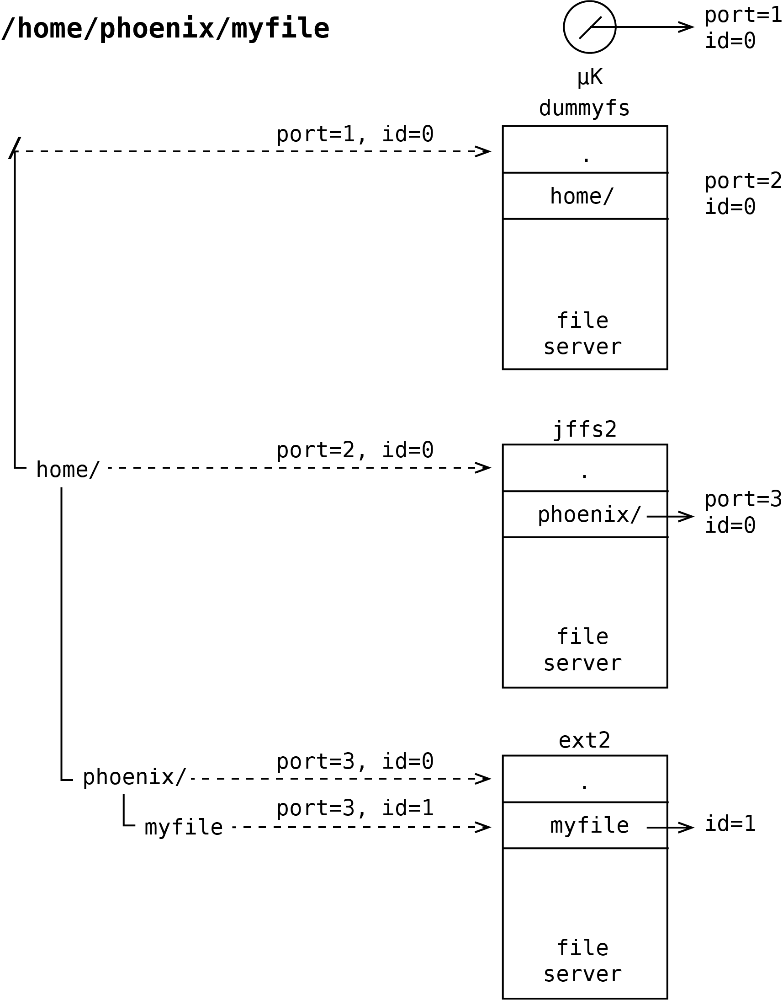
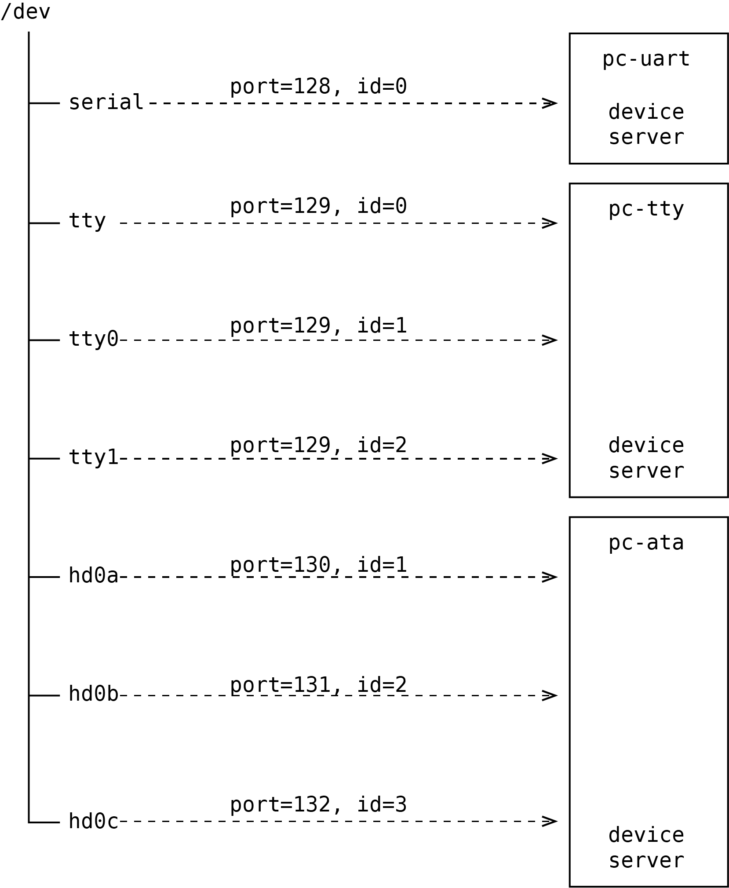

# Kernel - Processes and threads - Namespace

The namespace and port registering functionality are used by operating system servers
(e.g. device drivers, file servers) as a basic method of integration with the other operating system components.
For example, if a thread working in the process context opens the file given by specific path, it indirectly lookups for
the port of the file server handling this object and finally receives the `oid_t`(port, ID) structure identifying the
file on the server. It is done because the file server handling particular file during start registers its port in the
namespace handled by the other server or by the kernel. File server mounts its namespace to the existing namespace
handled by existing file servers. The namespace mounting functionality is presented on the following picture.

In the case of device drivers, they register special names in the namespace and associate them with the specific `oids`.
When program opens the file registered by a device driver it receives `oid` pointed directly to the device driver
server, so all communication is redirected to this server. This idea has been briefly presented on following figure.

1. [Kernel - Processes and threads](README.md)
2. [Kernel - Processes and threads - Scheduler](scheduler.md)
3. [Kernel - Processes and threads - Management](forking.md)
4. [Kernel - Processes and threads - Synchronization primitives](sync.md)
5. [Kernel - Processes and threads - Message passing](msg.md)
6. [Table of Contents](../../README.md)
