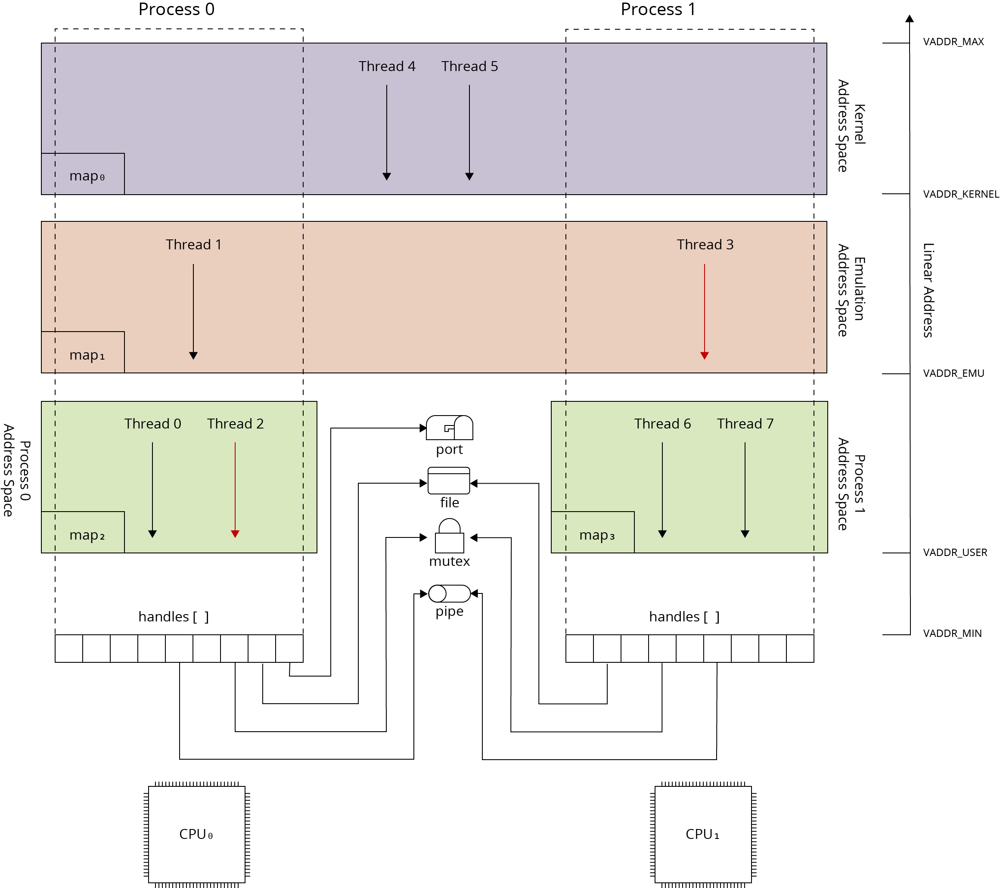
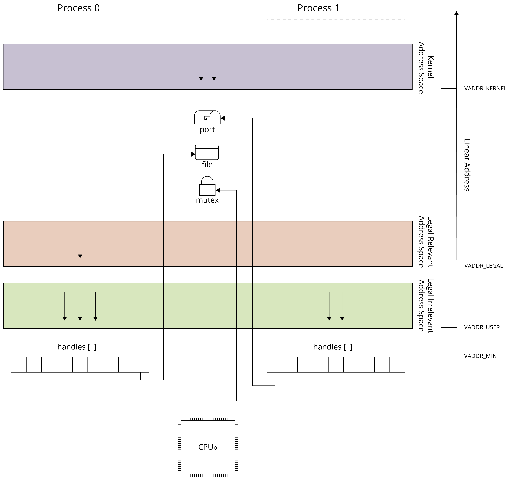

# Process and thread overview

This section describes processes and threads.

## Process

A process is a container for a program's address space and resources.
Each process contains a set of address spaces that are described by memory maps and made available in the process
linear address space.
On Memory Management Unit (MMU) architectures, these address spaces use paging and segment definitions.
On non-MMU architectures, the process linear address space uses segment definitions only, for example a Memory
Protection Unit (MPU) on ARM.

## Thread

A thread represents an instruction stream.
The scheduler interrupts threads with a timer or interrupt, saves the processor state, and selects the next thread.
On multicore systems, many threads can run at the same time.
On a single-core system, one thread runs in a given time slot.

A thread can belong to the kernel or to a process.
A kernel thread can use only kernel address spaces.
A process thread can use the address spaces associated with its process and the kernel.
Mode transitions are controlled by the operating system.
The processor enters privileged mode only through defined entry points, such as interrupts or system calls.

## Operating system resources

A thread can use operating system resources provided in the kernel or process context.
Process resources include mutexes, condition variables, files, network sockets, and ports.
These resources are shared kernel objects that a process accesses through handles.

A file is a typical process resource.
After a file is opened, the process receives a file descriptor that it can use for input and output operations.
Child processes can inherit file descriptors from their parent process.

The Phoenix-RTOS process model differs between MMU and non-MMU architectures.

## Process model on architectures equipped with MMU

Process model for MMU architectures has been presented on the following picture.

The linear address space is defined individually per process using MMU (Memory Management Unit) and virtual addressing.
Each linear address is translated into a physical address.
Address translation uses memory-page granularity and is performed by the MMU, a hardware unit located between the CPU
address bus and system address bus.

The virtual-address translation mechanism depends on the hardware platform.
Some architectures use page tables in physical memory and a hardware page-walking algorithm in the MMU.
Other architectures let the operating system control virtual-to-physical address associations through MMU registers.
In this approach, the operating system defines its own translation structures for each process.

When thread context and associated process context are switched, the MMU state changes to define the linear address
space.
This change can reduce performance because the MMU needs new definitions from physical memory.
The scheduler minimizes MMU context switches where possible.
Some hardware architectures extend virtual address definitions with bits that identify the process linear address space.
These mechanisms can avoid an MMU flush during each process context switch, but their identifier range is often limited.

Virtual addressing affects program creation, execution, and process separation.
Because each process has its own linear address space, programs can use the same address ranges and load without address
relocations.
The linear address space of each process can use private address spaces, defined per process, and global address spaces,
such as the kernel address space.
The kernel address space must be mapped into the linear address space of each process to provide operating system
services.

Virtual addressing and private address spaces also affect memory sharing.
When a process is created, it can define its private map from already allocated and named physical memory.
See [Memory objects](../vm/objects.md).
This map can be derived from the parent process map or created from scratch.
Copy-on-write allocates physical memory only for local modifications made by process threads during execution.

## Process model on architectures not equipped with MMU

The following diagram shows the process model on a non-MMU architecture.

The main difference between MMU and non-MMU process models is the lack of virtual addressing.
Each process uses the same linear address space.
Some linear addresses can be excluded from the process linear address space with a segment definition unit, such as an
MPU on ARM, or conditionally excluded by processor execution mode.

## Processor execution modes

Modern processors execute instructions using several execution modes. Execution modes allow separating sensitive
software parts (e.g. operating system kernel or machine emulation layer) from other software components. When processor
enters into the particular mode only hardware resources (i.e. I/O space, memory segments) and processor programming
model specific for this mode can be used.

There are three common processor execution modes: kernel mode, also called supervisor mode, user mode, also called
application mode, and machine mode, also called machine emulation mode.

Kernel mode runs the operating system kernel and provides broad access to hardware resources and privileged processor
instructions.

User mode runs user programs, provides limited access to hardware resources, limits memory access to user segments, and
allows only unprivileged instructions.

Machine mode, such as System Management Mode (SMM) on IA32 or Machine Mode on RISC-V, runs below the operating system.
It is used for hardware virtualization when required hardware resources are not implemented in hardware, and for
processor initialization.
Real-time software must account for this mode because machine-mode code execution can introduce unexpected jitter.
This mode usually has higher privileges than supervisor mode and is hidden from the operating system.

Because of software partitioning requirements on some processors new execution modes are introduced. These modes are
used to separate some parts of the application code (e.g. parts involved in security) from untrusted parts of
application. The good example of such mode is TrustZone extension on ARM or privileges rings on IA32
(introduced in 1986).

## Thread transitioning between execution modes

During program execution within a thread, processor can transit between many execution modes. Transitioning takes place
as the consequence of hardware interrupt, exception or program trap. When one of the mentioned events appears processor
transit into the execution mode defined by interrupt/exception/trap vector descriptor. After the transition to the
specified execution mode the processor programming model is extended with instructions specific for this mode and
address spaces specific to this mode are accessible for the program. When execution on particular execution mode
finishes program returns to the previous mode and restores previous program execution context. This return is performed
using special processor instruction. On most processors, it is the instruction used to notify of the end of interrupt
handling.

## Process separation

The Phoenix-RTOS process model uses address spaces and execution modes to separate programs.
Global address spaces can be selectively mapped into the linear address space of selected processes.
Private address spaces can prevent interference between processes when an MMU is available.

Some address spaces (e.g. kernel address space) can be attributed with the processor execution mode required to
access them. Using extended processor execution modes (e.g. ARM TrustZone or IA32 rings) the intermediate privilege
modes can be introduced. This technique allows for separating the sensitive parts or program executed within a process
from other parts. Privileged and separated address spaces mapped into many processes can consist shared data and code
used for example for emulation or to implement managed execution environments.

## Implementation structure

The process and thread management subsystem is located in `phoenix-rtos-kernel/proc/`.
Context switching routines are implemented in the hardware abstraction layer.
