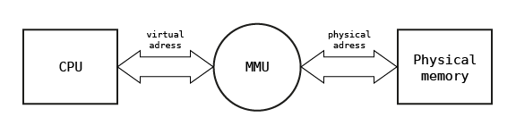
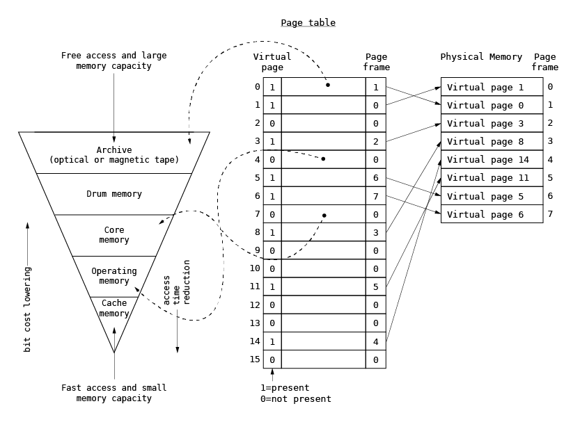
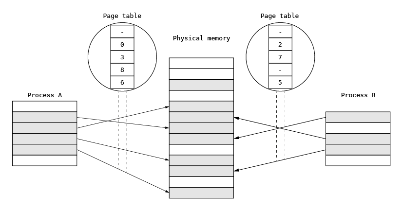

# Memory management

Memory management is the most important part of any operating system kernel, as it has a great impact on the overall system performance and scalability. The main goal of the memory management is to provide phsycial memory for the purpose of kernel and running programs represented by processes.

In most modern general-purpose operating systems, memory management is based on paging technique and the Memory Management Unit (MMU) is used. The MMU is available across many popular hardware architectures (e.g. IA32, x86-64, ARMv7 Cortex-A, RISC-V) and is used for translating the linear addresses used by programs executed on the processor core into the physical memory addresses. This translation is based on linear-physical address associations defined inside MMU which are specific for each running process allowing to separate them from each-other. The evolution of paging technique and current use of it in general purupose operating systems are briefly discussed in the further parts of this chapter.

The assumption of use of paging techniqe as the basic method of accessing the memory for running processeses is insufficient when operating system shall handle many hardware architectures starting from low-power microcontrollers and ending with advanced multi-core architectures with gigabytes of physical memory because MMU is available only on some of them. Moreover many modern architectures used for IoT device development and massively parallelized multi-core computers are equipped with a non-uniform physical memory (NUMA) with differrent access characteristics. For example in modern microcontrollers some physical memory segments can be tightly coupled with processor enabling to run real-time application demanding minimal jitter (e.g. for signal processing). On multi-core architectures some physical memory segment can by tightly coupled with particular set of processing cores while others segments can be accessible over switched buses what results in delayed access and performance degradation. Having this in mind in Phoenix-RTOS it was decided to redefine the traditional approach to memory management and some new memory management abstractions and mechanisms were proposed. These abstractions and mechamisms allow to unify the approach for memory management on many types of memory architectures. To understand the details and purpopose of these mechanims memory hardware architecture issues are briefly discussed in this chapter before Phoenix-RTOS memory management functions are briefly presented.

## Paging technique and Memory Management Unit

Processors equipped with MMU are typically used in servers, personal computers and mobile devices such as tablets and smartphones. In this architecture, the linear addresses used by executed program are translated to physical memory addresses using MMU associated with the processor core. This translation is performed with a defined granulation and the piece of the linear address space used for translation to physical address is called a memory page. Typically, the page size used in modern systems varies from 4KB to gigabytes, but in the past, e.g. on the PDP-10, VAX-11 architectures, it was much smaller (512 or 1KB).

MMU holds set of associations between linear and physical addresses defined for the process currently executed on the core. When process context is switched associations specific for the process are flushed from MMU and changed with associatons defined for the new process choosen for execution. The structure used for defining these association is commonly and incorrectly called page table and stored in physical memory. On many architectures associations used for defining the linear address space are automatically downloaded to MMU when linear addres is reached for the first time and association is not present in MMU. This task is performed by a part of MMU called Hardware Page Walker. On some architectures with simple MMU (e.g. eSI-RISC) the operating system define associatons by controlling MMU directly using its registers. In this case page table structure depends on software. The role of the MMU in memory address translation is illustrated in the figure below.

In the further considerations the linear address space defined using paging technique will be named synonymously as the virtual address space.

### Initial concept of paging technique

The concept of paging was first introduced in the late 1960s in order to organize the program memory overlaying for hierarchical memory systems consisting of transistor-based memory, core memory, magnetic disks and tapes. Historically, the virtual address space size was comparable to the physical memory size. The page table was used to point to the data location in the hierarchical memory system and to associate the physical memory location, called a page frame, with the virtual page. When the program accessed the virtual page, processor checked whether the page was present in the physical memory via the presence bit in the page table. If the page was not present in the physical memory, the program execution was interrupted and the page was loaded by the operating system into the physical memory via additional bits defining the data location in the page table. Once the presence bit was successfully loaded and set, the program execution was resumed. The original paging technique is presented below.

### Current use of paging technique

Over the years, paging has morphed into a technique used for defining the process memory space and for process separation. In general-purpose operating systems, paging is fundamental for memory management. Each process runs in its own virtual memory space and uses all address ranges for their needs. The address space is defined by a set of virtual-to-physical address associations for the MMU defined in the physical memory and stored in a structure which is much more complicated than a page table used in early computers. This is necessary in order to optimize memory consumption and speed up the virtual-to-physical memory translations. When a process is executed on a selected processor, the address space is switched to its virtual space, which prevents it from interfering with other processes. The address space is switched by providing the MMU with new sets of virtual-to-physical associations. In this scheme, some physical pages (for example parts of the program text) can be shared among processes by mapping them simultaneously into two or more processes to minimize the overall memory usage.

A memory management system which relies on paging describes the whole physical memory using physical pages.

## Direct physical memory access complemented with Memory Protection Unit or segmentation

Entry-level microcontrollers based on ARM Cortex-M architecture massively used in common electronics devices are typically equipped with embedded FLASH memories and tens of kilobytes of SRAM. Both FLASH and SRAM are accessible using the same address space. Because of small amount of RAM the MMU is useless and can lead to  memory usage overhead.

To provide separation of running processes and used by them physical memory the Memory Protection Unit is used. Memory Protection Unit takes part in memory addresing and typically allows to partition memory access by defining set of segments which can be used during the program execution. The number of these segments is usually limited (4, 8, 16). The access to defined memeory segments can be even associated with processor execution mode, so program executed in supervisor mode can operate on more segments then when it is executed in user mode. Processor execution modes and methods of transitioning between them have been Discussed in chapter [Processes and threads](proc/README.md).

There are two strategies of using MPU and memory segmentation. First and more flexible is strategy of switching whole MPU context when process context is switched. This demands to reload of all segments defined by MPU for the executed process with the new set defined for the newly choosen process. The big advantage of this technique is that processes are strictly separated because each of them uses its own set of user segments and shares the privileged segments (e.g. kernel segments). There are two disadvantages of this technique caused by typical MPU limitations. The process of redefining segments is slow because it requires the invalidation of cache memories. The method of defining segments in MPU is limited because segment address and size definition depends on choosen granulation. For example some segments can be defined only if all set of MPU registers is used.

The second strategy, used in Phoenix-RTOS, is based on memory regions/segments defined for the whole operating system and shared between processes. It means that processes can use during its execution assigned few predefined memory regions called further memory maps. These regions are defined during operating system bootstrap with respect of MPU register semantics and can be inline with physical memory characteristic. For example separate regions can be defined for TCM (Tightly Coupled Memory) with short acess time and separate regions can be defined for cached RAM. The set of regions assigned to the process is defined during process start-up. When a process context is switched the proper process set of MPU definition is activated using enable/disable bits. This can be done much faster in comparison to reloading the whole region definitions. The main disadvantage of described approach is the limited number of regions which can be used by running processes. This results with more weakly separation of runnning processes because they must use shared memory regions and erroneus thread of one process can destroy data in another process sharing the same memory region. But it should be emphasized that this technique complemented with proper definition of memory regions can allow to fullfill safety requirements of many type of applications e.g. applications based on software partitioning into two parts with different safety requirements.

Discussion of techniques used for protecing memory when direct physical memory acess is used should be complemented by presentation of memory segmentation mechanisms popularized widely by x86 microprocessors. The segmentation technique was developed on early computers to simplify the program loading and execution process. When a process is to be executed, its corresponding segmentation are loaded into non-contiguous memory though every segment is loaded into a contiguous block of available memory. The location of program segments in physical memoryis defined by special set of processor registers called segment registers and processor instructions are using offsets calculated according to segment base addresses. This technique prevents of using relocation/recalculation of program addresses after it is loaded to memory and before its execution is started. This technique was heavily extended in second generation of x86 processors (80286) by adding the ability to define segments attributes, limits and priviledge levels. This technique of processes separation was used on some early operating system for PC like MS Windows 3.0 and IBM OS/2. Nowadays it has been changed with paging.

## Non-uniform memory access

## Memory management subsystem structure

Memory management subsystem provides following functionalities:

* physical memory allocation,
* address space allocation (inside memory regions),
* linear addresses to physical addresses mapping (when paging is available),
* dynamic, fine-grained kernel memory allocation,
* objects memory mapping and memory sharing.

These functions will be briefly discussed and elaborated more in the particular chapters.

### Physical memory allocation

Physical memory allocation is the lowest level of the memory management subsystem. It is used to provide memory for the purposes of kernel or mapped object. The are two ways of obtaining physical memory depending on the type of hardwa memory architectures. When paging technique is used the memory is allocated using physical memory pages (page frames). On architecture with direct physical memory access the physical memory is allocated using address space allocation in the particular memory map. It is planned to generalize these techniques in the next version of Phoenix-RTOS memory management susbystem. To understand the physical memory allocation algorithm on architectures using paging technique please refer to [Physical memory allocation using memory pages](page.md).  To understand the physical memory allocation algorithm on architectures with direct memory access please refer to [Physical memory allocation](phys.md).

### Memory mapper

When the page allocator allocates a set of pages, the set must be mapped into an address space to be accessible. The memory address space is managed by the next memory management layer, i.e. the memory mapper. The memory mapper uses a memory map structures to describe memory segments located in address spaces. In MMU architectures, each process owns a separate memory map, and there is one kernel memory map defining the kernel address space. In non-MMU architectures, there is only one map shared by all processes and the kernel.

### Hardware dependent layer (pmap)

The `pmap` abstraction constitutes the lowest level of the memory management implemented in the HAL. This abstraction implements an interface for managing the MMU and hides hardware details from the upper layers. Its most important function is the `pmap_enter()`, which is used for mapping the page into the process virtual address space.

### Kernel fine-grained allocator
These two abstractions allow for memory allocation based on the needs of the kernel and processes with the resolution of page size. Such resolution is too large for dynamic allocation of kernel structures and could result in internal memory fragmentation and memory wasting. To omit these problems, zone allocator and fine-grained allocator are developed. They constitute the next layers of the memory management subsystem.

### Memory objects
First introduced in the Mach operating system, a memory object defines an entity containing data which could be partially or completely loaded into the memory and mapped into one or more address spaces. A good example of this is a binary object representing the program image (e.g. `/bin/sh`).

Memory objects were introduced so that processes could share physical memory; they allowing for identifying and defining sets of memory pages or segments of physical memory in non-MMU architectures. When one process maps an object into its memory map, the object occupies some physical pages. When another process uses the same object, the same pages (in the case of a read-only mapping) or their copies (in the case of a write mapping) are mapped.

## Implementation structure

The memory management subsystem is located in the `src/vm` subdirectory. The lowest `pmap` layer is implemented in the HAL.

## Chapter information

In this chapter main functions of Phoenix-RTOS memory management are discussed.

## See also

1. [Table of Contents](../README.md)
2. [Phoenix-RTOS architecture](../architecture.md)
3. [Building Phoenix-RTOS](../building/README.md)
4. [Running Phoenix-RTOS on targets](../quickstart/README.md)
