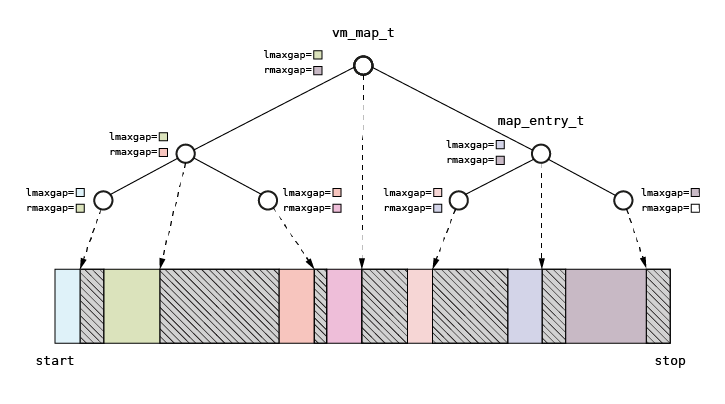

# Memory mapper

After memory pages are allocated, they must be mapped into the process or kernel address space so that the memory can be used by the kernel or user processes. A memory mapper is a part of memory management system which is responsible for this process and manages the available address space.

In non-MMU architectures, the kernel and user processes share the same address space. In architectures with a paged memory, address spaces are separated but the kernel is mapped into each of them. The kernel mapping is shared among the processes, using specific features of virtual-to-physical address resolution. To illustrate, the IA32 architecture’s MMU uses two-level page tables: after the kernel is initialized, all kernel page tables are created on the second level and used by the first level page tables, created during process creation.

## Memory map

A memory map (`vm_map_t` structure) is the main structure used for describing the address space. Built using the red-black tree structure, the memory map stores entries (`map_entry_t`) which describe the memory segments. The memory map belongs both to the kernel and processes. In non-MMU architectures, the kernel and processes share the same memory map. In MMU architectures, each process has its own separate memory map defining the user mappings. The kernel uses a separate memory map which describes the parts of the address space which belong to the kernel.

The map definition and its entry is presented below.

```c
    typedef struct _vm_map_t {
        pmap_t pmap;
        void *start;
        void *stop;
        rbtree_t tree;
    } vm_map_t;
```

The `start`, `stop` attributes define the beginning and ending of the address space described by the map. The `pmap` attribute defines the `pmap` structure encapsulating the hardware-dependent structures used by the MMU for address resolution. The tree attribute stores the red-black tree of map entries.

```c
    typedef struct _map_entry_t {
        rbnode_t linkage;
        struct _map_entry_t *next;
        struct _map_arena_t *arena;

        void *vaddr;
        size_t size;
        size_t lmaxgap;
        size_t rmaxgap;

        unsigned int flags;
        vm_object_t *object;
        vm_map_t *map;
        offs_t offs;
    } map_entry_t;
```

Each `map_entry_t` constitutes a tree node (the `linkage` field) and the tree is constructed on the basis of the virtual address value (`vaddr`). The virtual address points to the segment address. It is complemented by the segment size, segment attributes and two special attributes: `rmaxgap` and `lmaxgap`, which store the size of the maximum gap between the segments in the left or right subtree of the current node. The segment attributes are defined by the `flags` field. The `object` field points to the object mapped into the address space. The `NULL` value of this field contains the information that mapping is anonymous (no object is mapped). The offset (`offs`) defines the in-object location of the data which should be copied into the memory.

### Understanding the map tree representation

The figure below briefly presents the idea behind describing the address space with a memory map based on a binary tree.



The sample tree presented in the figure above will help you better understand the map structure. The root node points to the segment located approximately in the middle of the address space described by the map (the address range is defined by the `start`, `stop` attributes). The maximum gap in the left subtree is the gap marked with green color. The maximum gap in the right subtree is the gap marked with dark purple. The left child of the root node points to the segment in the middle of the left (lower) half of the address space. The right child of the root node points to the segment located in the middle of the right (upper) half of the address space. In the right subtree, where the right child of the map root node constitutes the root node, the maximum left gap is marked with dark blue. The maximum right gap for this subtree is marked with dark purple. A similar analysis may be performed for the other parts of the tree.

## Mapping algorithm

Page mapping is performed using the `_map_find()` function. The function tries to find the first suitable address for the mapping which is greater than the address specified as the argument and closest to it. The right maximum gap and the left maximum gap attributes are used for this operation so as to achieve a logarithmic algorithm complexity. The other argument provided for this function is a page set, obtained during page allocation. The function returns the nearest left and right neighbor entries. The returned entries are used to check whether the mapping is performed for the same object as the left and right neighbors. If the left or right neighbor attributes are the same as the required mapping attributes, and the mapping is performed for the same object as the left or right neighbors, the left or right entry is expanded respectively and no new entry is inserted into the tree.

The mapping algorithm is presented below. Due to its complexity, it will be discussed step by step: a fragment of the code is followed by an explanation of each step.

```c
    void *_map_find(vm_map_t *map, void *vaddr, size_t size, map_entry_t **prev, map_entry_t **next)
    {
        map_entry_t *e = lib_treeof(map_entry_t, linkage, map->tree.root);

        *prev = NULL;
        *next = NULL;
```

The first entry is assigned to the root entry of the map. The pointers for neighbors are nulled.

```c
        if (map->stop - size < vaddr)
            return NULL;
        if (vaddr < map->start)
            vaddr = map->start;
```

The address of the mapping is checked according to the map range.

```c
        while (e != NULL) {

            if ((size <= e->lmaxgap) && ((vaddr + size) <= e->vaddr)) {
                *next = e;

                if (e->linkage.left == &nil)
                    return max(vaddr, e->vaddr - e->lmaxgap);
                e = lib_treeof(map_entry_t, linkage, e->linkage.left);
                continue;
            }
```

The mapping address and sizes are compared with the left child of the node. If the address is less than the address of the current node and there is a space for the mapping, the left child is selected for the next iteration.

```c
            if (size <= e->rmaxgap) {
                *prev = e;

                if (e->linkage.right == &nil)
                    return max(vaddr, e->vaddr + e->size);

                e = lib_treeof(map_entry_t, linkage, e->linkage.right);
                continue;
            }
```

If the mapping address is not less than the address of the current node, the tree is traversed using the right child.

```c
            for (;; e = lib_treeof(map_entry_t, linkage, e->linkage.parent)) {
                if (e->linkage.parent == &nil)
                    return NULL;

                if ((e == lib_treeof(map_entry_t, linkage, e->linkage.parent->left)) &&
                    ((lib_treeof(map_entry_t, linkage, e->linkage.parent)->rmaxgap >= size)))
                    break;
            }
            e = lib_treeof(map_entry_t, linkage, e->linkage.parent);
```

If we get lost in the tree (the mapping address should be decreased to fulfill the size requirement), the tree is traversed up until the right child with a proper maximum gap is found.

```c
            for (*next = e; (*next)->linkage.parent != &nil;
                *next = lib_treeof(map_entry_t, linkage, (*next)->linkage.parent))

                if ((*next) == lib_treeof(map_entry_t, linkage, (*next)->linkage.parent->left))
                    break;
            *next = lib_treeof(map_entry_t, linkage, (*next)->linkage.parent);
```

When we find a new node from which we should move to the right, the right neighbor is established. The tree is traversed starting from the parent of the new node until the node representing the right becomes the left child. In this case, the right neighbor is the parent of this node.

```c
            *prev = e;
```

The left neighbor points to the new node.

```c
            if (e->linkage.right == &nil)
                return e->vaddr + e->size;

            e = lib_treeof(map_entry_t, linkage, e->linkage.right);
```

The tree is traversed to the right, starting from the new node. If the new node does not have the right child, the mapping is performed after the new node.

```c
        }

        return vaddr;
    }
```

## Map entry allocator

There is a dependency problem with memory mappings.

```c
    typedef struct _map_arena_t {
        struct _map_arena_t *next;
        struct _map_arena_t *prev;
        page_t *page;

        unsigned int nall;
        unsigned int nfree;
        map_entry_t *free;
        map_entry_t entries[];
    } map_arena_t;
```

## Object mapping function

It is not possible to map pages directly into the process address space on the user level. Instead, there is mechanism for mapping objects which is based on page mapping. See the next sections for a description of objects and related mechanisms.

The `vm_mmap()` function  maps object into the address space starting from address specified as function argument. Other function arguments define the size of the mapping, the attributes of the finally created memory segment, the object handle and flags determining the function behavior. If fixed mapping is specified in the flags argument mapping tries to map object at specified address. If address range of requested mapping overlaps with existing mapping the function will fail.

### Memory regions

A NUMA machine has different memory controllers with different distances to specific CPUs. 

## See also

1. [Kernel - Memory management](README.md)
2. [Kernel - Memory management - Page allocator](page.md)
3. [Kernel - Memory management - Zone allocator](zalloc.md)
4. [Kernel - Memory management - Fine grained allocator](kmalloc.md)
5. [Kernel - Memory management - Memory objects](objects.md)
6. [Table of Contents](../../README.md)
