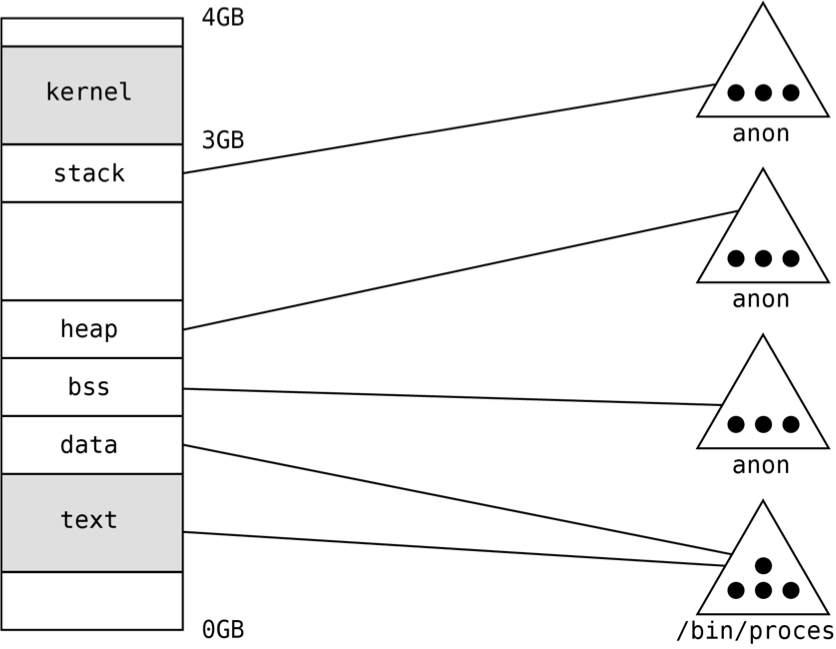
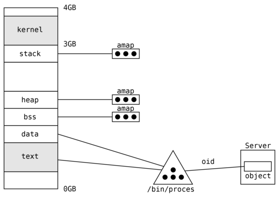
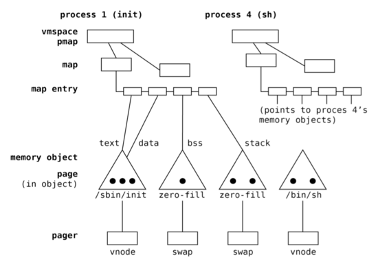
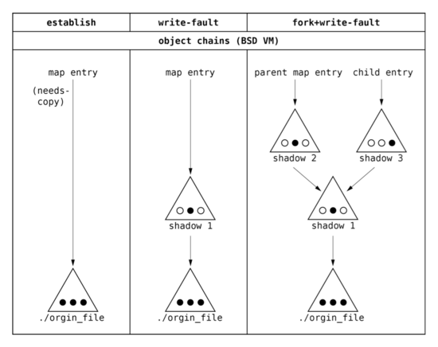
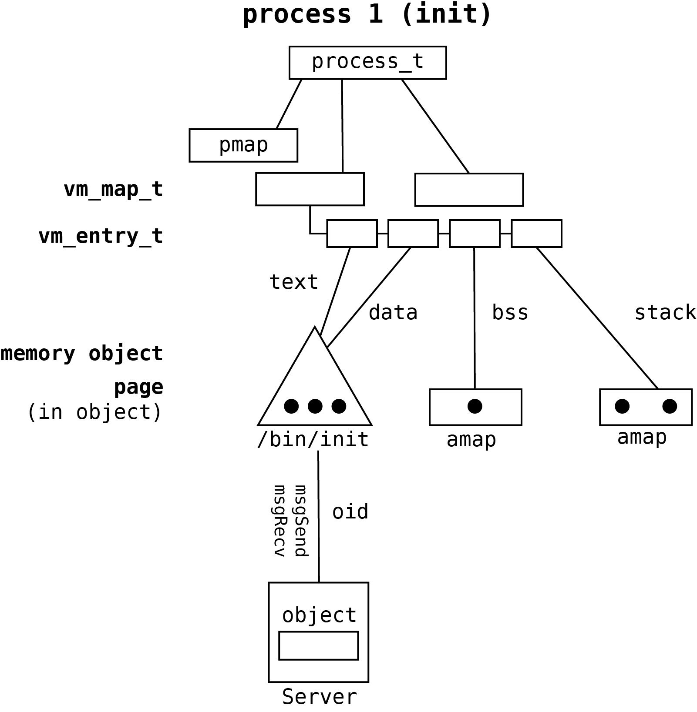

# Memory objects

Memory objects were introduced to share the physical memory between processes allowing to identify the sets of
allocated memory pages or segments of physical memory on non-MMU architectures. When process maps object into its memory
space kernel allocates physical memory for the object's data and copies it from the backing storage (e.g. filesystem).
When other process maps the same object into its address space most of the already allocated memory for the object
purposes can be shared. Only the memory for local in-process modifications should be allocated. The technique used for
allocating the memory for the purposes of in-process object modifications when the write access is performed is known as
copy-on-write. It is based on some features of MMU or segment management unit

Memory objects are used to optimize memory usage. They are also used as the basis for shared libraries. The shared
libraries are the libraries loaded during the process execution. They are loaded using object mapping technique, which
results that only one library code instance exists in memory. Library data segments are allocated using copy-on-write
technique. To use the shared library in the process context dynamic linking should be performed.

Memory objects were introduced in Mach operating system. They were quickly derived from it and implemented in UN*X BSD
and other operating systems. The Mach and BSD implementations were not optimal because of the way of implementation of
copy-on-write strategy when processes are forked. This problem was solved by BSD UVM memory management subsystem by
introducing the anonymous mapping abstraction.

This chapter briefly presents memory objects idea and the memory objects architecture supported by Phoenix-RTOS
microkernel.

## Understanding the process address space

Process’s address space is constituted by set of mapped objects. In traditional operating system memory objects
correspond with files or devices (and are identified by `vnode`, `inode` etc.) or with anonymous objects representing
the dynamically allocated physical memory. There are two strategies for retrieving object data into the process memory –
immediate retrieval strategy when object is mapped (e.g. during process start) and lazy on-demand retrieval strategy
when virtual page is first-time accessed during the runtime.

The process address space in the traditional operating system (e.g. BSD) is graphically presented on following picture.
Black circles represent pages allocated for the object purposes, holding the object data.

The first memory segment is constituted by the data from `/bin/process` file. It is mapped as the text, so it means that
it is marked as readable and executable.

The segment located right after the `text` segment is linked with data from the same file, but it’s marked as data
(readable and writable). The following segment is `bss` holding the uninitialized process data. This segment is
associated with anonymous object. The anonymous object is the special object allocated by memory management subsystem
for storing the process data created during the process load or the process execution.  The `bss` segment is marked as
readable and writable. At the end of user address space exist the last data segment named as `stack`. This is the
process stack (stack used by the main thread). As well as `bss` and `heap` segments it is connected with anonymous
object. After the stack kernel segments are mapped. These segments are inaccessible when the thread runs on the
user-level. When control is transferred explicitly to the kernel via the system call or implicitly via interrupt,
the executed program is able to access this memory. The described mechanism of separation of the kernel from user memory
is the basic mechanism constituting the operating system's security and reliability and preventing interference between
the operating system and processes.

The process address space in Phoenix-RTOS is presented on the following figure.

In Phoenix-RTOS objects are supported by operating system servers and are referenced by `oid` identifiers. Each `oid`
consists of server communication port number and in-server object identifier. If object is accessed within the process
the memory management subsystem allocates the new page and asks the server identified by `oid` for the data. The data is
retrieved from the server by sending the proper messages and are stored in the allocated page and mapped into the
process at requested virtual address.

The main difference between the monolithic kernel approach and Phoenix-RTOS is that memory segments correspond to
objects identified by oids (port and in-server ID) handled by external servers, so operating system kernel is free of
file abstraction. This allows to maintain the small size of kernel and emulate many file sharing and inheritance
strategies on the user level (POSIX, Windows etc.) or event to create the final operating system lacking of filesystem
abstraction.

## Memory objects in Mach/BSD operating systems

To understand the memory objects idea let’s analyze the traditional approach implemented in Mach/BSD operating systems.
The structure of Mach/BSD memory subsystem in the process context is presented on the following figure.

The process virtual address space is described by `vmspace` structure holding the list of memory maps
(user and kernel map). Each map stores entries defining the segment addresses, attributes and linked with
particular memory objects.

The additional important structure defined within the process is `pmap`. It is defined in HAL layer and holds all
hardware dependent data used for virtual address translation (e.g. pointers to page directories, tables, address
space identifier ASID etc.).

Each object stores physical pages allocated to preserve object data in physical memory (black circles). As it was
mentioned before object are identified by vnodes (filesystem pointers) or can exist only in the memory management
subsystem as anonymous objects.

Each memory object on the system has a pager that points to a list of functions used by the object to fetch and store
pages between physical memory and backing store. Pages are read in from backing store when a process requires them
(immediately or in case of page fault when lazy on-demand strategy is in use). Pages are written out to backing store
at the request of a program (e.g., via the `msync` system call), when physical memory is scarce when process is swapped
out, or when the object that owns the pages is freed.

### Shadow objects used for copy-on-write (BSD VM)

The BSD VM system manages copy-on-write mappings of memory objects by using shadow objects. A shadow object is an
anonymous memory object that contains the modified pages of a copy-on-write mapped memory object. The map entry mapping
a copy-on-write area of memory points to the shadow object allocated for it. Shadow objects point to the object they are
shadowing. When searching for pages in a copy-on-write mapping, the shadow object pointed to by the map entry is
searched first. If the desired page is not present in the shadow object, then the underlying object is searched. The
underlying object may either be a file object or another shadow object. The search continues until the desired page is
found, or there are no more underlying objects. The list of objects that connect a copy-on-write map entry to the
bottom-most object is called a shadow object chain.

The following figure shows how shadow object chains are formed in BSD VM.

A three-page file object is copy-on-write memory mapped into a process’s address space. The first column shows the first
step of memory mappings. The new entry with the needs-copy and copy-on-write flags is allocated. It points to the
underlying object. Once a writ fault occurs, a new memory object is created and that object tracks all the pages that
have been copied and modified.

The second column shows what happens when the process writes to the middle page of the object. Since the middle page is
either unmapped or mapped read-only, writing to it triggers a page fault. The fault routine looks up the appropriate map
entry and notes that it is a needs-copy copy-on-write mapping. It first clears needs-copy by allocating a shadow object
and inserting it between the map entry and the underlying object. Then it copies the data from the middle page of the
backing object into a new page that is inserted into the shadow object. The shadow object’s page can then be mapped
read-write into the faulting process’ address space.

The third column shows the BSD VM data structures after the process with the copy-on-write mapping forks a child, the
parent writes to the middle page, and the child writes to the right-hand page. When the parent forks, the child receives
a copy-on-write copy of the parent’s mapping. This is done by writing protecting the parent’s mappings and setting
needs-copy in both processes. When the parent faults on the middle page, a second shadow object is allocated for it and
inserted on top of the first shadow object. When the child faults on the right-hand page the same thing happens,
resulting in the allocation of a third shadow object.

Shadow objects are very problematic In terms of operating system efficiency and resource management.

Presented copy-on-write mechanism can leak memory by allowing pages that are no longer accessible to remain within an
object chain. In the example, the remaining shadow object chain contains three copies of the middle page, but only two
are accessible. The page in the first shadow object is no longer accessible and should be freed to prevent the memory
leak. BSD VM attempts to collapse a shadow object chain when it is possible (e.g. when new shadow object is created),
but searching for objects that can be collapsed is a complex process.

In BSD VM, a copy-on-write map entry points to a chain of shadow objects. There is no limit on the number of objects
that can reside in a single shadow object chain and creating the shadow object or copying the page demands the
inefficient looping over many shadow objects.

### Anonymous memory mapping (BSD UVM)

To solve problems with shadow objects chaining the anonymous mapping was introduced (Sun OS VM system). It based on two
abstractions - anon and amap.

Anon is the structure representing page of anonymous memory. It is created when copy-on-write flags of map entry are set
and process writes data to memory. Amap the structure created for particular map entry when needs-copy for the entry is
set. Amap stores anons created for the map entry.

When process is forked the memory space of child process is created based on memory space of parent process.
All memory segments (map entries) of parent and child processes are marked as read-only and needs-copy flag is set.
Amaps are initially shared between segments (map entries) of child and parent process, but the number of references to
each shared amap is set to minimum two. The writable pages belonging to shared entries are mapped in MMU as read only.
When one of the processes accesses the segment of memory with needs-copy flag the new amap is created and anons are
copied from the original amap. The number of references of each copied anon is incremented and is set to minimum two.
The needs-copy flag of map entry is cleared and new anon based on anon from the original amap is created (data is copied
from page pointed by original anon to page from the new anon). The number of original anon references is decremented
and if number of references is equal to one it can be mapped as writable to the memory space of another process.

The memory sharing technique based on shadowing of particular pages instead of whole objects eliminates the problem of
long chains of shadow objects existing in BSD VM.

## Memory objects in Phoenix-RTOS

Phoenix-RTOS derives the memory object architecture from BSD UVM. The structure of its memory management subsystem in
the process context is presented on the following figure.

There are three main differences between UVM and Phoenix-RTOS memory objects. Objects are identified by oid_t and
handled by external servers and data is fetched and stored using message passing. Processes are not swappable, so there
is no swap server for anonymous objects. Memory objects are supported as well on non-MMU architectures, but
functionality is simplified.
