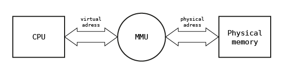
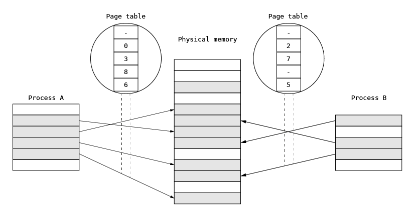
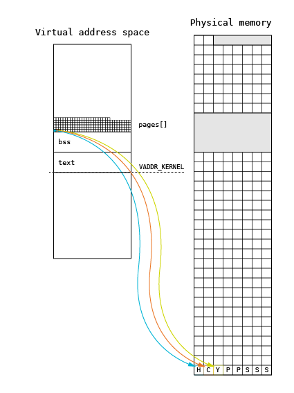
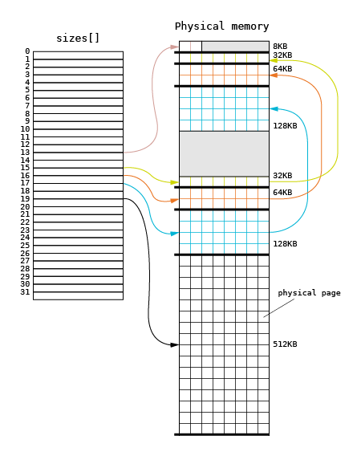
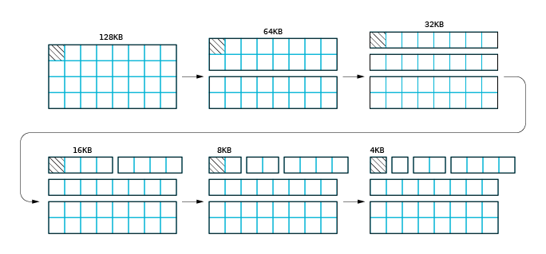

# Paging technique and Memory Management Unit

Processors equipped with MMU are typically used in servers, personal computers and mobile devices such as tablets and
smartphones. In this architecture, the linear addresses used by executed program are translated to physical memory
addresses using MMU associated with the processor core. This translation is performed with a defined granulation and
the piece of the linear address space used for translation to physical address is called a memory page. Typically, the
page size used in modern systems varies from 4 KB to gigabytes, but in the past, e.g. on the PDP-10, VAX-11
architectures, it was much smaller (512 or 1 KB).

MMU holds set of associations between linear and physical addresses defined for the process currently executed on the
core. When process context is switched associations specific for the process are flushed from MMU and changed with
associations defined for the new process chosen for execution. The structure used for defining this association is
commonly and incorrectly called page table and stored in physical memory. On many architectures associations used for
defining the linear address space are automatically downloaded to MMU when linear address is reached for the first time
and association is not present in MMU. This task is performed by a part of MMU called Hardware Page Walker. On some
architectures with simple MMU (e.g. eSI-RISC) the operating system defines associations by controlling MMU directly
using its registers. In this case page table structure depends on software. The role of the MMU in memory address
translation is illustrated in the figure below.



In further consideration, the linear address space defined using paging technique will be named synonymously as the
virtual address space.

## Initial concept of paging technique

The concept of paging was first introduced in the late 1960s in order to organize the program memory overlaying for
hierarchical memory systems consisting of transistor-based memory, core memory, magnetic disks and tapes. Historically,
the virtual address space size was comparable to the physical memory size. The page table was used to point to the data
location in the hierarchical memory system and to associate the physical memory location, called a page frame, with the
virtual page. When the program accessed the virtual page, processor checked whether the page was present in the physical
memory via the presence bit in the page table. If the page was not present in the physical memory, the program execution
was interrupted and the page was loaded by the operating system into the physical memory via additional bits defining
the data location in the page table. Once the presence bit was successfully loaded and set, the program execution was
resumed. The original paging technique is presented below.


## Current use of paging technique

Over the years, paging has morphed into a technique used for defining the process memory space and for process
separation. In general-purpose operating systems, paging is fundamental for memory management. Each process runs in its
own virtual memory space and uses all address ranges for its needs. The address space is defined by a set of
virtual-to-physical address associations for the MMU defined in the physical memory and stored in a structure that is
much more complicated than a page table used in early computers. This is necessary in order to optimize memory
consumption and speed up the virtual-to-physical memory translations. When a process is executed on a selected
processor, the address space is switched to its virtual space, which prevents it from interfering with other processes.
The address space is switched by providing the MMU with new sets of virtual-to-physical associations. In this scheme,
some physical pages (for example parts of the program text) can be shared among processes by mapping them simultaneously
into two or more processes to minimize the overall memory usage.



A memory management system that relies on paging describes the whole physical memory using physical pages.

## Page allocator

The page allocator constitutes the basic layer of the memory management subsystem in MMU architectures. It is
responsible for allocating the physical memory pages (page frames). In non-MMU architectures, the page allocator
allocates only fake `page_t` structures used by upper layers and plays a marginal role in memory management. This
section focuses on the role of a page allocator in MMU architectures.

### Page array

The available physical memory is treated as a set of physical pages (page frames). Each physical page available is
described using the `page_t` structure. The structure is defined in the HAL, but upper layers assume that some
attributes are defined. The minimum set of attributes is as follows.

````C
    typedef struct _page_t {
        addr_t addr;
        u8 idx;
        u8 flags;
        struct _page_t *next;
        struct _page_t *prev;
    } page_t;
````

The `addr` attribute stores the physical page address, the `flags` describe page attributes (see further sections). The
`next` and `prev` pointers and `idx` are used in the page allocation algorithm to construct lists of free pages.

When the memory management subsystem is initialized, the `_page_init()` function creates an array of `page_t` structures
(`pages[]`) using the `pmap_getPage()` call from the HAL subsystem. This call is used to discover the page frames by
upper (hardware-independent) layers of the memory management subsystem. The page array is located at the beginning of
the kernel heap, right after the kernel BSS segment.



The memory for the structure is allocated using a heap extension. This extension is performed by using the
`_page_sbrk()` function, which allocates a new page from the pool using the `_page_alloc()`function and maps it into the
kernel address space directly with `pmap_enter()` at the top of the heap. Pages are allocated using a regular allocation
algorithm, but data structures used for allocation are not fully initialized. The array creation algorithm is presented
below.

```c
    for (page = (page_t *)*bss;;) {
      if ((void *)page + sizeof(page_t) >= (*top))
        _page_sbrk(pmap, bss, top);

      if ((err = pmap_getPage(page, &addr)) == -ENOMEM)
        break;

      if (err == EOK) {

        if (page->flags & PAGE_FREE) {
          page->idx = hal_cpuGetFirstBit(SIZE_PAGE);
          _page_add(&pages.sizes[page->idx], page);
          pages.freesz += SIZE_PAGE;
        }

        else {
          pages.allocsz += SIZE_PAGE;
          if (((page->flags >> 1) & 7) == PAGE_OWNER_BOOT)
            pages.bootsz += SIZE_PAGE;
        }
        page = page + 1;
      }

      /* Wrap over 0 */
      if (addr < SIZE_PAGE)
        break;
    }
```

The initialization loop in each iteration discovers a new physical page using the `pmap_getPage()`. The function fills
the newly allocated `page_t` structure and returns the next valid physical address in the `addr` argument. The returned
page is flagged as either free or allocated using the `flags` attribute. The next two upper bits of this attribute
define the page ownership: a page can belong to the kernel, application or bootloader (memory reserved by BIOS on a PC
is marked in this way). The next upper bits define the page usage in the specific domain defined by ownership. For
example, pages marked as allocated by the kernel may be allocated for specific purposes (stack, heap, interrupt table,
page table etc.).

### Presentation of page array during the boot process

During the kernel boot process, the `page[]` is presented on the screen using letters and periods. The letter
interpretation will be presented using a sample map for a PC with 128 MB of RAM.

``` asm
vm: HCYPPSSS[24H][22K][103H]..B[80x][16B][32509.]BBB[101574x][64B] 
```

In this map, the first physical page is allocated to the kernel heap. The second page is used for CPU purposes
(interrupt and exception table). The `Y`-marked page stores the `syspage_t` structure used for communication between
the loader and the starting kernel. After this page, there are two pages used for storing structures used for paging
(page directory and page table marked with `P`). The next pages are allocated for the initial kernel stack. They will
be released after starting the init process, switching into its main thread stack. The next characters
(in square parentheses) contain the information that next 24 pages are allocated to the kernel heap. The next
22 pages store the kernel code and data. These are followed by 103 pages allocated to the kernel heap and two
free pages (marked with periods). The `B` character informs that next pages are used by the bootloader (BIOS).
This page is followed by a gap (i.e. the gap after the 640 KB of address space). After the gap, there are 16
pages allocated to BIOS and 32509 free pages. At the end of the address space, there are 64 pages reserved by BIOS.

| Letter | Page Type                                  | Description                            |
| :----: | ------------------------------------------ | -------------------------------------- |
|   .    | `PAGE_FREE`                                | Free page                              |
|   x    | `Memory gap`                               | Memory gap                             |
|   B    | `PAGE_OWNER_BOOT`                          | Reserved by Bootloader / BIOS          |
|   A    | `PAGE_OWNER_APP`                           | Used by application                    |
|   K    | `PAGE_OWNER_KERNEL`                        | Used by kernel for unspecified reasons |
|   Y    | `PAGE_OWNER_KERNEL \| PAGE_KERNEL_SYSPAGE` | Used by `syspage_t`                    |
|   C    | `PAGE_OWNER_KERNEL \| PAGE_KERNEL_CPU`     | Reserved for CPU specific purposes     |
|   P    | `PAGE_OWNER_KERNEL \| PAGE_KERNEL_PTABLE`  | Used for paging                        |
|   S    | `PAGE_OWNER_KERNEL \| PAGE_KERNEL_STACK`   | Used as kernel stack                   |
|   H    | `PAGE_OWNER_KERNEL \| PAGE_KERNEL_HEAP`    | Used as kernel heap                    |
|   U    | `UNDEFINED`                                | Undefined                              |

## Page allocation

The page allocator in the Phoenix-RTOS kernel is based on a well-known buddy algorithm. The figure below shows a
graphical illustration of data structures used in this algorithm.



Each square corresponds to a physical page, with the assumed page size of 4096 bytes. The main structure used in
the allocation is the `sizes[]` array. The `size[]` array is created on the basis of the `page[]` array during
the memory management initialization.

The `size[]` array contains pointers to lists of physically coherent sets of pages. The n-th entry of `sizes[]`
array points to the list of sets whose size is the n-th power of 2. For example, an entry with the 0 index points
to page sets whose size is 1 byte. An entry with the 12 index points to sets containing 4096 bytes of physical memory.

The initialization algorithm divides all accessible physical space into regions of maximum size. This means that during
the allocation process a region should be divided into smaller regions and the obtained free regions should be
added to the proper lists pointed by the `size[]` array.

### Sample allocation

Let us have a look at an allocation process where only one region of 128 KB in size is available, and 4096 bytes
should be allocated. The allocation starts with the lookup of the first region. The starting entry of `size[]`
array is calculated on the basis of the requested size (4096 bytes). In this case, the starting entry will be 12,
and no list is available in this entry. The lookup is performed for the next entry and finally the 128 KB region
list is found (entry 17). When the first not-empty entry is found, the algorithm proceeds to the next step, which
is illustrated below.



The first page set is removed from the list and divided into two 64 KB regions. The upper 64 KB region is added to the
`size[16]` entry and then split. The first 64 KB region is split into two 32 KB regions. The upper 32 KB region is
returned to the `size[15]` entry. Next, the first half of the region is divided into two 16 KB regions, and finally,
only one page is available. This page is returned as an allocation result. The complexity of this allocation is
<!-- markdownlint-disable -->
O(log<sub>2</sub>N). The maximum number of steps that should be performed is the size of `size[]` array minus
the log<sub>2</sub>(page size). The maximum cost of page allocation on a 32-bit address space is 20 steps.
<!-- markdownlint-enable -->

## Page deallocation

Page deallocation is defined as the process opposite to the page allocation process.

### Sample deallocation

Let us assume that the page allocated in the previous section must be released. The first step is to analyze the
neighborhood of the page based on the `pages[]` array. The array is sorted, and it is assumed that the
next page for the released `page_t` is the `page_t` structure, describing the physical page located right
after the released page or the page located on higher physical addresses. If the next `page_t` structure describes
the neighboring page, and if it is marked as free, the merging process is performed. The next page is removed from
the `sizes[]` array and merged with the page which should be released. If the region created in this way is located
right before the free region of the same size, the merging process is repeated. The next steps are repeated forming
larger regions until there are no free neighboring regions.


## Page allocation for non-MMU architectures

In non-MMU architectures, the page_t structure is only allocated as needed by upper layers (i.e. a memory mapper).
It does not correspond to a real memory segment. During the kernel initialization, a pool of page_t structures is
created, assuming a given page size. The number of `page_t` entries is proportional to the size of physical memory.

```c
    void _page_init(pmap_t *pmap, void **bss, void **top)
    {
        page_t *p;
        unsigned int i;
        pages.freesz = VADDR_MAX - (unsigned int)(*bss);
        ..
        /* Prepare allocation queue */
        for (p = pages.freeq, i = 0; i < pages.freeqsz; i++) {
                p->next = p + 1;
                p = p->next;
        }
        (pages.freeq + pages.freeqsz - 1)->next = NULL;
        ..
    }
```

The assumed page size depends on the architecture and the available memory size. For microcontrollers with small memory
sizes, the page size is typically 256 bytes.

Page allocation is quite simple. It just retrieves the first `page_t` entry from the pool. In the deallocation process,
a `page_t` is returned to the pool. It must be noted that the real memory allocation is performed during the memory
mapping process. All processes and the kernel use the same, common memory map which stores all segments existing in
the physical memory.
