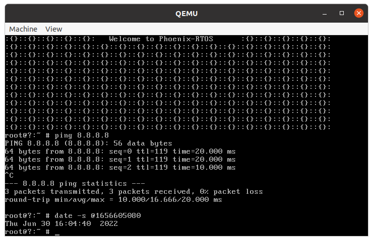
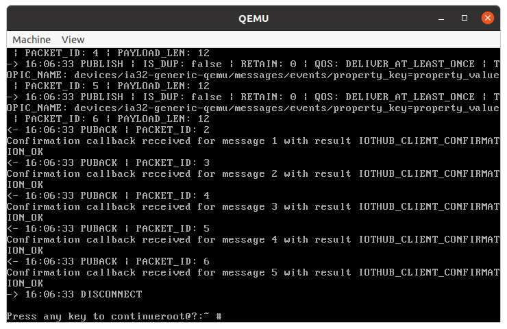

# Azure IoT C SDK Port

## General information

There are stored adaptations needed to run `azure-iot-sdk-c` on Phoenix-RTOS.

Azure IoT C Software Development Kit provides the interface to communicate easily with Azure IoT Hub, Azure IoT Central,
and Azure IoT Device Provisioning. It's intended for apps written in C99 (or newer) or C++. For more information
please visit the [Azure IoT C SDK GitHub](https://github.com/Azure/azure-iot-sdk-c).

## Supported version

The supported version is [LTS_01_2022](https://github.com/Azure/azure-iot-sdk-c/tree/LTS_01_2022_Ref01).

## Quickstart for ia32-generic-qemu

This simple guide is recommended for getting familiar with using `azure_sdk` on Phoenix-RTOS. You will need to have a
`hub` created in [Azure IoT Hub](https://azure.microsoft.com/en-us/services/iot-hub/#overview) and a device within it.
Each device has its connection string, which will be needed in the following instructions.

First, please build the project with the `ports` component and set `AZURE_CONNECTION_STRING` (see below):

```shell
TARGET=ia32-generic-qemu AZURE_CONNECTION_STRING="HostName=test-hub.azure-devices.net;DeviceId=ia32-generic-qemu;SharedAccessKey=xxxxxxxxx=" ./phoenix-rtos-build/build.sh clean all
```

- Note: The connection string above is only an example, please use your own.

- Note: You do not need all the ports provided for the `ia32-generic-qemu` target architecture. The necessary ports
are: `busybox`, `openssl`, `curl` and `azure_sdk`.
[Here](https://github.com/phoenix-rtos/phoenix-rtos-doc/blob/master/building/script.md) you can find more about
building scripts.

Next, you will need an internet connection. You can take a look at how this is established
in the `ia32-generic-qemu` [quickstart guide](../quickstart/ia32-generic-qemu.md).

Note: you can check the internet connection using the `ping` applet.

To complete the configuration please set the current date using `date` applet, like below:



Note: The required argument entered after `@` is EPOCH (POSIX time format) - you can get it for example from
[here](https://www.epochconverter.com/).

## Running the IoThub Client sample

Providing that internet connection is working, and the current date is set, you can run `iothub_ll_telemetry_sample`:

```shell
/bin/iothub_ll_telemetry_sample
```



- Note: The entered connection string was added to the sample's source code. You can find it in
`_build/ia32-generic-qemu/azure_sdk/azure-iot-sdk-c-lts_01_2022/iothub_client/samples/iothub_ll_telemetry_sample/iothub_ll_telemetry_sample.c`.

You can read messages received from Azure, for example using `AzureIotHub VS Code Extension` by clicking
`Start Monitoring Built-in Event Endpoint`:

```shell
[IoTHubMonitor] [6:07:21 PM] Message received from [ia32-generic-qemu]:
"test_message"
[IoTHubMonitor] [6:07:21 PM] Message received from [ia32-generic-qemu]:
"test_message"
[IoTHubMonitor] [6:07:21 PM] Message received from [ia32-generic-qemu]:
"test_message"
[IoTHubMonitor] [6:07:21 PM] Message received from [ia32-generic-qemu]:
"test_message"
[IoTHubMonitor] [6:07:21 PM] Message received from [ia32-generic-qemu]:
"test_message"
```

## Using azure-iot-sdk-c

The above guide shows how to run only one of the provided samples. To write your own programs using the SDK please read
the following instructions. It may be helpful for other architectures, like `armv7m7-imxrt106x-evk`, where the
previously generated sample may not work. That's the reason, why the following example is adjusted to the configuration
with `mbedtls` intended for 'smaller' targets (now only the `imxrt106x` is supported). If you want to write your own
programs intended for the `openssl` configuration ('larger' targets, like `ia32-generic-qemu`) there will be a few
differences, e.g. there is no need for setting the certificate in code and increasing the stack size in Makefile.

To use functions provided by `azure-iot-sdk-c` please append specific `azure` libraries (and possibly `mbedtls`
libraries) to `LIBS` variable in `Makefile` and include the required header file. Below is an example of a simple
program similar to `iothub_client_ll_telemetry_sample`. You can place it for example in the `_user` directory:

- Note: The SDK was tested for the `armv7m7-imxrt106x` target architecture with the `mbedtls` port, but remember
that internet connection and the current date also have to be provided.

- Makefile - linking with Azure SDK and mbedtls libraries.

  ```makefile
  NAME := sample
  LOCAL_SRCS := main.c
  LIBS := libiothub_client libiothub_client_mqtt_transport libumqtt \
          libaziotsharedutil libmbedtls libmbedx509 libmbedcrypto
  LDFLAGS += -z stack-size=12288

  include $(binary.mk)
  ```

- Source code:

  ```c
  #include "iothub.h"
  #include "iothub_device_client_ll.h"
  #include "iothub_client_options.h"
  #include "iothub_message.h"
  #include "iothubtransportmqtt.h"
  #include "azure_c_shared_utility/threadapi.h"
  #include "azure_c_shared_utility/crt_abstractions.h"
  #include "azure_c_shared_utility/shared_util_options.h"


  /* Paste here your connection string from IotHub device */
  #define AZURE_CONNECTION_STRING "HostName=test-hub.azure-devices.net;DeviceId=ia32-generic-qemu;SharedAccessKey=xxxxxxxxx="


  static unsigned long msgConfirmations = 0;


  /* Baltimore public certificate */
  static const unsigned char cert[] = {
      "-----BEGIN CERTIFICATE-----\r\n"
      "MIIDdzCCAl+gAwIBAgIEAgAAuTANBgkqhkiG9w0BAQUFADBaMQswCQYDVQQGEwJJ\r\n"
      "RTESMBAGA1UEChMJQmFsdGltb3JlMRMwEQYDVQQLEwpDeWJlclRydXN0MSIwIAYD\r\n"
      "VQQDExlCYWx0aW1vcmUgQ3liZXJUcnVzdCBSb290MB4XDTAwMDUxMjE4NDYwMFoX\r\n"
      "DTI1MDUxMjIzNTkwMFowWjELMAkGA1UEBhMCSUUxEjAQBgNVBAoTCUJhbHRpbW9y\r\n"
      "ZTETMBEGA1UECxMKQ3liZXJUcnVzdDEiMCAGA1UEAxMZQmFsdGltb3JlIEN5YmVy\r\n"
      "VHJ1c3QgUm9vdDCCASIwDQYJKoZIhvcNAQEBBQADggEPADCCAQoCggEBAKMEuyKr\r\n"
      "mD1X6CZymrV51Cni4eiVgLGw41uOKymaZN+hXe2wCQVt2yguzmKiYv60iNoS6zjr\r\n"
      "IZ3AQSsBUnuId9Mcj8e6uYi1agnnc+gRQKfRzMpijS3ljwumUNKoUMMo6vWrJYeK\r\n"
      "mpYcqWe4PwzV9/lSEy/CG9VwcPCPwBLKBsua4dnKM3p31vjsufFoREJIE9LAwqSu\r\n"
      "XmD+tqYF/LTdB1kC1FkYmGP1pWPgkAx9XbIGevOF6uvUA65ehD5f/xXtabz5OTZy\r\n"
      "dc93Uk3zyZAsuT3lySNTPx8kmCFcB5kpvcY67Oduhjprl3RjM71oGDHweI12v/ye\r\n"
      "jl0qhqdNkNwnGjkCAwEAAaNFMEMwHQYDVR0OBBYEFOWdWTCCR1jMrPoIVDaGezq1\r\n"
      "BE3wMBIGA1UdEwEB/wQIMAYBAf8CAQMwDgYDVR0PAQH/BAQDAgEGMA0GCSqGSIb3\r\n"
      "DQEBBQUAA4IBAQCFDF2O5G9RaEIFoN27TyclhAO992T9Ldcw46QQF+vaKSm2eT92\r\n"
      "9hkTI7gQCvlYpNRhcL0EYWoSihfVCr3FvDB81ukMJY2GQE/szKN+OMY3EU/t3Wgx\r\n"
      "jkzSswF07r51XgdIGn9w/xZchMB5hbgF/X++ZRGjD8ACtPhSNzkE1akxehi/oCr0\r\n"
      "Epn3o0WC4zxe9Z2etciefC7IpJ5OCBRLbf1wbWsaY71k5h+3zvDyny67G7fyUIhz\r\n"
      "ksLi4xaNmjICq44Y3ekQEe5+NauQrz4wlHrQMz2nZQ/1/I6eYs9HRCwBXbsdtTLS\r\n"
      "R9I4LtD+gdwyah617jzV/OeBHRnDJELqYzmp\r\n"
      "-----END CERTIFICATE-----\r\n"
      " "
  };


  static void azure_sendConfirmCallback(IOTHUB_CLIENT_CONFIRMATION_RESULT result, void *userContextCallback)
  {
      (void)userContextCallback;
      /* When a message is sent this callback will get invoked */
      msgConfirmations++;
      printf("Confirmation callback received for message %lu with result %s\r\n",
             (unsigned long)msgConfirmations,
             MU_ENUM_TO_STRING(IOTHUB_CLIENT_CONFIRMATION_RESULT,
             result));
  }


  static void azure_connectionStatusCallback(IOTHUB_CLIENT_CONNECTION_STATUS result,
                                             IOTHUB_CLIENT_CONNECTION_STATUS_REASON reason,
                                             void *user_context)
  {
      (void)reason;
      (void)user_context;
      /* It doesn't take into consideration network outages */
      if (result == IOTHUB_CLIENT_CONNECTION_AUTHENTICATED) {
          printf("The device client is connected to iothub\r\n");
      }
      else {
          printf("The device client has been disconnected\r\n");
      }
  }


  int azure_sendMsg(IOTHUB_DEVICE_CLIENT_LL_HANDLE *devhandle, const char *msg)
  {
      IOTHUB_MESSAGE_HANDLE msghandle;
      unsigned long messagesSent = 0;
      bool running = true;
      msgConfirmations = 0;
      do {
          if (messagesSent < 1) {
              msghandle = IoTHubMessage_CreateFromString(msg);
              IoTHubMessage_SetProperty(msghandle, "property_key", "property_value");
              printf("Sending the following message to IoTHub: %s\n", msg);
              IoTHubDeviceClient_LL_SendEventAsync(*devhandle, msghandle, azure_sendConfirmCallback, NULL);
              /* The message is copied to the sdk so the we can destroy it */
              IoTHubMessage_Destroy(msghandle);
              messagesSent++;
          }
          else if (msgConfirmations >= 1) {
              /* After all messages are all received stop running */
              running = false;
          }
          IoTHubDeviceClient_LL_DoWork(*devhandle);
          ThreadAPI_Sleep(1);
      } while (running);
      printf("The message sent properly\n");
      return 0;
  }


  int azure_open(const char *connectionString,
                 const unsigned char *cert,
                 IOTHUB_DEVICE_CLIENT_LL_HANDLE *devhandle)
  {
      IOTHUB_CLIENT_TRANSPORT_PROVIDER protocol;
      protocol = MQTT_Protocol;
      printf("Creating IoTHub Device handle\r\n");
      *devhandle = IoTHubDeviceClient_LL_CreateFromConnectionString(connectionString, protocol);
      if (*devhandle == NULL) {
          fprintf(stderr, "Failure creating IotHub device. Hint: Check your connection string.\n");
          return 1;
      }
      IoTHubDeviceClient_LL_SetOption(*devhandle, OPTION_TRUSTED_CERT, cert);
      bool urlEncodeOn = true;
      IoTHubDeviceClient_LL_SetOption(*devhandle, OPTION_AUTO_URL_ENCODE_DECODE, &urlEncodeOn);
      /* Setting connection status callback to get indication of connection to iothub */
      IoTHubDeviceClient_LL_SetConnectionStatusCallback(*devhandle, azure_connectionStatusCallback, NULL);
      return 0;
  }


  static void azure_close(IOTHUB_DEVICE_CLIENT_LL_HANDLE *devhandle)
  {
      IoTHubDeviceClient_LL_Destroy(*devhandle);
  }


  static void azure_deinit(void)
  {
      IoTHub_Deinit();
  }


  static void azure_init(void)
  {
      IoTHub_Init();
  }


  int main(void)
  {
      IOTHUB_DEVICE_CLIENT_LL_HANDLE devhandle;

      azure_init();
      azure_open(AZURE_CONNECTION_STRING, cert, &devhandle);

      azure_sendMsg(&devhandle, "test message");

      azure_close(&devhandle);
      azure_deinit();

      return 0;
  }
  ```

- Note: Please remember that `PORTS_AZURE_SDK` and environment variables for other required ports should be set to `y`
in the specific building script in `_projects` directory or using an environment variable.

### Running tests

To build `azure_sdk` tests please set `LONG_TEST=y` environment variable before calling `build.sh`.

In the result, unit tests for the `c-utility` component should be placed in the `/bin` directory.

The tests have `ut_exe` suffix, for example: `connectionstringparser_ut_exe`. You run it as follows:

```shell
/bin/connectionstringparser_ut_exe
```

## Known bugs

- None
