# Running system on <nobr>aarch64a53-zynqmp-zcu104</nobr>

These instructions describe how to run a Phoenix-RTOS system image for `aarch64a53-zynqmp-zcu104` target architecture.
The guide assumes that you have already built the system image and build artifacts are in the `_boot` directory.
If you haven't run the `build.sh` script yet, run it for `aarch64a53-zynqmp-zcu104` target.

See [how to build the Phoenix-RTOS system image](../building/index.md).

## Preparing the board

The first step of running Phoenix-RTOS is loading plo (Phoenix loader) into RAM. This can be done in two ways -
from the SD card or the on-board NOR flash. If you are flashing Phoenix-RTOS for the first time, or the image in
NOR flash is corrupt, you can load plo from the SD card. Using plo you can write the system image into NOR flash.
After this is done, you can run plo and then Phoenix-RTOS from NOR flash.

### Loading plo from SD card

1. Ensure the SD card is formatted using MBR scheme and the first partition is using FAT or FAT32 filesystem.

2. Copy the disk image `part_plo.img` from the `_boot/aarch64a53-zynqmp-zcu104` directory
to the FAT partition on the SD card and rename it to `BOOT.BIN` (case-insensitive).

3. Insert the SD card into the board.

4. Set boot mode to SD card. Set switches in the switch block `SW6` as follows:

    ```text
            ┌───────┐
            │  -->  │
    MODE0  =│1 --[] │=
    MODE1  =│2 []-- │=
    MODE2  =│3 []-- │=
    MODE3  =│4 []-- │=
            │       │
            └───────┘
    ```

    MODE pins[3:0]: 1110/0xE

    SW6 switch positions [4:1]: OFF,OFF,OFF,ON

### Loading plo from NOR flash

```{note}
If this is the first time you run Phoenix-RTOS on this board, use the SD card method to run plo first!
```

1. Set boot mode to QSPI32 flash. Set switches in the switch block `SW6` as follows:

    ```text
            ┌───────┐
            │  -->  │
    MODE0  =│1 --[] │=
    MODE1  =│2 []-- │=
    MODE2  =│3 --[] │=
    MODE3  =│4 --[] │=
            │       │
            └───────┘
    ```

    MODE pins[3:0]: 0010/0x2

    SW6 switch positions [4:1]: ON,ON,OFF,ON

### Loading plo - common steps

1. Plug in the dedicated power supply into the board using connector `J52`. For now leave the `SW1` switch
in the `OFF` position to turn off power to the board.

2. The board contains an FTDI FT4232HL chip that adapts JTAG and UART ports of the SoC into USB. Connect a
micro-USB cable from the host PC to connector `J164`.

3. Verify that the UART ports of FT4232HL are visible on host PC.
    - On Ubuntu:

      ```sh
      ls -l /dev/serial/by-id
      ```

      The result should be similar to:

      ```shell
      lrwxrwxrwx 1 root root 13 sty 31 11:48 usb-Xilinx_JTAG+3Serial_90805-if00-port0 -> ../../ttyUSB0
      lrwxrwxrwx 1 root root 13 sty 31 11:48 usb-Xilinx_JTAG+3Serial_90805-if01-port0 -> ../../ttyUSB1
      lrwxrwxrwx 1 root root 13 sty 31 11:48 usb-Xilinx_JTAG+3Serial_90805-if02-port0 -> ../../ttyUSB2
      lrwxrwxrwx 1 root root 13 sty 31 11:48 usb-Xilinx_JTAG+3Serial_90805-if03-port0 -> ../../ttyUSB3
      ```

      `ttyUSB1` is connected to `UART0` which is used for data transfer using `phoenixd`.

      `ttyUSB2` is connected to `UART1` which is used for serial console.

      `ttyUSB3` is connected to the FPGA part of the SoC, and it will not be used in this guide.

      `ttyUSB0` is not connected to UART but the corresponding port on FT4232HL is connected to JTAG. The device may
      disappear after connecting OpenOCD (described at the end of the guide).

4. Power up the board, changing the `SW1` position to `ON`. Two rows of green LEDs should turn on indicating
power rails - see "Power and Status LEDs" section of the ZCU104 Board User Guide (UG1267) for detailed descriptions.
    - If the `DS36` LED is turned on (red), the board is in reset. It should light up for a short time after turning on
    the board or pressing the `POR_B` button.

    - If the `DS35` LED is turned on (red), it indicates an error loading plo. Ensure that the boot mode is
    set correctly, and the boot image is written correctly to the chosen boot medium (SD card or NOR flash).

5. When the board is connected to your host PC, open serial port in terminal using picocom and type the console port
(in this case `ttyUSB2`)

    ```sh
    picocom -b 115200 --imap lfcrlf /dev/[port]
    ```

<details>

<summary>How to get picocom and run it without privileges (Ubuntu 22.04)</summary>

```sh
sudo apt-get update && \
sudo apt-get install picocom
```

To use picocom without sudo privileges run this command and then restart:

```sh
sudo usermod -a -G tty <yourname>
```

</details>
</br>

You can leave the terminal with the serial port open, and follow the next steps.

## Flashing the Phoenix-RTOS system image

At first before any flashing, you need to enter Phoenix-RTOS loader (plo), which should have been already loaded.

If there wasn't an older system image in the NOR flash the following output should appear:

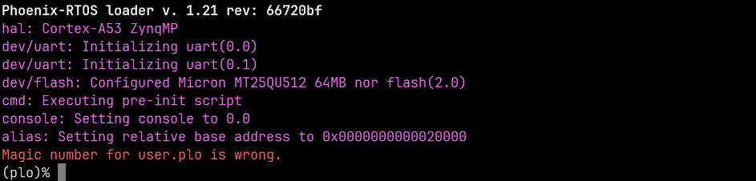

If you don't see it, please press the `POR_B` button (`SW4`) to reset the chip.

Providing that Phoenix-RTOS is present in the flash memory you will probably see the system startup:

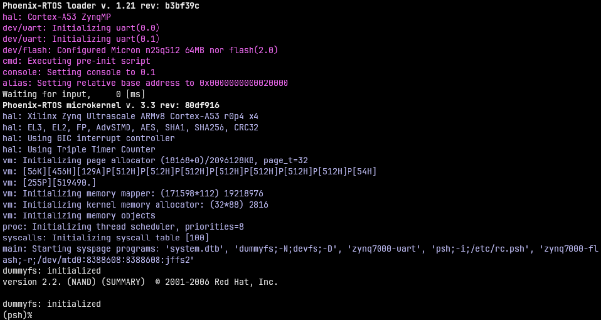

You want to press the `POR_B` button (`SW4`) again and interrupt `Waiting for input` by pressing any key to enter plo:

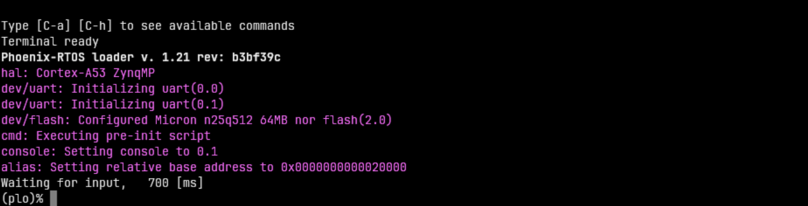

### Erasing the area intended for file system

It's needed to erase sectors that will be used by `jffs2` file system as we place in the `phoenix.disk`
 only the necessary file system content, not the whole area intended for it.
Without erasure `jffs2` may encounter data from the previous flash operation and errors
 during the system startup may occur.
That's why we have to run erase using plo command specific to `jffs2` file system:

```shell
jffs2 -d 2.0 -e -c 0x80:0x100:0x10000:16
```

Quick description of used arguments:

- `-d 2.0` - regards to the device with the following ID: 2.0, which means it's a flash memory (2) instance nr 0 (0),

- `-e` - erase,

- `-c 0x80:0x100:0x10000:16` - set clean markers
  - start block: `0x80` (`FS_OFFS`/`BLOCK_SIZE`),
  - number of blocks: `0x100` (`FS_SZ`/`BLOCK_SIZE`),
  - block size: `0x10000` (`erase_size`)
  - clean marker size: `16` (value specific for `jffs2` on `NOR` flash)


Please wait until erasing is finished.

### Copying flash image using PHFS (phoenixd)

To share disk image to the bootloader, `phoenixd` has to be launched with the following arguments
 (choose suitable `ttyUSBx` device, in this case, `ttyUSB1`):

```sh
cd _boot/aarch64a53-zynqmp-zcu104
./phoenixd -p /dev/tty[port] -b 921600 -s .
```

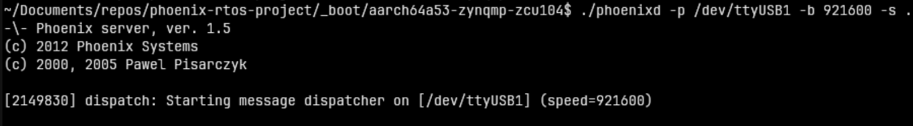

To start copying the file, write the following command in the console with plo interface:

```shell
copy uart0 flash0.disk flash0 0x0 0x0
```

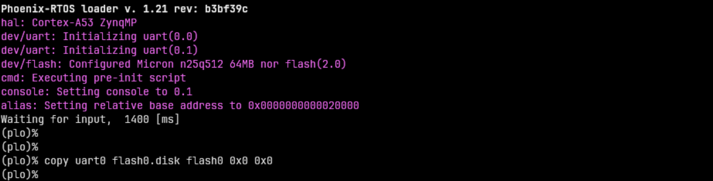

### Copying flash image using RAM disk and OpenOCD

On ZynqMP plo is configured with a RAM disk at address 0x08000000. The flash image can be written to it
using OpenOCD over JTAG which is a lot faster than over UART.

See [Debugging](#debugging) for details on how to launch OpenOCD.

Run the following commands (Note: this assumes the `ftdi_zcu104.cfg` file is in your home directory):

```sh
cd _boot/aarch64a53-zynqmp-zcu104
openocd -f "$(realpath ~/ftdi_zcu104.cfg)" -f "target/xilinx_zynqmp.cfg" \
  -c "init" \
  -c "halt" \
  -c "load_image flash0.disk 0x08000000 bin" \
  -c "resume" \
  -c "exit"
```

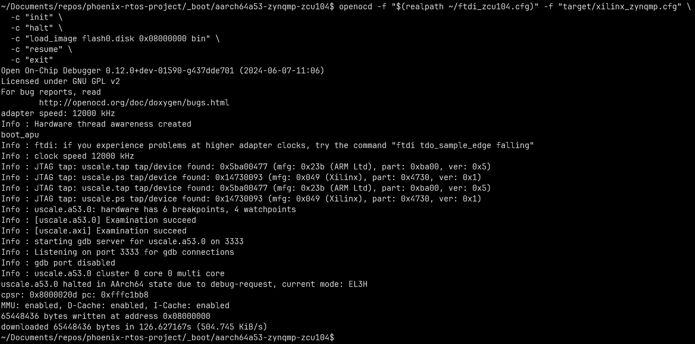

Once the flash image is in RAM disk you can copy it to flash0 in PLO:

```shell
copy ramdisk 0x0 0x4000000 flash0 0x0 0x4000000
```

### Booting Phoenix-RTOS from NOR flash memory

Now, the image is located in the NOR Quad SPI Flash memory.
To run it you should follow the steps below:

1. Power off the board using `SW1`

2. Switch boot mode to QSPI32 as described in section [Loading plo from NOR flash](#loading-plo-from-nor-flash)

3. Power on the board using `SW1`

4. Connect to the serial console port (in this case `ttyUSB2`).

    ```shell
    picocom -b 115200 --imap lfcrlf /dev/tty[port]
    ```

5. Restart the chip using the `POR_B` button to print initialization logs:

  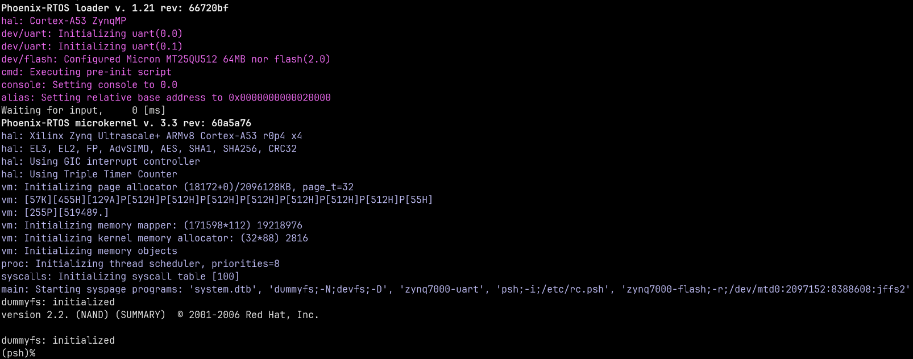

## Using Phoenix-RTOS

To get the available command list please type:

```shell
help
```

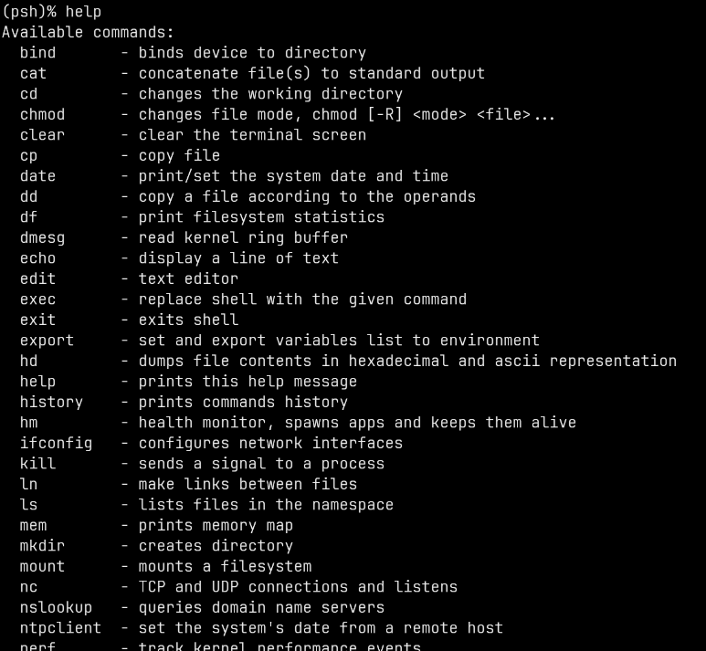

If you want to get the list of working processes please type:

```shell
ps
```

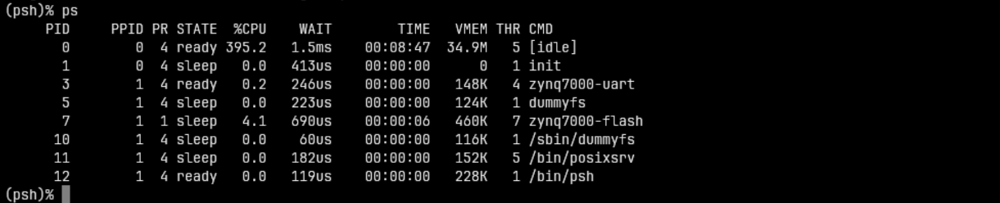

To get the table of processes please type:

```shell
top
```

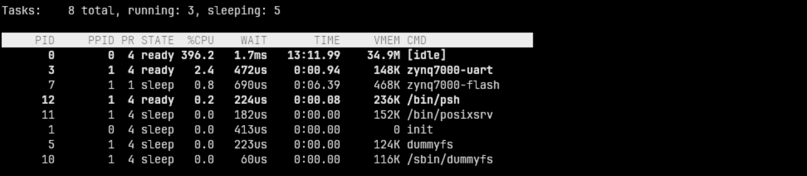

## Debugging

The FT4232HL chip can be used to communicate with the SoC over JTAG. Below are instructions how to connect OpenOCD
to the board:

First create a file named `ftdi_zcu104.cfg` with the following contents:

```tcl
adapter driver ftdi
ftdi vid_pid 0x0403 0x6011
ftdi channel 0
ftdi layout_init 0x00c8 0x000b
ftdi layout_signal POR_RST -data 0x0040 -oe 0x0040
ftdi layout_signal nSRST -data 0x0080 -oe 0x0080
transport select jtag
adapter speed 8000
```

Then run OpenOCD with the following command:

```sh
openocd -f "ftdi_zcu104.cfg" -f "target/xilinx_zynqmp.cfg" -c "reset_config srst_only"
```

You may get an error `LIBUSB_ERROR_ACCESS`. If this happens, try running `openocd` with `sudo` - if this fixes
the problem, you need to configure [udev rules](https://github.com/arduino/OpenOCD/blob/master/contrib/60-openocd.rules)
for `openocd` and add your user account to group `plugdev`.

If the connection was successful, this result should appear:

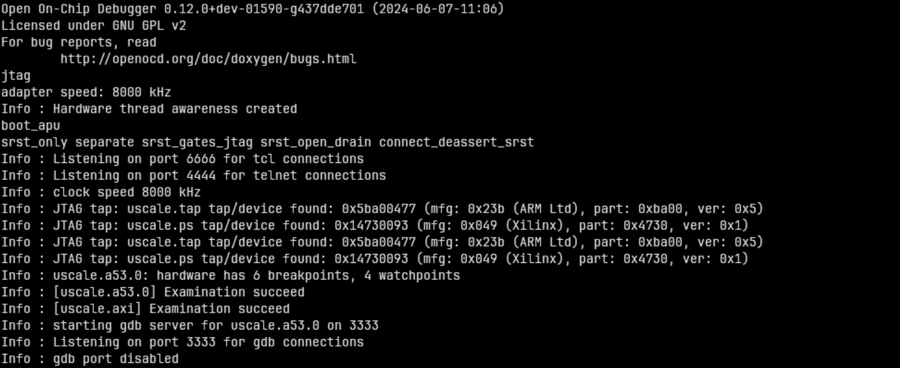

Now GDB can be connected to port 3333 on local machine.

For debugging the kernel or userspace you will need to examine all cores before starting GDB.
To do this you need to run OpenOCD with command:

```sh
openocd -f "ftdi_zcu104.cfg" -f "target/xilinx_zynqmp.cfg" -c "reset_config srst_only" -c "init" -c "core_up 1 2 3"
```
