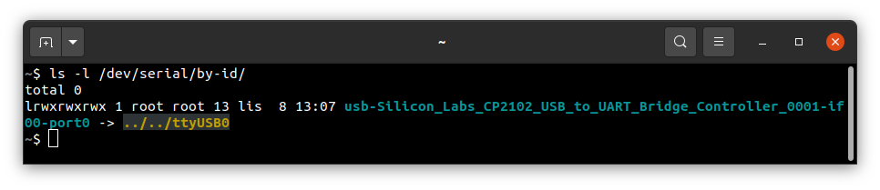
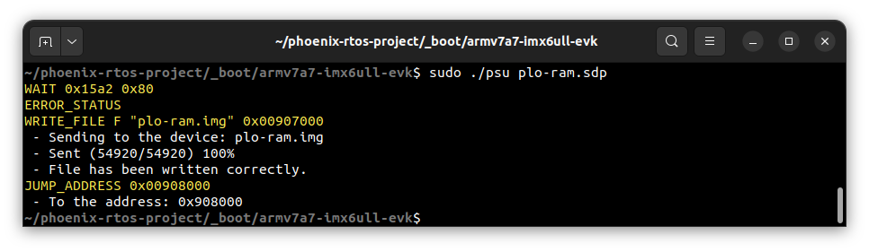
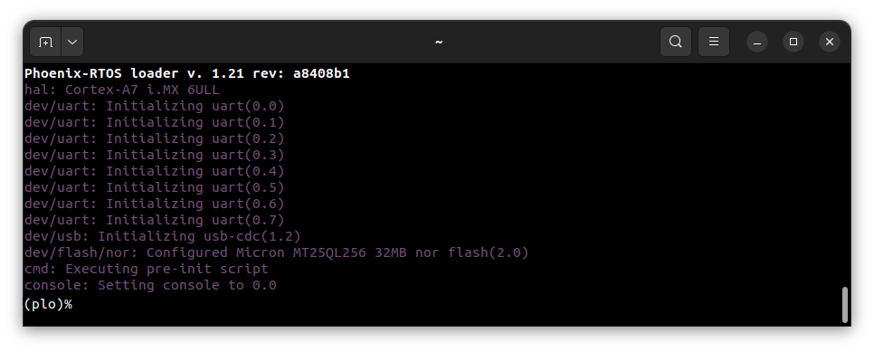
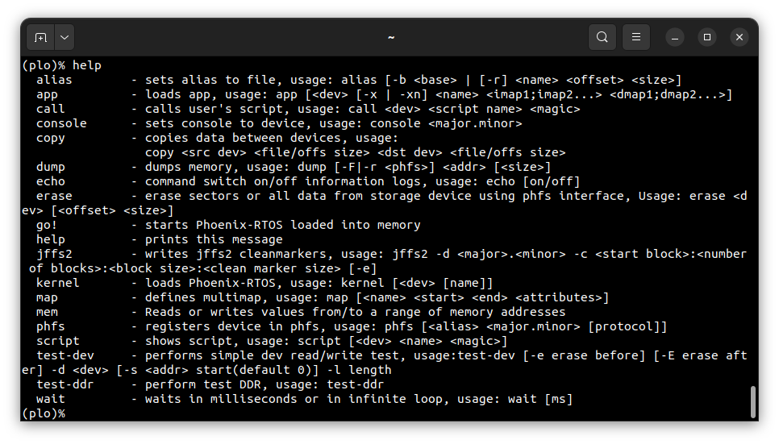
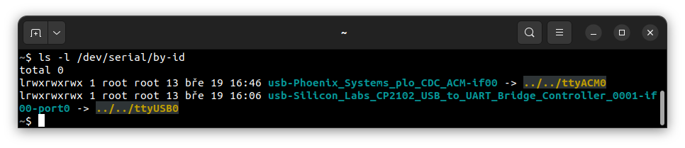
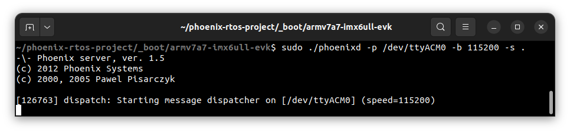
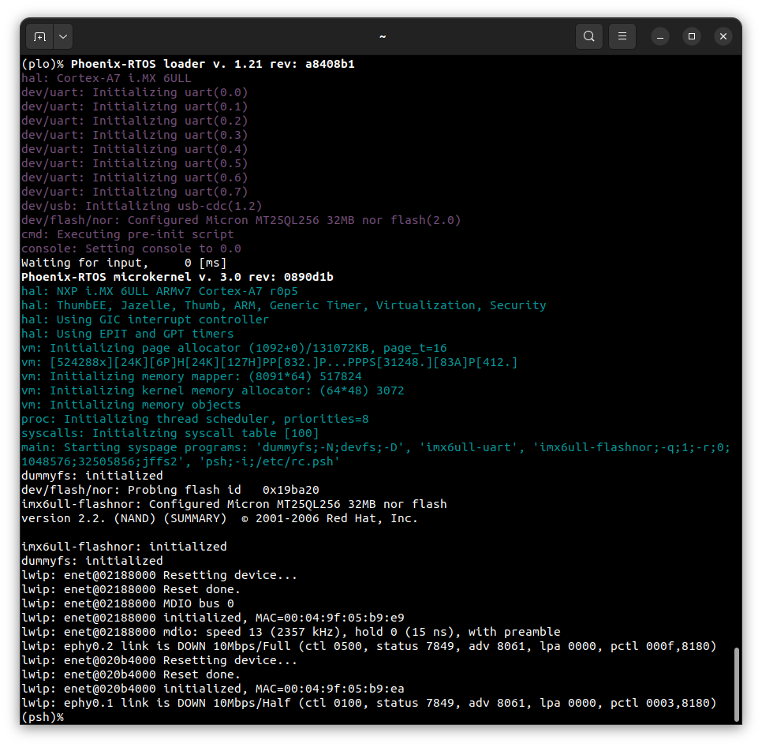
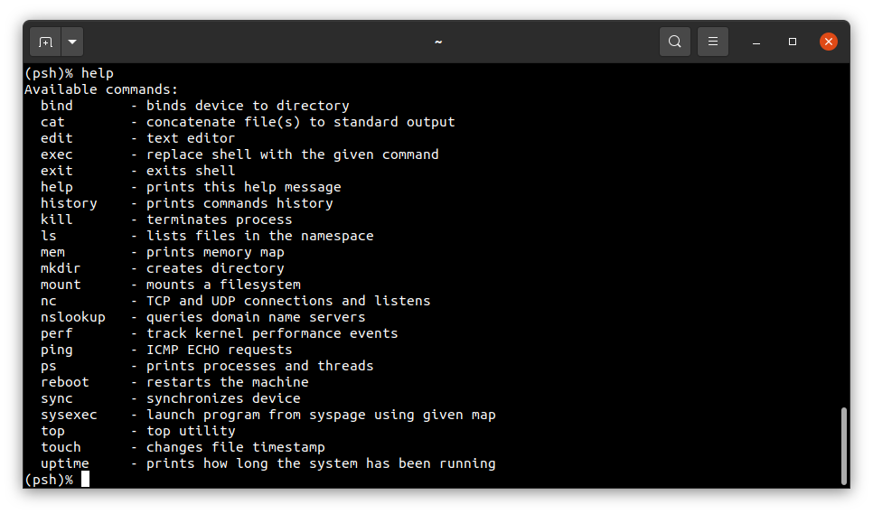
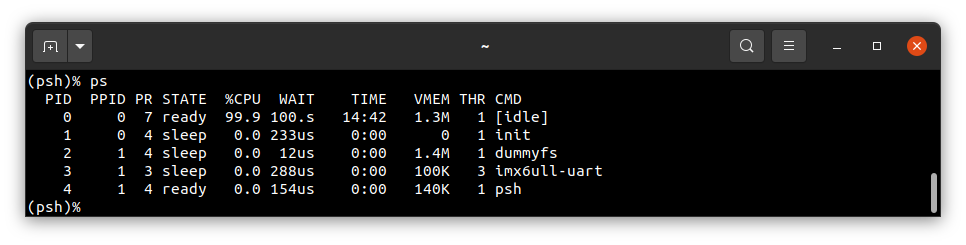
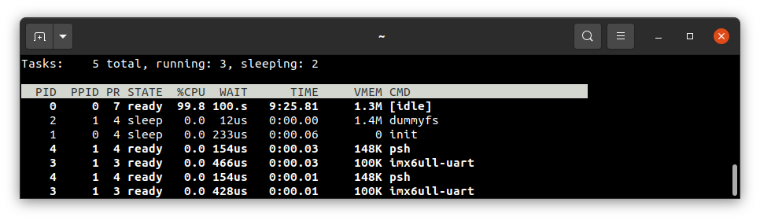

# Running system on <nobr>armv7a7-imx6ull-evk</nobr>

This version is designed for NXP i.MX 6ULL processors with ARM Cortex-A7 core. To launch this version the final disk
image and loader image should be provided. Images are created as the final artifacts of the `phoenix-rtos-project`
building and are located in the `_boot` directory. The disk image consists of bootloader (plo), kernel, UART driver
(tty), dummyfs filesystem server (RAM disk), and psh (shell). Necessary tools to carry out the uploading process are
located in the `_boot` directory as well.

## Development board

The easiest way to start programming hardware targets using Phoenix-RTOS is to get some evaluation boards with a
specified target processor or microcontroller. In this case
<!-- markdownlint-disable -->
[i. MX 6ULL - EVK](https://www.nxp.com/design/development-boards/i-mx-evaluation-and-development-boards/evaluation-kit-for-the-i-mx-6ull-and-6ulz-applications-processor:MCIMX6ULL-EVK)
<!-- markdownlint-restore -->
Is the example of a board with the `imx6ull` processor, where the default configuration of peripherals allows running
Phoenix-RTOS.

## Connecting the board

- To provide a power supply for the board, you should connect AC Adapter to the DC socket on the board. For now, leave
the `SW2001` switch in the `1` position.

- To communicate with the board you will need to connect the USB cable to the `DEBUG USB` port (`J1901`). The onboard
UART-USB converter is used here.

- You should also connect another micro USB cable to the `USB OTG` port (`J1102`). As a result two available USB ports
in `i. MX 6ULL - EVK` will be connected to your host-pc.

- Now you can power up the board by changing the `SW2001` position to `2`. The `D2003` LED should turn green.

- Now you should verify what USB device on your host-pc is connected with the `DEBUG USB` (console). To check that run:

  ```console
  ls -l /dev/serial/by-id
  ```

  

  If your output is like in the screenshot above, the console (`DEBUG USB` in the evaluation board) is on the `USB0`
  port.

- When the board is connected to your host-pc, open serial port in terminal using picocom and type the console port
(in this case USB0)

  ```console
  picocom -b 115200 --imap lfcrlf /dev/ttyUSB0
  ```

  <details>
  <summary>How to get picocom (Ubuntu 20.04)</summary>

  ```console
  sudo apt-get update && \
  sudo apt-get install picocom
  ```

  </details>

You can leave the terminal with the serial port open, and follow the next steps.

## Flashing the Phoenix-RTOS system image

The process comes down to a few steps, described below.

### Uploading Phoenix-RTOS loader (plo) to the RAM memory

To flash the disk image to the board, the bootloader (plo) image located in the `_boot` directory should be uploaded to
the RAM using `psu` (Phoenix Serial Uploader) via `SDP` (Serial Download Protocol).

- Make sure, that the SW602 switch is in the following configuration (serial downloader mode):

  | D1/MODE1 | D2/MODE0 |
  |----------|----------|
  | OFF      | ON       |

  If it was in a different position you have to restart the board after the change and connect to the serial port a
  second time.

- Change directory to `_boot` and run `psu` as follows:

  ```console
  cd _boot/armv7a7-imx6ull-evk
  ```

  ```console
  sudo ./psu plo-ram.sdp
  ```



- The plo user interface should appear in the console.



- To get the available bootloader command list please type `help`.



### Copying flash image using PHFS (phoenixd)

To flash the disk image, first, you need to verify on which port plo USB device has appeared. You can check that using
`ls` as follows:

```console
ls -l /dev/serial/by-id
```



To share disk image to the bootloader, `phoenixd` has to be launched with the following arguments
(choose suitable ttyACMx device, in this case, ttyACM0):

```console
sudo ./phoenixd -p /dev/ttyACM0 -b 115200 -s .
```



To start copying a file, write the following command in the console with plo interface:

```console
copy usb0 phoenix.disk nor0 0x0 0x0
```

The `nor0` is the flash memory.

### Booting Phoenix-RTOS from Flash

- Turn off the board.

- Change configuration of SW602 to the following configuration (internal boot mode):

  | D1/MODE1 | D2/MODE0 |
  | -------- | -------- |
  | ON       | OFF      |

- Change configuration of SW601 to the following configuration (boot from QSPI):
  | D1  | D2  | D3  | D4  |
  | --- | --- | --- | --- |
  | OFF | OFF | OFF | OFF |

- Turn on the board.

If everything has gone correctly, Phoenix-RTOS with the default configuration and the `psh` shell command prompt will
appear in the terminal after 2 seconds. If there is a need to enter the bootloader, the waiting for input should be
interrupted by pressing any key. Then you can exit plo by passing `go!` command.



## Using Phoenix-RTOS

To get the available command list please type:

```console
help
```



If you want to get the list of working processes please type:

```console
ps
```



To get the table of processes please type:

```console
top
```


