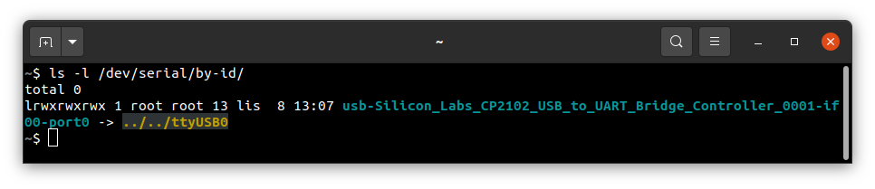
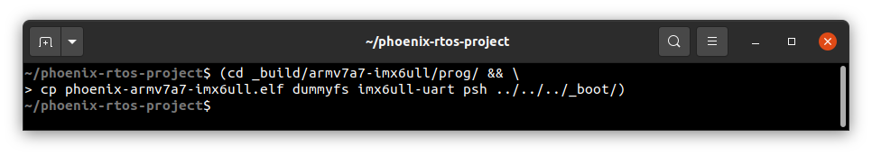
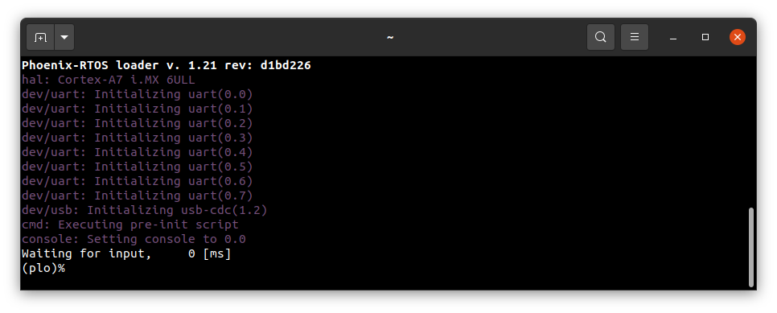
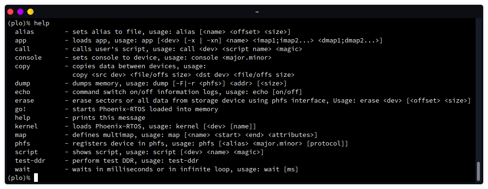
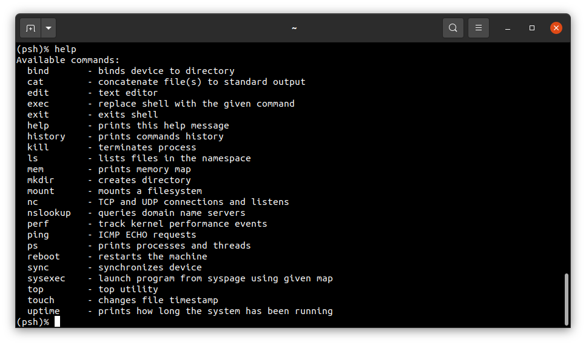
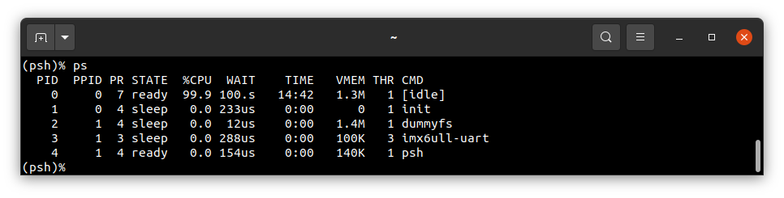

# Running system on `armv7a7-imx6ull` (NXP i.MX 6ULL)

This version is designed for NXP i.MX 6ULL processors with ARM Cortex-A7 core. To launch this version the final disk image and loader image should be provided. The images are created as the final artifacts of `phoenix-rtos-project` building and are located in `_boot` directory. The disk image consist of bootloader (plo), kernel, UART driver (tty), dummyfs filesystem server (RAM disk) and psh (shell). The necessary tools to carry out the uploading process are located in `_boot` directory as well.

## Pre-build steps

To make instructions given in this quickstart possible, you should checkout to `feature/syspage` branch and update submodules before building a system image.
  <details>
  <summary> How to checkout to the feature/syspage branch and update submodules </summary>
  There are diffrent ways to do that, here is one of them.

  Launch these commands from `phoenix-rtos-project` directory:

  ```
git remote add origin https://github.com/phoenix-rtos/phoenix-rtos-project.git && \
git fetch origin feature/syspage && \
git checkout origin/feature/syspage && \
git submodule update --recursive
```
  

  </details>

  After that you can run `build.sh` script for `armv7a7-imx6ull` target architecture.

  See [how to build the Phoenix-RTOS system image](../building/README.md)

## Development board

The easiest way to start programming hardware targets using Phoenix-RTOS is to get some of the evaluation boards with specified target processor or microcontroller. In this case [i. MX 6ULL - EVK](https://www.nxp.com/design/development-boards/i-mx-evaluation-and-development-boards/evaluation-kit-for-the-i-mx-6ull-and-6ulz-applications-processor:MCIMX6ULL-EVK) is the example of a board with the `imx6ull` processor, where default configuration of peripherals allows to run Phoenix-RTOS.

## Connecting the board

- To provide a power supply for the board, you should connect AC Adapter to DC socket on the board. For now leave `SW2001` switch in the `1` position.

- To communicate with the board you will need to connect the usb cable to `DEBUG USB` port. The on-board uart-usb converter is used here.

- You should also connect the another micro usb cable to `USB OTG` port. As a result two available usb ports in `i. MX 6ULL - EVK` will be connected to yor host-pc.

- Now you can power up the board, changing the `SW2001` position to `2`. The `D2003` LED should turn green.

- Now you should verify what USB device on your host-pc is connected with the `DEBUG USB` (console). In order to check that run:
  ```
  ls -l /dev/serial/by-id
  ```
  

  If your output is like in the screenshot above, the console (`DEBUG USB` in evaluation board) is on the USB0 port.

- When the board is connected to your host-pc, open serial port in terminal using picocom and type the console port (in this case USB0)
  ```bash
  picocom -b 115200 --imap lfcrlf /dev/ttyUSB0
  ```
  <details>
  <summary>How to get picocom (Ubuntu 20.04)</summary>

  ```bash
  sudo apt-get update
  sudo apt-get install picocom
  ```

  </details>
  </br>

You can leave the terminal with serial port open, and follow the next steps.

## Uploading the Phoenix-RTOS system image to RAM memory

In order to place the disk image on the board, the bootlader (plo) image located in `_boot` directory should be uploaded to the RAM memory using `psu` (Phoenix Serial Uploader) via SDP (Serial Download Protocol). Next, there have to be a short delay for plo usb cdc device to appear. Then `phoenixd` should be launched to make copying programs from `_boot` directory to the image possible. To do that follow the instructions below:

- To properly run the system image, kernel and other used programs need to be provided in `_boot` directory, so you should copy them from `_build` directory:

  ```
  (cd _build/armv7a7-imx6ull/prog/ && \
  cp phoenix-armv7a7-imx6ull.elf dummyfs imx6ull-uart psh ../../../_boot/)
  ```

  

- Make sure, that the SW602 switch is in the following configuration (serial downloader mode):

  | D1/MODE1 | D2/MODE0 |
  |----------|----------|
  | OFF      | ON       |

  If it was in different position you have to restart the board after change and connect to serial port second time.

- Change directory to `_boot` and run `psu` as follow:

  ```bash
  cd _boot/ && \
  sudo ./psu plo-ram-armv7a7-imx6ull.sdp && \
  sleep 1 && \
  sudo ./phoenixd -k phoenix-armv7a7-imx6ull.elf -p /dev/ttyACM0 -b 115200 -s .
  ```

  

The plo user interface should appear in the console.



To get the available bootloader command list please type:
```
help
```



Now you can start PhoenixRTOS by typing:
```
go!
```


## Using Phoenix-RTOS


To get the available command list please type:
```
help
```




If you want to get the list of working processes please type:

```
ps
```



To get the table of processes please type:
```
top
```


## See also

1. [Running system on targets](README.md)
2. [Table of Contents](../README.md)
