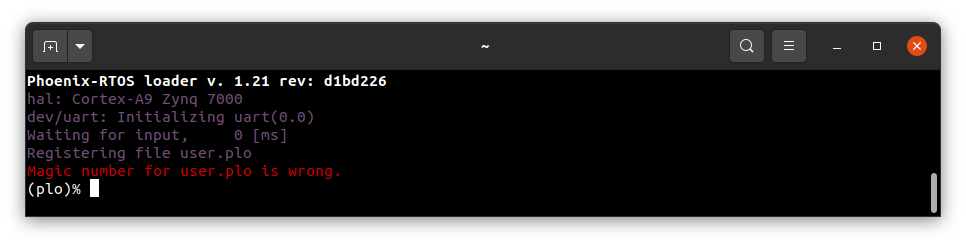

# Running system on `armv7a9-zynq7000` (Xilinx Zynq-7000) on development board

These instructions describe how to run the Phoenix-RTOS system image for `armv7a9-zynq7000` target architecture using an evaluation board.
Note that, the build artifacts, including the system image, should be first provided in the `_boot` directory. If you haven't run the `build.sh` script yet, follow the pre-build steps [here](armv7a9-zynq7000.md) and next run it for `armv7a9-zynq7000` target.


## Preparing the board

- Firstly, you should copy the disk image `phoenix-armv7a9-zynq7000.disk` from the `_boot` directory to the SD card and rename it to `BOOT.bin`.

- Then, insert the SD card into the board.

- To allow booting from SD card, set the jumpers to the following configuration:

  

- After that, to provide a power supply for the board, you should connect AC Adapter to the DC socket on the board. For now, leave the `SW8` switch in the `OFF` position.

- To communicate with the board you will need to connect the USB cable to the `UART` port (`J14`). The onboard UART-USB converter is used here.

- You should also connect another micro USB cable to the `USB OTG` port (`J13`).

- Now you can power up the board, changing the `SW8` position to `ON`. The `LD13` LED should turn green.

- Now you should verify, what USB device on your host-pc is connected with the `UART` (console). To check that run:

  ```
  ls -l /dev/serial/by-id
  ```

  

  If your output is like in the screenshot above, the console (`UART` in the evaluation board) is on the ACM0 port.

- When the board is connected to your host-pc, open serial port in terminal using picocom and type the console port (in this case ACM0)

  ```
  picocom -b 115200 --imap lfcrlf /dev/ttyACM0
  ```

  <details>
  <summary>How to get picocom (Ubuntu 20.04)</summary>

  ```
  sudo apt-get update && \
  sudo apt-get install picocom
  ```

  </details>
  </br>

You can leave the terminal with the serial port open, and follow the next steps.

## Flashing the Phoenix-RTOS system image

The process comes down to a few steps, described below.

### Uploading Phoenix-RTOS loader (plo)

The Phoenix-RTOS loader is uploaded to the SD card. When the board is powered on, the following output will appear on the serial port:



If you don't see it, please press the `PS-RST` button (`BTN7`), to restart the chip and print initialization logs.


If you are flashing the board a second time and some older Phoenix-RTOS image is uploaded to NOR flash memory, the following output will appear:


As you can see, the older Phoenix-RTOS image is now launched, but we need to run plo (Phoenix-RTOS loader). To do that, you should press any button, for example, `enter` within 1 second after restart (using `PS-RST`):


### Copying flash image using PHFS (phoenixd)

To flash the disk image, first, you need to verify on which port plo USB device has appeared. You can check that using `ls` as follow:

```bash
ls -l /dev/serial/by-id
```


To share disk image to the bootloader, `phoenixd` has to be launched with the following arguments (choose suitable ttyACMx device, in this case, ttyACM1):

```
cd _boot/
```

```bash
sudo ../_build/host-pc/prog/phoenixd -k phoenix-armv7a9-zynq7000.elf -p /dev/ttyACM1 -b 115200 -s .
```


To start copying the file, write the following command in the console with plo interface:

```bash
copy usb0 phoenix-armv7a9-zynq7000.disk flash0 0x0 0x0
```


### Booting Phoenix-RTOS from internal Flash

Now, the image is located in the internal Quad SPI Flash memory.
To run it you should follow the steps below:

- Power off the board using `SW8`

- Change jumpers position as follows:

  

- Power on the board using `SW8`

- Check which port the console appeared on:

  ```
  ls -l /dev/serial/by-id/
  ```

  

- connect to that port:

  ```
  picocom -b 115200 --imap lfcrlf /dev/ttyACM0
  ```

- restart the chip using the `PS-RST` button to print initialization logs:

  

## Using Phoenix-RTOS

To get the available command list please type:

```
help
```


If you want to get the list of working processes please type:

```bash
ps
```


To get the table of processes please type:

```bash
top
```


## See also


1. [Running system on armv7a9-zynq7000](armv7a9-zynq7000.md)
2. [Running system on armv7a9-zynq7000 on emulator](armv7a9-zynq7000-emu.md)
3. [Running system on targets](README.md)
4. [Table of Contents](../README.md)
