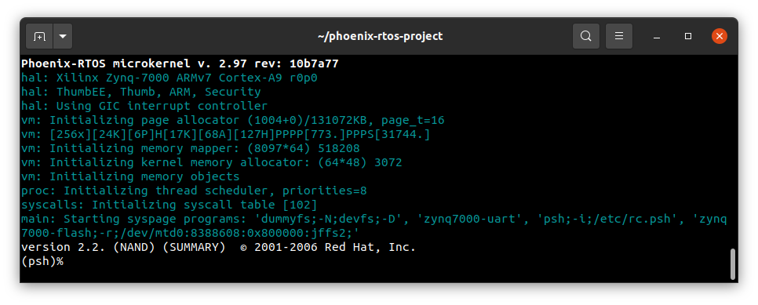

# Running system on `armv7a9-zynq7000` (Xilinx Zynq-7000) on emulator

This quickstart describes how to run Phoenix-RTOS system image for `armv7a9-zynq7000` target architecture using docker and qemu.

## Pre-build steps

To make instructions given in this quickstart possible, you should checkout to `feature/syspage` branch and update submodules before building a system image.
  <details>
  <summary> How to checkout to the feature/syspage branch and update submodules </summary>
  There are diffrent ways to do that, here is one of them.

  Launch these commands from `phoenix-rtos-project` directory:

  ```
  git remote add origin https://github.com/phoenix-rtos/phoenix-rtos-project.git && \
  git fetch origin feature/syspage && \
  git checkout origin/feature/syspage && \
  git submodule update --recursive
  ```

  

  </details>

  After that you can run `build.sh` script for `armv7a7-imx6ull` target architecture.

  See [how to build the Phoenix-RTOS system image](../building/README.md)

## Running the system image

Firstly, you need to have the docker installed.

  <details>
  <summary>How to get docker (Ubuntu 20.04)</summary>

  - Install required packages

  ```
  sudo apt-get update && \
  sudo apt-get install curl \
  ca-certificates \
  gnupg \
  lsb-release
  ```

  - Make docker packages available

  ```
  curl -fsSL https://download.docker.com/linux/ubuntu/gpg | sudo gpg --dearmor -o /usr/share/keyrings/docker-archive-keyring.gpg && \
  echo \
  "deb [arch=$(dpkg --print-architecture) signed-by=/usr/share/keyrings/docker-archive-keyring.gpg] https://download.docker.com/linux/ubuntu \
  $(lsb_release -cs) stable" | sudo tee /etc/apt/sources.list.d/docker.list > /dev/null
  ```

  - Install docker packages

  ```
  sudo apt-get update && \
  sudo apt-get install docker-ce docker-ce-cli containerd.io
  ```

  - Check if docker is properly installed (version can be different):

  ```
  sudo docker --version
  ```

  

  - To make calling docker command without `sudo` possible type:

  ```
  sudo groupadd docker
  ```

  Even if group `docker` already exists type then:

  ```
  sudo usermod -aG docker $USER && \
  newgrp docker
  ```

  - Check if running docker images without sudo works properly:

  ```
  docker run hello-world
  ```
  

  For more details and other instructions see

  [docker.com](https://docs.docker.com/engine/install/ubuntu/)

  </details> 

Now, with docker installed you can run the Phoenix-RTOS using the following command:

```
./docker-devel.sh scripts/armv7a9-zynq7000.sh
```

As a result, you should see `psh` (Phoenix-RTOS shell).



  <details>
  <summary>Why there is no need to install qemu?</summary>

  All necessary tools including qemu are provided in phoenixrtos/devel docker image (run by `docker-devel.sh` script)

  If you want, you can read more about docker containerization on https://www.docker.com/resources/what-container

  </details> 

## Using Phoenix-RTOS

To get the available command list please type:

```
help
```


If you want to get the list of working processes please type:

```bash
ps
```


To get the table of processes please type:

```bash
top
```


If you want to quit, you should click on the terminal window, press `ctrl + a`, release it, and next press the `x` key.


## See also

1. [Running system on targets](README.md)
2. [Table of Contents](../README.md)
