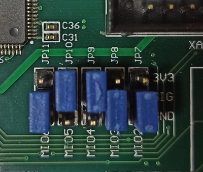
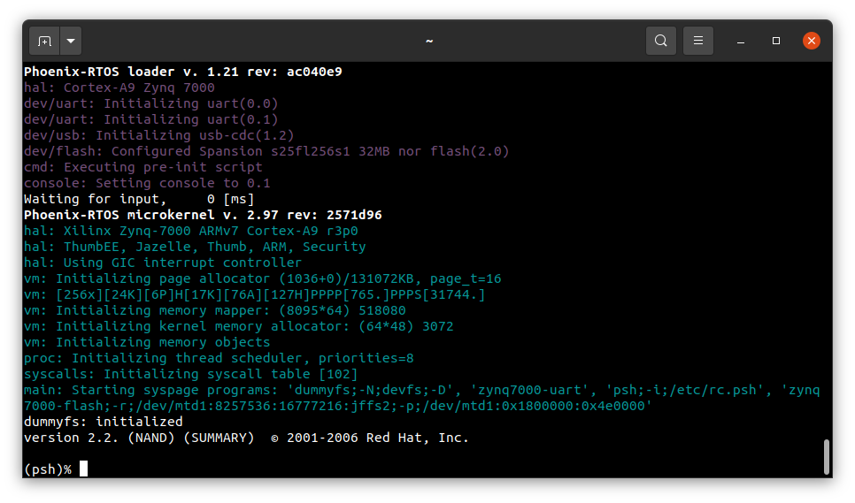
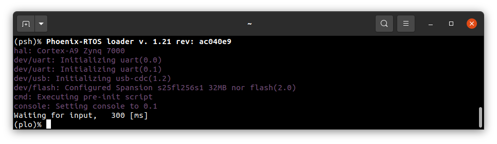
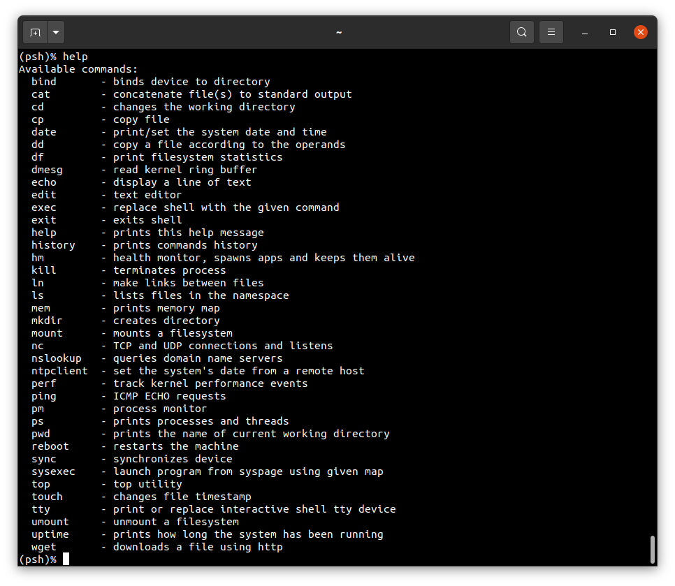

# Running system on <nobr>armv7a9-zynq7000-zedboard</nobr>

These instructions describe how to run a Phoenix-RTOS system image for `armv7a9-zynq7000-zedboard` target architecture.
Note that, the build artifacts, including the system image, should be first provided in the `_boot` directory.
If you haven't run the `build.sh` script yet, run it for `armv7a9-zynq7000-zedboard` target.

See [how to build the Phoenix-RTOS system image](../building/index.md).

## Preparing the board

Preparing the board depends on how the plo is loaded into RAM, this quickstart describes 2 approaches.
Loading from SD card and from NOR flash, depending on your needs use one of them.
For example if you are flashing Phoenix-RTOS for a first time, or you want to load a plo from the current system image.
Otherwise, you can simply use plo from the already flashed image.

### Loading plo from SD card

- Firstly, you should copy the disk image `phoenix.disk`
 from the `_boot/armv7a9-zynq7000-zedboard` directory to the SD card and rename it to `BOOT.bin`.

- Then, insert the SD card into the board.

- To allow booting from SD card, set the jumpers to
 the following configuration (`JP11`: `110`, `JP10`: `011`, `JP9`: `011`, `JP8`: `110`, `JP7`: `110`):

  

### Loading plo from NOR flash

**This version is possible only if you have already flashed Phoenix-RTOS system image to this board before!**

- To allow loading from NOR flash,
set the jumpers to the following configuration (`JP11`: `110`, `JP10`: `011`, `JP9`: `110`, `JP8`: `110`, `JP7`: `110`):

  

### Loading plo - common steps

- To provide a power supply for the board, you should connect AC Adapter to the DC socket on the board.
For now, leave the `SW8` switch in the `OFF` position.

- To communicate with the board you will need to connect the USB cable to the `UART` port (`J14`).
The onboard UART-USB converter is used here.

- You should also connect another micro USB cable to the `USB OTG` port (`J13`).

  The picture below presents how the board should be connected:

  

- Now you can power up the board, changing the `SW8` position to `ON`. The `LD13` LED should turn green.

- Now you should verify, what USB device on your host-pc is connected with the `UART` (console). To check that run:

  - On Ubuntu:

  ```console
  ls -l /dev/serial/by-id
  ```

  

  - On macOS:

  ```console
  ls -l /dev/tty.*
  ```

  

  If your output is like in the screenshot above, the console (`UART` in the evaluation board) is on the `ACM0` port.

- When the board is connected to your host-pc,
 open serial port in terminal using picocom and type the console port (in this case ACM0)

  ```console
  picocom -b 115200 --imap lfcrlf /dev/tty[port]
  ```

<details>

<summary>How to get picocom and run it without privileges (Ubuntu 22.04)</summary>

```console
sudo apt-get update && \
sudo apt-get install picocom
```

To use picocom without sudo privileges run this command and then restart:

```console
sudo usermod -a -G tty <yourname>
```

</details>
</br>

 <details>
  <summary>How to get picocom (macOS)</summary>

  ```console
  brew update &&\
  brew install picocom
  ```

  </details>
  </br>

You can leave the terminal with the serial port open, and follow the next steps.

## Flashing the Phoenix-RTOS system image

At first before any flashing, you need to enter Phoenix-RTOS loader (plo), which should have been already loaded.

If there wasn't an older system image in the NOR flash the following output should appear:


If you don't see it, please press the `PS-RST` button (`BTN7`) to restart the chip.

Providing that Phoenix-RTOS is present in the flash memory you will probably see the system startup:



You want to press the `PS-RST` button (`BTN7`) again and interrupt `Waiting for input` by pressing any key to enter plo:



If you encountered some problems during this step please see
 [common problems](armv7a9-zynq7000.md#common-problems-on-zynq7000-boards).

### Erasing the area intended for file system

It's needed to erase sectors that will be used by `jffs2` file system as we place in the `phoenix.disk`
 only the necessary file system content, not the whole area intended for it.
Without erasure `jffs2` may encounter data from the previous flash operation and errors
 during the system startup may occur.
That's why we have to run erase using plo command specific to `jffs2` file system:

```console
jffs2 -d 2.0 -e -c 0x80:0x100:0x10000:16
```

Quick description of used arguments:

- `-d 2.0` - regards to the device with the following ID: 2.0, which means it's a flash memory (2) instance nr 0 (0),

- `-e` - erase,

- `-c 0x80:0x100:0x10000:16` - set clean markers
  - start block: `0x80` (`FS_OFFS`/`BLOCK_SIZE`),
  - number of blocks: `0x100` (`FS_SZ`/`BLOCK_SIZE`),
  - block size: `0x10000` (`erase_size`)
  - clean marker size: `16` (value specific for `jffs2` on `NOR` flash)


Please wait until erasing is finished.

### Copying flash image using PHFS (phoenixd)

To flash the disk image, first, you need to verify on which port plo USB device has appeared.
You can check that using `ls` as follow:

- On Ubuntu:

```console
ls -l /dev/serial/by-id
```


- On macOS:

```console
ls -l /dev/tty.*
```


To share disk image to the bootloader, `phoenixd` has to be launched with the following arguments
 (choose suitable ttyACMx device, in this case, ttyACM1):

```console
cd _boot/armv7a9-zynq7000-zedboard
```

```console
sudo ./phoenixd -p /dev/tty[port] -b 115200 -s .
```


To start copying the file, write the following command in the console with plo interface:

```console
copy usb0 phoenix.disk flash0 0x0 0x0
```


### Booting Phoenix-RTOS from NOR flash memory

Now, the image is located in the NOR Quad SPI Flash memory.
To run it you should follow the steps below:

*If you have already set the `NOR flash` mode by following instructions from
 [Loading plo from NOR flash](#loading-plo-from-nor-flash) chapter,
 you should only follow the last step - press `PS-RST` button.

- Power off the board using `SW8`

- Change jumpers position as follows (`JP11`: `110`, `JP10`: `011`, `JP9`: `110`, `JP8`: `110`, `JP7`: `110`):

  

- Power on the board using `SW8`

- Check which port the console appeared on:

  - On Ubuntu:

  ```console
  ls -l /dev/serial/by-id/
  ```

  

  - On macOS:

  ```console
  ls -l /dev/tty.*
  ```

  

- connect to that port:

  ```console
  picocom -b 115200 --imap lfcrlf /dev/tty[port]
  ```

- restart the chip using the `PS-RST` button to print initialization logs:

  

## Using Phoenix-RTOS

To get the available command list please type:

```console
help
```



If you want to get the list of working processes please type:

```console
ps
```


To get the table of processes please type:

```console
top
```


## See also

1. [Running system on armv7a9-zynq7000](armv7a9-zynq7000.md)
2. [Running system on armv7a9-zynq7000 on emulator](armv7a9-zynq7000-qemu.md)
3. [Running system on armv7a9-zynq7000-zturn](armv7a9-zynq7000-zturn.md)
4. [Running system on targets](index.md)
5. [Table of Contents](../index.md)
