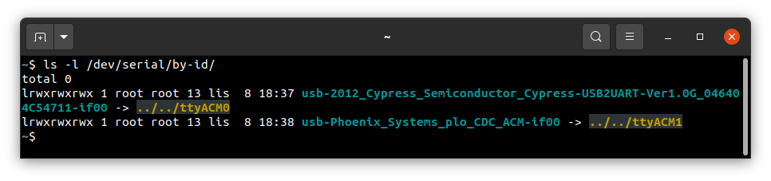
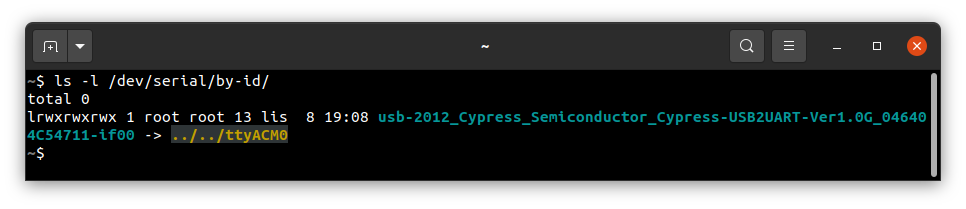
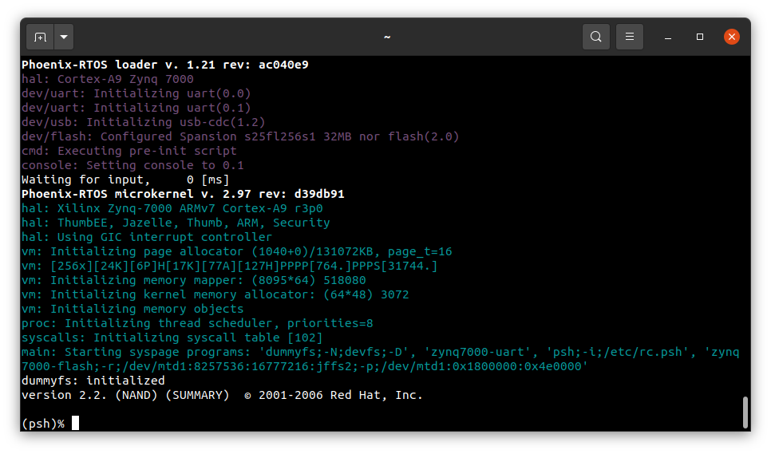
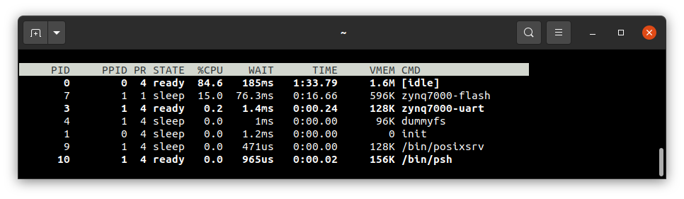

# Running system on `armv7a9-zynq7000-zturn`

These instructions describe how to run a Phoenix-RTOS system image for `armv7a9-zynq7000-zturn` target architecture.
Note that, the build artifacts, including the system image, should be first provided in the `_boot` directory.
If you haven't run the `build.sh` script yet, run it for `armv7a9-zynq7000-zturn` target.

See [how to build the Phoenix-RTOS system image](../building/README.md).

## Preparing the board

Preparing the board depends on how the plo is loaded into RAM, this quickstart describes 2 approaches - loading from SD
card and QSPI flash, use one of them depending on your needs. For example if you have empty flash memory or want to
load new plo use SD card, otherwise you can simply load plo from QSPI flash.

### Loading plo from SD card

- Firstly, you should copy the disk image `phoenix.disk` from the `_boot/armv7a9-zynq7000-zturn` directory to the SD
  card and rename it to `BOOT.bin`, make sure that this file is in binary format, otherwise you won't be able to load
  plo (Phoenix-RTOS Loader) from SD card to RAM.

- Then, insert the SD card into the board.

- To allow loading from SD card, set the jumpers (`JP1:OFF`, `JP2:ON`) to the following configuration:

  

### Loading plo from QSPI flash

**This version is possible only if you have already flashed Phoenix-RTOS system image to this board before!**

- To allow load from QSPI flash, set the jumpers to the following configuration (`JP1:ON`, `JP2:ON`):

  

### Loading plo - common steps

- To communicate with the board you will need to connect the USB cable to the `USB_UART` port (`J6`).

- You should also connect another micro USB cable to the `USB_OTG` port (`J2`).

  The picture below presents how the board should be connected:

  

- If you connected everything like in the picture above, the board should be powered on and the `D25` POWER LED should
  shine blue.

- Now you should verify, what USB device on your host-pc is connected with the `UART` (console). To check that run:

  ```text
  ls -l /dev/serial/by-id
  ```

  

  If your output is like in the screenshot above, the console (`UART` in the evaluation board) is on the `USB0` port.

- When the board is connected to your host-pc, open serial port in terminal using picocom and type the console port
  (in this case USB0)

  ```text
  picocom -b 115200 --imap lfcrlf /dev/ttyUSB0
  ```

- You should see such output:
  
  

  <details>
  <summary>How to get picocom (Ubuntu 20.04)</summary>

  ```text
  sudo apt-get update && \
  sudo apt-get install picocom
  ```

  To use picocom without sudo privileges run this command and then restart:

  ```text
  sudo usermod -a -G dialout <yourname>
  ```

  </details>
  </br>

You can leave the terminal with the serial port open, and follow the next steps.

## Flashing the Phoenix-RTOS system image

At first, before any flashing, you need to enter Phoenix-RTOS loader (plo).

### Entering Phoenix-RTOS loader (plo)

Press RESET button (`K2`) to restart the chip.

If flash memory doesn't contain Phoenix-RTOS system image, booting process will stop at plo level, you should see:


Phoenix-RTOS loader tried to find an image in flash, which was unsuccessful. That's why there is an error message.

Otherwise, in order to get into plo you need to press any key within 500ms. If you don't do that, plo will load system
and start psh, but we cannot flash from there. Output when you enter psh:


Restart the chip with RESTART button `K2` and try again. Output of successful entry to plo:


If you want to flash the system image please follow the next steps.

### Copying image to flash memory using PHFS (phoenixd)

To flash the disk image, first, you need to verify on which port plo USB device has appeared. You can check that using
`ls` as follows:

```text
ls -l /dev/serial/by-id
```



To share disk image to the bootloader, `phoenixd` has to be launched with the following arguments (choose suitable
ttyACMx device, in this case, ttyACM0):

```text
cd _boot/armv7a9-zynq7000-zturn
```

```text
sudo ./phoenixd -p /dev/ttyACM0 -b 115200 -s .
```


If you encountered some problems during this step please see
[common problems](armv7a9-zynq7000.md#common-problems-on-zynq7000-boards).

Before flashing, good practice is to erase older file system on flash memory (this is done to avoid errors).

### Erasing the area intended for file system

It's needed to erase sectors that will be used by `jffs2` file system as we place in the `phoenix.disk`
 only the necessary file system content, not the whole area intended for it.
Without erasure `jffs2` may encounter data from the previous flash operation and errors
 during the system startup may occur.
That's why we have run erase using plo command specific to `jffs2` file system:

```text
jffs2 -d 2.0 -e -c 0x80:0x80:0x10000:16
```

Quick description of used arguments:

- `-d 2.0` - regards to the device with the following ID: 2.0, which means it's a flash memory (2) instance nr 0 (0),

- `-e` - erase,

- `-c 0x80:0x80:0x10000:16` - set clean markers
  - start block: `0x80` (`FS_OFFS`/`BLOCK_SIZE`),
  - number of blocks: `0x80` (`FS_SZ`/`BLOCK_SIZE`),
  - block size: `0x10000` (`erase_size`)
  - clean marker size: `16`


Please wait until erasing is finished.

To start copying the file, write the following command in the console with plo interface:

```text
copy usb0 phoenix.disk flash0 0x0 0x0
```


### Booting Phoenix-RTOS from QSPI flash memory

Now, the image is located in the QSPI Flash memory.
To run it you should follow the steps below:

- Power off the board by disconnecting USB_OTG and USB_UART connectors

- Configure jumpers as depicted (`JP2:ON`, `JP1:ON`):

  

- Power on the board by connecting USB_OTG and USB_UART connectors

- Check which port the console appeared on:

  ```text
  ls -l /dev/serial/by-id/
  ```

  

- connect to that port:

  ```text
  picocom -b 115200 --imap lfcrlf /dev/ttyACM0
  ```

- restart the chip using the `K2` RESET button, after that booting starts

- after successful boot you should see:

  

Psh prompt indicates that everything is up and running.

## Using Phoenix-RTOS

To get the available command list please type:

```text
help
```


If you want to get the list of working processes please type:

```text
ps
```


To get the table of processes please type:

```text
top
```



## See also

1. [Running system on armv7a9-zynq7000](armv7a9-zynq7000.md)
2. [Running system on armv7a9-zynq7000 on emulator](armv7a9-zynq7000-qemu.md)
3. [Running system on armv7a9-zynq7000 on Zedboard](armv7a9-zynq7000-zedboard.md)
4. [Running system on targets](README.md)
5. [Table of Contents](../README.md)
