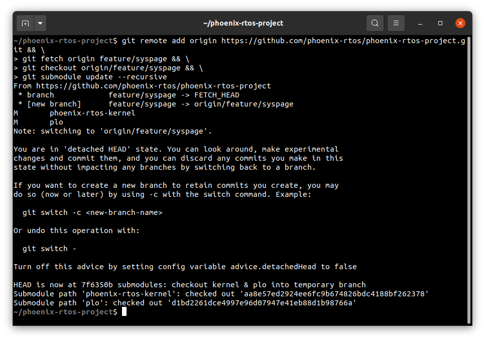

# Running system on `armv7a9-zynq7000` (Xilinx Zynq-7000)

This version is designed for Xilinx Zynq-7000 SoC (System on Chip) with ARM Cortex-A9 core. To launch this version the final disk image should be provided. The image is created as the final artifact of the `phoenix-rtos-project` building and is located in the `_boot` directory. The disk image consists of the bootloader (plo), kernel, UART driver (tty), dummyfs filesystem server (RAM disk), and psh (shell). Necessary tools to carry out the flashing process are located in the `_boot` directory as well.

## Pre-build steps

To make instructions given in this quickstart possible, you should check out to `feature/syspage` branch and update submodules before building a system image.
  <details>
  <summary> How to checkout to the feature/syspage branch and update submodules </summary>
  There are diffrent ways to do that, here is one of them.

  Launch these commands from the `phoenix-rtos-project` directory:

  ```
  git remote add origin https://github.com/phoenix-rtos/phoenix-rtos-project.git && \
  git fetch origin feature/syspage && \
  git checkout origin/feature/syspage && \
  git submodule update --recursive
  ```

  

  </details>

  After that, you can run the `build.sh` script for the `armv7a9-zynq7000` target architecture.

  See [how to build the Phoenix-RTOS system image](../building/README.md)

## Development board or emulator

The easiest way to start programming hardware targets using Phoenix-RTOS is to get some of the evaluation boards with a specified target processor or microcontroller. In this case [ZedBoard](https://www.xilinx.com/products/boards-and-kits/1-8dyf-11.html) is the example of a board with the `zynq7000` SoC, where the default configuration of peripherals allows to run Phoenix-RTOS.
The next steps for a development board are described below.

- [Running system on `armv7a9-zynq7000` using development board](armv7a9-zynq7000-devboard.md)

If you don't have one, you can check the running system for this target architecture on an emulator and follow the steps from the site below.

- [Running system on `armv7a9-zynq7000` using emulator](armv7a9-zynq7000-emu.md)

## See also

1. [Running system on targets](README.md)
2. [Table of Contents](../README.md)
