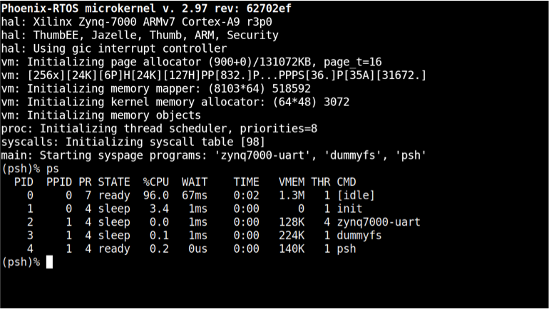

# Running system on `armv7a9-zynq7000`

This version is designated for Xilnx Zynq7000 and its development board. 

## See also

1. [Running system on targets](README.md)
2. [Table of Contents](../README.md)
