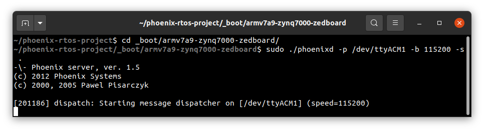
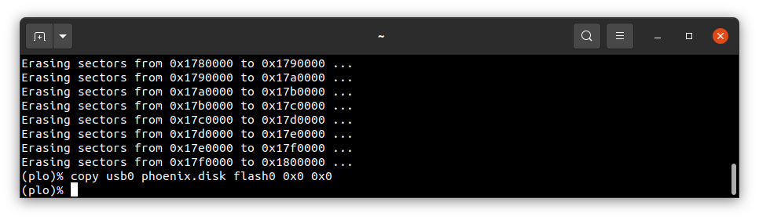
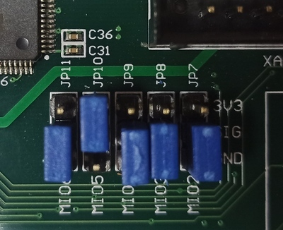
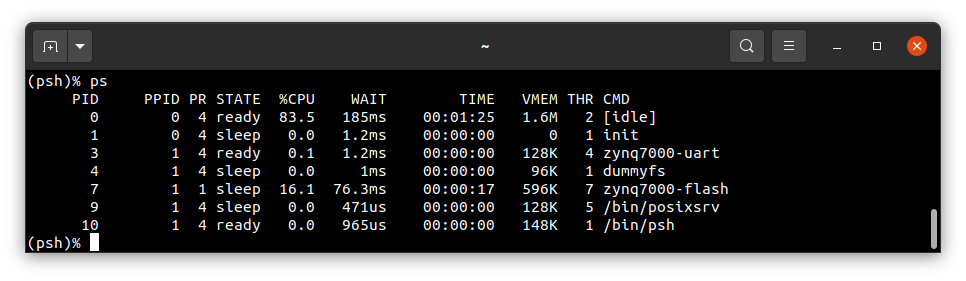

# Running system on `armv7a9-zynq7000` (Xilinx Zynq-7000)

This version is designed for Xilinx Zynq-7000 SoC (System on Chip) with ARM Cortex-A9 core. To launch this version the final disk image should be provided. The image is created as the final artifact of `phoenix-rtos-project` building and is located in `_boot` directory. The disk image consist of bootloader (plo), kernel, UART driver (tty), dummyfs filesystem server (RAM disk) and psh (shell). The necessary tools to carry out the flashing process are located in `_boot` directory as well.

## Development board

The easiest way to start programming hardware targets using Phoenix-RTOS is to get some of the evaluation boards with specified target processor or microcontroller. In this case [ZedBoard](https://www.xilinx.com/products/boards-and-kits/1-8dyf-11.html) is the example of a board with the `zynq7000` SoC, where default configuration of peripherals allows to run Phoenix-RTOS.


## Pre-build steps

To make instructions given in this quickstart possible, you should checkout to `feature/syspage` branch and update submodules before building a system image.
  <details>
  <summary> How to checkout to the feature/syspage branch and update submodules </summary>
  There are diffrent ways to do that, here is one of them.

  Launch these commands from `phoenix-rtos-project` directory:

  ```
  git remote add origin https://github.com/phoenix-rtos/phoenix-rtos-project.git && \
  git fetch origin feature/syspage && \
  git checkout origin/feature/syspage && \
  git submodule update --recursive
  ```

  

  </details>

  After that you can run `build.sh` script for `armv7a7-imx6ull` target architecture.

  See [how to build the Phoenix-RTOS system image](../building/README.md)

## Preparing the board

- Firstly, you should copy the disk image `phoenix-armv7a9-zynq7000.disk` from the `_boot` directory to SD card and rename it to `BOOT.bin`.

- Then, insert the SD card into the board.

- To allow booting from SD card, set the jumpers to the following configuration:

  

- After that, to provide a power supply for the board, you should connect AC Adapter to DC socket on the board. For now leave `SW8` switch in the `OFF` position.

- To communicate with the board you will need to connect the usb cable to `UART` port (`J14`). The on-board uart-usb converter is used here.

- You should also connect the another micro usb cable to `USB OTG` port (`J13`).

- Now you can power up the board, changing the `SW8` position to `ON`. The `LD13` LED should turn green.

- Now you should verify, what USB device on your host-pc is connected with the `UART` (console). In order to check that run:

  ```
  ls -l /dev/serial/by-id
  ```

  

  If your output is like in the screenshot above, the console (`UART` in evaluation board) is on the ACM0 port.

- When the board is connected to your host-pc, open serial port in terminal using picocom and type the console port (in this case ACM0)

  ```
  picocom -b 115200 --imap lfcrlf /dev/ttyACM0
  ```

  <details>
  <summary>How to get picocom (Ubuntu 20.04)</summary>

  ```
  sudo apt-get update && \
  sudo apt-get install picocom
  ```

  </details>
  </br>

You can leave the terminal with serial port open, and follow the next steps.

## Flashing the Phoenix-RTOS system image

The process comes down to a few steps, described below.

### Uploading Phoenix-RTOS loader (plo)

The Phoenix-RTOS loader is uploaded to the SD card. When the board is power on, the following output will appear on serial port:


If you don't see it, please press the `PS-RST` button (`BTN7`), to restart the chip and print initialisation logs.


If you are flashing the board a second time and some older Phoenix-RTOS image is uploaded to NOR flash memory, the following output will appear:


As you can see, the older Phoenix-RTOS image is now launched, but we need to run plo (Phoenix-RTOS loader). To do that, you should press any button, for example `enter` within 1 second after restart (using `PS-RST`):


### Copying flash image using PHFS (phoenixd)

To flash the disk image, first you need to verify on which port plo usb device has been appeared. You can check that using `ls` as follow:

```bash
ls -l /dev/serial/by-id
```


To share disk image to the bootloader, `phoenixd` has to be launched with the following arguments (choose suitable ttyACMx device, in this case ttyACM1):

```bash
cd _boot/
```

```bash
sudo ../_build/host-pc/prog/phoenixd -k phoenix-armv7a9-zynq7000.elf -p /dev/ttyACM1 -b 115200 -s .
```



To start copying file, write the following command in the console with plo interface:

```bash
copy usb0 phoenix-armv7a9-zynq7000.disk flash0 0x0 0x0
```



### Booting Phoenix-RTOS from internal Flash

Now, the image is located in the internal Quad SPI Flash memory.
To run it you should follow the steps below:

- Power off the board using `SW8`

- Change jumpers position as follows:

  

- Power on the board using `SW8`

- Check which port the console appeared on:

  ```
  ls -l /dev/serial/by-id/
  ```

  

- connect to that port:

  ```
  picocom -b 115200 --imap lfcrlf /dev/ttyACM0
  ```

- restart the chip using the `PS-RST` button to print initialisation logs:

  

## Using Phoenix-RTOS

To get the available command list please type:

```
help
```


If you want to get the list of working processes please type:

```bash
ps
```



To get the table of processes please type:

```bash
top
```


## See also

1. [Running system on targets](README.md)
2. [Table of Contents](../README.md)
