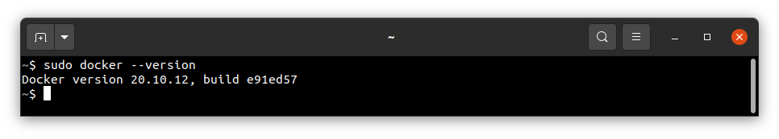
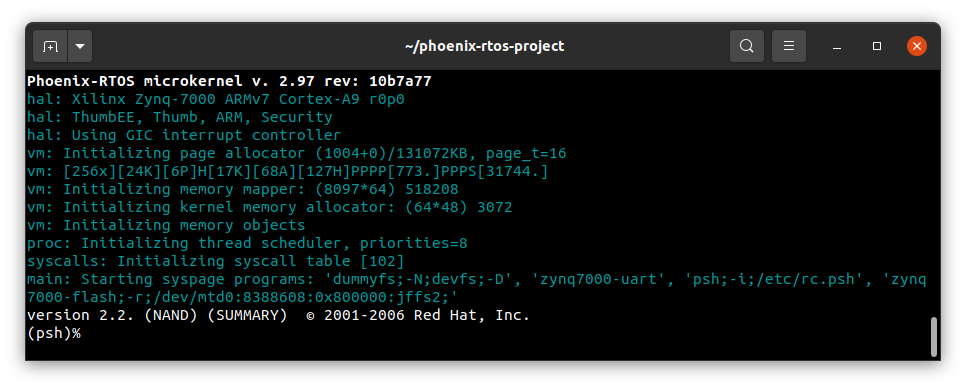
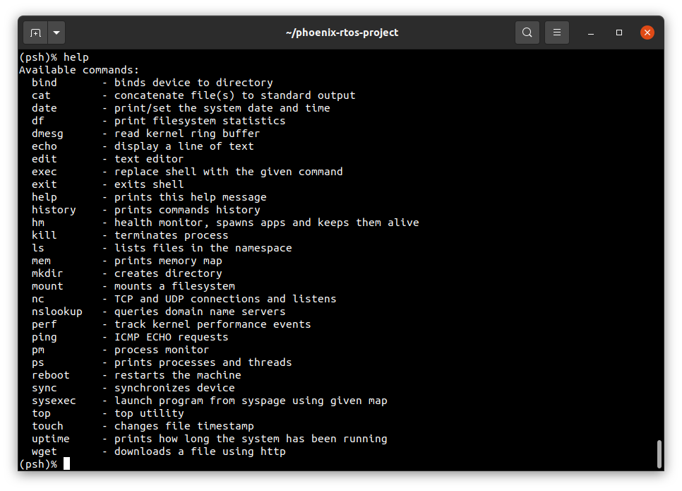
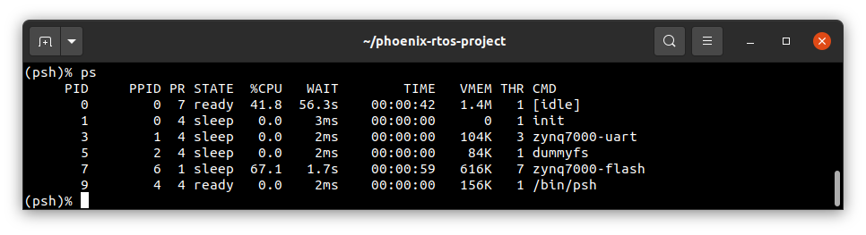
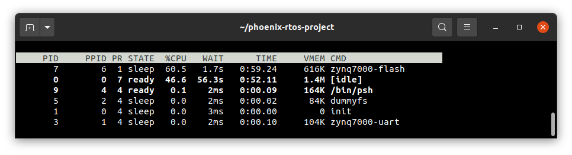
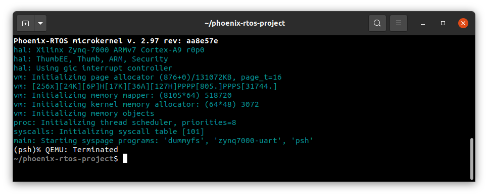

# Running system on <nobr>armv7a9-zynq7000-qemu</nobr>

These instructions describe how to run a Phoenix-RTOS system image for the `armv7a9-zynq7000-qemu` target architecture
using docker.

Note that, the build artifacts, including the system image, should be first provided in the `_boot` directory.

If you haven't run the `build.sh` script yet, run it for `armv7a9-zynq7000-qemu` target.

See [how to build the Phoenix-RTOS system image](../../building/index.md).

## Running the system image

Firstly, you need to have the docker installed.

  <details>
  <summary>How to get docker (Ubuntu 22.04)</summary>

- Install required packages

  ```console
  sudo apt-get update && \
  sudo apt-get install curl \
  ca-certificates \
  gnupg \
  lsb-release
  ```

- Make docker packages available

  ```console
  curl -fsSL https://download.docker.com/linux/ubuntu/gpg | sudo gpg --dearmor -o /usr/share/keyrings/docker-archive-keyring.gpg && \
  echo \
  "deb [arch=$(dpkg --print-architecture) signed-by=/usr/share/keyrings/docker-archive-keyring.gpg] https://download.docker.com/linux/ubuntu \
  $(lsb_release -cs) stable" | sudo tee /etc/apt/sources.list.d/docker.list > /dev/null
  ```

- Install docker packages

  ```console
  sudo apt-get update && \
  sudo apt-get install docker-ce docker-ce-cli containerd.io
  ```

- Check if Docker is properly installed (version can be different):

  ```console
  sudo docker --version
  ```

  

- To make calling docker command without `sudo` possible type:

  ```console
  sudo groupadd docker
  ```

  Even if group `docker` already exists type then:

  ```console
  sudo usermod -aG docker $USER && \
  newgrp docker
  ```

- Check if running docker images without sudo works properly:

  ```console
  docker run hello-world
  ```

  

  For more details and other instructions see

  [docker.com](https://docs.docker.com/engine/install/ubuntu/)

  </details>

Now, with docker installed you can run Phoenix-RTOS using the following command:

```console
./docker-devel.sh scripts/armv7a9-zynq7000-qemu.sh
```

As a result, you should see `psh` (Phoenix-RTOS shell).

- Note: It may take a while.



  <details>
  <summary>Why there is no need to install qemu?</summary>

  All necessary tools including QEMU are provided in phoenix-rtos/devel docker image (run by `docker-devel.sh` script)

  If you want, you can read more about docker containerization on <https://www.docker.com/resources/what-container>

  </details>

## Using Phoenix-RTOS

To get the available command list please type:

```console
help
```



If you want to get the list of working processes please type:

```console
ps
```



To get the table of processes please type:

```console
top
```



If you want to quit, you should click on the terminal window, press `ctrl + a`, release it, and next press the `x` key.


