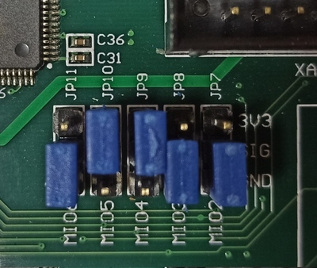
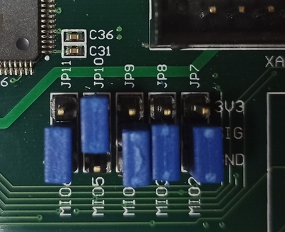
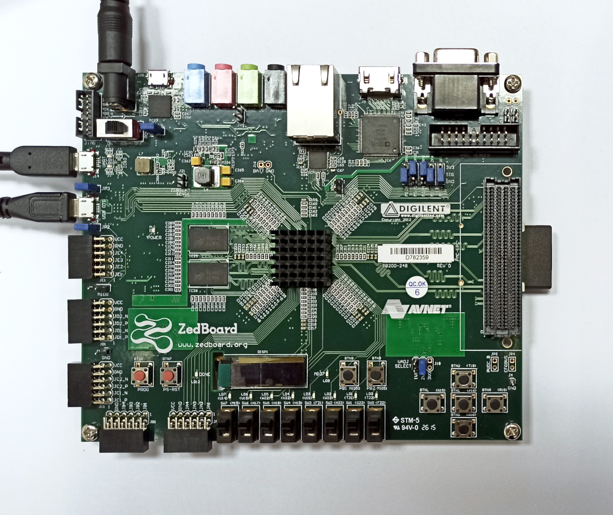

# Running system on <nobr>armv7a9-zynq7000-zedboard</nobr>

These instructions describe how to run a Phoenix-RTOS system image for `armv7a9-zynq7000-zedboard` target architecture.
Note that, the build artifacts, including the system image, should be first provided in the `_boot` directory.
If you haven't run the `build.sh` script yet, run it for `armv7a9-zynq7000-zedboard` target.

See [Building](../../building/index.md) chapter.

## Preparing the board

Preparing the board depends on how the plo is loaded into RAM, this quickstart describes 2 approaches.
Loading from SD card and from NOR flash, depending on your needs use one of them.
For example if you are flashing Phoenix-RTOS for a first time, or you want to load a plo from the current system image.
Otherwise, you can simply use plo from the already flashed image.

### Loading plo from SD card

- Copy the disk image `phoenix.disk`
 from the `_boot/armv7a9-zynq7000-zedboard` directory to the SD card and rename it to `BOOT.bin`.

- Then, insert the SD card into the board.

- To allow booting from SD card, set the jumpers to
 the following configuration (`JP11`: `110`, `JP10`: `011`, `JP9`: `011`, `JP8`: `110`, `JP7`: `110`):

  

### Loading plo from NOR flash

**This version is possible only if you have already flashed Phoenix-RTOS system image to this board before!**

- To allow loading from NOR flash,
set the jumpers to the following configuration (`JP11`: `110`, `JP10`: `011`, `JP9`: `110`, `JP8`: `110`, `JP7`: `110`):

  

### Loading plo - common steps

- To provide a power supply for the board, connect AC Adapter to the DC socket on the board.
For now, leave the `SW8` switch in the `OFF` position.

- To communicate with the board connect the USB cable to the UART port (`J14`).
The onboard UART-USB converter is used here.

- You should also connect another micro USB cable to the `USB OTG` port (`J13`).

  Board connections:

  

- Now you can power up the board, changing the `SW8` position to `ON`. The `LD13` LED should turn green.

- Verify, what USB device on your host-pc is connected with the UART (console). To check that run:

  - On Ubuntu:

  ```shell
  ls -l /dev/serial/by-id
  ```

  ```
  ~$ ls -l /dev/serial/by-id/
  total 0
  lrwxrwxrwx 1 root root 13 lis  8 16:49 usb-2012_Cypress_Semiconductor_Cypress-USB2UART-Ver1.0G_04640
  4C54711-if00 -> ../../ttyACM0
  ~$
  ```

  If the output matches, the console (UART in the evaluation board) is on the `ACM0` port.

- When the board is connected to your host-pc,
 open serial port in terminal using picocom and type the console port (in this case ACM0)

  ```shell
  picocom -b 115200 --imap lfcrlf /dev/tty[port]
  ```

<details>

<summary>How to get picocom and run it without privileges (Ubuntu 22.04)</summary>

```shell
sudo apt-get update && \
sudo apt-get install picocom
```

To use picocom without sudo privileges run this command and then restart:

```shell
sudo usermod -a -G tty <yourname>
```

</details>
</br>

You can leave the terminal with the serial port open, and follow the next steps.

## Flashing the Phoenix-RTOS system image

At first before any flashing, enter Phoenix-RTOS loader (plo), which should have been already loaded.

If there wasn't an older system image in the NOR flash the following output should appear:

```
Phoenix-RTOS loader v. 1.21 rev: 9a488af
hal: Cortex-A9 Zynq 7000
dev/uart: Initializing uart(0.0)
dev/uart: Initializing uart(0.1)
dev/usb: Initializing usb-cdc(1.2)
dev/flash: Configured Spansion s25fl256s1 32MB nor flash(2.0)
cmd: Executing pre-init script
console: Setting console to 0.1
Magic number for user.plo is wrong.
(plo)%
```

If you don't see it, please press the `PS-RST` button (`BTN7`) to restart the chip.

Providing that Phoenix-RTOS is present in the flash memory you will probably see the system startup:

```
Phoenix-RTOS loader v. 1.21 rev: ac040e9
hal: Cortex-A9 Zynq 7000
dev/uart: Initializing uart(0.0)
dev/uart: Initializing uart(0.1)
dev/usb: Initializing usb-cdc(1.2)
dev/flash: Configured Spansion s25fl256s1 32MB nor flash(2.0)
cmd: Executing pre-init script
console: Setting console to 0.1
Waiting for input,      0 [ms]
Phoenix-RTOS microkernel v. 2.97 rev: 2571d96
hal: Xilinx Zynq-7000 ARMv7 Cortex-A9 r3p0
hal: ThumbEE, Jazelle, Thumb, ARM, Security
hal: Using GIC interrupt controller
vm: Initializing page allocator (1036+0)/131072KB, page_t=16
vm: [256x][24K][6P]H[17K][76A][127H]PPPP[765.]PPPS[31744.]
vm: Initializing memory mapper: (8095*64) 518080
vm: Initializing kernel memory allocator: (64*48) 3072
vm: Initializing memory objects
proc: Initializing thread scheduler, priorities=8
syscalls: Initializing syscall table [102]
main: Starting syspage programs: 'dummyfs;-N;devfs;-D', 'zynq7000-uart', 'psh;-i;/etc/rc.psh', 'zynq
7000-flash;-r;/dev/mtd1:8257536:16777216:jffs2;-p;/dev/mtd1:0x1800000:0x4e0000'
dummyfs: initialized
version 2.2. (NAND) (SUMMARY)  © 2001-2006 Red Hat, Inc.

(psh)%
```

You want to press the `PS-RST` button (`BTN7`) again and interrupt `Waiting for input` by pressing any key to enter plo:

```
(psh)% Phoenix-RTOS loader v. 1.21 rev: ac040e9
hal: Cortex-A9 Zynq 7000
dev/uart: Initializing uart(0.0)
dev/uart: Initializing uart(0.1)
dev/usb: Initializing usb-cdc(1.2)
dev/flash: Configured Spansion s25fl256s1 32MB nor flash(2.0)
cmd: Executing pre-init script
console: Setting console to 0.1
Waiting for input,  300 [ms]
(plo)%
```

If you encountered some problems during this step please see
 [common problems](index.md#common-problems-on-zynq7000-boards).

### Erasing the area intended for file system

Erase sectors used by `jffs2` file system as we place in the `phoenix.disk`
 only the necessary file system content, not the whole area intended for it.
Without erasure `jffs2` may encounter data from the previous flash operation and errors
 during the system startup may occur.
That's why we have to run erase using plo command specific to `jffs2` file system:

```shell
jffs2 -d 2.0 -e -c 0x80:0x100:0x10000:16
```

Quick description of used arguments:

- `-d 2.0` - regards to the device with the following ID: 2.0, which means it's a flash memory (2) instance nr 0 (0),

- `-e` - erase,

- `-c 0x80:0x100:0x10000:16` - set clean markers
  - start block: `0x80` (`FS_OFFS`/`BLOCK_SIZE`),
  - number of blocks: `0x100` (`FS_SZ`/`BLOCK_SIZE`),
  - block size: `0x10000` (`erase_size`)
  - clean marker size: `16` (value specific for `jffs2` on NOR flash)

```
(plo)% jffs2 -d 2.0 -e -c 0x80:0x100:0x10000:16
Erasing sectors from 0x800000 to 0x810000 ...
Erasing sectors from 0x810000 to 0x820000 ...
Erasing sectors from 0x820000 to 0x830000 ...
Erasing sectors from 0x830000 to 0x840000 ...
Erasing sectors from 0x840000 to 0x850000 ...
Erasing sectors from 0x850000 to 0x860000 ...
Erasing sectors from 0x860000 to 0x870000 ...
Erasing sectors from 0x870000 to 0x880000 ...
Erasing sectors from 0x880000 to 0x890000 ...
Erasing sectors from 0x890000 to 0x8a0000 ...
Erasing sectors from 0x8a0000 to 0x8b0000 ...
Erasing sectors from 0x8b0000 to 0x8c0000 ...
Erasing sectors from 0x8c0000 to 0x8d0000 ...
Erasing sectors from 0x8d0000 to 0x8e0000 ...
Erasing sectors from 0x8e0000 to 0x8f0000 ...
Erasing sectors from 0x8f0000 to 0x900000 ...
Erasing sectors from 0x900000 to 0x910000 ...
Erasing sectors from 0x910000 to 0x920000 ...
Erasing sectors from 0x920000 to 0x930000 ...
Erasing sectors from 0x930000 to 0x940000 ...
Erasing sectors from 0x940000 to 0x950000 ...
Erasing sectors from 0x950000 to 0x960000 ...
Erasing sectors from 0x960000 to 0x970000 ...
```

Please wait until erasing is finished.

### Copying flash image using PHFS (phoenixd)

To flash the disk image, first, verify on which port plo USB device has appeared.
Check with `ls` as follow:

- On Ubuntu:

```shell
ls -l /dev/serial/by-id
```

```
~$ ls -l /dev/serial/by-id/
total 0
lrwxrwxrwx 1 root root 13 lis  8 18:37 usb-2012_Cypress_Semiconductor_Cypress-USB2UART-Ver1.0G_04640
4C54711-if00 -> ../../ttyACM0
lrwxrwxrwx 1 root root 13 lis  8 18:38 usb-Phoenix_Systems_plo_CDC_ACM-if00 -> ../../ttyACM1
~$
```

Launch `phoenixd` to share the disk image with the bootloader
 (choose suitable ttyACMx device, in this case, ttyACM1):

```shell
cd _boot/armv7a9-zynq7000-zedboard
```

```shell
sudo ./phoenixd -p /dev/tty[port] -b 115200 -s .
```

```
~phoenix-rtos-project$ cd _boot/armv7a9-zynq7000-zedboard/
~phoenix-rtos-project/_boot/armv7a9-zynq7000-zedboard$ sudo ./phoenixd -p /dev/ttyACM1 -b 115200 -s
.
-\- Phoenix server, ver. 1.5
(c) 2012 Phoenix Systems
(c) 2000, 2005 Pawel Pisarczyk

[201186] dispatch: Starting message dispatcher on [/dev/ttyACM1] (speed=115200)
```

To start copying the file, write the following command in the console with plo interface:

```shell
copy usb0 phoenix.disk flash0 0x0 0x0
```

```
Erasing sectors from 0x1780000 to 0x1790000 ...
Erasing sectors from 0x1790000 to 0x17a0000 ...
Erasing sectors from 0x17a0000 to 0x17b0000 ...
Erasing sectors from 0x17b0000 to 0x17c0000 ...
Erasing sectors from 0x17c0000 to 0x17d0000 ...
Erasing sectors from 0x17d0000 to 0x17e0000 ...
Erasing sectors from 0x17e0000 to 0x17f0000 ...
Erasing sectors from 0x17f0000 to 0x1800000 ...
(plo)% copy usb0 phoenix.disk flash0 0x0 0x0
(plo)%
```

### Booting Phoenix-RTOS from NOR flash memory

Now, the image is located in the NOR Quad SPI Flash memory.
Follow these steps:

*If you have already set the `NOR flash` mode by following instructions from
 [Loading plo from NOR flash](#loading-plo-from-nor-flash) chapter,
 you should only follow the last step - press `PS-RST` button.

- Power off the board using `SW8`

- Change jumpers position as follows (`JP11`: `110`, `JP10`: `011`, `JP9`: `110`, `JP8`: `110`, `JP7`: `110`):

  

- Power on the board using `SW8`

- Check which port the console appeared on:

  - On Ubuntu:

  ```shell
  ls -l /dev/serial/by-id/
  ```

  ```
  ~$ ls -l /dev/serial/by-id/
  total 0
  lrwxrwxrwx 1 root root 13 lis  8 19:08 usb-2012_Cypress_Semiconductor_Cypress-USB2UART-Ver1.0G_04640
  4C54711-if00 -> ../../ttyACM0
  ~$
  ```

- connect to that port:

  ```shell
  picocom -b 115200 --imap lfcrlf /dev/tty[port]
  ```

- restart the chip using the `PS-RST` button to print initialization logs:

  ```
  Phoenix-RTOS loader v. 1.21 rev: ac040e9
  hal: Cortex-A9 Zynq 7000
  dev/uart: Initializing uart(0.0)
  dev/uart: Initializing uart(0.1)
  dev/usb: Initializing usb-cdc(1.2)
  dev/flash: Configured Spansion s25fl256s1 32MB nor flash(2.0)
  cmd: Executing pre-init script
  console: Setting console to 0.1
  Waiting for input,      0 [ms]
  Phoenix-RTOS microkernel v. 2.97 rev: d39db91
  hal: Xilinx Zynq-7000 ARMv7 Cortex-A9 r3p0
  hal: ThumbEE, Jazelle, Thumb, ARM, Security
  hal: Using GIC interrupt controller
  vm: Initializing page allocator (1040+0)/131072KB, page_t=16
  vm: [256x][24K][6P]H[17K][77A][127H]PPPP[764.]PPPS[31744.]
  vm: Initializing memory mapper: (8095*64) 518080
  vm: Initializing kernel memory allocator: (64*48) 3072
  vm: Initializing memory objects
  proc: Initializing thread scheduler, priorities=8
  syscalls: Initializing syscall table [102]
  main: Starting syspage programs: 'dummyfs;-N;devfs;-D', 'zynq7000-uart', 'psh;-i;/etc/rc.psh', 'zynq
  7000-flash;-r;/dev/mtd1:8257536:16777216:jffs2;-p;/dev/mtd1:0x1800000:0x4e0000'
  dummyfs: initialized
  version 2.2. (NAND) (SUMMARY)  © 2001-2006 Red Hat, Inc.

  (psh)%
  ```

## Using Phoenix-RTOS

Once booted, the `psh` shell prompt appears. See [Shell basics](../psh-basics.md) for an introduction to
the available shell commands, process inspection, and running programs.
