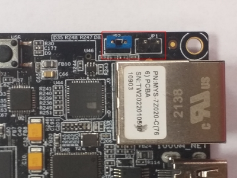
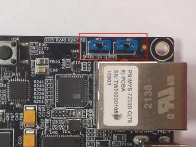
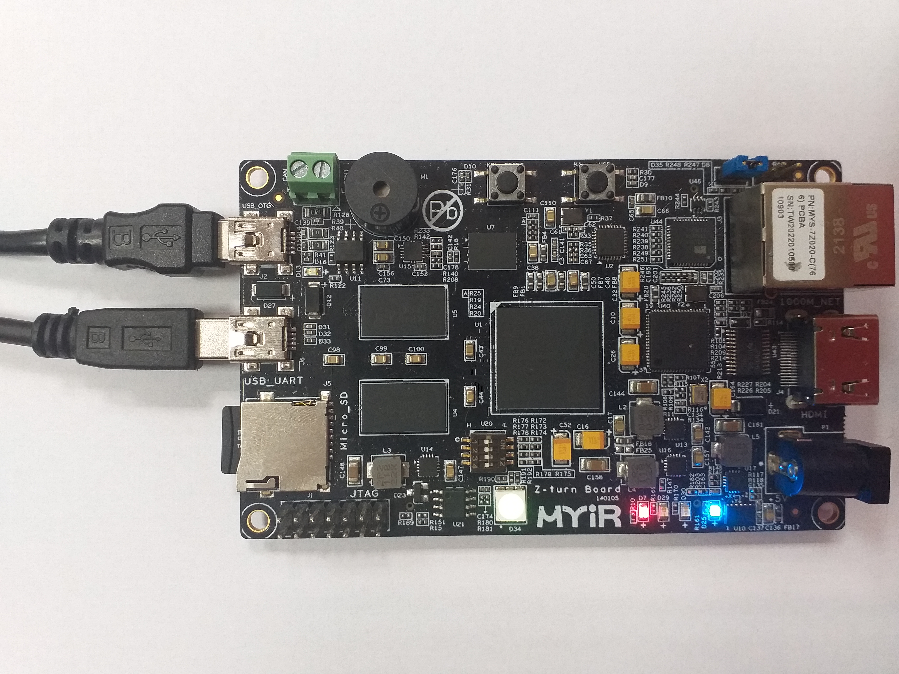

# Running system on <nobr>armv7a9-zynq7000-zturn</nobr>

These instructions describe how to run a Phoenix-RTOS system image for `armv7a9-zynq7000-zturn` target architecture.
Note that, the build artifacts, including the system image, should be first provided in the `_boot` directory.
If you haven't run the `build.sh` script yet, run it for `armv7a9-zynq7000-zturn` target.

See [Building](../../building/index.md) chapter.

## Preparing the board

Preparing the board depends on how the plo is loaded into RAM, this quickstart describes 2 approaches - loading from SD
card and QSPI flash, use one of them depending on your needs. For example if you have empty flash memory or want to
load new plo use SD card, otherwise you can simply load plo from QSPI flash.

### Loading plo from SD card

- Firstly, you should copy the disk image `phoenix.disk` from the `_boot/armv7a9-zynq7000-zturn` directory to the SD
  card and rename it to `BOOT.bin`, make sure that this file is in binary format, otherwise you won't be able to load
  plo (Phoenix-RTOS Loader) from SD card to RAM.

- Then, insert the SD card into the board.

- To allow loading from SD card, set the jumpers (`JP1:OFF`, `JP2:ON`) to the following configuration:

  

### Loading plo from QSPI flash

**This version is possible only if you have already flashed Phoenix-RTOS system image to this board before!**

- To allow load from QSPI flash, set the jumpers to the following configuration (`JP1:ON`, `JP2:ON`):

  

### Loading plo - common steps

- To communicate with the board you will need to connect the USB cable to the `USB_UART` port (`J6`).

- You should also connect another micro USB cable to the `USB_OTG` port (`J2`).

  The picture below presents how the board should be connected:

  

- If you connected everything like in the picture above, the board should be powered on and the `D25` POWER LED should
  shine blue.

- Now you should verify, what USB device on your host-pc is connected with the `UART` (console). To check that run:

  ```shell
  ls -l /dev/serial/by-id
  ```

  ```
  total 0
  lrwxrwxrwx 1 root root 13 Jul  3 16:57 usb-Silicon_Labs_CP2103_USB_to_UART_Bridge_Controller_0001-if00-port0 -> ../../ttyUSB0
  ```

  If your output is like in the example above, the console (`UART` in the evaluation board) is on the `USB0` port.

- When the board is connected to your host-pc, open serial port in terminal using picocom and type the console port
  (in this case USB0)

  ```shell
  picocom -b 115200 --imap lfcrlf /dev/ttyUSB0
  ```

- You should see such output:

  ```
  picocom v3.1

  port is        : /dev/ttyUSB0
  flowcontrol    : none
  baudrate is    : 115200
  parity is      : none
  databits are   : 8
  stopbits are   : 1
  escape is      : C-a
  local echo is  : no
  noinit is      : no
  noreset is     : no
  hangup is      : no
  nolock is      : no
  send_cmd is    : sz -vv
  receive_cmd is : rz -vv -E
  imap is        : lfcrlf,
  omap is        :
  emap is        : crcrlf,delbs,
  logfile is     : none
  initstring     : none
  exit_after is  : not set
  exit is        : no

  Type [C-a] [C-h] to see available commands
  Terminal ready
  ```

  <details>
  <summary>How to get picocom (Ubuntu 20.04)</summary>

  ```shell
  sudo apt-get update && \
  sudo apt-get install picocom
  ```

  To use picocom without sudo privileges run this command and then restart:

  ```shell
  sudo usermod -a -G dialout <yourname>
  ```

  </details>
  </br>

You can leave the terminal with the serial port open, and follow the next steps.

## Flashing the Phoenix-RTOS system image

At first, before any flashing, you need to enter Phoenix-RTOS loader (plo).

### Entering Phoenix-RTOS loader (plo)

Press RESET button (`K2`) to restart the chip.

If flash memory doesn't contain Phoenix-RTOS system image, booting process will stop at plo level, you should see:

```
Phoenix-RTOS loader v. 1.21 rev: ac040e9
hal: Cortex-A9 Zynq 7000
dev/uart: Initializing uart(0.0)
dev/uart: Initializing uart(0.1)
dev/usb: Initializing usb-cdc(1.2)
dev/flash: Configured Winbond W25Q128JV 16MB nor flash(2.0)
cmd: Executing pre-init script
console: Setting console to 0.1
Magic number for user.plo is wrong.
(plo)%
```

Phoenix-RTOS loader tried to find an image in flash, which was unsuccessful. That's why there is an error message.

Otherwise, in order to get into plo you need to press any key within 500ms. If you don't do that, plo will load system
and start psh, but we cannot flash from there. Output when you enter psh:

```
Phoenix-RTOS microkernel v. 2.97 rev: 808ed40
hal: Xilinx Zynq-7000 ARMv7 Cortex-A9 r3p0
hal: ThumbEE, Jazelle, Thumb, ARM, Security
hal: Using GIC interrupt controller
vm: Initializing page allocator (1036+0)/131072KB, page_t=16
vm: [256x][24K][6P]H[17K][76A][127H]PPPP[765.]PPPS[31744.]
vm: Initializing memory mapper: (8095*64) 518080
vm: Initializing kernel memory allocator: (64*48) 3072
vm: Initializing memory objects
proc: Initializing thread scheduler, priorities=8
syscalls: Initializing syscall table [102]
main: Starting syspage programs: 'dummyfs;-N;devfs;-D', 'zynq7000-uart', 'psh;-i;/etc/rc.psh',
'zynq7000-flash;-r;/dev/mtd0:8388608:8388608:jffs2;'
dummyfs: initialized
version 2.2. (NAND) (SUMMARY)  © 2001-2006 Red Hat, Inc.

(psh)%
```

Restart the chip with RESTART button `K2` and try again. Output of successful entry to plo:

```
(psh)% Phoenix-RTOS loader v. 1.21 rev: 785b5d0
hal: Cortex-A9 Zynq 7000
dev/uart: Initializing uart(0.0)
dev/uart: Initializing uart(0.1)
dev/usb: Initializing usb-cdc(1.2)
dev/flash: Initializing flash(2.0)
cmd: Executing pre-init script
console: Setting console to 0.1
Waiting for input,     0 [ms]
(plo)%
```

If you want to flash the system image please follow the next steps.

### Copying image to flash memory using PHFS (phoenixd)

To flash the disk image, first, you need to verify on which port plo USB device has appeared. You can check that using
`ls` as follows:

```shell
ls -l /dev/serial/by-id
```

```
total 0
lrwxrwxrwx 1 root root 13 lis  8 18:37 usb-2012_Cypress_Semiconductor_Cypress-USB2UART-Ver1.0G_04640
4C54711-if00 -> ../../ttyACM0
lrwxrwxrwx 1 root root 13 lis  8 18:38 usb-Phoenix_Systems_plo_CDC_ACM-if00 -> ../../ttyACM1
```

To share disk image to the bootloader, `phoenixd` has to be launched with the following arguments (choose suitable
ttyACMx device, in this case, ttyACM0):

```shell
cd _boot/armv7a9-zynq7000-zturn
```

```shell
sudo ./phoenixd -p /dev/ttyACM0 -b 115200 -s .
```

```
~/phoenix-rtos-project/_boot/armv7a9-zynq7000-zturn$ sudo ./phoenixd -p /dev/ttyACM0 -b 115200 -s .
-\- Phoenix server, ver. 1.5
(c) 2012 Phoenix Systems
(c) 2000, 2005 Pawel Pisarczyk

[227437] dispatch: Starting message dispatcher on [/dev/ttyACM0] (speed=115200)
```

If you encountered some problems during this step please see
[common problems](index.md#common-problems-on-zynq7000-boards).

Before flashing, good practice is to erase older file system on flash memory (this is done to avoid errors).

### Erasing the area intended for file system

It's needed to erase sectors that will be used by `jffs2` file system as we place in the `phoenix.disk`
 only the necessary file system content, not the whole area intended for it.
Without erasure `jffs2` may encounter data from the previous flash operation and errors
 during the system startup may occur.
That's why we have run erase using plo command specific to `jffs2` file system:

```shell
jffs2 -d 2.0 -e -c 0x80:0x80:0x10000:16
```

Quick description of used arguments:

- `-d 2.0` - regards to the device with the following ID: 2.0, which means it's a flash memory (2) instance nr 0 (0),

- `-e` - erase,

- `-c 0x80:0x80:0x10000:16` - set clean markers
  - start block: `0x80` (`FS_OFFS`/`BLOCK_SIZE`),
  - number of blocks: `0x80` (`FS_SZ`/`BLOCK_SIZE`),
  - block size: `0x10000` (`erase_size`)
  - clean marker size: `16`

```
(plo)% jffs2 -d 2.0 -e -c 0x80:0x80:0x10000:16
Erasing sectors from 0x800000 to 0x810000 ...
Erasing sectors from 0x810000 to 0x820000 ...
Erasing sectors from 0x820000 to 0x830000 ...
Erasing sectors from 0x830000 to 0x840000 ...
...
Erasing sectors from 0x960000 to 0x970000 ...
```

Please wait until erasing is finished.

To start copying the file, write the following command in the console with plo interface:

```shell
copy usb0 phoenix.disk flash0 0x0 0x0
```

```
(plo)% copy usb0 phoenix.disk flash0 0x0 0x0
(plo)%
```

### Booting Phoenix-RTOS from QSPI flash memory

Now, the image is located in the QSPI Flash memory.
To run it you should follow the steps below:

- Power off the board by disconnecting USB_OTG and USB_UART connectors

- Configure jumpers as depicted (`JP2:ON`, `JP1:ON`):

  

- Power on the board by connecting USB_OTG and USB_UART connectors

- Check which port the console appeared on:

  ```shell
  ls -l /dev/serial/by-id/
  ```

  ```
  total 0
  lrwxrwxrwx 1 root root 13 lis  8 19:08 usb-2012_Cypress_Semiconductor_Cypress-USB2UART-Ver1.0G_04640
  4C54711-if00 -> ../../ttyACM0
  ```

- connect to that port:

  ```shell
  picocom -b 115200 --imap lfcrlf /dev/ttyACM0
  ```

- restart the chip using the `K2` RESET button, after that booting starts

- after successful boot you should see:

  ```
  Phoenix-RTOS loader v. 1.21 rev: ac040e9
  hal: Cortex-A9 Zynq 7000
  dev/uart: Initializing uart(0.0)
  dev/uart: Initializing uart(0.1)
  dev/usb: Initializing usb-cdc(1.2)
  dev/flash: Configured Spansion s25fl256s1 32MB nor flash(2.0)
  cmd: Executing pre-init script
  console: Setting console to 0.1
  Waiting for input,     0 [ms]
  Phoenix-RTOS microkernel v. 2.97 rev: d39db91
  hal: Xilinx Zynq-7000 ARMv7 Cortex-A9 r3p0
  hal: ThumbEE, Jazelle, Thumb, ARM, Security
  hal: Using GIC interrupt controller
  vm: Initializing page allocator (1040+0)/131072KB, page_t=16
  vm: [256x][24K][6P]H[17K][77A][127H]PPPP[764.]PPPS[31744.]
  vm: Initializing memory mapper: (8095*64) 518080
  vm: Initializing kernel memory allocator: (64*48) 3072
  vm: Initializing memory objects
  proc: Initializing thread scheduler, priorities=8
  syscalls: Initializing syscall table [102]
  main: Starting syspage programs: 'dummyfs;-N;devfs;-D', 'zynq7000-uart', 'psh;-i;/etc/rc.psh', 'zynq
  7000-flash;-r;/dev/mtd1:8257536:16777216:jffs2;-p;/dev/mtd1:0x1800000:0x4e0000'
  dummyfs: initialized
  version 2.2. (NAND) (SUMMARY)  © 2001-2006 Red Hat, Inc.

  (psh)%
  ```

Psh prompt indicates that everything is up and running.

## Using Phoenix-RTOS

To get the available command list please type:

```shell
help
```

```
(psh)% help
Available commands:
  bind        - binds device to directory
  cat         - concatenate file(s) to standard output
  cd          - changes the working directory
  cp          - copy file
  date        - print/set the system date and time
  dd          - copy a file according to the operands
  df          - print filesystem statistics
  dmesg       - read kernel ring buffer
  echo        - display a line of text
  edit        - text editor
  exec        - replace shell with the given command
  exit        - exits shell
  help        - prints this help message
  history     - prints commands history
  hm          - health monitor, spawns apps and keeps them alive
  kill        - terminates process
  ln          - make links between files
  ls          - lists files in the namespace
  mem         - prints memory map
  mkdir       - creates directory
  mount       - mounts a filesystem
  nc          - TCP and UDP connections and listens
  nslookup    - queries domain name servers
  ntpclient   - set the system's date from a remote host
  perf        - track kernel performance events
  ping        - ICMP ECHO requests
  pm          - process monitor
  ps          - prints processes and threads
  pwd         - prints the name of current working directory
  reboot      - restarts the machine
  sync        - synchronizes device
  sysexec     - launch program from syspage using given map
  top         - top utility
  touch       - changes file timestamp
  tty         - print or replace interactive shell tty device
  umount      - unmount a filesystem
  uptime      - prints how long the system has been running
  wget        - downloads a file using http
(psh)%
```

If you want to get the list of working processes please type:

```shell
ps
```

```
(psh)% ps
  PID   PPID  PR  STATE  %CPU    WAIT       TIME   VMEM  THR  CMD
    0      0   4  ready  83.5   185ms   00:01:25   1.6M    2  [idle]
    1      0   4  sleep   0.0   1.2ms   00:00:00      0    1  init
    3      1   4  ready   0.1   1.2ms   00:00:00   128K    4  zynq7000-uart
    4      1   4  sleep   0.0     1ms   00:00:00    96K    1  dummyfs
    7      1   1  sleep  16.1  76.3ms   00:00:17   596K    7  zynq7000-flash
    9      1   4  sleep   0.0   471us   00:00:00   128K    5  /bin/posixsrv
   10      1   4  ready   0.0   965us   00:00:00   148K    1  /bin/psh
(psh)%
```

To get the table of processes please type:

```shell
top
```

```
  PID   PPID  PR  STATE  %CPU    WAIT      TIME   VMEM  CMD
    0      0   4  ready  84.6   185ms   1:33.79   1.6M  [idle]
    7      1   1  sleep  15.0  76.3ms   0:16.66   596K  zynq7000-flash
    3      1   4  ready   0.2   1.4ms   0:00.24   128K  zynq7000-uart
    4      1   4  sleep   0.0     1ms   0:00.00    96K  dummyfs
    1      0   4  sleep   0.0   1.2ms   0:00.00      0  init
    9      1   4  sleep   0.0   471us   0:00.00   128K  /bin/posixsrv
   10      1   4  ready   0.0   965us   0:00.02   156K  /bin/psh
```
