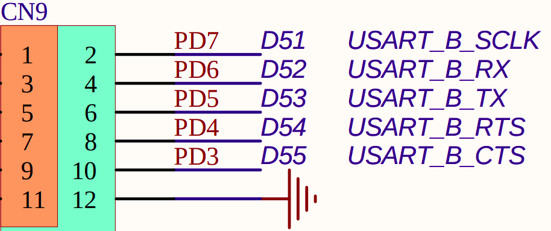
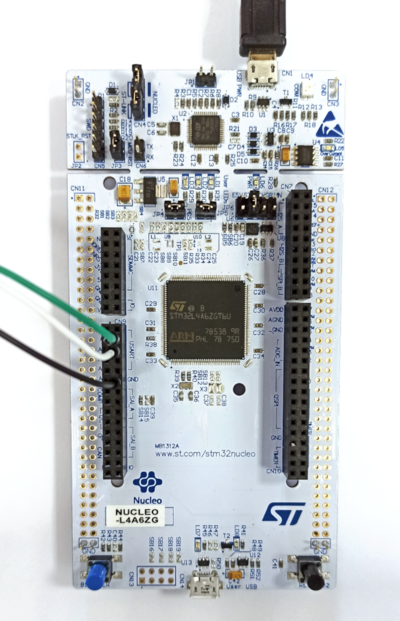
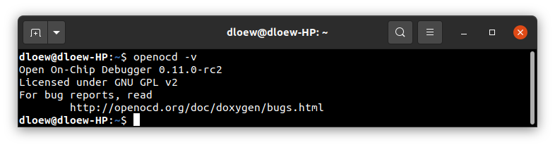

# Running system on `armv7m4-stm32l4x6-nucleo` (ST STM32L4x)

This version is designated for STM32L4x6 processors with Cortex-M4 core. To launch this version the final flash image
should be provided. The image is created as the final artifact of the `phoenix-rtos-project` building and is located in
the `_boot` directory. The image consists of a kernel, TTY UART driver, RAM disk filesystem, and psh (shell).

See [how to build the Phoenix-RTOS system image](../building/README.md).

## Development board

The easiest way to start programming hardware targets using Phoenix-RTOS is to get some of the evaluation boards with a
specified target processor or microcontroller.

In this case [NUCLEO-L4A6ZG](https://www.st.com/en/evaluation-tools/nucleo-l4a6zg.html#overview) is the example of a
board with `stm32l4x6` microcontroller.

## Connecting the board

To provide a power supply for the board and make flashing possible, you have to connect a USB to micro USB cable between
your host pc and the development board (`USB PWR` port, also called `CN1`).

To communicate with the board you will need to use a UART-USB converter, like `PL2303 TA`.

- Connect TX, RX, and GND wires to the USART2 (called also USART_B) in the Nucleo board.
  For example, using PL2303 TA:
  - PL2303 TX (green) - Nucleo USART_B_RX
  - PL2303 RX (white) - Nucleo USART_B_TX
  - PL2303 GND (black) - Nucleo GND

  

  Source: The Nucleo board's schematic, available on
  <https://www.st.com/en/evaluation-tools/nucleo-l4a6zg.html#cad-resources>

- Put the converter into your host PC's USB port

  The picture below presents how the board should be connected:

  

- Open serial port in terminal using picocom

  ```bash
  picocom -b 115200 --imap lfcrlf /dev/ttyUSB0
  ```

  <details>
  <summary>How to get picocom (Ubuntu 20.04)</summary>

  ```bash
  sudo apt-get update && \
  sudo apt-get install picocom
  ```

  </details>
  </br>

You can leave the terminal with the serial port open, and follow the next steps.

## Flashing the Phoenix-RTOS system image

To flash the image to the board you will need `openocd` in version 0.11. When installing openocd using `apt-get` version
can be out of date (0.10). You can check it using

```bash
openocd -v
```

  <details>
  <summary>How to get openocd in version 0.11 (Ubuntu 20.04)</summary>

- download `openocd-0.11.0-rc2` from [here](https://launchpad.net/ubuntu/+source/openocd)
- enter the downloaded directory

  ```bash
  cd openocd-0.11.0-rc2
  ```

- install openocd

  ```bash
  sudo apt-get install libusb-1.0 && ./configure --enable-stlink && make && sudo make install
  ```

- check if the version is correct

  ```bash
  openocd -v
  ```

  </br>
  
  </br>

  </details>

If you have openocd, next you can use the following script:

```bash
sudo phoenix-rtos-build/scripts/program-stm32l4x6.sh _boot/armv7m4-stm32l4x6-nucleo/phoenix.disk
```

or use openocd directly:

```bash
openocd -f interface/stlink.cfg \
-f target/stm32l4x.cfg -c "reset_config srst_only srst_nogate connect_assert_srst" \
-c "program _boot/armv7m4-stm32l4x6-nucleo/phoenix.disk 0x08000000 verify reset exit"
```


The script can be modified to accommodate other SWD interfaces.

## Using Phoenix-RTOS

Phoenix-RTOS will be launched and the `psh` shell command prompt will appear in the terminal with the serial port
opened.


- Note: You can also enter plo (Phoenix-RTOS loader) by pressing any button, for example, `enter` within some time after
reset (using `RESET B2`).

To get the available command list please type:

```plaintext
help
```


To get the list of working processes please type:

```bash
ps
```


## See also

1. [Running system on targets](README.md)
2. [Table of Contents](../README.md)
