# Running system on `armv7m7-imxrt106x-evk` (NXP i.MX RT106x)

This version is designed for NXP i.MX RT106x processors with ARM Cortex-M7 core. To launch this version the final disk
image and loader image should be provided. The images are created as the final artifacts of the `phoenix-rtos-project`
building and are located in the `_boot` directory. The disk image consists of the bootloader (plo), kernel, UART driver
(tty), dummyfs filesystem server (RAM disk), and psh (shell). Necessary tools to carry out the flashing process are
located in the `_boot` directory as well.

See [how to build the Phoenix-RTOS system image](../building/README.md).

## Development board

The easiest way to start programming hardware targets using Phoenix-RTOS is to get some evaluation boards with a
specified target processor or microcontroller.

<!-- markdownlint-disable -->
In this case [i. MX RT1064 - EVK](https://www.nxp.com/design/development-boards/i-mx-evaluation-and-development-boards/mimxrt1064-evk-i-mx-rt1064-evaluation-kit:MIMXRT1064-EVK)
<!-- markdownlint-restore -->

Is the example of a board with the `imxrt106x` processor, where the default configuration of peripherals allows running
Phoenix-RTOS.

## Connecting the board

- Firstly make sure, that the `J1` jumper is in a `3-4` position so that the power will be supplied from the `USB OTG`
port. This is the simplest way, but the good practice is using a USB hub. You can provide power using an AC adapter and
DC connector too (1-2 jumper position).

- To provide a power supply for the board and make flashing possible, you should connect a USB to micro USB cable
between your host pc and `USB OTG` (`J9`) of the development board. Do it first.

- To communicate with the board you will need to connect another USB cable, but to `DEBUG USB` port (`J14`). The onboard
UART-USB converter is used here.

  The picture below presents how the board should be connected:

  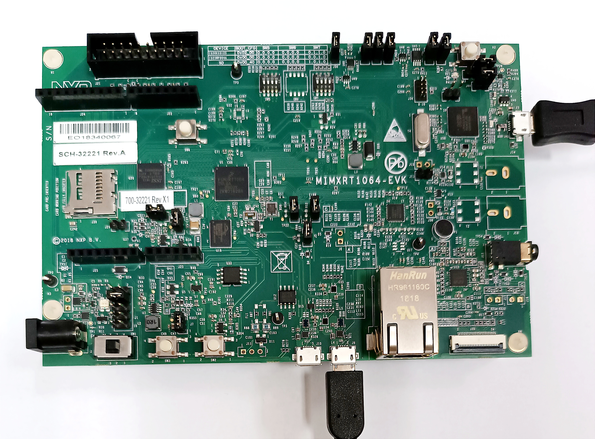

- Now you should verify what USB device on your host-pc is connected with the `DEBUG USB` (console). To check that run:

  - On Ubuntu:

  ```bash
  ls -l /dev/serial/by-id
  ```

  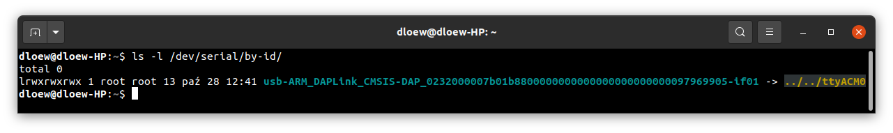

  - On macOS:

  ```bash
  ls -l /dev/tty.*
  ```

  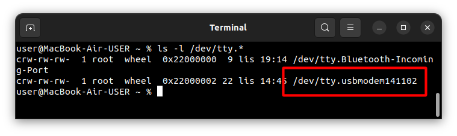

  If your output is like in the screenshot above, the console (`DEBUG USB` in the evaluation board) is on the `ACM0`
  port.

- When the board is connected to your host-pc, open serial port in terminal using picocom and type the console port
(in this case ACM0)

  ```bash
  picocom -b 115200 --imap lfcrlf /dev/tty[port]
  ```

  <details>
  <summary>How to get picocom and run it without privileges (Ubuntu 22.04)</summary>

  ```bash
  sudo apt-get update && \
  sudo apt-get install picocom
  ```

  To use picocom without sudo privileges run this command and then restart:

  ```bash
  sudo usermod -a -G tty <yourname>
  ```

  </details>
  </br>

  <details>
  <summary>How to get picocom (macOS)</summary>

  ```bash
  brew update &&\
  brew install picocom
  ```

  </details>
  </br>

You can leave the terminal with the serial port open, and follow the next steps.

## Flashing the Phoenix-RTOS system image

The process comes down to a few steps, described below.

### Uploading Phoenix-RTOS loader (PLO) to the RAM

In order to flash the disk image to the board, the bootloader (plo) image located in the `_boot` directory should be
uploaded to the RAM using `psu` (Phoenix Serial Uploader) via `SDP` (Serial Download Protocol).

NOTE: i. MX RT1064 should be set in Serial Download mode. Set the appropriate configuration of SW7 switch on
i.MX RT1064 - EVK, which is `0001` as it is shown below. If the configuration was different you should restart
the board after the change and open the serial port using picocom once again.

  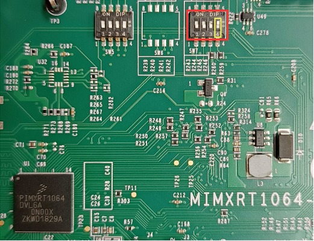

Change directory to `_boot/armv7m7-imxrt106x-evk` and run `psu` as follows:

```bash
cd _boot/armv7m7-imxrt106x-evk
```

```bash
sudo ./psu plo-ram.sdp
```

The plo user interface should appear in the console.

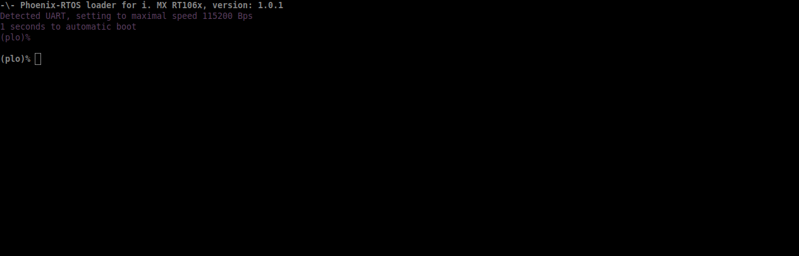

To get the available bootloader command list please type `help`.

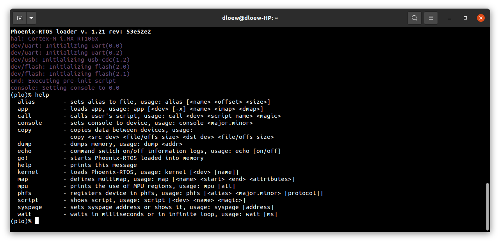

### Copying flash image using PHFS (phoenixd)

To flash the disk image, first, you need to verify on which port plo USB device has been appeared. You can check that
using `ls` as follows:

- On Ubuntu:

```bash
ls -l /dev/serial/by-id
```

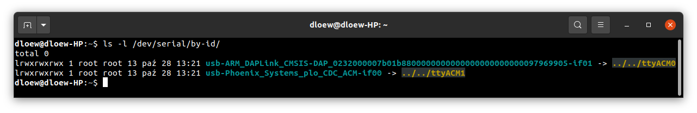

- On macOS:

```bash
ls -l /dev/tty.*
```


To share disk image to the bootloader, `phoenixd` has to be launched with the following arguments
(choose suitable ttyACMx device, in this case, ttyACM1):

```bash
sudo ./phoenixd -p /dev/tty[port] -b 115200 -s .
```

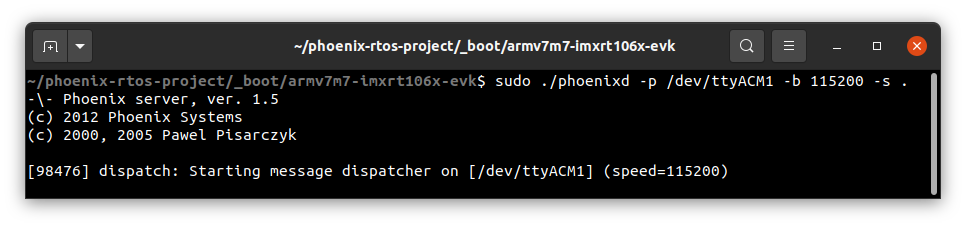

To start copying a file, write the following command in the console with plo interface:

```bash
copy usb0 phoenix.disk flash1 0x0 0x0
```

The `flash1` is the internal flash memory. The alternative option is to copy the system image to external
flash memory - `flash0`.

### Booting Phoenix-RTOS from internal Flash

To launch Phoenix-RTOS from flash memory, change SW7 switch to Internal Flash mode (`0010` configuration as presented
in the photo below) and restart the board (you can do it by pushing the `SW3` button).

  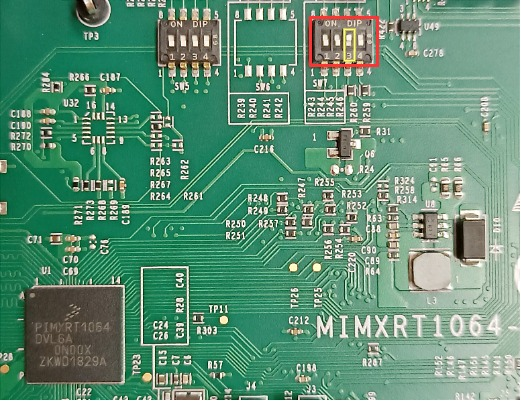

If everything has gone correctly, Phoenix-RTOS with the default configuration and the `psh` shell command prompt will
appear in the terminal after 2 seconds. If there is a need to enter the bootloader, the waiting for input should be
interrupted by pressing any key. Then you can exit plo by passing `go!` command.


## Using Phoenix-RTOS

If you want to get the available command list please type:

```plaintext
help
```

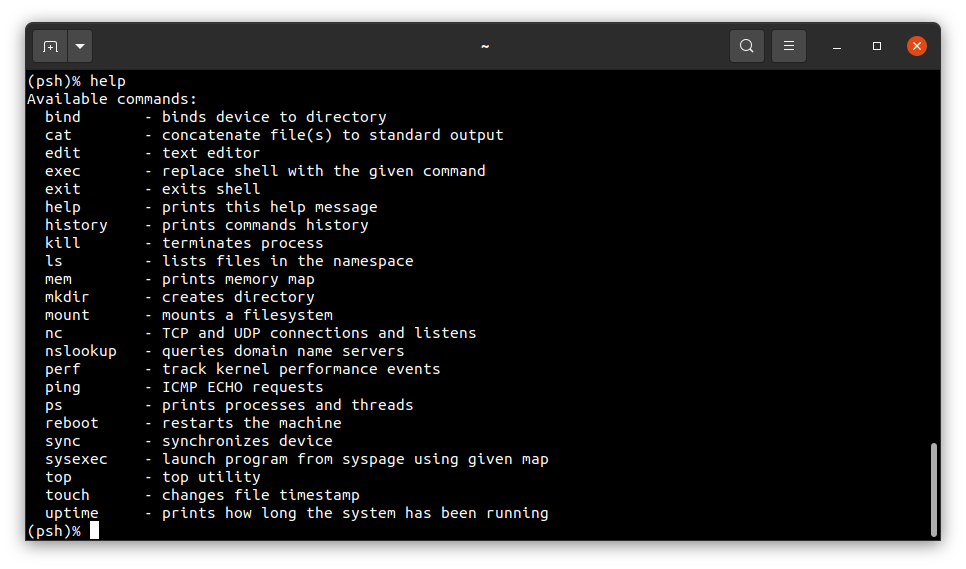

To get the list of working processes please type:

```plaintext
ps
```

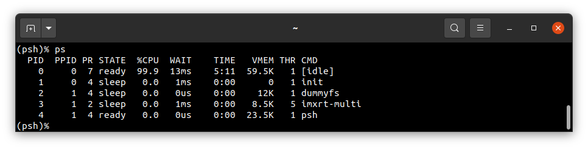

To get the table of processes please type:

```plaintext
top
```

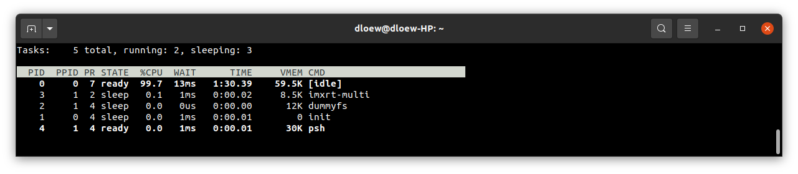

## See also

1. [Running system on targets](README.md)
2. [Table of Contents](../README.md)
