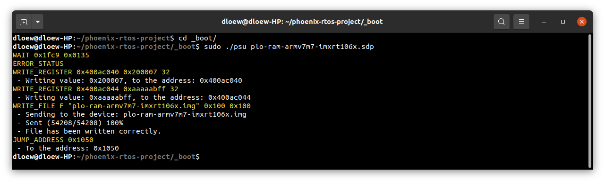
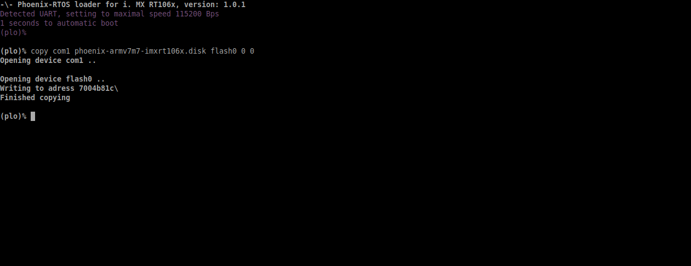
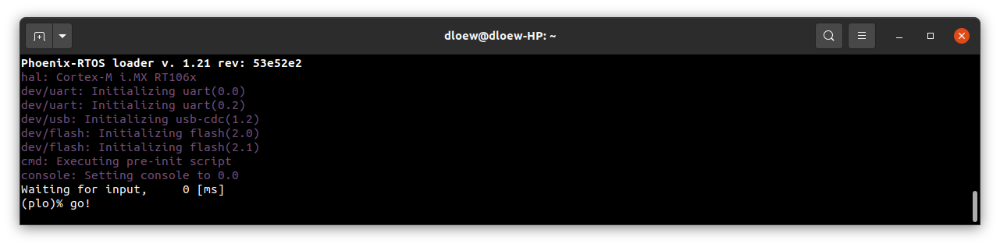
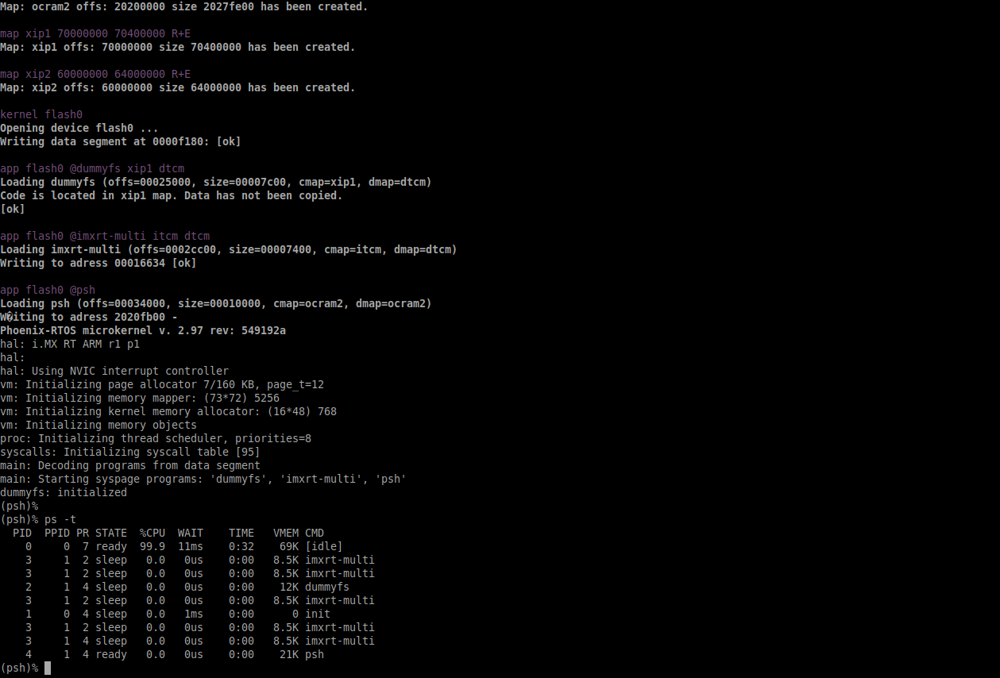

# Running system on `armv7m7-imxrt106x` (NXP i.MX RT106x)

This version is designed for NXP i.MX RT106x processors with ARM Cortex-M7 core. To launch this version the final disk image and loader image should be provided. The images are created as the final artifact of `phoenix-rtos-project` building and are located in `_boot` directory. The disk image consist of bootloader (plo), kernel, UART driver (tty), dummyfs filesystem server (RAM disk) and psh (shell). The necessary tools to carry out the flashing process are located in `_boot` directory as well.

## Development board

The esiest way to start programming hardware targets using Phoenix-RTOS is to get some of the evaluation boards with specified target processor or microcontroller. In this case [i. MX RT1064 - EVK](https://www.nxp.com/design/development-boards/i-mx-evaluation-and-development-boards/mimxrt1064-evk-i-mx-rt1064-evaluation-kit:MIMXRT1064-EVK) is the example of a board with the `imxrt106x` processor, where default configuration of peripherals allows to run Phoenix-RTOS.

## Connecting the board

- Firstly make sure, that the J1 jumper is in 3-5 position, so that the power will be supplied from `USB OTG` port.

- To provide a power supply for the board and make flashing possible, you should connect usb to micro usb cable between your host pc and `USB OTG` of the development board. Do it first.

- To communicate with the board you will need to connect the another usb cable, but to `DEBUG USB` port. The on-board uart-usb converter is used here.

- Now you should verify what USB device on your host-pc is connected with the `DEBUG USB` (console). In order to check that run:
	```bash
	ls -l /dev/serial/by-id
	```
	

	If your output is like in the screenshot above, the console (`DEBUG USB` in evaluation board) is on the ACM0 port.

- When the board is connected to your host-pc, open serial port in terminal using picocom and type the console port (in this case ACM0)
  ```bash
  picocom -b 115200 --imap lfcrlf /dev/ttyACM0
  ```
  <details>
  <summary>How to get picocom (Ubuntu 20.04)</summary>

  ```bash
  sudo apt-get update
  sudo apt-get install picocom
  ```

  </details>
  </br>

You can leave the terminal with serial port open, and follow the next steps.
## Flashing the Phoenix-RTOS system image

The process comes down to a few steps, described below.

### Uploading Phoenix-RTOS loader (plo) to the RAM memory

In order to flash the disk image to the board, the bootlader (plo) image located in `_boot` directory should be uploaded to the RAM memory using `psu` (Phoenix Serial Uploader) via SDP (Serial Download Protocol).

NOTE: i. MX RT1064 should be set in Serial Download mode. Set appropriate configuration of SW7 switch on i. MX RT1064 - EVK, which is `0001`. If the configuration was different you should restart the board after the change and open serial port using picocom once again.

Change directory to `_boot` and run `psu` as follow:

```bash
cd _boot/
sudo ./psu plo-ram-armv7m7-imxrt106x.sdp
```
The following output is expected:



The plo user interface should appear in the console.


To get the available bootloader command list please type `help`.


### Copying flash image using PHFS (phoenixd)

To flash the disk image, first you need to verify on which port plo usb device has been appeared. You can check that using `ls` as follow:
```bash
ls -l /dev/serial/by-id
```


To share disk image to the bootloader, `phoenixd` has to be launched with the following arguments (choose suitable ttyACMx device, in this case ttyACM1):

```bash
sudo ./phoenixd -k ../_build/armv7m7-imxrt106x/prog/phoenix-armv7m7-imxrt106x.elf -p /dev/ttyACM1 -b 115200 -s .
```


To start copying file, write the following command in the console with plo interface:

```bash
copy usb0 phoenix-armv7m7-imxrt106x.disk flash0 0x0 0x0
```



### Booting Phoenix-RTOS from internal Flash

To launch Phoenix-RTOS from flash memory, change SW7 switch to Internal Flash mode (`0010` configuration) and restart the board.

If everything has gone correctly, the bootloader should appear in the terminal, with a console opened. Now you should type `go!` command.
As a result Phoenix-RTOS with default configuration and `psh` shell command prompt will appear in the terminal.




## Using Phoenix-RTOS


To get the list of working threads and processes please type `ps -t`.




To get the table of processes please type `top`.


## See also

1. [Running system on targets](README.md)
2. [Table of Contents](../README.md)

