# Running system on <nobr>armv7m7-imxrt117x-evk</nobr>

This version is designed for NXP i.MX RT117x processors with ARM Cortex-M7 core. To launch this version the final disk
image and loader image should be provided. The images are created as the final artifacts of the `phoenix-rtos-project`
building and are located in the `_boot` directory. The disk image consists of the bootloader (plo), kernel, UART driver
(tty), dummyfs filesystem server (RAM disk), and `psh` (shell). Necessary tools to carry out the flashing process are
located in the `_boot` directory as well.

See [how to build the Phoenix-RTOS system image](../building/README.md).

## Development board

The easiest way to start programming hardware targets using Phoenix-RTOS is to get some evaluation boards with a
specified target processor or microcontroller.

<!-- markdownlint-disable -->
 In this case [MIMXRT1170-EVK](https://www.nxp.com/design/development-boards/i-mx-evaluation-and-development-boards/i-mx-rt1170-evaluation-kit:MIMXRT1170-EVK)
<!-- markdownlint-enable -->

Is the example of a board with the `imxrt117x` processor, where the default configuration of peripherals allows running
Phoenix-RTOS.

## Connecting the board

- Firstly make sure, that the `J38` jumper is in the `3-4` position, so that the power will be supplied from the
`USB OTG` port. It is the simplest way, but the good practice is using a USB hub. You can provide power using an AC
adapter and DC connector too (1-2 jumper position).

- To provide a power supply for the board and make flashing possible, you should connect a USB to micro USB cable
between your host pc and `USB OTG` (`J20`) of the development board. Do it first.

- To communicate with the board you will need to connect another USB cable, but to `DEBUG USB` port (`J11`). The
onboard UART-USB converter is used here.

  The picture below presents how the board should be connected:

  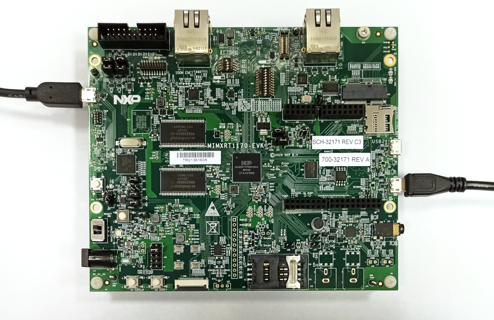

- Now you should verify what USB device on your host-pc is connected with the `DEBUG USB` (console). In order to check
that run:

- On Ubuntu:

  ```text
  ls -l /dev/serial/by-id
  ```

  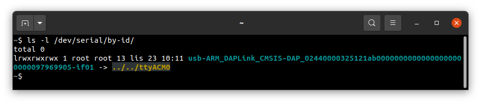

  - On macOS:

  ```text
  ls -l /dev/tty.*
  ```

  

  If your output is like in the screenshot above, the console (`DEBUG USB` in the evaluation board) is on the `ACM0`
  port.

- When the board is connected to your host-pc, open serial port in terminal using picocom and type the console port
(in this case ACM0)

  ```text
  picocom -b 115200 --imap lfcrlf /dev/tty[port]
  ```

  <details>
  <summary>How to get picocom and run it without privileges (Ubuntu 22.04)</summary>

  ```text
  sudo apt-get update && \
  sudo apt-get install picocom
  ```

  To use picocom without sudo privileges run this command and then restart:

  ```text
  sudo usermod -a -G tty <yourname>
  ```

  </details>
  </br>

  <details>
  <summary>How to get picocom (macOS)</summary>

  ```text
  brew update &&\
  brew install picocom
  ```

  </details>
  </br>

You can leave the terminal with the serial port open, and follow the next steps.

## Flashing the Phoenix-RTOS system image

The process comes down to a few steps, described below.

### Uploading Phoenix-RTOS loader (plo) to the RAM memory

To flash the disk image to the board, the bootloader (plo) image located in the `_boot` directory should be uploaded to
the RAM using `psu` (Phoenix Serial Uploader) via `SDP` (Serial Download Protocol).

NOTE: `i. MX RT1176` should be set in Serial Download mode. Set the appropriate configuration of the `SW1` switch on
 `MIMXRT1170-EVK`, which is `0001`. If the configuration was different you should restart the board after the
 change and open the serial port using picocom once again.

Change directory to `_boot` and run `psu` as follows:

```text
cd _boot/armv7m7-imxrt117x-evk
```

```text
sudo ./psu plo-ram.sdp
```

The plo user interface should appear in the console.

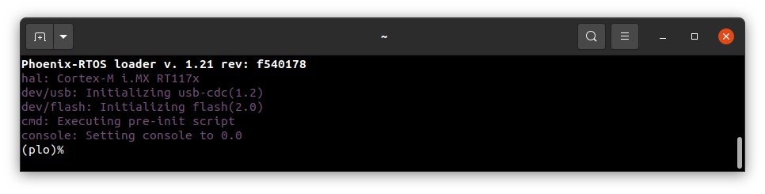

To get the available bootloader command list please type `help`.

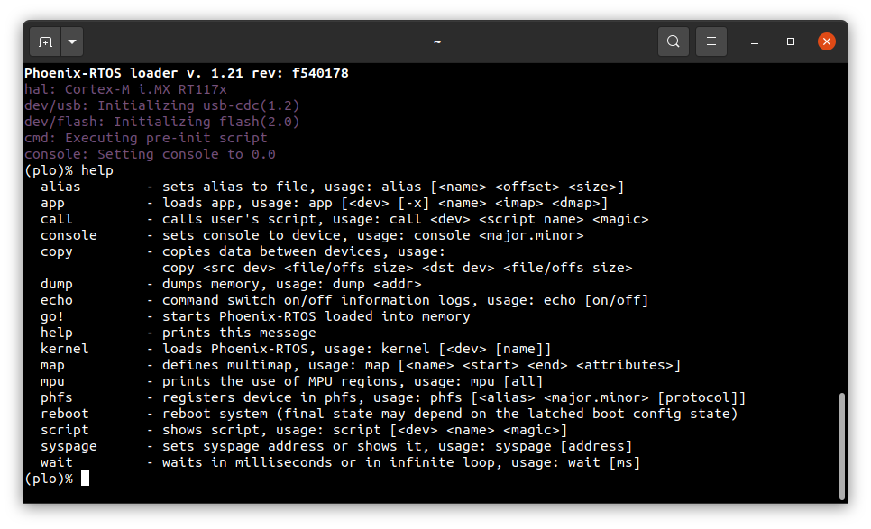

### Copying flash image using PHFS (phoenixd)

To flash the disk image, first, you need to verify on which port plo USB device has appeared. You can check that using
`ls` as follows:

- On Ubuntu:

```text
ls -l /dev/serial/by-id
```

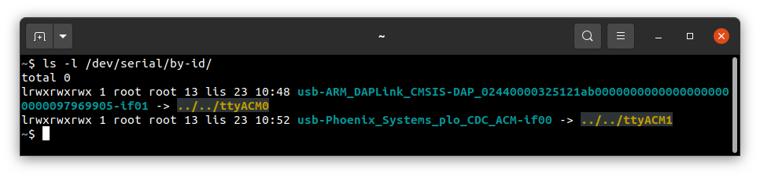

- On macOS:

```text
ls -l /dev/tty.*
```

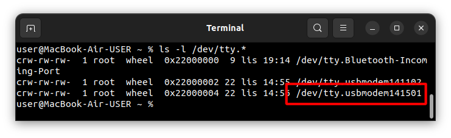

To share disk image to the bootloader, `phoenixd` has to be launched with the following arguments (choose suitable
ttyACMx device, in this case, ttyACM1):

```text
sudo ./phoenixd -p /dev/tty[port] -b 115200 -s .
```

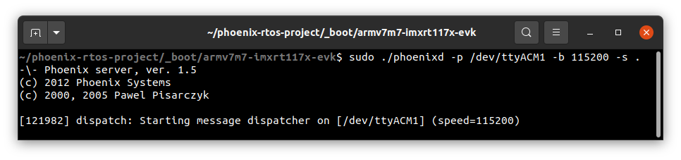

To start copying a file, write the following command in the console with plo interface:

```text
copy usb0 phoenix.disk flash0 0x0 0x0
```

The `flash0` is the external flash memory.

### Booting Phoenix-RTOS from Flash

To launch Phoenix-RTOS from flash memory, change the `SW1` switch to Internal Boot mode (`0010` configuration) and
restart the board (you can do it by pushing the `SW4` button).

If everything has gone correctly, Phoenix-RTOS with the default configuration and the `psh` shell command prompt will
appear in the terminal after 2 seconds. If there is a need to enter the bootloader, the waiting for input should be
interrupted by pressing any key. Then you can exit plo by passing `go!` command.

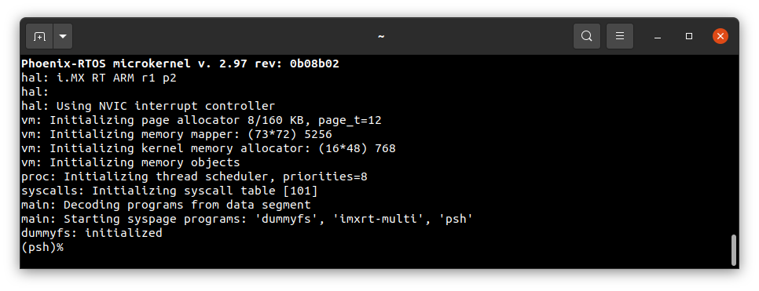

## Using Phoenix-RTOS

If you want to get the available command list please type:

```text
help
```

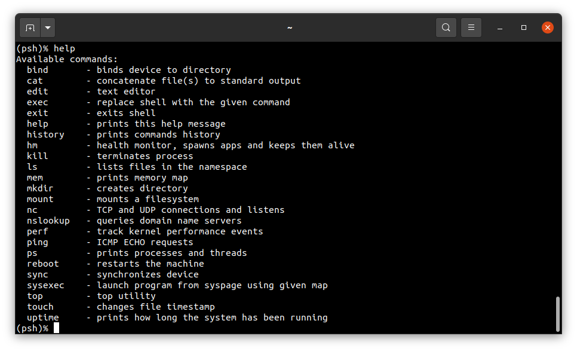

To get the list of working processes please type:

```text
ps
```

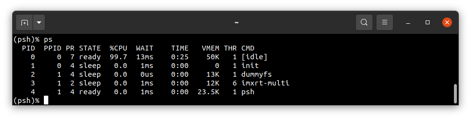

To get the table of processes please type:

```text
top
```

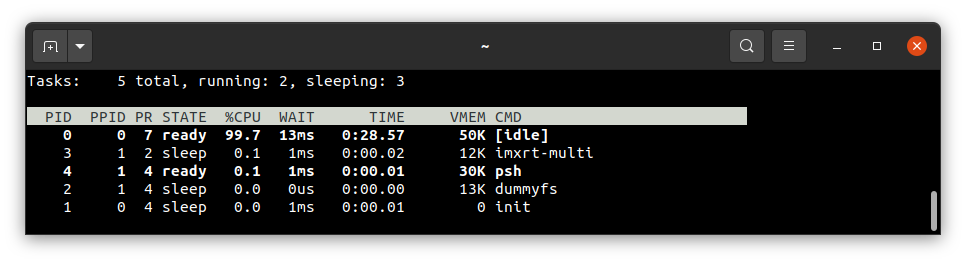

## See also

1. [Running system on targets](README.md)
2. [Table of Contents](../README.md)
