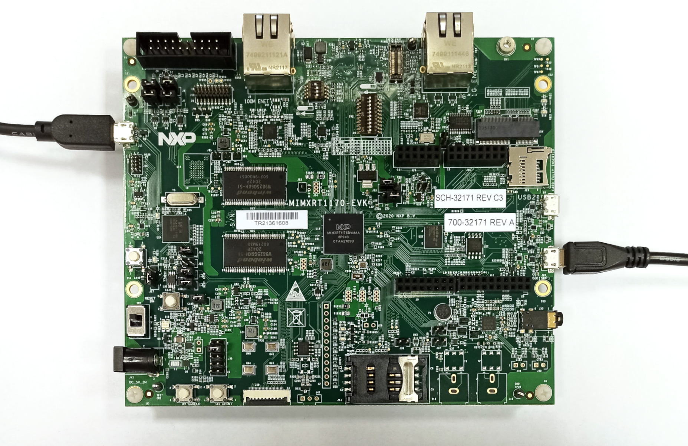

# Running system on <nobr>armv7m7-imxrt117x-evk</nobr>

This version is designed for NXP i.MX RT117x processors with ARM Cortex-M7 core. To launch this version the final disk
image and loader image should be provided. The images are created as the final artifacts of the `phoenix-rtos-project`
building and are located in the `_boot` directory. The disk image consists of the bootloader (plo), kernel, UART driver
(tty), dummyfs filesystem server (RAM disk), and `psh` (shell). Necessary tools to carry out the flashing process are
located in the `_boot` directory as well.

See [Building](../building/index.md) chapter.

## Development board

The easiest way to start programming hardware targets using Phoenix-RTOS is to get some evaluation boards with a
specified target processor or microcontroller.

<!-- markdownlint-disable -->
 In this case [MIMXRT1170-EVK](https://www.nxp.com/design/development-boards/i-mx-evaluation-and-development-boards/i-mx-rt1170-evaluation-kit:MIMXRT1170-EVK)
<!-- markdownlint-enable -->

Is the example of a board with the `imxrt117x` processor, where the default configuration of peripherals allows running
Phoenix-RTOS.

## Connecting the board

- Firstly make sure, that the `J38` jumper is in the `3-4` position, so that the power will be supplied from the
`USB OTG` port. It is the simplest way, but the good practice is using a USB hub. You can provide power using an AC
adapter and DC connector too (1-2 jumper position).

- To provide a power supply for the board and make flashing possible, connect a USB to micro USB cable
between your host pc and `USB OTG` (`J20`) of the development board. Do it first.

- To communicate with the board connect another USB cable, but to `DEBUG USB` port (`J11`). The
onboard UART-USB converter is used here.

  Board connections:

  

- Verify what USB device on your host-pc is connected with the `DEBUG USB` (console). To check
that run:

- On Ubuntu:

  ```shell
  ls -l /dev/serial/by-id
  ```

  ```
  ~$ ls -l /dev/serial/by-id/
  total 0
  lrwxrwxrwx 1 root root 13 lis 23 10:11 usb-ARM_DAPLink_CMSIS-DAP_02440000325121ab000000000000000000000097969905-if01 -> ../../ttyACM0
  ~$
  ```

  If the output matches, the console (`DEBUG USB` in the evaluation board) is on the `ACM0`
  port.

- When the board is connected to your host-pc, open serial port in terminal using picocom and type the console port
(in this case ACM0)

  ```shell
  picocom -b 115200 --imap lfcrlf /dev/tty[port]
  ```

  <details>
  <summary>How to get picocom and run it without privileges (Ubuntu 22.04)</summary>

  ```shell
  sudo apt-get update && \
  sudo apt-get install picocom
  ```

  To use picocom without sudo privileges run this command and then restart:

  ```shell
  sudo usermod -a -G tty <yourname>
  ```

  </details>
  </br>

You can leave the terminal with the serial port open, and follow the next steps.

## Flashing the Phoenix-RTOS system image

The process comes down to a few steps, described below.

### Uploading Phoenix-RTOS loader (plo) to the RAM memory

To flash the disk image to the board, the bootloader (plo) image located in the `_boot` directory should be uploaded to
the RAM using `psu` (Phoenix Serial Uploader) via SDP (Serial Download Protocol).

NOTE: `i. MX RT1176` should be set in Serial Download mode. Set the appropriate configuration of the `SW1` switch on
 `MIMXRT1170-EVK`, which is `0001`. If the configuration was different restart the board after the
 change and open the serial port using picocom once again.

Change directory to `_boot` and run `psu` as follows:

```shell
cd _boot/armv7m7-imxrt117x-evk
```

```shell
sudo ./psu plo-ram.sdp
```

The plo user interface should appear in the console.

```
Phoenix-RTOS loader v. 1.21 rev: f540178
hal: Cortex-M i.MX RT117x
dev/usb: Initializing usb-cdc(1.2)
dev/flash: Initializing flash(2.0)
cmd: Executing pre-init script
console: Setting console to 0.0
(plo)%
```

Type `help`.

```
(plo)% help
  alias       - sets alias to file, usage: alias [<name> <offset> <size>]
  app         - loads app, usage: app [<dev> [-x] <name> <imap> <dmap>]
  call        - calls user's script, usage: call <dev> <script name> <magic>
  console     - sets console to device, usage: console <major.minor>
  copy        - copies data between devices, usage:
                  copy <src dev> <file/offs size> <dst dev> <file/offs size>
  dump        - dumps memory, usage: dump <addr>
  echo        - command switch on/off information logs, usage: echo [on/off]
  go!         - starts Phoenix-RTOS loaded into memory
  help        - prints this message
  kernel      - loads Phoenix-RTOS, usage: kernel [<dev> [name]]
  map         - defines multimap, usage: map [<name> <start> <end> <attributes>]
  mpu         - prints the use of MPU regions, usage: mpu [all]
  phfs        - registers device in phfs, usage: phfs [<alias> <major.minor> [protocol]]
  reboot      - reboot system (final state may depend on the latched boot config state)
  script      - shows script, usage: script [<dev> <name> <magic>]
  syspage     - sets syspage address or shows it, usage: syspage [address]
  wait        - waits in milliseconds or in infinite loop, usage: wait [ms]
(plo)%
```

### Copying flash image using PHFS (phoenixd)

To flash the disk image, first, verify on which port plo USB device has appeared. Check with
`ls` as follows:

- On Ubuntu:

```shell
ls -l /dev/serial/by-id
```

```
~$ ls -l /dev/serial/by-id/
total 0
lrwxrwxrwx 1 root root 13 lis 23 10:48 usb-ARM_DAPLink_CMSIS-DAP_02440000325121ab000000000000000000000097969905-if01 -> ../../ttyACM0
lrwxrwxrwx 1 root root 13 lis 23 10:52 usb-Phoenix_Systems_plo_CDC_ACM-if00 -> ../../ttyACM1
~$
```

Launch `phoenixd` to share the disk image with the bootloader (choose suitable
ttyACMx device, in this case, ttyACM1):

```shell
sudo ./phoenixd -p /dev/tty[port] -b 115200 -s .
```

```
~/phoenix-rtos-project/_boot/armv7m7-imxrt117x-evk$ sudo ./phoenixd -p /dev/ttyACM1 -b 115200 -s .
-\- Phoenix server, ver. 1.5
(c) 2012 Phoenix Systems
(c) 2000, 2005 Pawel Pisarczyk

[121982] dispatch: Starting message dispatcher on [/dev/ttyACM1] (speed=115200)
```

To start copying a file, write the following command in the console with plo interface:

```shell
copy usb0 phoenix.disk flash0 0x0 0x0
```

The `flash0` is the external flash memory.

### Booting Phoenix-RTOS from Flash

To launch Phoenix-RTOS from flash memory, change the `SW1` switch to Internal Boot mode (`0010` configuration) and
restart the board (you can do it by pushing the `SW4` button).

If everything has gone correctly, Phoenix-RTOS with the default configuration and the `psh` shell command prompt will
appear in the terminal after 2 seconds. If there is a need to enter the bootloader, the waiting for input should be
interrupted by pressing any key. Then you can exit plo by passing `go!` command.

```
Phoenix-RTOS microkernel v. 2.97 rev: 10b7a77
hal: NXP i.MX RT117x ARMv7 Cortex-M7 r1 p2
hal: FPU, MPU, Thumb
hal: Using NVIC interrupt controller
vm: Initializing page allocator 8/160 KB, page_t=12
vm: Initializing memory mapper: (73*72) 5256
vm: Initializing kernel memory allocator: (16*48) 768
vm: Initializing memory objects
proc: Initializing thread scheduler, priorities=8
syscalls: Initializing syscall table [102]
main: Starting syspage programs: 'dummyfs', 'imxrt-multi', 'psh'
dummyfs: initialized
(psh)%
```

## Using Phoenix-RTOS

Once booted, the `psh` shell prompt appears. See [Shell basics](psh-basics.md) for an introduction to
the available shell commands, process inspection, and running programs.
