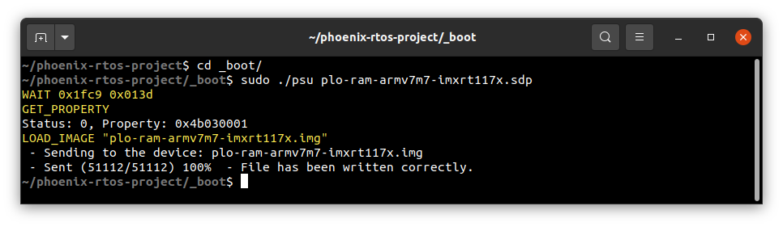
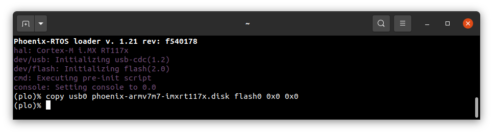
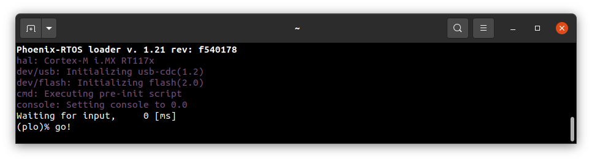

# Running system on `armv7m7-imxrt117x` (NXP i.MX RT106x)

This version is designed for NXP i.MX RT117x processors with ARM Cortex-M7 core. To launch this version the final disk image and loader image should be provided. The images are created as the final artifacts of the `phoenix-rtos-project` building and are located in the `_boot` directory. The disk image consists of the bootloader (plo), kernel, UART driver (tty), dummyfs filesystem server (RAM disk), and `psh` (shell). Necessary tools to carry out the flashing process are located in the `_boot` directory as well.

## Development board

The easiest way to start programming hardware targets using Phoenix-RTOS is to get some of the evaluation boards with a specified target processor or microcontroller. In this case [MIMXRT1170-EVK](https://www.nxp.com/design/development-boards/i-mx-evaluation-and-development-boards/i-mx-rt1170-evaluation-kit:MIMXRT1170-EVK) is the example of a board with the `imxrt117x` processor, where the default configuration of peripherals allows to run Phoenix-RTOS.

## Connecting the board

- Firstly make sure, that the J38 jumper is in the `3-4` position so that the power will be supplied from the `USB OTG` port. It is the simplest way, but the good practice is using a USB hub. You can provide power using an AC adapter and DC connector too. (1-2 jumper position)

- To provide a power supply for the board and make flashing possible, you should connect a USB to micro USB cable between your host pc and `USB OTG` (`J20`) of the development board. Do it first.

- To communicate with the board you will need to connect another USB cable, but to `DEBUG USB` port (`J11`). The onboard UART-USB converter is used here.

- Now you should verify what USB device on your host-pc is connected with the `DEBUG USB` (console). In order to check that run:

  ```bash
  ls -l /dev/serial/by-id
  ```

  </br>
  
  </br>

  If your output is like in the screenshot above, the console (`DEBUG USB` in the evaluation board) is on the ACM0 port.

- When the board is connected to your host-pc, open serial port in terminal using picocom and type the console port (in this case ACM0)

  ```
  picocom -b 115200 --imap lfcrlf /dev/ttyACM0
  ```

  <details>
  <summary>How to get picocom (Ubuntu 20.04)</summary>

  ```
  sudo apt-get update && \
  sudo apt-get install picocom
  ```

  </details>
  </br>

You can leave the terminal with the serial port open, and follow the next steps.
## Flashing the Phoenix-RTOS system image

The process comes down to a few steps, described below.

### Uploading Phoenix-RTOS loader (plo) to the RAM memory

To flash the disk image to the board, the bootloader (plo) image located in the `_boot` directory should be uploaded to the RAM using `psu` (Phoenix Serial Uploader) via SDP (Serial Download Protocol).

NOTE: `i. MX RT1176` should be set in Serial Download mode. Set the appropriate configuration of the `SW1` switch on `MIMXRT1170-EVK`, which is `0001`. If the configuration was different you should restart the board after the change and open the serial port using picocom once again.

Change directory to `_boot` and run `psu` as follow:

```
cd _boot/
```

```
sudo ./psu plo-ram-armv7m7-imxrt117x.sdp
```
The following output is expected:



The plo user interface should appear in the console.


To get the available bootloader command list please type `help`.


### Copying flash image using PHFS (phoenixd)

To flash the disk image, first, you need to verify on which port plo USB device has appeared. You can check that using `ls` as follow:
```bash
ls -l /dev/serial/by-id
```


To share disk image to the bootloader, `phoenixd` has to be launched with the following arguments (choose suitable ttyACMx device, in this case, ttyACM1):

```bash
sudo ./phoenixd -k ../_build/armv7m7-imxrt117x/prog/phoenix-armv7m7-imxrt117x.elf -p /dev/ttyACM1 -b 115200 -s .
```


To start copying a file, write the following command in the console with plo interface:

```bash
copy usb0 phoenix-armv7m7-imxrt117x.disk flash0 0x0 0x0
```



The `flash0` is the external flash memory.

### Booting Phoenix-RTOS from Flash

To launch Phoenix-RTOS from flash memory, change the `SW1` switch to Internal Boot mode (`0010` configuration) and restart the board (you can do it by pushing the `SW4` button).

If everything has gone correctly, the bootloader should appear in the terminal, with a console opened. Now you should type the `go!` command.
As a result, Phoenix-RTOS with the default configuration and the `psh` shell command prompt will appear in the terminal.



</br>


## Using Phoenix-RTOS

If you want to get the available command list please type:

```
help
```


To get the list of working processes please type:

```bash
ps
```


To get the table of processes please type:

```bash
top
```


## See also

1. [Running system on targets](README.md)
2. [Table of Contents](../README.md)