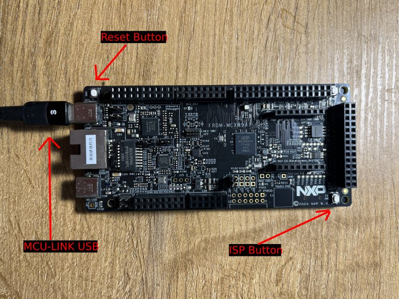
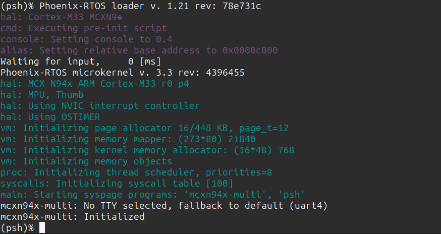
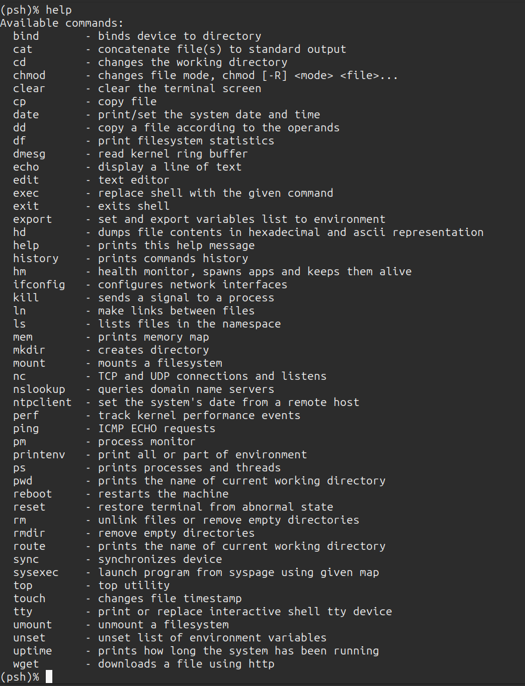
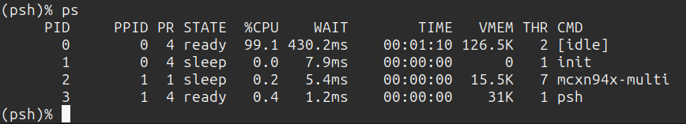

# Running system on <nobr>armv8m33-mcxn94x-frdm</nobr>

These instructions describe how to run Phoenix-RTOS on the `armv8m33-mcxn94x-frdm` target. Note that the build
artifacts, including the system image should be provided in the `_boot` directory. If you have not built the system
image yet, please refer to the [Building Phoenix-RTOS image](../building/index.md) section.

## Connecting the board

Connect the board to the computer using the USB-C port marked `MCU LINK` (see the attached picture).
This USB port provides debug interface along with a TTY channel for ISP and system shell.



## Flashing the Phoenix-RTOS system image

<details>
<summary> Flashing the Phoenix-RTOS system image with Pyocd</summary>
The process comes down to a few steps, described below.

### Installing PYOCD

Pyocd can be installed using:

```console
python3 -m pip install pyocd
```

#### Installing PYOCD from source

from PyOCD GitHub, you can do the following:

```console
python3 -m pip install --pre -U git+https://github.com/pyocd/pyOCD.git
PATH=$PATH:$HOME/.local/bin
```

For complete support of the MCXN94x target, it is necessary to install the corresponding device family
 pack for PyOCD (it may take a while):

```console
pyocd pack install mcxn947 -c -u
```

When the board is connected to the port and PyOCD is installed with MCXN94x support, you can upload the image:

```console
pyocd flash _boot/armv8m33-mcxn94x-frdm/phoenix.disk --target=mcxn947 --format=bin
```

The image will be uploaded:

```console
pyocd flash _boot/armv8m33-mcxn94x-frdm/phoenix.disk --target=mcxn947 --format=bin  

W DFP device definition conflict: specified default reset sequence ResetSystem for core #1 (cm33_core1) is disabled by the DFP [pack_target]
I Loading phoenix-rtos-project/_boot/armv8m33-mcxn94x-frdm/phoenix.disk [load_cmd]
[==================================================] 100%
I Erased 303104 bytes (37 sectors), programmed 296960 bytes (580 pages), skipped 0 bytes (0 pages) at 17.19 kB/s
```

After the upload has been completed, the board will self-restart, and Phoenix-RTOS will boot up.

</details>

<details>
<summary>Flashing the Phoenix-RTOS system image with ISP</summary>

Phoenix-RTOS provides a limited, yet simple and effective utility for flashing the image to the board - MCXISP.
It is built along with the `armv8m33-mcxn94x-frdm` and available in the `_boot` directory.

Usage:

```console
$ ./mcxisp
MCX N94x series UART ISP util
Usage: ./mcxisp -f program file -t ISP tty
```

Connect the board via the `MCU LINK` USB-C port. TTY link will become available. To find out the assigned tty
device:

```console
# dmesg
(...)
usb 1-1.1: Product: MCU-LINK FRDM-MCXN947 (r0E7) CMSIS-DAP V3.128
usb 1-1.1: Manufacturer: NXP Semiconductors
cdc_acm 1-1.1:1.2: ttyACM0: USB ACM device
```

In this case it's `ttyACM0`.

To enter the ISP mode (that allows the image flashing) hold the `ISP` button and when holding it down,
momentarily press the `Reset` button. MCX N947 will enter the ISP mode and `MCXISP` tool can be used.

To upload the image:

```console
./mcxisp -f phoenix.disk -t /dev/ttyACM0
```

The image will be uploaded:

```console
Connecting to the target...
Connected.
Flash erase...
Erased.
Uploading file...
Progress: 288/288 KiB
Done.
Reseting target...
Done.
```

If the tool fails to connect to the board (`target invalid response` message is seen), enter the ISP
mode again using buttons on the board, while the tool is trying to reconnect.

After the upload has been completed, the board is reset and Phoenix-RTOS is started.
</details>

## Using Phoenix-RTOS

The system console is available on the same TTY that was used earlier to upload the system image.

Phoenix-RTOS will be launched and the `psh` shell command prompt will appear in the terminal.



- Note: You can also enter `plo` by pressing any button within some time after reset.

To get the available command list type:

```console
help
```



To get the list of working processes type:

```console
ps
```


