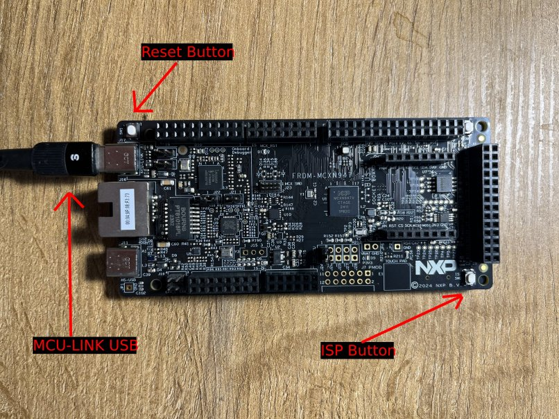

# Running system on <nobr>armv8m33-mcxn94x-frdm</nobr>

These instructions describe how to run Phoenix-RTOS on the `armv8m33-mcxn94x-frdm` target. Note that the build
artifacts, including the system image should be provided in the `_boot` directory. If you have not built the system
image yet, please refer to the [Building Phoenix-RTOS image](../building/index.md) section.

## Connecting the board

Connect the board to the computer using the USB-C port marked `MCU LINK` (see the attached picture).
This USB port provides debug interface along with a TTY channel for ISP and system shell.



## Flashing the Phoenix-RTOS system image

Phoenix-RTOS provides a limited, yet simple and effective utility for flashing the image to the board - MCXISP.
It is built along with the `armv8m33-mcxn94x-frdm` and available in the `_boot` directory.

Usage:

```shell
$ ./mcxisp
MCX N94x series UART ISP util
Usage: ./mcxisp -f program file -t ISP tty
```

Connect the board via the `MCU LINK` USB-C port. TTY link will become available. To find out the assigned tty
device:

```shell
# dmesg
(...)
usb 1-1.1: Product: MCU-LINK FRDM-MCXN947 (r0E7) CMSIS-DAP V3.128
usb 1-1.1: Manufacturer: NXP Semiconductors
cdc_acm 1-1.1:1.2: ttyACM0: USB ACM device
```

In this case it's `ttyACM0`.

To enter the ISP mode (that allows the image flashing) hold the `ISP` button and when holding it down,
momentarily press the `Reset` button. MCX N947 will enter the ISP mode and `MCXISP` tool can be used.

To upload the image:

```shell
./mcxisp -f phoenix.disk -t /dev/ttyACM0
```

The image will be uploaded:

```shell
Connecting to the target...
Connected.
Flash erase...
Erased.
Uploading file...
Progress: 288/288 KiB
Done.
Reseting target...
Done.
```

If the tool fails to connect to the board (`target invalid response` message is seen), enter the ISP
mode again using buttons on the board, while the tool is trying to reconnect.

After the upload has been completed, the board is reset and Phoenix-RTOS is started.

## Using Phoenix-RTOS

The system console is available on the same TTY that was used earlier to upload the system image.

Phoenix-RTOS will be launched and the `psh` shell command prompt will appear in the terminal.

```
Phoenix-RTOS loader v. 1.21 rev: 78e731c
hal: Cortex-M33 MCXN94x
cmd: Executing pre-init script
console: Setting console to 0.4
alias: Setting relative base address to 0x0000c800
Waiting for input,     0 [ms]
Phoenix-RTOS microkernel v. 3.3 rev: 4396455
hal: MCX N94x ARM Cortex-M33 r0 p4
hal: MPU, Thumb
hal: Using NVIC interrupt controller
hal: Using OSTIMER
vm: Initializing page allocator 16/448 KB, page_t=12
vm: Initializing memory mapper: (273*80) 21840
vm: Initializing kernel memory allocator: (16*48) 768
vm: Initializing memory objects
proc: Initializing thread scheduler, priorities=8
syscalls: Initializing syscall table [100]
main: Starting syspage programs: 'mcxn94x-multi', 'psh'
mcxn94x-multi: No TTY selected, fallback to default (uart4)
mcxn94x-multi: Initialized
(psh)%
```

- Note: You can also enter `plo` by pressing any button within some time after reset.

To get the available command list type:

```shell
help
```

```
(psh)% help
Available commands:
  bind        - binds device to directory
  cat         - concatenate file(s) to standard output
  cd          - changes the working directory
  chmod       - changes file mode, chmod [-R] <mode> <file>...
  clear       - clear the terminal screen
  cp          - copy file
  date        - print/set the system date and time
  dd          - copy a file according to the operands
  df          - print filesystem statistics
  dmesg       - read kernel ring buffer
  echo        - display a line of text
  edit        - text editor
  exec        - replace shell with the given command
  exit        - exits shell
  export      - set and export variables list to environment
  hd          - dumps file contents in hexadecimal and ascii representation
  help        - prints this help message
  history     - prints commands history
  hm          - health monitor, spawns apps and keeps them alive
  ifconfig    - configures network interfaces
  kill        - sends a signal to a process
  ln          - make links between files
  ls          - lists files in the namespace
  mem         - prints memory map
  mkdir       - creates directory
  mount       - mounts a filesystem
  nc          - TCP and UDP connections and listens
  nslookup    - queries domain name servers
  ntpclient   - set the system's date from a remote host
  perf        - track kernel performance events
  ping        - ICMP ECHO requests
  pm          - process monitor
  printenv    - print all or part of environment
  ps          - prints processes and threads
  pwd         - prints the name of current working directory
  reboot      - restarts the machine
  reset       - restore terminal from abnormal state
  rm          - unlink files or remove empty directories
  rmdir       - remove empty directories
  route       - prints the name of current working directory
  sync        - synchronizes device
  sysexec     - launch program from syspage using given map
  top         - top utility
  touch       - changes file timestamp
  tty         - print or replace interactive shell tty device
  umount      - unmount a filesystem
  unset       - unset list of environment variables
  uptime      - prints how long the system has been running
  wget        - downloads a file using http
(psh)%
```

To get the list of working processes type:

```shell
ps
```

```
(psh)% ps
  PID    PPID  PR  STATE  %CPU      WAIT       TIME  VMEM THR CMD
    0       0   4  ready  99.1   430.2ms   00:01:10 126.5K   2 [idle]
    1       0   4  sleep   0.0    7.9ms    00:00:00     0   1 init
    2       1   1  sleep   0.2    5.4ms    00:00:00  15.5K   7 mcxn94x-multi
    3       1   4  ready   0.4    1.2ms    00:00:00    31K   1 psh
(psh)%
```
