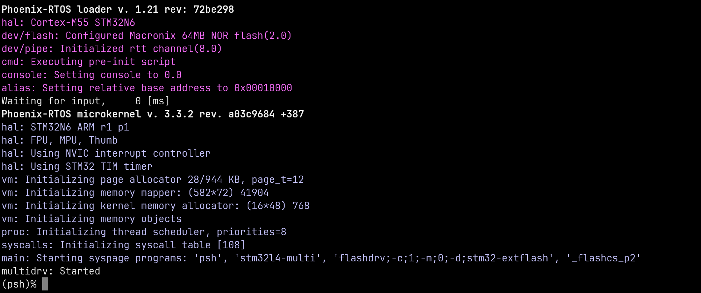
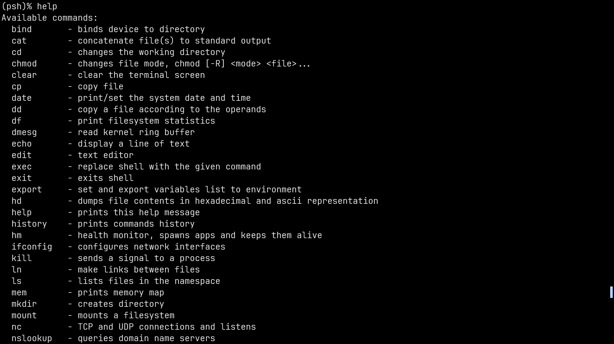
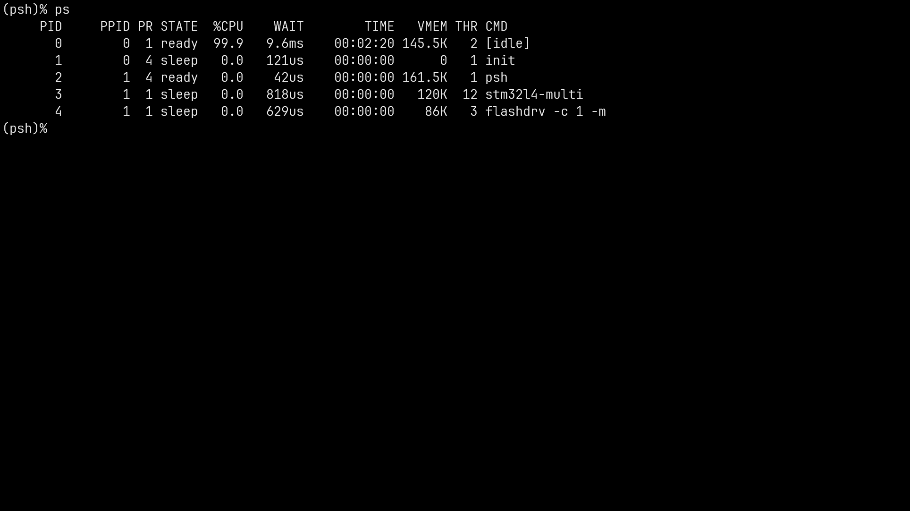
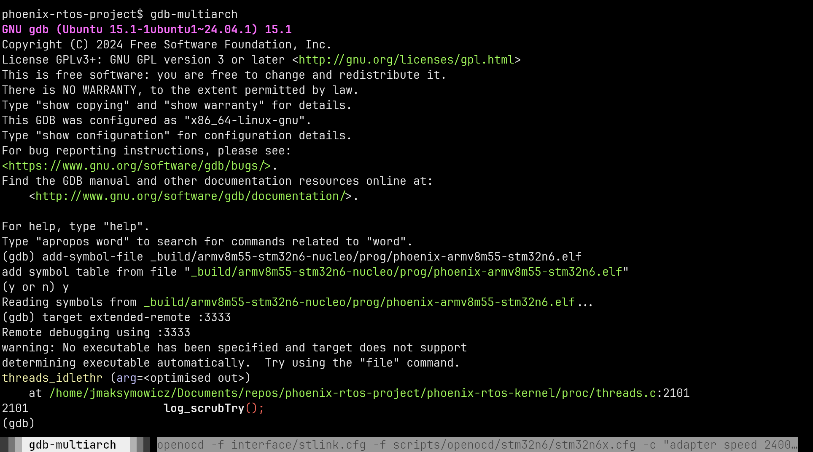
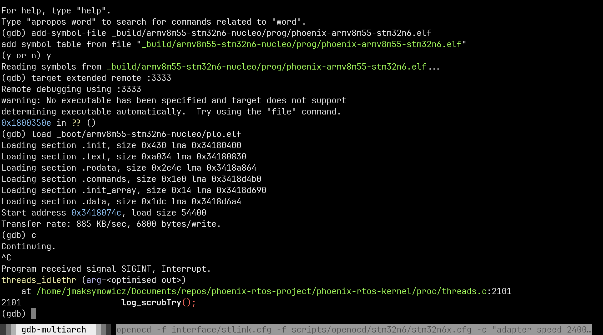

# Running system on <nobr>armv8m55-stm32n6-nucleo</nobr>

These instructions describe how to run a Phoenix-RTOS system image on a STM32N6 series microcontroller on a
<nobr>NUCLEO-N657X0-Q</nobr> board.
The guide assumes that you have already built the system image and build artifacts are in the `_boot` directory.
If you haven't run the `build.sh` script yet, run it for `armv8m55-stm32n6-nucleo` target.

See [Building](../building/index.md) chapter.

## Development board

The system image is configured to run on the
[NUCLEO-N657X0-Q](https://www.st.com/en/evaluation-tools/nucleo-n657x0-q.html) board. The board integrates an ST-LINK
debugging solution, which will allow us to program, debug and communicate with the microcontroller over UART.

Running an image on other boards is possible, but it may require changing the configuration in `board_config.h` file.
Phoenix-RTOS may also have limited support for Flash devices other than the one on the Nucleo board.

## Prerequisites - OpenOCD

Accessing the STM32N6 microcontroller requires an SWD adapter that works in ARM-DAP mode (called "dapdirect" in
OpenOCD documentation). In recent versions of OpenOCD this mode has been made default and the old "hla" mode
has been deprecated. The instructions below assume you have a version of OpenOCD compiled from commit 34ec553
(committed on 2024-11-02) or later. For best compatibility we **strongly recommend using the latest available
version of OpenOCD**.

You can build the latest version of OpenOCD by cloning their official
[GitHub mirror](https://github.com/openocd-org/openocd.git) and following the
["Building OpenOCD" instructions](https://github.com/openocd-org/openocd/blob/master/README.md#building-openocd).

If you try to use an old version of OpenOCD you may get a message when trying to connect:

```text
Error: The selected transport doesn't support this target
```

If this happens you can try replacing `interface/stlink.cfg` in the commands below with `interface/stlink-dap.cfg`.

## Connecting the board

For further information about the NUCLEO-N657X0-Q board see user manual
[UM3417](https://www.st.com/resource/en/user_manual/um3417-stm32n6-nucleo144-board-mb1940-stmicroelectronics.pdf)
from ST Microelectronics.

In the default configuration power, debugging and UART communication are all provided over a single USB-C port
labelled `CN10` on the board. Note that the board has two USB-C ports - you need to use the one further away from
the Ethernet port.

- Plug in USB-C cable from the host into the port on Nucleo board

- Verify that the device is detected and which serial port can be used to communicate with the device

  - On Ubuntu:

  ```shell
    ls -l /dev/serial/by-id
  ```

  The result should be similar to:

  ```shell
  lrwxrwxrwx 1 root root 13 Sep  9 12:46 usb-STMicroelectronics_STLINK-V3_004F003F3234510333353533-if01 -> ../../ttyACM1
  ```

  In this example UART communication is available through device `ttyACM1`.

- Open serial port in terminal using picocom

  ```shell
  picocom -b 115200 --imap lfcrlf /dev/tty[port]
  ```

  <details>
  <summary>How to get picocom and run it without privileges (Ubuntu 22.04)</summary>

  ```shell
  sudo apt update && \
  sudo apt install -y picocom
  ```

  To use picocom without sudo privileges run this command and then restart:

  ```shell
  sudo usermod -a -G tty <yourname>
  ```

  </details>

You can leave the terminal with the serial port open, and follow the next steps.

## Device boot modes

### Configuration

The board contains two jumpers - JP1 and JP2 - that control the boot mode of the microcontroller.
JP1 controls the BOOT0 signal and JP2 the BOOT1 signal.
To set a boot signal to 0, put the jumper in the 1-2 position.
To set a boot signal to 1, put the jumper in the 2-3 position.

For example, in the diagram below BOOT0 == 0 and BOOT1 == 1. Pins are represented by `*` symbols,
jumpers are represented by `⇐⇒` symbols:

```text
┌─────┐
│BOOT0│
└─────┘
  ┌─────────┐ J
  │ *⇐⇒*  * │ P
  └─────────┘ 1
┌─────┐
│BOOT1│
└─────┘
  ┌─────────┐ J
  │ *  *⇐⇒* │ P
  └─────────┘ 2

this side towards ST-LINK →
```

### Description

| BOOT1 | BOOT0 | Mode             |
|-------|-------|------------------|
| 0     | 0     | Flash boot       |
| 0     | 1     | Serial boot      |
| 1     | any   | Development boot |

In Flash boot mode the microcontroller reads software from the external NOR Flash chip, verifies and executes it.

In Serial boot mode the microcontroller expects to receive software over USB using DFU or UART using a proprietary
ST protocol. Once received the software is verified and executed.

In Development boot mode the microcontroller stays in Boot ROM after initialization with debug access port enabled
so that software can be written over SWD or JTAG.

## Flashing the Phoenix-RTOS system image over SWD

1. Set the BOOT1 signal to 1 as shown in the diagram above and press the RESET button.

2. Run the following command inside your project directory:

    ```sh
    openocd \
        -f interface/stlink.cfg \
        -f scripts/openocd/stm32n6/stm32n6x.cfg \
        -c "adapter speed 24000" \
        -c "set PLO_PATH _boot/armv8m55-stm32n6-nucleo/plo-ram.elf" \
        -f scripts/stm32n6-plo-rtt.cfg
    ```

    This will run OpenOCD, upload an image of plo into the device's RAM and open RTT connections - for commands on
    port 18021 and for `phoenixd` data exchange on port 18022.

3. Run the following command inside your project directory:

    ```sh
    ./_boot/armv8m55-stm32n6-nucleo/phoenixd -s _boot/armv8m55-stm32n6-nucleo -t 127.0.0.1:18022
    ```

    `phoenixd` will allow plo access to the selected directory on host's filesystem.

4. Connect to the board over serial with picocom:

    ```sh
    picocom -b 115200 --imap lfcrlf /dev/tty[port]
    ```

5. Run the following commands within plo:

    ```text
    erase flash0
    copy rtt phoenix.disk.bin flash0 0 0
    ```

    Erasing the entire Flash on Nucleo boards can take up to 3 minutes, so please be patient - plo does not indicate
    erase progress. File copying progress will be indicated by `phoenixd`.

6. Once erase and copy operations are complete, set BOOT0 to 0 and BOOT1 to 0 then press RESET button.

The board should now run Phoenix-RTOS:



### Optimizing the flashing process

Copying the whole disk image can take a very long time, so you can copy only the partitions which you wish to update.
Even if you want to write all partitions this can still be faster, as there may be large gaps between them.
The current list of partitions is printed at the end of the build process like this:

```text
VERBOSE: program images:
part_plo.img                   (offs=       0x0, size=  0xd8a0 /  0x10000 84%)
part_user.img                  (offs=   0x10000, size= 0x61020 /  0xf0000 40%)
part_storage.img               (offs=  0x100000, size=0x200000 / 0x200000 100%)
part_flash0_ptable.img         (offs= 0x3ff0000, size=  0xf080 /  0x10000 93%)
```

For example, to write only the `user` partition, use the following commands:

```text
erase flash0 0x10000 0xf0000
copy rtt part_user.img flash0 0x10000 0
```

## Using Phoenix-RTOS

To get the available command list please type:

```shell
help
```



To get the list of working processes please type:

```shell
ps
```



## Troubleshooting

### Flash memory interface

On a factory default Nucleo board you will most likely see the following message printed by plo:

```text
ERROR: GPIO port for device 2.0 is in incorrect voltage range. Clock frequency lowered.
```

**You may safely ignore this message.** The only negative effect is slower performance of Flash memory.

In order to unlock the maximum transfer speed of Flash memory interface, the option bit `HSLV_VDDIO3`
needs to be set to 1. You can burn this fuse by following the instructions below.

**ATTENTION - before you attempt the following operation you must understand:**

- **This operation is irreversible.**
- **It may cause permanent damage to device if performed incorrectly.**
- **It is meant to be performed on <nobr>NUCLEO-N657X0-Q</nobr> boards marked MB1940C.** For any other revision,
  please consult documentation to ensure this operation is appropriate.
- We shall not be held responsible for any damage that may occur when running this command on other boards.

In order to burn bit `HSLV_VDDIO3` in fuse `HCONF1` to 1, issue the following command within plo:

```text
otp -f 124 -w 0x00008000
```

### Board restart upon first power-on

Upon cold boot in development boot mode you may notice that after loading plo into memory and running it the board
will reset immediately. **This is normal and expected.** Phoenix-RTOS on this platform uses a non-standard
FLEXMEM configuration. The microcontroller is designed in such a way that configuring FLEXMEM requires the controller
to perform a reset. In Flash boot mode this is unnoticeable to the user, but in development boot mode
it gives the impression that the board has crashed for some unknown reason.

If this happens you should simply write plo into memory and run it again. After FLEXMEM has been configured, the
configuration will be remembered until the board is power-cycled and no unexpected resets should occur.

### Using official STM tools for flashing

It is possible to use tools like `STM32_Programmer_CLI` to write Phoenix system images to Flash. However, some external
loaders from ST demand that FLEXMEM be in its default configuration. This means that after running Phoenix-RTOS you must
enter development boot mode and **power-cycle the board** in order to use these tools. A simple reset is insufficient,
because FLEXMEM configuration is retained through resets.

## Debugging

Run the following command in your project directory:

```sh
openocd \
    -f interface/stlink.cfg \
    -f scripts/openocd/stm32n6/stm32n6x.cfg \
    -c "adapter speed 24000" \
    -c init
```

Note that in Flash boot mode the debug port will only be open if the system image was built with the flag `DEBUG=1`.
In development boot mode the port will always be open.

You can now run `gdb-multiarch` to perform debugging. You can load symbol files for the kernel and connect to the target
using the following commands:

```text
add-symbol-file _build/armv8m55-stm32n6-nucleo/prog/phoenix-armv8m55-stm32n6.elf
target extended-remote :3333
```

If you connect while the system is running the output will be similar to this:


Alternatively you can connect to the board in development boot mode. This will allow you to debug everything from the
start of the system. In this case you will have to set BOOT1 to 1, reset the board then load plo using the following gdb
commands:

```text
add-symbol-file _build/armv8m55-stm32n6-nucleo/prog/phoenix-armv8m55-stm32n6.elf
target extended-remote :3333
load _boot/armv8m55-stm32n6-nucleo/plo.elf
continue
```

After these commands plo will run directly from RAM, then kernel and user programs will be loaded from Flash
and executed:

