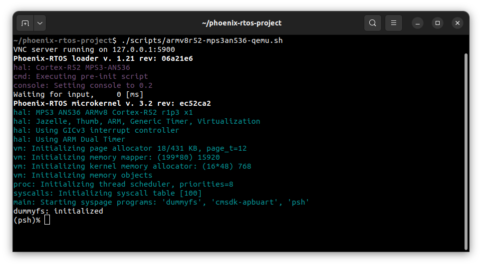
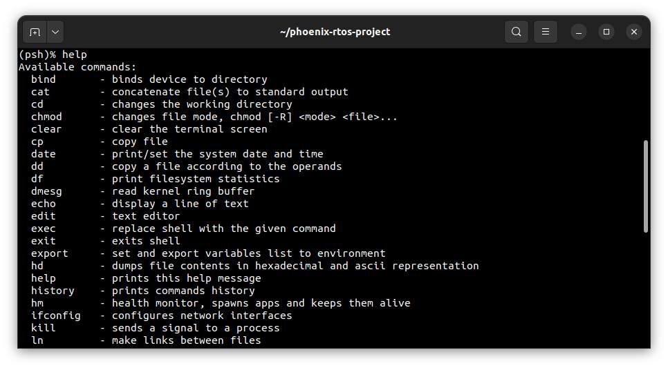
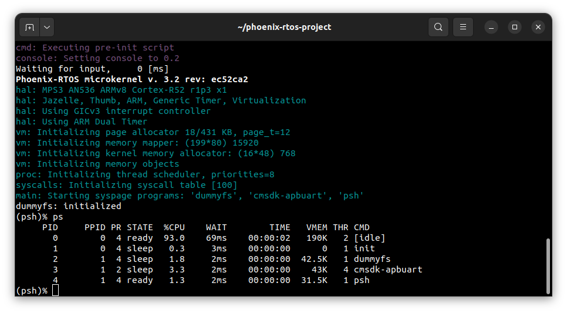

# Running system on <nobr>armv8r52-mps3an536-qemu</nobr>

These instructions describe how to run a Phoenix-RTOS system image for the `armv8r52-mps3an536-qemu` target
architecture.

Note that the build artifacts, including the system image, should be first provided in the `_boot` directory.

If you haven't run the `build.sh` script yet, run it for `armv8r52-mps3an536-qemu` target.

See [Building](../building/index.md) chapter.

## Running the system image

Support for the `mps3-an536` machine in QEMU has been added in QEMU 9.0.0. To run the Phoenix-RTOS system image for the
`armv8r52-mps3an536-qemu` target architecture, you must have QEMU version 9.0.0 or later installed. On Ubuntu 22.04, you
must build QEMU from source.

  <details>
  <summary>How to build QEMU (Ubuntu 22.04)</summary>

- Download QEMU 9.0.2 (or later) source code from the official repository and build for the `arm-softmmu` target:

  ```console
  git clone https://gitlab.com/qemu-project/qemu.git -b v9.0.2 && \
  cd qemu && \
  git submodule update --init --recursive && \
  ./configure --target-list=arm-softmmu && \
  make && \
  sudo make install
  ```

- Check if QEMU is properly installed:

  ```console
  qemu-system-arm --version
  ```

  ```console
  ~$ qemu-system-arm --version
  QEMU emulator version 9.0.2 (v9.0.2)
  Copyright (c) 2003-2024 Fabrice Bellard and the QEMU Project developers
  ~$
  ```

  </details>

To run the image under QEMU, use the following script provided in the `phoenix-rtos-project` repository:

  ```console
  ./scripts/armv8r52-mps3an536-qemu.sh
  ```

## Using Phoenix-RTOS

Phoenix-RTOS will be launched and the `psh` shell command prompt will appear in the terminal.



To get the available command list use command:

```console
help
```



To get the list of working processes use command:

```console
ps
```


