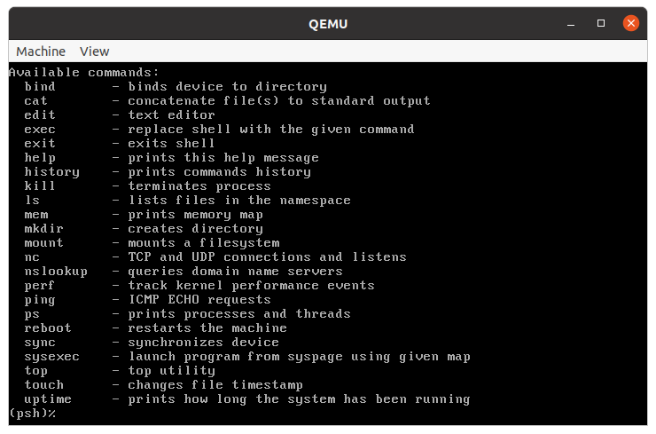
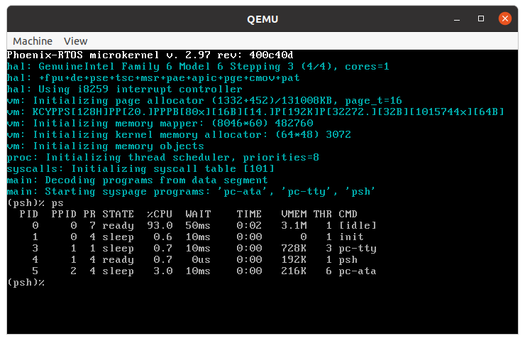
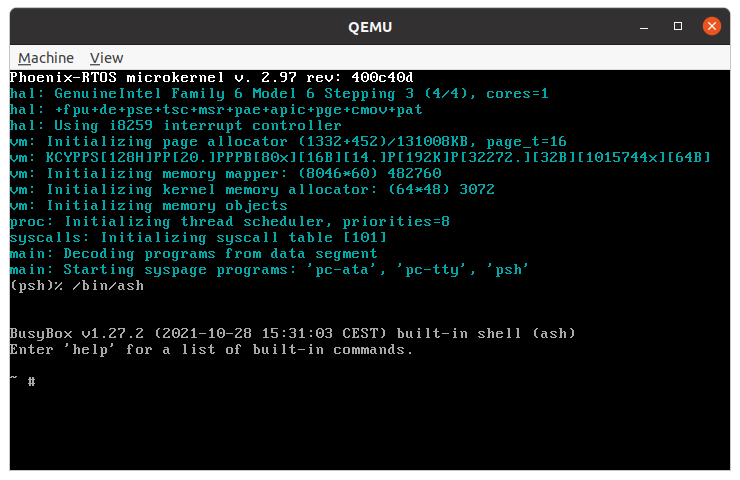
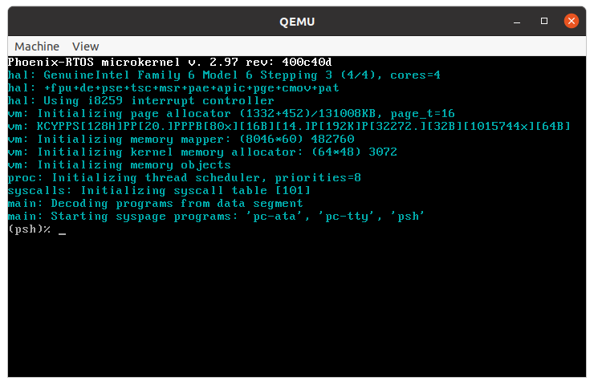

# Running system on `ia32-generic-qemu`

This version is designated for generic PC based on the IA32 processor. To launch this version the final disk image
should be provided. The image is created as the final artifact of the `phoenix-rtos-project` building and is located in
the `_boot` directory. The image consists of the bootloader (plo), kernel, TTY VGA driver, ATA driver with ext2
filesystem.

See [how to build the Phoenix-RTOS system image](../building/README.md).

## Running image under QEMU

Firstly, you need to install QEMU emulator.
<details>
  <summary>How to get QEMU (Ubuntu)</summary>

- Install the required packages

  ```text
  sudo apt-get update && \
  sudo apt-get install qemu-kvm \
  qemu virt-manager \
  virt-viewer libvirt-clients \
  libvirt-daemon-system \
  bridge-utils virtinst \
  libvirt-daemon \
  qemu-system-misc
  ```

- Check if QEMU is properly installed:

  ```text
  qemu-system-i386 --version
  ```

  ```text
  ~$ qemu-system-i386 --version
  QEMU emulator version 4.2.1 (Debian 1:4.2-3ubuntu6.24)
  Copyright (c) 2003-2019 Fabrice Bellard and the QEMU Project developers
  ~$
  ```

  </details>

<details>
  <summary>How to get QEMU (macOS)</summary>

- Install the required packages

  ```zsh
  brew update && \
  brew install qemu
  ```

- Check if QEMU is properly installed:

  ```zsh
  qemu-system-i386 --version
  ```

  ```zsh
  ~$ qemu-system-i386 --version
  QEMU emulator version 8.0.0
  Copyright (c) 2003-2022 Fabrice Bellard and the QEMU Project developers
  ~$
  ```

  </details>

To run the system image under QEMU you should type the following command
(launched from `phoenix-rtos-project` directory).

```text
./scripts/ia32-generic-qemu.sh
```

Phoenix-RTOS will be launched and the `psh` shell command prompt will appear in the terminal.


To get the available command list please type:

```text
help
```



In order to run one of the user applications you should type `/usr/bin/appname`, for example:

```text
/usr/bin/voxeldemo
```

The result is presented below.


You can press `ctrl + c` to quit the voxeldemo app.

To get the list of working processes please type:

```text
ps
```



There is a possibility to run the ash shell, it can be launched using the following command.

```text
/bin/ash
```



Phoenix-RTOS image can be also launched on multiple processor cores. To do this please define the number of cores
(e.g. 4) using the following command (launched from the `phoenix-rtos-project` directory).

```text
qemu-system-i386 -hda _boot/phoenix-ia32-generic.disk -smp 4
```

The number of detected cores is presented during kernel initialization.



## Running image on regular hardware

To run the image on regular hardware please be sure that a target system is equipped with an ATA disk supporting the
PATA interface. The image should be copied to the boot disk using the `dd` command (it is assumed that the target
disk is represented by /dev/sda block device).

```text
  dd if=_boot/ia32-generic-pc/phoenix.disk of=/dev/sda
```

## See also

1. [Running system on targets](README.md)
2. [Table of Contents](../README.md)
