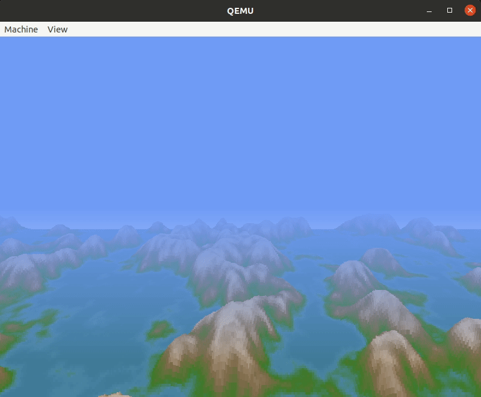

# Running system on <nobr>ia32-generic-qemu</nobr>

This version is designated for generic PC based on the IA32 processor. To launch this version the final disk image
should be provided. The image is created as the final artifact of the `phoenix-rtos-project` building and is located in
the `_boot` directory. The image consists of the bootloader (plo), kernel, TTY VGA driver, ATA driver with ext2
filesystem.

See [Building](../building/index.md) chapter.

## Running image under QEMU

Firstly, you need to install QEMU emulator.
<details>
  <summary>How to get QEMU (Ubuntu)</summary>

- Install the required packages

  ```shell
  sudo apt update && \
  sudo apt install -y \
  qemu-system \
  virt-manager \
  virt-viewer \
  libvirt-clients \
  libvirt-daemon-system \
  bridge-utils \
  virtinst \
  libvirt-daemon
  ```

- Check if QEMU is properly installed:

  ```shell
  qemu-system-i386 --version
  ```

  ```shell
  ~$ qemu-system-i386 --version
  QEMU emulator version 4.2.1 (Debian 1:4.2-3ubuntu6.24)
  Copyright (c) 2003-2019 Fabrice Bellard and the QEMU Project developers
  ~$
  ```

  </details>

To run the system image under QEMU you should type the following command
(launched from `phoenix-rtos-project` directory).

```shell
./scripts/ia32-generic-qemu.sh
```

Phoenix-RTOS will be launched and the `psh` shell command prompt will appear in the terminal.

```
Phoenix-RTOS microkernel v. 2.97 rev: 400c40d
hal: GenuineIntel Family 6 Model 6 Stepping 3 (4/4), cores=1
hal: +fpu+de+pse+tsc+msr+pae+apic+pge+cmov+pat
hal: Using i8259 interrupt controller
vm: Initializing page allocator (1332+452)/131008KB, page_t=16
vm: KCYPPS[128H]PP[20,]PPPB[80x][16B][14,]P[192K]P[32272,][32B][1015744x][64B]
vm: Initializing memory mapper: (8046*60) 482760
vm: Initializing kernel memory allocator: (64*48) 3072
vm: Initializing memory objects
proc: Initializing thread scheduler, priorities=8
syscalls: Initializing syscall table [101]
main: Decoding programs from data segment
main: Starting syspage programs: 'pc-ata', 'pc-tty', 'psh'
(psh)%
```

To get the available command list please type:

```shell
help
```

```
Available commands:
 bind          - binds device to directory
 cat           - concatenate file(s) to standard output
 edit          - text editor
 exec          - replace shell with the given command
 exit          - exits shell
 help          - prints this help message
 history       - prints commands history
 kill          - terminates process
 ls            - lists files in the namespace
 mem           - prints memory map
 mkdir         - creates directory
 mount         - mounts a filesystem
 nc            - TCP and UDP connections and listens
 nslookup      - queries domain name servers
 perf          - track kernel performance events
 ping          - ICMP ECHO requests
 ps            - prints processes and threads
 reboot        - restarts the machine
 sync          - synchronizes device
 sysexec       - launch program from syspage using given map
 top           - top utility
 touch         - changes file timestamp
 uptime        - prints how long the system has been running
(psh)%
```

In order to run one of the user applications you should type `/usr/bin/appname`, for example:

```shell
/usr/bin/voxeldemo
```

The result is presented below.

```{only} html

```

```{only} latex

```

You can press `ctrl + c` to quit the voxeldemo app.

To get the list of working processes please type:

```shell
ps
```

```
  PID  PPID PR STATE  %CPU   WAIT     TIME    VMEM THR CMD
    0     0  7 ready  93.0   50ms     0:02    3.1M   1 [idle]
    1     0  4 sleep   0.6   10ms     0:00       0   1 init
    3     1  1 sleep   0.7   10ms     0:00    728K   3 pc-tty
    4     1  4 ready   0.7    0us     0:00    192K   1 psh
    5     2  4 sleep   3.0   10ms     0:00    216K   6 pc-ata
(psh)%
```

There is a possibility to run the ash shell, it can be launched using the following command.

```shell
/bin/ash
```

```
(psh)% /bin/ash

BusyBox v1.27.2 (2021-10-28 15:31:03 CEST) built-in shell (ash)
Enter 'help' for a list of built-in commands.

~ #
```

Phoenix-RTOS image can be also launched on multiple processor cores. To do this please define the number of cores
(e.g. 4) using the following command (launched from the `phoenix-rtos-project` directory).

```shell
qemu-system-i386 -hda _boot/phoenix-ia32-generic.disk -smp 4
```

The number of detected cores is presented during kernel initialization (note `cores=4` in the first line).

```
Phoenix-RTOS microkernel v. 2.97 rev: 400c40d
hal: GenuineIntel Family 6 Model 6 Stepping 3 (4/4), cores=4
hal: +fpu+de+pse+tsc+msr+pae+apic+pge+cmov+pat
hal: Using i8259 interrupt controller
...
main: Starting syspage programs: 'pc-ata', 'pc-tty', 'psh'
(psh)%
```

## Network setup on ia32-generic-qemu

```{note}
This guide was tested on `Ubuntu 24.04 LTS` host OS.
```

There are few steps to follow:

### 1. Create and set up `vibr0` bridge on a host using `qemu-bridge-helper`

Install the required package and ensure that `libvirtd` is running:

```shell
sudo apt update
sudo apt install qemu-system-common libvirt-clients libvirt-daemon
systemctl enable libvirtd.service
systemctl start libvirtd.service
```

Start the default network bridge, and configure it to run on startup.

```shell
sudo virsh net-autostart --network default
sudo virsh net-start --network default
```

After that verify that the IP range `192.168.122.1/24` is reported by the `vibr0` bridge:

```shell
ip addr show virbr0
```

The expected output:

```shell
virbr0: <NO-CARRIER,BROADCAST,MULTICAST,UP> mtu 1500 qdisc noqueue state DOWN group default qlen 1000
  link/ether xx:xx:xx:xx:xx:xx brd ff:ff:ff:ff:ff:ff
  inet 192.168.122.1/24 brd 192.168.122.255 scope global virbr0
    valid_lft forever preferred_lft forever
```

If `/etc/qemu` directory does not exist, create it and provide required privileges:

```shell
sudo mkdir /etc/qemu
sudo chmod 755 /etc/qemu
```

Provide bridge configuration for QEMU:

```shell
echo "allow virbr0" | sudo tee -a /etc/qemu/bridge.conf > /dev/null
sudo chmod 644 /etc/qemu/bridge.conf
```

Set necessary permission for `qemu-bridge-helper` in order to enable running QEMU without root privileges.

```{warning}
Mind that setting this permission is not fully secure.
See this [discussion](https://bugs.launchpad.net/ubuntu/+source/qemu/+bug/1882420).
```

```shell
sudo chmod u+s /usr/lib/qemu/qemu-bridge-helper
```

Sources used: <https://apiraino.github.io/qemu-bridge-networking/>,
<https://mike42.me/blog/2019-08-how-to-use-the-qemu-bridge-helper-on-debian-10>

### 2. If IPv6 is needed, change the configuration of `virbr0`

```shell
sudo virsh net-destroy default
sudo virsh net-edit default
```

The commands above open the editor of the configuration file of `virbr0`. There are two necessary changes:

- Add IPv6 address to the bridge interface:

  ```XML
  <ip family='ipv6' address='2001:db8:dead:beef:fe::2' prefix='64'/>
  ```

- Enable NAT for IPv6:

  ```XML
  <forward mode='nat'>
    <nat ipv6='yes'/>
  </forward>
  ```

The overall config should look something like this:

```XML
<network>
  <name>default</name>
  <uuid>a9e032b7-e32f-4f91-a273-e6c6f15b8904</uuid>
  <forward mode='nat'>
    <nat ipv6='yes'/>
  </forward>
  <bridge name='virbr0' stp='on' delay='0'>
  <mac address='52:54:00:99:4d:c3'/>
  <ip address='192.168.122.1' netmask='255.255.255.0'>
    <dhcp>
      <range start='192.168.122.2' end='192.168.122.254'/>
    </dhcp>
  </ip>
  <ip family='ipv6' address='2001:db8:dead:beef:fe::2' prefix='64'/>
</network>
```

Save the config file and start the bridge by running:

```shell
sudo virsh net-start default
```

### 3. Launch QEMU using a starting script with `net` suffix

```shell
./scripts/ia32-generic-qemu-net.sh
```

### 4. Configure network on the target

This configuration can be done in two ways: using `psh` tools or `Busybox`.

```{note}
For now IPv6 configuration is possible only using `Busybox`.
```

#### Network configuration using `psh`

Enable dynamic IP address assignment and set default gateway:

```shell
ifconfig en1 dynamic
route add default gw 192.168.122.1 en1
```

Here `192.168.122.1` is the address of the virtual bridge interface on the host pc.
You should put a different address if applicable.

#### Network configuration using `Busybox` and `rc` script

```{note}
By default `IP` is assigned using `DHCP`. For other possibilities please check the configuration file
located in `_projects/ia32-generic-qemu/rootfs-overlay/etc/rc.conf.d/network`
```

```{note}
There are other programs executed by the script. For more information please check the content of the `rc`
file for `ia32-generic-qemu` in `_projects/ia32-generic-qemu/rootfs-overlay/etc/rc`
```

Run the script by calling:

```shell
/linuxrc
```

As you can see, the advanced version of `Phoenix-RTOS` with `POSIX` shell has been started:

```
BusyBox v1.27.2 (2022-06-30 17:42:15 CEST) built-in shell (ash)
Enter 'help' for a list of built-in commands.

         Welcome to Phoenix-RTOS

root@?:~ #
```

```{note}
Some applications may require accurate datetime to be set. See how it is done in case of [Azure IoT SDK](../ports/azure_sdk.md).
```

## Running image on regular hardware

To run the image on regular hardware please be sure that a target system is equipped with an ATA disk supporting the
PATA interface. The image should be copied to the boot disk using the `dd` command (it is assumed that the target
disk is represented by /dev/sda block device).

```shell
dd if=_boot/ia32-generic-pc/phoenix.disk of=/dev/sda
```
