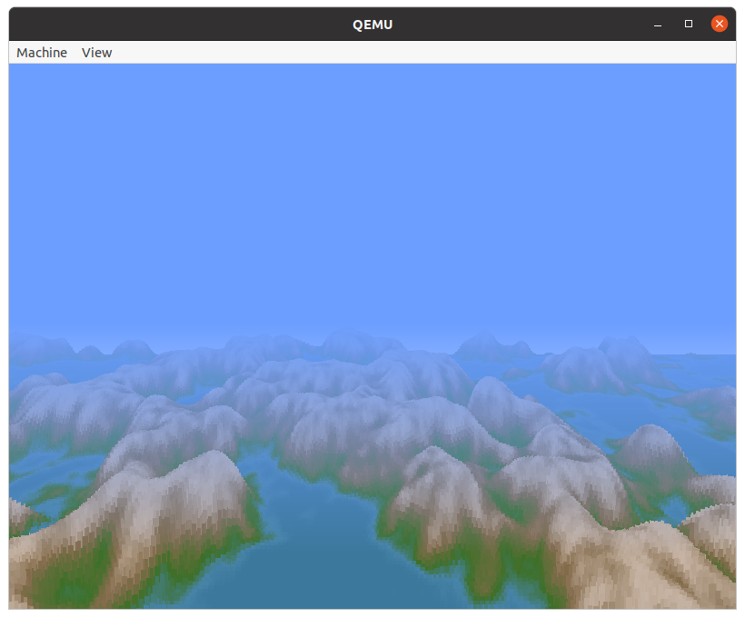
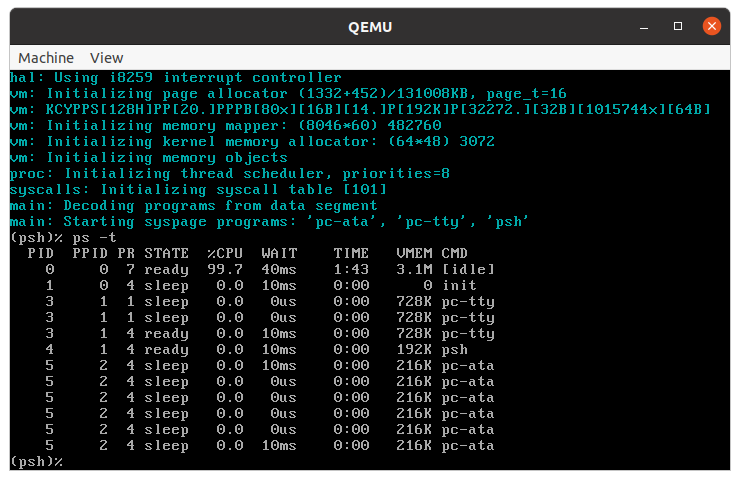
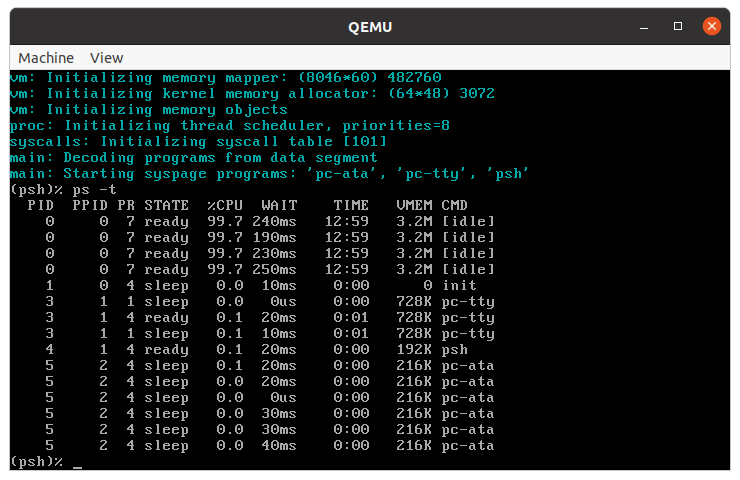

# Running system on `ia32-generic` (PC based on IA32 processor)
This version is designated for generic PC based on IA32 processor. To launch this version the final disk image should be provided. The image is created as the final artifact of `phoenix-rtos-project` building and is located in `_boot` directory. The image consist of bootloader (plo), kernel, TTY VGA driver, ATA driver with ext2 filesystem.

## Running image under qemu
To run the system image under qemu you should type:

```bash
./scripts/ia32-generic.sh
```

Phoenix-RTOS will be launched and `psh` shell command prompt will appear in the terminal.


To get the available command list please type:

```bash
help
```


In order to run one of the user applications you should type `/usr/bin/appname` for example:
```bash
/usr/bin/voxeldemo
```
The screenshot from voxeldemo appliction is presented below.



You can press `ctrl + c` to quit the voxeldemo app.

To get the list of working threads and processes please type:

```bash
ps -t
```



There is a possibility to run the ash shell, it can be launched using the following command.

```bash
/bin/ash
```


Phoenix-RTOS image can be also launched on multiple processor cores. To do this please define number of cores (e.g. 4) using following command (launched from `phoenix-rtos-project` directory).

```bash
qemu-system-i386 -hda _boot/phoenix-ia32-generic.disk -smp 4
```
The number of detected cores is presented during kernel initialization or can be obtained by counting number of idle threads.




## Running image on regular hardware
To run the image on a regular hardware please be sure that a target system is equipped with ATA disk supporting PATA interface. The image should be copied to the boot disk using `dd` command (it is assumed that target disk is represented by /dev/sda blok device).

```
  dd if=_boot/phoenix-ia32-generic.disk of=/dev/sda
```

## See also

1. [Running system on targets](README.md)
2. [Table of Contents](../README.md)