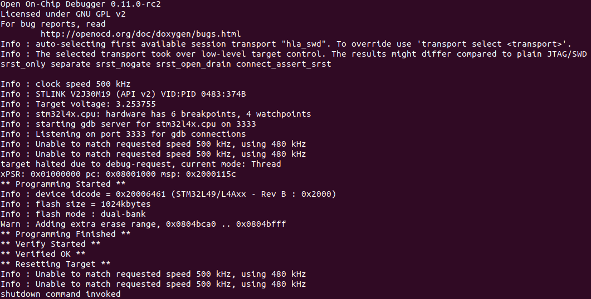
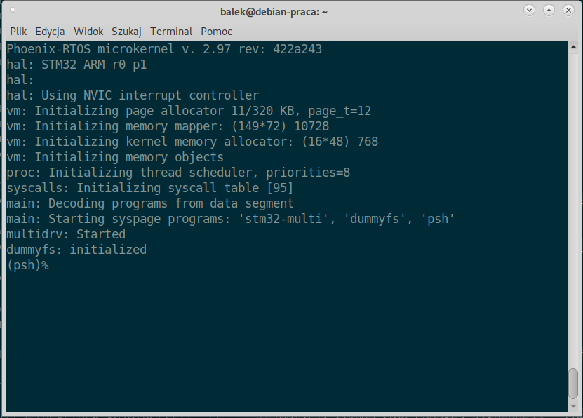
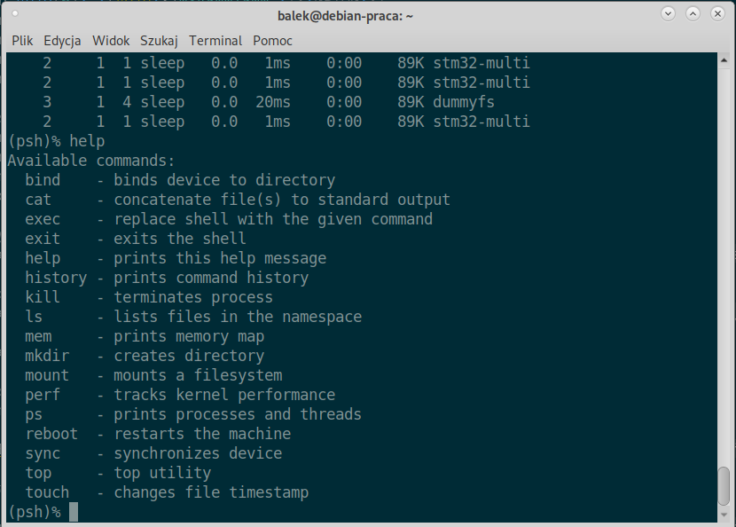
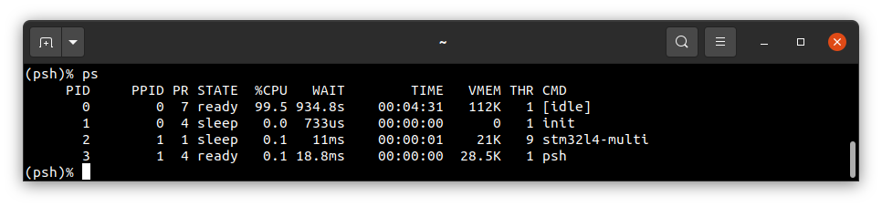

# stm32l4x6
This version is designated for STM32L4x6 processors with Cortex-M4 core. To launch this version the final flash image should be downloaded. The image is created as the final artifact of `phoenix-rtos-project` building and is located in `_boot` directory. The image consist of kernel, TTY UART driver, RAM disk filesystem and psh (shell).

## Programming the board
To flash the image to the board one will need openocd in version 0.10 or newer (http://openocd.org/). For STLink there is a script available:

```
  $ sudo phoenix-rtos-build/scripts/program-stm32l4x6.sh _boot/phoenix-armv7m4-stm32l4x6.bin
```

or use openocd directly:

```
OPENOCDPATH="/usr/local/share/openocd"
openocd -f $OPENOCDPATH/scripts/interface/stlink.cfg -f $OPENOCDPATH/scripts/target/stm32l4x.cfg -c "reset_config srst_only srst_nogate connect_assert_srst" -c "program _boot/phoenix-armv7m4-stm32l4x6.bin 0x08000000 verify reset exit"
```



Script can be modified to accomodate other SWD interfaces.

## Using Phoenix-RTOS

Phoenix-RTOS will be launched and `psh` shell command prompt will appear in the terminal.



To get the available command list please type `help`.



To get the list of working threads and processes please type `ps -t`.



