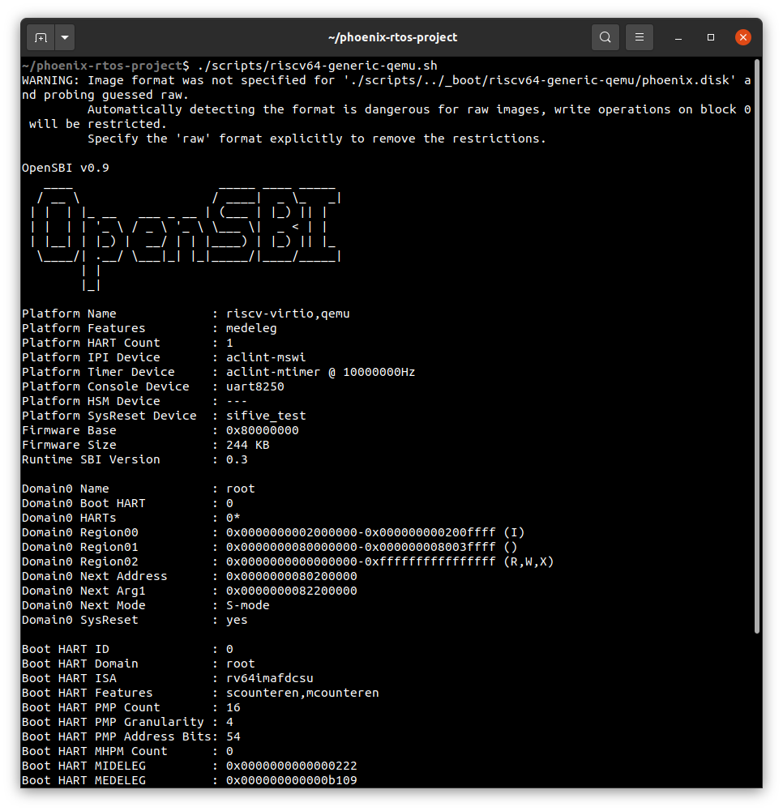
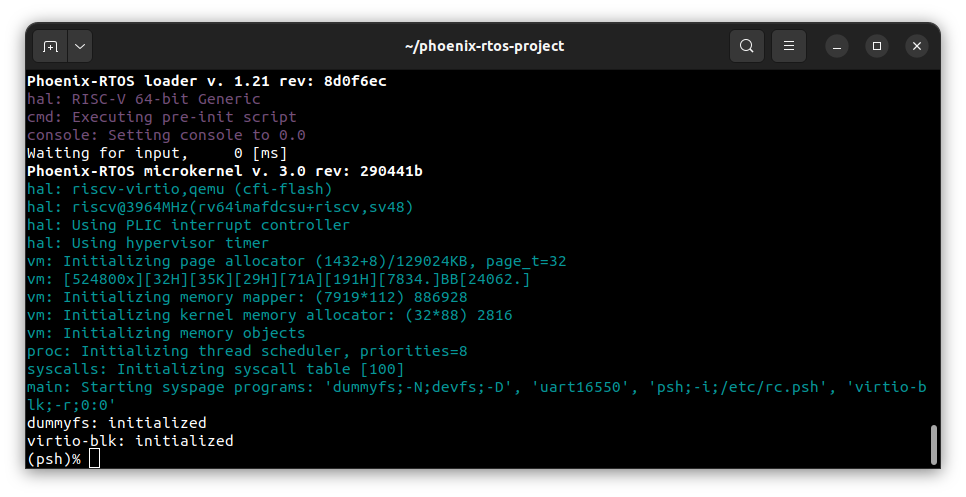
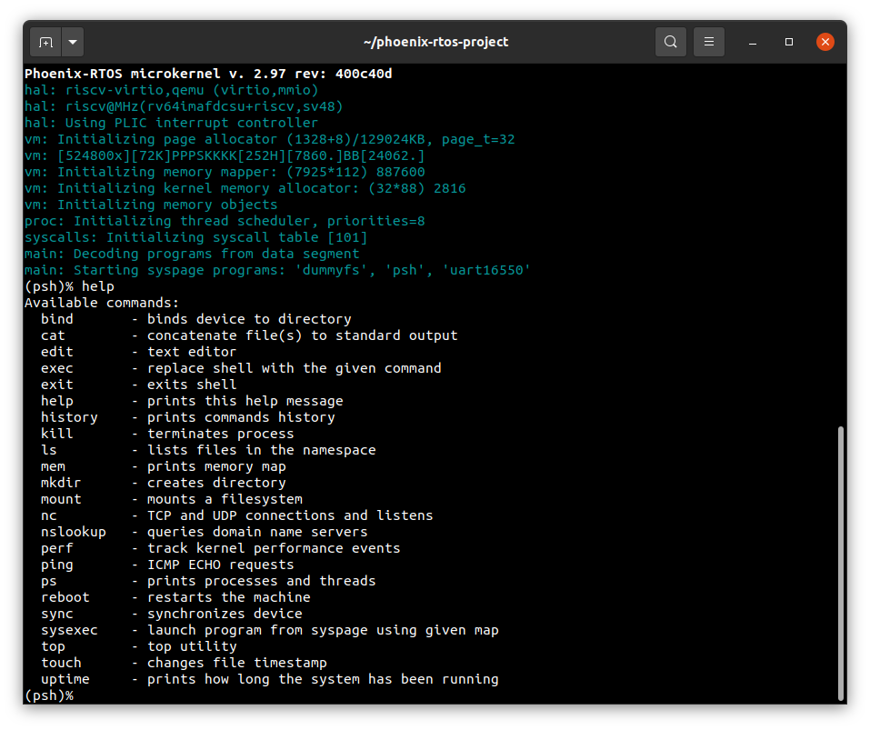
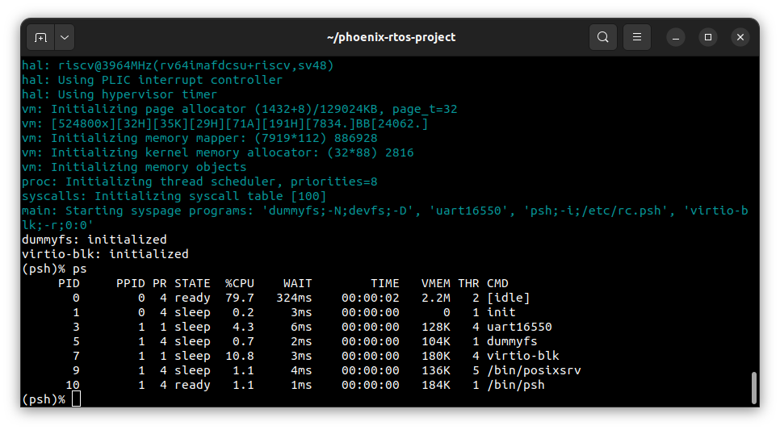

# Running system on `riscv64-generic-qemu`

This version is designated for RISC-V 64 processors based virtual machine implemented by `qemu-system-riscv64`.
To launch this version two files should be provided - `phoenix.disk` file integrated with SBI firmware with embedded
PLO, kernel, UART16550 interface and virtio-blk drivers, dummyfs filesystem and the `psh` shell and `rootfs.disk` image
with the ext2 filesystem.

The files are created as the final artifact of the `phoenix-rtos-project` building and are located in the `_boot`
directory. See [how to build the Phoenix-RTOS system image](../building/README.md).

## Running image under QEMU

Firstly, you need to install QEMU emulator.
  <details>
  <summary>How to get QEMU (Ubuntu)</summary>

- Install the required packages

  ```text
  sudo apt-get update && \
  sudo apt-get install qemu-kvm \
  qemu virt-manager \
  virt-viewer libvirt-clients \
  libvirt-daemon-system \
  bridge-utils virtinst \
  libvirt-daemon \
  qemu-system-misc
  ```

- Check if QEMU is properly installed:

  ```text
  qemu-system-riscv64 --version
  ```

  ```text
  ~$ qemu-system-riscv64 --version
  QEMU emulator version 4.2.1 (Debian 1:4.2-3ubuntu6.24)
  Copyright (c) 2003-2019 Fabrice Bellard and the QEMU Project developers
  ~$
  ```

  </details>

  <details>
  <summary>How to get QEMU (macOS)</summary>

- Install the required packages

  ```zsh
  brew update && \
  brew install qemu
  ```

- Check if QEMU is properly installed:

  ```zsh
  qemu-system-riscv64 --version
  ```

  ```zsh
  ~$ qemu-system-riscv64 --version
  QEMU emulator version 8.0.0
  Copyright (c) 2003-2022 Fabrice Bellard and the QEMU Project developers
  ~$
  ```

  </details>

To run the image under QEMU you should type:

```text
./scripts/riscv64-generic-qemu.sh
```


</br>


## Using Phoenix-RTOS

Phoenix-RTOS will be launched and the `psh` shell command prompt will appear in the terminal. To get the available
command list please type:

```text
help
```



To get the list of working processes please type:

```text
ps
```



## See also

1. [Running system on targets](README.md)
2. [Table of Contents](../README.md)
